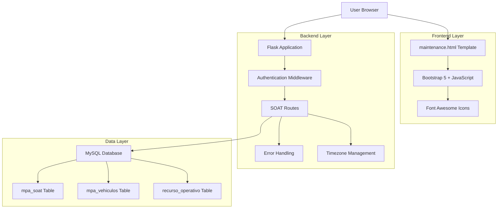
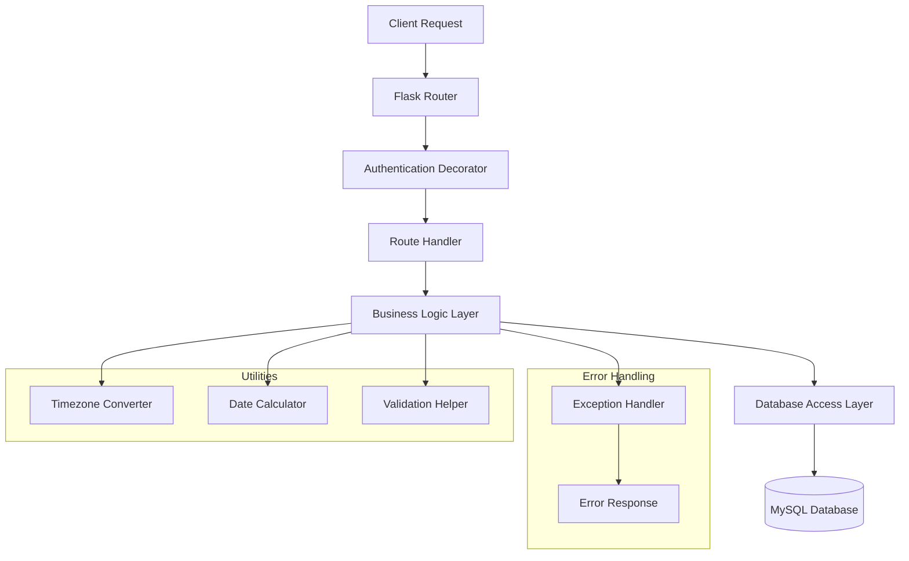
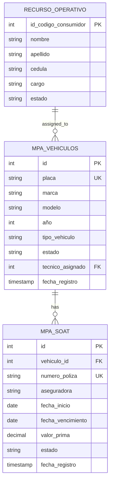

# Documento de Arquitectura Técnica - Módulo SOAT MPA

## 1. Architecture design



## 2. Technology Description

- **Frontend**: HTML5 + Bootstrap 5 + JavaScript ES6 + Font Awesome 6
- **Backend**: Flask 2.x + Python 3.x
- **Database**: MySQL 8.0
- **Authentication**: Flask-Login + Session Management
- **Timezone**: pytz (America/Bogota)
- **Date Handling**: datetime + timedelta

## 3. Route definitions

| Route | Purpose |
|-------|---------|
| /mpa/soat | Página principal del módulo SOAT, muestra la lista de seguros |
| /api/mpa/soat | API GET para obtener lista de registros SOAT con información de vehículos |
| /api/mpa/soat | API POST para crear nuevo registro SOAT |
| /api/mpa/soat/<id> | API GET para obtener detalles específicos de un SOAT |
| /api/mpa/soat/<id> | API PUT para actualizar registro SOAT existente |
| /api/mpa/soat/<id> | API DELETE para eliminar registro SOAT |
| /api/mpa/vehiculos/placas | API GET para obtener lista de vehículos con técnicos asignados |

## 4. API definitions

### 4.1 Core API

**Obtener lista de registros SOAT**
```
GET /api/mpa/soat
```

Response:
| Param Name | Param Type | Description |
|------------|------------|-------------|
| id | integer | ID único del registro SOAT |
| placa | string | Placa del vehículo |
| numero_poliza | string | Número de la póliza SOAT |
| aseguradora | string | Nombre de la aseguradora |
| fecha_inicio | string | Fecha de inicio del seguro (YYYY-MM-DD) |
| fecha_vencimiento | string | Fecha de vencimiento (YYYY-MM-DD) |
| valor_prima | decimal | Valor de la prima del seguro |
| estado | string | Estado del seguro (vigente, vencido, cancelado) |
| dias_vencimiento | integer | Días hasta el vencimiento (calculado) |
| tecnico_nombre | string | Nombre del técnico asignado al vehículo |

**Crear nuevo registro SOAT**
```
POST /api/mpa/soat
```

Request:
| Param Name | Param Type | isRequired | Description |
|------------|------------|------------|-------------|
| placa | string | true | Placa del vehículo |
| numero_poliza | string | true | Número de póliza único |
| aseguradora | string | true | Nombre de la aseguradora |
| fecha_inicio | string | true | Fecha inicio (YYYY-MM-DD) |
| fecha_vencimiento | string | true | Fecha vencimiento (YYYY-MM-DD) |
| valor_prima | decimal | true | Valor de la prima |

**Obtener detalles específicos de SOAT**
```
GET /api/mpa/soat/<id>
```

**Actualizar registro SOAT**
```
PUT /api/mpa/soat/<id>
```

**Eliminar registro SOAT**
```
DELETE /api/mpa/soat/<id>
```

**Obtener vehículos disponibles**
```
GET /api/mpa/vehiculos/placas
```

Response:
| Param Name | Param Type | Description |
|------------|------------|-------------|
| id | integer | ID del vehículo |
| placa | string | Placa del vehículo |
| tipo_vehiculo | string | Tipo de vehículo |
| tecnico_nombre | string | Nombre del técnico asignado |

Example Request:
```json
{
  "placa": "ABC123",
  "numero_poliza": "SOA-2024-001234",
  "aseguradora": "Seguros Bolívar",
  "fecha_inicio": "2024-01-15",
  "fecha_vencimiento": "2025-01-15",
  "valor_prima": 450000.00
}
```

Example Response:
```json
{
  "id": 1,
  "placa": "ABC123",
  "numero_poliza": "SOA-2024-001234",
  "aseguradora": "Seguros Bolívar",
  "fecha_inicio": "2024-01-15",
  "fecha_vencimiento": "2025-01-15",
  "valor_prima": 450000.00,
  "estado": "vigente",
  "dias_vencimiento": 45,
  "tecnico_nombre": "Juan Pérez"
}
```

## 5. Server architecture diagram



## 6. Data model

### 6.1 Data model definition



### 6.2 Data Definition Language

**Tabla de SOAT (mpa_soat)**
```sql
-- Crear tabla principal
CREATE TABLE mpa_soat (
    id INT PRIMARY KEY AUTO_INCREMENT,
    vehiculo_id INT NOT NULL,
    numero_poliza VARCHAR(50) UNIQUE NOT NULL,
    aseguradora VARCHAR(100) NOT NULL,
    fecha_inicio DATE NOT NULL,
    fecha_vencimiento DATE NOT NULL,
    valor_prima DECIMAL(12,2) NOT NULL,
    estado ENUM('vigente', 'vencido', 'cancelado') DEFAULT 'vigente',
    fecha_registro TIMESTAMP DEFAULT CURRENT_TIMESTAMP,
    fecha_actualizacion TIMESTAMP DEFAULT CURRENT_TIMESTAMP ON UPDATE CURRENT_TIMESTAMP,
    FOREIGN KEY (vehiculo_id) REFERENCES mpa_vehiculos(id) ON DELETE CASCADE
);

-- Crear índices para optimización
CREATE INDEX idx_mpa_soat_vehiculo ON mpa_soat(vehiculo_id);
CREATE INDEX idx_mpa_soat_vencimiento ON mpa_soat(fecha_vencimiento);
CREATE INDEX idx_mpa_soat_estado ON mpa_soat(estado);
CREATE INDEX idx_mpa_soat_poliza ON mpa_soat(numero_poliza);

-- Trigger para actualizar estado automáticamente
DELIMITER //
CREATE TRIGGER tr_mpa_soat_update_estado
BEFORE UPDATE ON mpa_soat
FOR EACH ROW
BEGIN
    IF NEW.fecha_vencimiento < CURDATE() THEN
        SET NEW.estado = 'vencido';
    ELSEIF NEW.fecha_vencimiento >= CURDATE() AND OLD.estado = 'vencido' THEN
        SET NEW.estado = 'vigente';
    END IF;
END//
DELIMITER ;

-- Datos iniciales de ejemplo
INSERT INTO mpa_soat (vehiculo_id, numero_poliza, aseguradora, fecha_inicio, fecha_vencimiento, valor_prima) VALUES
(1, 'SOA-2024-001234', 'Seguros Bolívar', '2024-01-15', '2025-01-15', 450000.00),
(2, 'SOA-2024-001235', 'Seguros del Estado', '2024-02-01', '2025-02-01', 380000.00),
(3, 'SOA-2024-001236', 'Liberty Seguros', '2024-03-10', '2025-03-10', 520000.00);

-- Vista para consultas optimizadas
CREATE VIEW vw_soat_vehiculos AS
SELECT 
    s.id,
    s.numero_poliza,
    s.aseguradora,
    s.fecha_inicio,
    s.fecha_vencimiento,
    s.valor_prima,
    s.estado,
    v.placa,
    v.marca,
    v.modelo,
    v.tipo_vehiculo,
    CONCAT(ro.nombre, ' ', ro.apellido) as tecnico_nombre,
    DATEDIFF(s.fecha_vencimiento, CURDATE()) as dias_vencimiento,
    CASE 
        WHEN DATEDIFF(s.fecha_vencimiento, CURDATE()) < 0 THEN 'vencido'
        WHEN DATEDIFF(s.fecha_vencimiento, CURDATE()) <= 15 THEN 'critico'
        WHEN DATEDIFF(s.fecha_vencimiento, CURDATE()) <= 30 THEN 'proximo'
        ELSE 'vigente'
    END as estado_vencimiento
FROM mpa_soat s
LEFT JOIN mpa_vehiculos v ON s.vehiculo_id = v.id
LEFT JOIN recurso_operativo ro ON v.tecnico_asignado = ro.id_codigo_consumidor
ORDER BY s.fecha_vencimiento ASC;
```

**Procedimientos almacenados para operaciones comunes**
```sql
-- Procedimiento para obtener SOAT próximos a vencer
DELIMITER //
CREATE PROCEDURE sp_soat_proximos_vencer(IN dias_limite INT)
BEGIN
    SELECT * FROM vw_soat_vehiculos 
    WHERE dias_vencimiento <= dias_limite 
    AND dias_vencimiento >= 0
    ORDER BY dias_vencimiento ASC;
END//
DELIMITER ;

-- Procedimiento para renovar SOAT
DELIMITER //
CREATE PROCEDURE sp_renovar_soat(
    IN p_soat_id INT,
    IN p_nueva_fecha_inicio DATE,
    IN p_nueva_fecha_vencimiento DATE,
    IN p_nuevo_numero_poliza VARCHAR(50),
    IN p_nueva_aseguradora VARCHAR(100),
    IN p_nuevo_valor_prima DECIMAL(12,2)
)
BEGIN
    DECLARE EXIT HANDLER FOR SQLEXCEPTION
    BEGIN
        ROLLBACK;
        RESIGNAL;
    END;
    
    START TRANSACTION;
    
    -- Marcar el SOAT anterior como cancelado
    UPDATE mpa_soat 
    SET estado = 'cancelado' 
    WHERE id = p_soat_id;
    
    -- Crear nuevo registro SOAT
    INSERT INTO mpa_soat (
        vehiculo_id, 
        numero_poliza, 
        aseguradora, 
        fecha_inicio, 
        fecha_vencimiento, 
        valor_prima
    )
    SELECT 
        vehiculo_id,
        p_nuevo_numero_poliza,
        p_nueva_aseguradora,
        p_nueva_fecha_inicio,
        p_nueva_fecha_vencimiento,
        p_nuevo_valor_prima
    FROM mpa_soat 
    WHERE id = p_soat_id;
    
    COMMIT;
END//
DELIMITER ;
```