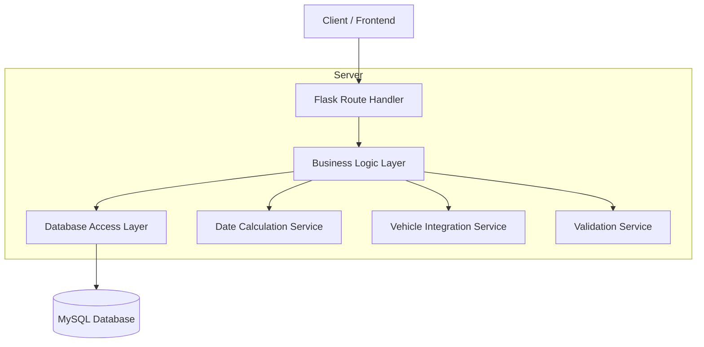
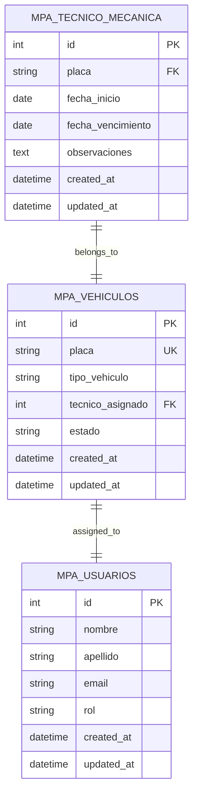

# Arquitectura Técnica - Módulo Técnico Mecánica MPA

## 1. Architecture design

```mermaid
graph TD
    A[User Browser] --> B[React Frontend - Técnico Mecánica]
    B --> C[Flask Backend API]
    C --> D[MySQL Database]
    C --> E[Timezone Utils - Bogotá]

    subgraph "Frontend Layer"
        B
        F[tecnico_mecanica.html]
        G[JavaScript Functions]
        H[Bootstrap UI Components]
    end

    subgraph "Backend Layer"
        C
        I[/api/mpa/tecnico_mecanica Routes]
        J[CRUD Operations]
        K[Date Calculations]
    end

    subgraph "Data Layer"
        D
        L[mpa_tecnico_mecanica Table]
        M[mpa_vehiculos Table]
        N[mpa_usuarios Table]
    end

    subgraph "External Services"
        E
    end
```

## 2. Technology Description

- Frontend: HTML5 + Bootstrap 5 + JavaScript ES6 + jQuery
- Backend: Flask + MySQL + Python 3.8+
- Database: MySQL 8.0 con tablas relacionadas
- Timezone: pytz para manejo de zona horaria Colombia/Bogotá

## 3. Route definitions

| Route | Purpose |
|-------|---------|
| /mpa/tecnico_mecanica | Página principal del módulo de técnico mecánica |
| /api/mpa/tecnico_mecanica | API para listar todas las revisiones técnico mecánicas |
| /api/mpa/tecnico_mecanica/<id> | API para obtener, actualizar o eliminar revisión específica |
| /api/mpa/vehiculos | API para obtener lista de vehículos disponibles |

## 4. API definitions

### 4.1 Core API

**Listar Técnico Mecánicas**
```
GET /api/mpa/tecnico_mecanica
```

Response:
| Param Name | Param Type | Description |
|-----------|-------------|-------------|
| id | integer | ID único de la revisión técnico mecánica |
| placa | string | Placa del vehículo |
| fecha_inicio | date | Fecha de inicio de vigencia |
| fecha_vencimiento | date | Fecha de vencimiento |
| dias_vencimiento | integer | Días restantes hasta vencimiento (negativo si vencido) |
| estado | string | Estado calculado: Vigente, Próximo a vencer, Vencido |
| tecnico_asignado | string | Nombre completo del técnico asignado |
| tipo_vehiculo | string | Tipo de vehículo |

**Crear Técnico Mecánica**
```
POST /api/mpa/tecnico_mecanica
```

Request:
| Param Name | Param Type | isRequired | Description |
|-----------|-------------|-------------|-------------|
| placa | string | true | Placa del vehículo seleccionado |
| fecha_inicio | date | true | Fecha de inicio de la revisión |
| fecha_vencimiento | date | true | Fecha de vencimiento |
| observaciones | string | false | Observaciones adicionales |

**Obtener Técnico Mecánica**
```
GET /api/mpa/tecnico_mecanica/<id>
```

Response:
| Param Name | Param Type | Description |
|-----------|-------------|-------------|
| id | integer | ID de la revisión |
| placa | string | Placa del vehículo |
| fecha_inicio | date | Fecha de inicio |
| fecha_vencimiento | date | Fecha de vencimiento |
| observaciones | string | Observaciones |
| tecnico_asignado | string | Técnico responsable |
| tipo_vehiculo | string | Tipo de vehículo |
| created_at | datetime | Fecha de creación |
| updated_at | datetime | Fecha de última actualización |

**Actualizar Técnico Mecánica**
```
PUT /api/mpa/tecnico_mecanica/<id>
```

Request:
| Param Name | Param Type | isRequired | Description |
|-----------|-------------|-------------|-------------|
| fecha_inicio | date | false | Nueva fecha de inicio |
| fecha_vencimiento | date | false | Nueva fecha de vencimiento |
| observaciones | string | false | Observaciones actualizadas |

**Eliminar Técnico Mecánica**
```
DELETE /api/mpa/tecnico_mecanica/<id>
```

Response:
| Param Name | Param Type | Description |
|-----------|-------------|-------------|
| success | boolean | Estado de la eliminación |
| message | string | Mensaje de confirmación |

## 5. Server architecture diagram



## 6. Data model

### 6.1 Data model definition



### 6.2 Data Definition Language

**Tabla Técnico Mecánica (mpa_tecnico_mecanica)**
```sql
-- Crear tabla principal
CREATE TABLE mpa_tecnico_mecanica (
    id INT AUTO_INCREMENT PRIMARY KEY,
    placa VARCHAR(10) NOT NULL,
    fecha_inicio DATE NOT NULL,
    fecha_vencimiento DATE NOT NULL,
    observaciones TEXT,
    created_at TIMESTAMP DEFAULT CURRENT_TIMESTAMP,
    updated_at TIMESTAMP DEFAULT CURRENT_TIMESTAMP ON UPDATE CURRENT_TIMESTAMP,
    INDEX idx_tecnico_mecanica_placa (placa),
    INDEX idx_tecnico_mecanica_vencimiento (fecha_vencimiento),
    FOREIGN KEY (placa) REFERENCES mpa_vehiculos(placa) ON DELETE CASCADE
);

-- Crear índices para optimización
CREATE INDEX idx_tecnico_mecanica_estado ON mpa_tecnico_mecanica(fecha_vencimiento);
CREATE INDEX idx_tecnico_mecanica_created_at ON mpa_tecnico_mecanica(created_at DESC);

-- Datos iniciales de ejemplo
INSERT INTO mpa_tecnico_mecanica (placa, fecha_inicio, fecha_vencimiento, observaciones) VALUES
('ABC123', '2024-01-15', '2025-01-15', 'Revisión técnico mecánica inicial'),
('DEF456', '2024-03-20', '2025-03-20', 'Renovación anual'),
('GHI789', '2023-12-10', '2024-12-10', 'Próxima a vencer');
```

**Validaciones y Restricciones**
```sql
-- Agregar restricciones de validación
ALTER TABLE mpa_tecnico_mecanica 
ADD CONSTRAINT chk_fechas_validas 
CHECK (fecha_vencimiento > fecha_inicio);

-- Trigger para actualizar timestamp
DELIMITER //
CREATE TRIGGER tr_tecnico_mecanica_updated 
    BEFORE UPDATE ON mpa_tecnico_mecanica
    FOR EACH ROW
BEGIN
    SET NEW.updated_at = CURRENT_TIMESTAMP;
END//
DELIMITER ;
```