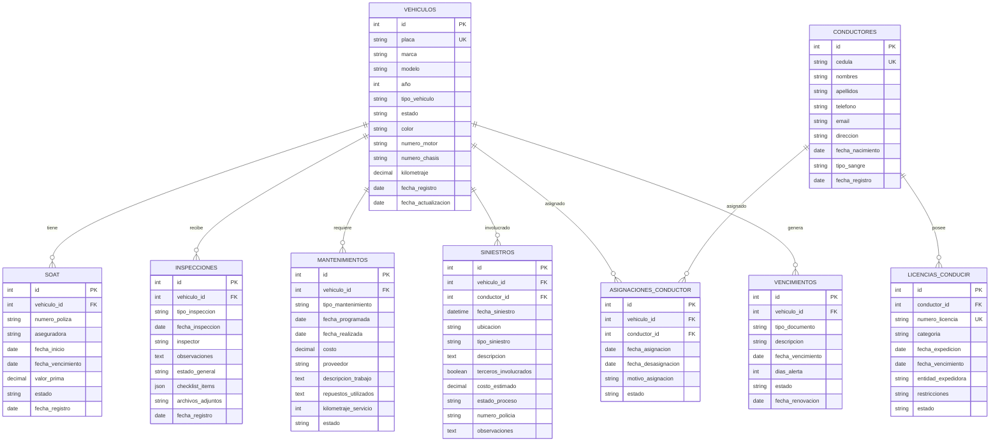

# Módulo de Parque Automotor (MPA) - Documento de Arquitectura Técnica

## 1. Architecture design


## 2. Technology Description

- Frontend: Flask Templates + Bootstrap 5 + Font Awesome 6 + jQuery
- Backend: Flask + Flask-SQLAlchemy + Flask-Login
- Database: MySQL (integrado con la base de datos existente de Synapsis)
- Authentication: Sistema de autenticación existente de Synapsis
- File Storage: Sistema de archivos local para documentos y fotografías

## 3. Route definitions

| Route | Purpose |
|-------|---------|
| /mpa | Dashboard principal del módulo MPA con estadísticas y accesos rápidos |
| /mpa/vehiculos | Gestión completa del inventario vehicular |
| /mpa/vencimientos | Control centralizado de fechas de vencimiento |
| /mpa/soat | Administración de seguros obligatorios SOAT |
| /mpa/tecnico-mecanica | Control de revisiones técnico mecánicas |
| /mpa/licencias | Gestión de licencias de conducir |
| /mpa/inspecciones | Registro y seguimiento de inspecciones vehiculares |
| /mpa/siniestros | Gestión de accidentes y siniestros |
| /mpa/mantenimientos | Control de mantenimientos preventivos y correctivos |

## 4. API definitions

### 4.1 Core API

**Gestión de Vehículos**
```
GET /api/mpa/vehiculos
```
Response:
| Param Name | Param Type | Description |
|------------|------------|-------------|
| success | boolean | Estado de la respuesta |
| data | array | Lista de vehículos con información completa |
| total | integer | Total de vehículos registrados |

```
POST /api/mpa/vehiculos
```
Request:
| Param Name | Param Type | isRequired | Description |
|------------|------------|------------|-------------|
| placa | string | true | Placa del vehículo |
| marca | string | true | Marca del vehículo |
| modelo | string | true | Modelo del vehículo |
| año | integer | true | Año de fabricación |
| tipo_vehiculo | string | true | Tipo de vehículo (automóvil, camión, etc.) |
| estado | string | true | Estado operativo del vehículo |
| conductor_asignado | integer | false | ID del conductor asignado |

**Control de Vencimientos**
```
GET /api/mpa/vencimientos
```
Response:
| Param Name | Param Type | Description |
|------------|------------|-------------|
| success | boolean | Estado de la respuesta |
| vencimientos_proximos | array | Lista de documentos próximos a vencer |
| vencimientos_vencidos | array | Lista de documentos ya vencidos |

**Gestión SOAT**
```
POST /api/mpa/soat
```
Request:
| Param Name | Param Type | isRequired | Description |
|------------|------------|------------|-------------|
| vehiculo_id | integer | true | ID del vehículo |
| numero_poliza | string | true | Número de la póliza SOAT |
| aseguradora | string | true | Nombre de la aseguradora |
| fecha_inicio | date | true | Fecha de inicio de vigencia |
| fecha_vencimiento | date | true | Fecha de vencimiento |
| valor_prima | decimal | true | Valor de la prima pagada |

**Inspecciones Vehiculares**
```
POST /api/mpa/inspecciones
```
Request:
| Param Name | Param Type | isRequired | Description |
|------------|------------|------------|-------------|
| vehiculo_id | integer | true | ID del vehículo inspeccionado |
| tipo_inspeccion | string | true | Tipo de inspección (preventiva/correctiva) |
| fecha_inspeccion | date | true | Fecha de realización |
| inspector | string | true | Nombre del inspector |
| observaciones | text | false | Observaciones generales |
| estado_general | string | true | Estado general del vehículo |

**Gestión de Siniestros**
```
POST /api/mpa/siniestros
```
Request:
| Param Name | Param Type | isRequired | Description |
|------------|------------|------------|-------------|
| vehiculo_id | integer | true | ID del vehículo involucrado |
| fecha_siniestro | datetime | true | Fecha y hora del siniestro |
| ubicacion | string | true | Ubicación del siniestro |
| tipo_siniestro | string | true | Tipo de siniestro |
| descripcion | text | true | Descripción detallada del evento |
| conductor_involucrado | integer | true | ID del conductor involucrado |
| terceros_involucrados | boolean | true | Si hay terceros involucrados |

## 5. Server architecture diagram


## 6. Data model

### 6.1 Data model definition



### 6.2 Data Definition Language

**Tabla de Vehículos (mpa_vehiculos)**
```sql
CREATE TABLE mpa_vehiculos (
    id INT PRIMARY KEY AUTO_INCREMENT,
    placa VARCHAR(10) UNIQUE NOT NULL,
    marca VARCHAR(50) NOT NULL,
    modelo VARCHAR(50) NOT NULL,
    año INT NOT NULL,
    tipo_vehiculo VARCHAR(30) NOT NULL,
    estado ENUM('activo', 'inactivo', 'mantenimiento', 'siniestrado') DEFAULT 'activo',
    color VARCHAR(20),
    numero_motor VARCHAR(50),
    numero_chasis VARCHAR(50),
    kilometraje DECIMAL(10,2) DEFAULT 0,
    fecha_registro TIMESTAMP DEFAULT CURRENT_TIMESTAMP,
    fecha_actualizacion TIMESTAMP DEFAULT CURRENT_TIMESTAMP ON UPDATE CURRENT_TIMESTAMP
);

CREATE INDEX idx_mpa_vehiculos_placa ON mpa_vehiculos(placa);
CREATE INDEX idx_mpa_vehiculos_estado ON mpa_vehiculos(estado);
```

**Tabla de Conductores (mpa_conductores)**
```sql
CREATE TABLE mpa_conductores (
    id INT PRIMARY KEY AUTO_INCREMENT,
    cedula VARCHAR(20) UNIQUE NOT NULL,
    nombres VARCHAR(100) NOT NULL,
    apellidos VARCHAR(100) NOT NULL,
    telefono VARCHAR(20),
    email VARCHAR(100),
    direccion TEXT,
    fecha_nacimiento DATE,
    tipo_sangre VARCHAR(5),
    fecha_registro TIMESTAMP DEFAULT CURRENT_TIMESTAMP
);

CREATE INDEX idx_mpa_conductores_cedula ON mpa_conductores(cedula);
```

**Tabla de SOAT (mpa_soat)**
```sql
CREATE TABLE mpa_soat (
    id INT PRIMARY KEY AUTO_INCREMENT,
    vehiculo_id INT NOT NULL,
    numero_poliza VARCHAR(50) NOT NULL,
    aseguradora VARCHAR(100) NOT NULL,
    fecha_inicio DATE NOT NULL,
    fecha_vencimiento DATE NOT NULL,
    valor_prima DECIMAL(10,2) NOT NULL,
    estado ENUM('vigente', 'vencido', 'cancelado') DEFAULT 'vigente',
    fecha_registro TIMESTAMP DEFAULT CURRENT_TIMESTAMP,
    FOREIGN KEY (vehiculo_id) REFERENCES mpa_vehiculos(id)
);

CREATE INDEX idx_mpa_soat_vehiculo ON mpa_soat(vehiculo_id);
CREATE INDEX idx_mpa_soat_vencimiento ON mpa_soat(fecha_vencimiento);
```

**Tabla de Inspecciones (mpa_inspecciones)**
```sql
CREATE TABLE mpa_inspecciones (
    id INT PRIMARY KEY AUTO_INCREMENT,
    vehiculo_id INT NOT NULL,
    tipo_inspeccion ENUM('preventiva', 'correctiva', 'preoperacional') NOT NULL,
    fecha_inspeccion DATE NOT NULL,
    inspector VARCHAR(100) NOT NULL,
    observaciones TEXT,
    estado_general ENUM('excelente', 'bueno', 'regular', 'malo') NOT NULL,
    checklist_items JSON,
    archivos_adjuntos TEXT,
    fecha_registro TIMESTAMP DEFAULT CURRENT_TIMESTAMP,
    FOREIGN KEY (vehiculo_id) REFERENCES mpa_vehiculos(id)
);

CREATE INDEX idx_mpa_inspecciones_vehiculo ON mpa_inspecciones(vehiculo_id);
CREATE INDEX idx_mpa_inspecciones_fecha ON mpa_inspecciones(fecha_inspeccion);
```

**Tabla de Mantenimientos (mpa_mantenimientos)**
```sql
CREATE TABLE mpa_mantenimientos (
    id INT PRIMARY KEY AUTO_INCREMENT,
    vehiculo_id INT NOT NULL,
    tipo_mantenimiento ENUM('preventivo', 'correctivo', 'emergencia') NOT NULL,
    fecha_programada DATE NOT NULL,
    fecha_realizada DATE,
    costo DECIMAL(10,2),
    proveedor VARCHAR(100),
    descripcion_trabajo TEXT,
    repuestos_utilizados TEXT,
    kilometraje_servicio DECIMAL(10,2),
    estado ENUM('programado', 'en_proceso', 'completado', 'cancelado') DEFAULT 'programado',
    fecha_registro TIMESTAMP DEFAULT CURRENT_TIMESTAMP,
    FOREIGN KEY (vehiculo_id) REFERENCES mpa_vehiculos(id)
);

CREATE INDEX idx_mpa_mantenimientos_vehiculo ON mpa_mantenimientos(vehiculo_id);
CREATE INDEX idx_mpa_mantenimientos_fecha ON mpa_mantenimientos(fecha_programada);
```

**Datos iniciales**
```sql
-- Insertar tipos de vehículos comunes
INSERT INTO mpa_vehiculos (placa, marca, modelo, año, tipo_vehiculo, estado) VALUES
('ABC123', 'Toyota', 'Hilux', 2022, 'Camioneta', 'activo'),
('DEF456', 'Chevrolet', 'Spark', 2021, 'Automóvil', 'activo'),
('GHI789', 'Nissan', 'NP300', 2023, 'Camioneta', 'activo');

-- Insertar conductores de ejemplo
INSERT INTO mpa_conductores (cedula, nombres, apellidos, telefono, email) VALUES
('12345678', 'Juan Carlos', 'Pérez González', '3001234567', 'juan.perez@empresa.com'),
('87654321', 'María Elena', 'Rodríguez López', '3009876543', 'maria.rodriguez@empresa.com');
```