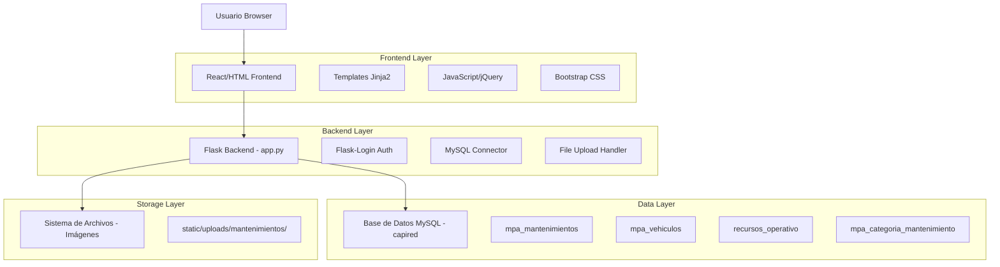
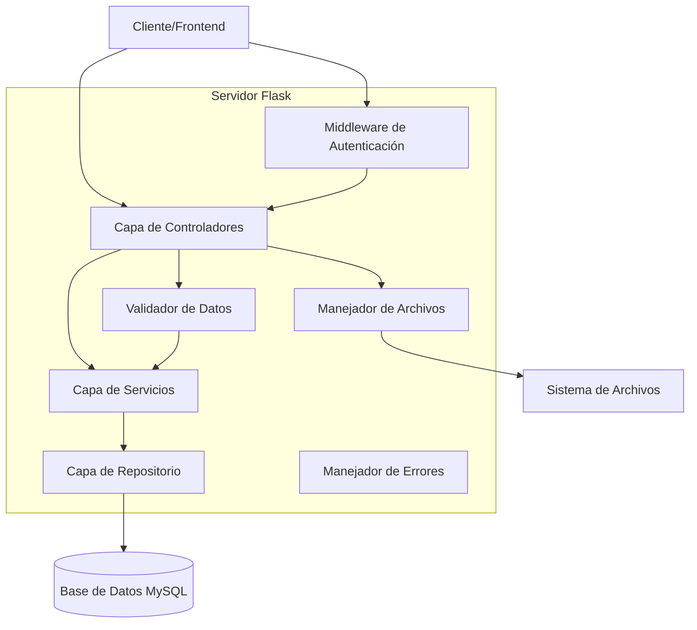
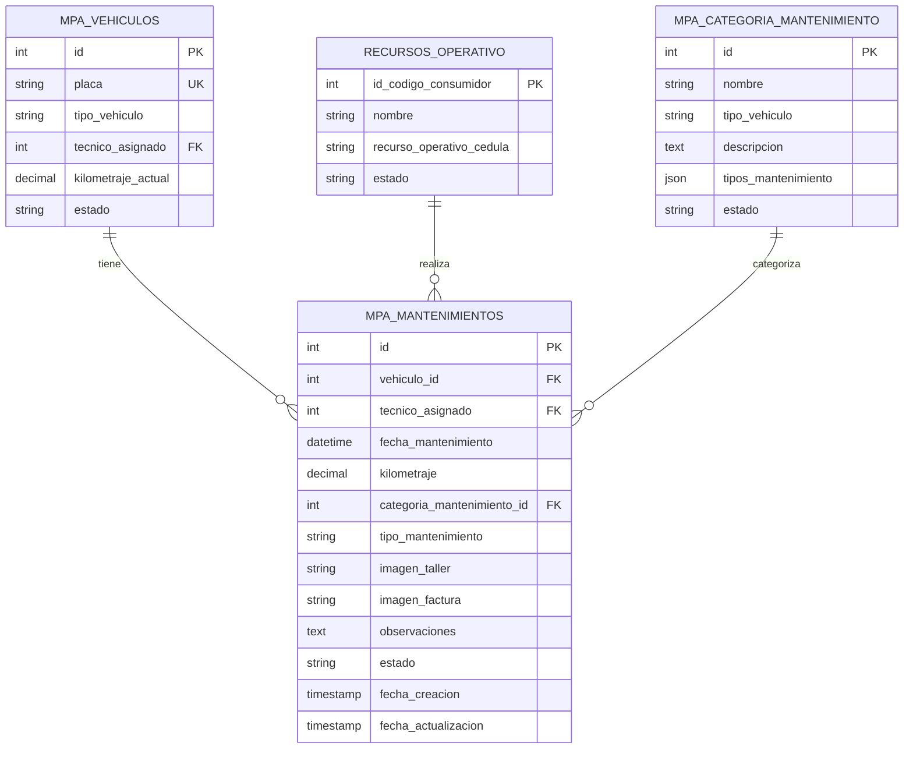

# Documento de Arquitectura Técnica - Módulo de Mantenimientos MPA

## 1. Diseño de Arquitectura



## 2. Descripción de Tecnología

- Frontend: HTML5 + Jinja2 Templates + Bootstrap 5 + jQuery + Font Awesome
- Backend: Flask + Flask-Login + MySQL Connector
- Base de Datos: MySQL (base de datos capired existente)
- Almacenamiento: Sistema de archivos local para imágenes

## 3. Definiciones de Rutas

| Ruta | Propósito |
|------|-----------|
| /mpa/mantenimientos | Página principal del módulo de mantenimientos |
| /api/mpa/mantenimientos | API para listar mantenimientos (GET) |
| /api/mpa/mantenimientos | API para crear mantenimiento (POST) |
| /api/mpa/mantenimientos/<id> | API para obtener detalles de mantenimiento (GET) |
| /api/mpa/mantenimientos/<id> | API para actualizar mantenimiento (PUT) |
| /api/mpa/mantenimientos/<id> | API para eliminar mantenimiento (DELETE) |
| /api/mpa/vehiculos/placas | API para obtener lista de placas disponibles |
| /api/mpa/categorias-mantenimiento/<tipo_vehiculo> | API para obtener categorías por tipo de vehículo |
| /api/mpa/tipos-mantenimiento/<categoria_id> | API para obtener tipos por categoría |

## 4. Definiciones de API

### 4.1 API Principal de Mantenimientos

**Listar Mantenimientos**
```
GET /api/mpa/mantenimientos
```

Response:
| Param Name | Param Type | Description |
|------------|------------|-------------|
| success | boolean | Estado de la respuesta |
| data | array | Lista de mantenimientos |
| data[].id | integer | ID del mantenimiento |
| data[].placa | string | Placa del vehículo |
| data[].tecnico_nombre | string | Nombre del técnico asignado |
| data[].fecha_mantenimiento | string | Fecha del mantenimiento |
| data[].tipo_mantenimiento | string | Tipo de mantenimiento realizado |
| data[].estado | string | Estado del mantenimiento |

**Crear Mantenimiento**
```
POST /api/mpa/mantenimientos
```

Request:
| Param Name | Param Type | isRequired | Description |
|------------|------------|------------|-------------|
| vehiculo_id | integer | true | ID del vehículo |
| kilometraje | decimal | true | Kilometraje actual del vehículo |
| categoria_mantenimiento_id | integer | true | ID de la categoría de mantenimiento |
| tipo_mantenimiento | string | true | Tipo específico de mantenimiento |
| imagen_taller | file | true | Imagen georeferenciada del taller |
| imagen_factura | file | true | Imagen de la factura |
| observaciones | string | true | Observaciones detalladas |

Response:
| Param Name | Param Type | Description |
|------------|------------|-------------|
| success | boolean | Estado de la operación |
| message | string | Mensaje de confirmación |
| data | object | Datos del mantenimiento creado |

### 4.2 APIs de Soporte

**Obtener Placas Disponibles**
```
GET /api/mpa/vehiculos/placas
```

Response:
| Param Name | Param Type | Description |
|------------|------------|-------------|
| success | boolean | Estado de la respuesta |
| data | array | Lista de vehículos con placas |
| data[].id | integer | ID del vehículo |
| data[].placa | string | Placa del vehículo |
| data[].tipo_vehiculo | string | Tipo de vehículo |
| data[].tecnico_nombre | string | Nombre del técnico asignado |

**Obtener Categorías de Mantenimiento**
```
GET /api/mpa/categorias-mantenimiento/<tipo_vehiculo>
```

Response:
| Param Name | Param Type | Description |
|------------|------------|-------------|
| success | boolean | Estado de la respuesta |
| data | array | Lista de categorías |
| data[].id | integer | ID de la categoría |
| data[].nombre | string | Nombre de la categoría |
| data[].descripcion | string | Descripción de la categoría |

## 5. Diagrama de Arquitectura del Servidor



## 6. Modelo de Datos

### 6.1 Definición del Modelo de Datos



### 6.2 Lenguaje de Definición de Datos

**Tabla de Mantenimientos (mpa_mantenimientos)**
```sql
-- Crear tabla principal
CREATE TABLE mpa_mantenimientos (
    id INT PRIMARY KEY AUTO_INCREMENT,
    vehiculo_id INT NOT NULL,
    tecnico_asignado INT NOT NULL,
    fecha_mantenimiento DATETIME NOT NULL,
    kilometraje DECIMAL(10,2) NOT NULL,
    categoria_mantenimiento_id INT NOT NULL,
    tipo_mantenimiento VARCHAR(100) NOT NULL,
    imagen_taller VARCHAR(255) NOT NULL,
    imagen_factura VARCHAR(255) NOT NULL,
    observaciones TEXT NOT NULL,
    estado ENUM('programado', 'en_proceso', 'completado', 'cancelado') DEFAULT 'completado',
    fecha_creacion TIMESTAMP DEFAULT CURRENT_TIMESTAMP,
    fecha_actualizacion TIMESTAMP DEFAULT CURRENT_TIMESTAMP ON UPDATE CURRENT_TIMESTAMP,
    
    FOREIGN KEY (vehiculo_id) REFERENCES mpa_vehiculos(id),
    FOREIGN KEY (tecnico_asignado) REFERENCES recursos_operativo(id_codigo_consumidor),
    FOREIGN KEY (categoria_mantenimiento_id) REFERENCES mpa_categoria_mantenimiento(id)
);

-- Crear índices para optimización
CREATE INDEX idx_mpa_mantenimientos_vehiculo ON mpa_mantenimientos(vehiculo_id);
CREATE INDEX idx_mpa_mantenimientos_tecnico ON mpa_mantenimientos(tecnico_asignado);
CREATE INDEX idx_mpa_mantenimientos_fecha ON mpa_mantenimientos(fecha_mantenimiento);
CREATE INDEX idx_mpa_mantenimientos_categoria ON mpa_mantenimientos(categoria_mantenimiento_id);
```

**Tabla de Categorías de Mantenimiento (mpa_categoria_mantenimiento)**
```sql
-- Crear tabla de categorías
CREATE TABLE mpa_categoria_mantenimiento (
    id INT PRIMARY KEY AUTO_INCREMENT,
    nombre VARCHAR(100) NOT NULL,
    tipo_vehiculo ENUM('Moto', 'Camioneta', 'Camión', 'Automóvil') NOT NULL,
    descripcion TEXT,
    tipos_mantenimiento JSON NOT NULL,
    estado ENUM('activo', 'inactivo') DEFAULT 'activo',
    fecha_creacion TIMESTAMP DEFAULT CURRENT_TIMESTAMP,
    fecha_actualizacion TIMESTAMP DEFAULT CURRENT_TIMESTAMP ON UPDATE CURRENT_TIMESTAMP
);

-- Crear índices
CREATE INDEX idx_categoria_mantenimiento_tipo ON mpa_categoria_mantenimiento(tipo_vehiculo);
CREATE INDEX idx_categoria_mantenimiento_estado ON mpa_categoria_mantenimiento(estado);

-- Datos iniciales para categorías de mantenimiento
INSERT INTO mpa_categoria_mantenimiento (nombre, tipo_vehiculo, descripcion, tipos_mantenimiento) VALUES
('Mantenimiento Preventivo', 'Moto', 'Mantenimientos programados para prevenir fallas', 
 '["Cambio de aceite", "Revisión de frenos", "Ajuste de cadena", "Cambio de filtros", "Revisión eléctrica"]'),
 
('Mantenimiento Correctivo', 'Moto', 'Reparaciones por fallas o averías', 
 '["Reparación de motor", "Cambio de llantas", "Reparación eléctrica", "Reparación de frenos", "Reparación de transmisión"]'),
 
('Mantenimiento Preventivo', 'Camioneta', 'Mantenimientos programados para prevenir fallas', 
 '["Cambio de aceite", "Revisión de frenos", "Alineación y balanceo", "Cambio de filtros", "Revisión de suspensión"]'),
 
('Mantenimiento Correctivo', 'Camioneta', 'Reparaciones por fallas o averías', 
 '["Reparación de motor", "Cambio de llantas", "Reparación de transmisión", "Reparación de dirección", "Reparación eléctrica"]'),
 
('Mantenimiento de Emergencia', 'Moto', 'Reparaciones urgentes en ruta', 
 '["Reparación de pinchazo", "Ajuste de emergencia", "Reparación básica eléctrica"]'),
 
('Mantenimiento de Emergencia', 'Camioneta', 'Reparaciones urgentes en ruta', 
 '["Cambio de llanta", "Reparación de batería", "Reparación básica de motor", "Reparación de radiador"]');
```

**Directorio para almacenamiento de imágenes**
```bash
# Crear directorios para almacenamiento
mkdir -p static/uploads/mantenimientos/talleres
mkdir -p static/uploads/mantenimientos/facturas

# Establecer permisos
chmod 755 static/uploads/mantenimientos/
chmod 755 static/uploads/mantenimientos/talleres/
chmod 755 static/uploads/mantenimientos/facturas/
```