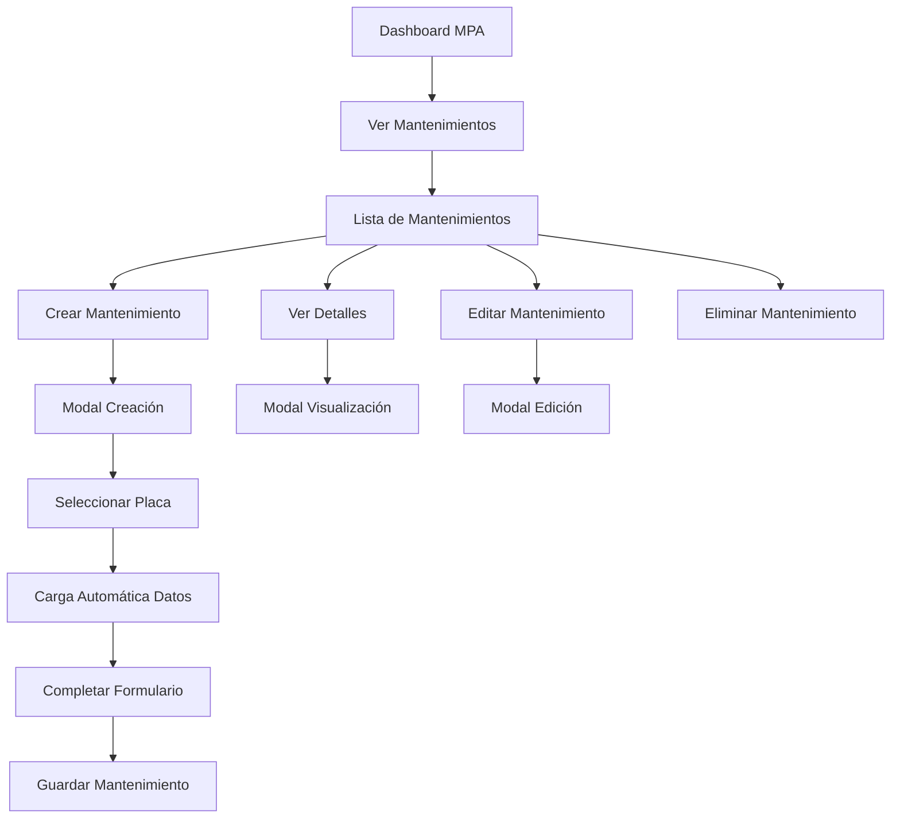

# Documento de Requerimientos del Producto - Módulo de Mantenimientos MPA

## 1. Resumen del Producto

El módulo de Mantenimientos MPA es un submódulo especializado para la gestión integral de mantenimientos vehiculares dentro del sistema MPA (Módulo de Parque Automotor). Permite registrar, consultar, editar y eliminar registros de mantenimientos realizados a los vehículos de la flota, con funcionalidades avanzadas de categorización por tipo de vehículo y carga automática de datos relacionados.

- **Propósito Principal**: Centralizar y sistematizar el control de mantenimientos preventivos y correctivos de la flota vehicular, facilitando el seguimiento histórico y la planificación de futuras intervenciones.
- **Usuarios Objetivo**: Personal administrativo con rol 'administrativo' en el sistema MPA.
- **Valor del Producto**: Optimización del control de mantenimientos, reducción de costos operativos y mejora en la disponibilidad de vehículos.

## 2. Características Principales

### 2.1 Roles de Usuario

| Rol | Método de Registro | Permisos Principales |
|-----|-------------------|---------------------|
| Administrativo | Asignación por sistema existente | Acceso completo: crear, ver, editar y eliminar mantenimientos |

### 2.2 Módulo de Características

Nuestro módulo de Mantenimientos MPA consta de las siguientes páginas principales:

1. **Lista de Mantenimientos**: tabla principal con registros, filtros y acciones CRUD.
2. **Modal de Creación**: formulario completo para registro de nuevos mantenimientos.
3. **Modal de Visualización**: vista detallada de mantenimientos existentes.
4. **Modal de Edición**: modificación de registros de mantenimientos.

### 2.3 Detalles de Páginas

| Nombre de Página | Nombre del Módulo | Descripción de Características |
|------------------|-------------------|-------------------------------|
| Lista de Mantenimientos | Tabla Principal | Mostrar placa, técnico asignado, fecha de mantenimiento con botones Ver, Editar, Eliminar. Incluir botón "Crear Mantenimiento" |
| Modal de Creación | Formulario de Registro | Selector de placa (carga automática de técnico y tipo), kilometraje manual, fecha automática (zona horaria Bogotá), categorías y tipos de mantenimiento dinámicos, carga de 2 imágenes, campo observaciones |
| Modal de Visualización | Vista de Detalles | Mostrar todos los datos del mantenimiento en formato de solo lectura con imágenes |
| Modal de Edición | Formulario de Modificación | Permitir edición de todos los campos excepto placa, mantener funcionalidad de carga automática |

## 3. Proceso Principal

### Flujo de Usuario Administrativo

El usuario administrativo accede al módulo desde el dashboard MPA mediante el botón "Ver Mantenimientos". En la vista principal, puede consultar la tabla de mantenimientos existentes con opciones de filtrado. Para crear un nuevo mantenimiento, hace clic en "Crear Mantenimiento", lo que abre un modal donde:

1. Selecciona la placa del vehículo (dropdown desde mpa_vehiculos)
2. El sistema carga automáticamente el técnico asignado y tipo de vehículo
3. Ingresa manualmente el kilometraje actual
4. La fecha se establece automáticamente con zona horaria de Bogotá
5. Selecciona categoría de mantenimiento según el tipo de vehículo
6. Selecciona tipo específico de mantenimiento según la categoría
7. Carga imagen georeferenciada del taller
8. Carga imagen de la factura del taller
9. Completa observaciones detalladas
10. Guarda el registro

Para mantenimientos existentes, puede ver detalles, editar información o eliminar registros según sea necesario.

## 4. Diseño de Interfaz de Usuario

### 4.1 Estilo de Diseño

- **Colores Primarios**: Azul corporativo (#007bff), Verde para acciones positivas (#28a745)
- **Colores Secundarios**: Gris para elementos neutros (#6c757d), Rojo para acciones de eliminación (#dc3545)
- **Estilo de Botones**: Redondeados con efectos hover, iconos Font Awesome
- **Fuente**: Sistema por defecto (Arial, sans-serif), tamaños 14px para texto normal, 16px para títulos
- **Estilo de Layout**: Basado en tarjetas con navegación superior, diseño responsivo Bootstrap
- **Iconos**: Font Awesome para consistencia con el sistema existente

### 4.2 Resumen de Diseño de Páginas

| Nombre de Página | Nombre del Módulo | Elementos de UI |
|------------------|-------------------|-----------------|
| Lista de Mantenimientos | Tabla Principal | Tabla responsiva con encabezados fijos, botones de acción con iconos, filtros superiores, paginación inferior, botón flotante "Crear Mantenimiento" |
| Modal de Creación | Formulario de Registro | Modal centrado 800px ancho, formulario en 2 columnas, selectores con búsqueda, campos de fecha con calendario, áreas de carga de archivos con preview, textarea expandible |
| Modal de Visualización | Vista de Detalles | Layout de solo lectura con etiquetas y valores, galería de imágenes con zoom, información organizada en secciones |
| Modal de Edición | Formulario de Modificación | Similar al modal de creación pero con datos precargados, campos bloqueados según reglas de negocio |

### 4.3 Responsividad

El producto está diseñado con enfoque desktop-first pero completamente adaptativo para dispositivos móviles. En pantallas pequeñas, la tabla se convierte en tarjetas apilables, los modales ocupan el 95% del ancho de pantalla, y se optimizan las interacciones táctiles con botones más grandes y espaciado adecuado.

## 5. Especificaciones Técnicas

### 5.1 Estructura de Base de Datos

**Tabla Principal: mpa_mantenimientos**
- id (INT, PK, AUTO_INCREMENT)
- vehiculo_id (INT, FK a mpa_vehiculos)
- tecnico_asignado (INT, FK a recursos_operativo)
- fecha_mantenimiento (DATETIME, zona horaria Bogotá)
- kilometraje (DECIMAL)
- categoria_mantenimiento_id (INT, FK a mpa_categoria_mantenimiento)
- tipo_mantenimiento (VARCHAR)
- imagen_taller (VARCHAR, ruta archivo)
- imagen_factura (VARCHAR, ruta archivo)
- observaciones (TEXT)
- fecha_creacion (TIMESTAMP)
- fecha_actualizacion (TIMESTAMP)

**Tablas de Referencia:**
- mpa_vehiculos (placa, tipo_vehiculo, tecnico_asignado)
- recursos_operativo (técnicos disponibles)
- mpa_categoria_mantenimiento (categorías por tipo de vehículo)

### 5.2 Funcionalidades Clave

- **Carga Dinámica**: Al seleccionar placa, carga automática de técnico y tipo de vehículo
- **Filtrado Inteligente**: Categorías de mantenimiento filtradas por tipo de vehículo
- **Gestión de Archivos**: Subida y almacenamiento seguro de imágenes con validación
- **Zona Horaria**: Manejo automático de fecha/hora en zona horaria de Bogotá, Colombia
- **Validación**: Validación en tiempo real de formularios y datos requeridos

### 5.3 Integración con Sistema Existente

- Autenticación mediante sistema Flask-Login existente
- Autorización basada en roles (solo 'administrativo')
- Consistencia con estructura de módulos MPA
- Reutilización de componentes UI existentes
- Integración con sistema de notificaciones (flash messages)