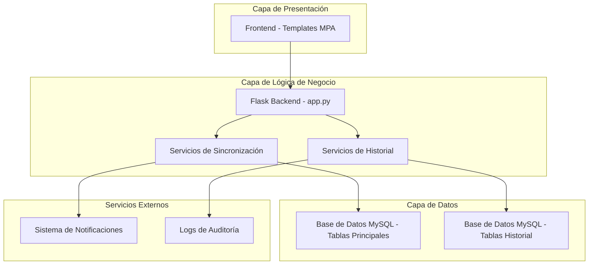
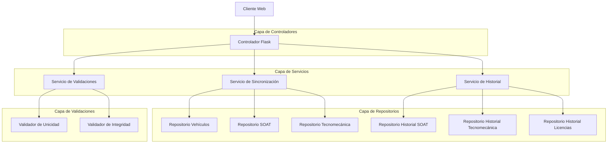
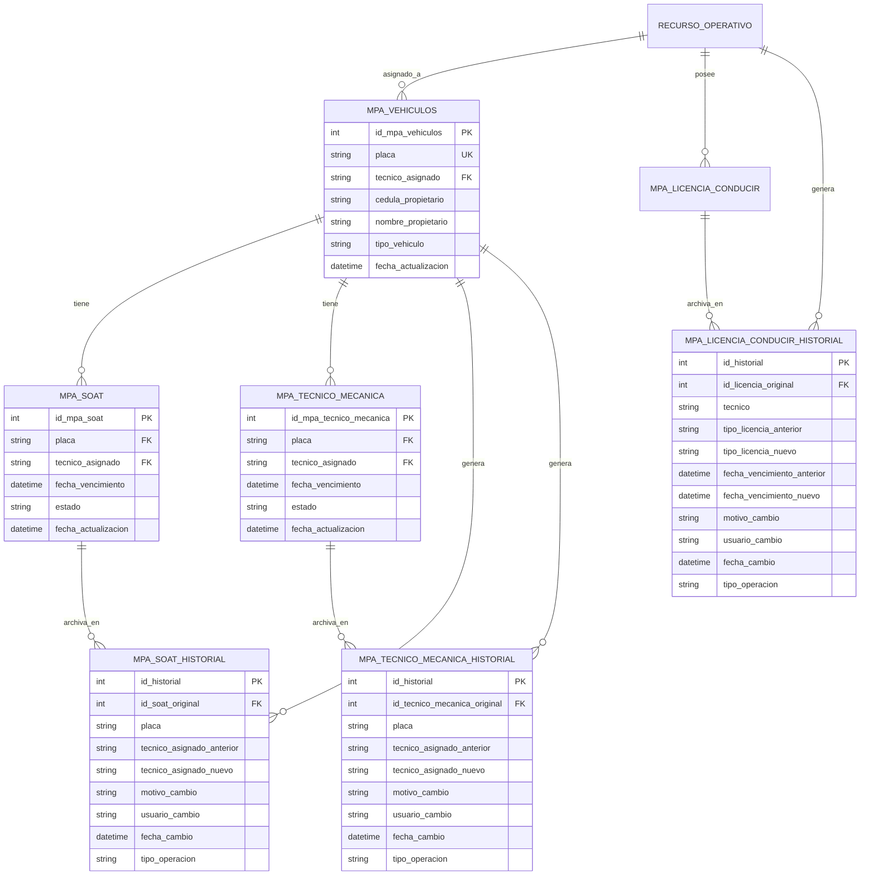

# Documento de Arquitectura Técnica - Mejoras Módulo MPA

## 1. Diseño de Arquitectura



## 2. Descripción de Tecnologías

- Frontend: HTML5 + Bootstrap 4 + JavaScript ES6 + jQuery
- Backend: Flask + MySQL Connector + Python 3.8+
- Base de Datos: MySQL 8.0 con triggers y procedimientos almacenados
- Servicios: Servicios de sincronización automática y gestión de historial

## 3. Definiciones de Rutas

| Ruta | Propósito |
|------|-----------|
| /mpa/vehiculos/sync | Endpoint para sincronización manual de vehículos |
| /api/mpa/vehiculos/sync-auto | API para sincronización automática al actualizar vehículo |
| /api/mpa/historial/soat | API para consultar historial de SOAT |
| /api/mpa/historial/tecnico-mecanica | API para consultar historial de Tecnomecánica |
| /api/mpa/historial/licencias | API para consultar historial de Licencias |
| /api/mpa/historial/consolidado | API para historial consolidado con filtros |
| /api/mpa/validaciones/unicidad | API para validar unicidad de SOAT/Tecnomecánica |
| /api/mpa/reportes/sincronizacion | API para reportes de procesos de sincronización |

## 4. Definiciones de API

### 4.1 API Principal de Sincronización

**Sincronización automática de vehículo**
```
PUT /api/mpa/vehiculos/<int:vehiculo_id>/sync-auto
```

Request:
| Parámetro | Tipo | Requerido | Descripción |
|-----------|------|-----------|-------------|
| tecnico_asignado | string | true | ID del nuevo técnico asignado |
| motivo_cambio | string | true | Motivo del cambio para auditoría |
| sincronizar_soat | boolean | false | Si sincronizar SOAT (default: true) |
| sincronizar_tecnico_mecanica | boolean | false | Si sincronizar Tecnomecánica (default: true) |

Response:
| Parámetro | Tipo | Descripción |
|-----------|------|-------------|
| success | boolean | Estado de la operación |
| vehiculo_actualizado | boolean | Si el vehículo fue actualizado |
| soat_sincronizado | boolean | Si el SOAT fue sincronizado |
| tecnico_mecanica_sincronizado | boolean | Si la Tecnomecánica fue sincronizada |
| registros_historial | array | IDs de registros creados en historial |

Ejemplo Request:
```json
{
  "tecnico_asignado": "12345",
  "motivo_cambio": "Reasignación por cambio de ruta",
  "sincronizar_soat": true,
  "sincronizar_tecnico_mecanica": true
}
```

Ejemplo Response:
```json
{
  "success": true,
  "vehiculo_actualizado": true,
  "soat_sincronizado": true,
  "tecnico_mecanica_sincronizado": true,
  "registros_historial": [101, 102, 103],
  "message": "Sincronización completada exitosamente"
}
```

### 4.2 API de Validación de Unicidad

**Validar unicidad de SOAT/Tecnomecánica**
```
POST /api/mpa/validaciones/unicidad
```

Request:
| Parámetro | Tipo | Requerido | Descripción |
|-----------|------|-----------|-------------|
| placa | string | true | Placa del vehículo |
| tipo_documento | string | true | 'soat' o 'tecnico_mecanica' |
| accion | string | true | 'crear' o 'actualizar' |
| id_actual | integer | false | ID del registro actual (para actualizaciones) |

Response:
| Parámetro | Tipo | Descripción |
|-----------|------|-------------|
| es_unico | boolean | Si cumple con la regla de unicidad |
| registro_existente | object | Datos del registro activo existente (si aplica) |
| requiere_historial | boolean | Si se debe mover el registro existente al historial |

### 4.3 API de Historial Consolidado

**Obtener historial consolidado**
```
GET /api/mpa/historial/consolidado
```

Request Parameters:
| Parámetro | Tipo | Requerido | Descripción |
|-----------|------|-----------|-------------|
| fecha_inicio | date | false | Fecha inicio del filtro (YYYY-MM-DD) |
| fecha_fin | date | false | Fecha fin del filtro (YYYY-MM-DD) |
| tecnico | string | false | ID del técnico para filtrar |
| tipo_cambio | string | false | 'vehiculo', 'soat', 'tecnico_mecanica', 'licencia' |
| placa | string | false | Placa específica para filtrar |
| page | integer | false | Número de página (default: 1) |
| limit | integer | false | Registros por página (default: 50) |

Response:
| Parámetro | Tipo | Descripción |
|-----------|------|-------------|
| historial | array | Lista de cambios históricos |
| total_registros | integer | Total de registros encontrados |
| pagina_actual | integer | Página actual |
| total_paginas | integer | Total de páginas |

## 5. Arquitectura del Servidor



## 6. Modelo de Datos

### 6.1 Definición del Modelo de Datos



### 6.2 Lenguaje de Definición de Datos (DDL)

**Tabla de Historial de SOAT**
```sql
-- Crear tabla de historial de SOAT
CREATE TABLE mpa_soat_historial (
    id_historial INT AUTO_INCREMENT PRIMARY KEY,
    id_soat_original INT NOT NULL,
    placa VARCHAR(10) NOT NULL,
    numero_poliza_anterior VARCHAR(50),
    numero_poliza_nuevo VARCHAR(50),
    aseguradora_anterior VARCHAR(100),
    aseguradora_nuevo VARCHAR(100),
    tecnico_asignado_anterior VARCHAR(20),
    tecnico_asignado_nuevo VARCHAR(20),
    fecha_vencimiento_anterior DATETIME,
    fecha_vencimiento_nuevo DATETIME,
    estado_anterior VARCHAR(20),
    estado_nuevo VARCHAR(20),
    motivo_cambio TEXT NOT NULL,
    usuario_cambio VARCHAR(50) NOT NULL,
    fecha_cambio DATETIME DEFAULT CURRENT_TIMESTAMP,
    tipo_operacion ENUM('CREACION', 'ACTUALIZACION', 'ELIMINACION', 'SINCRONIZACION') NOT NULL,
    datos_completos_anteriores JSON,
    datos_completos_nuevos JSON,
    INDEX idx_soat_historial_placa (placa),
    INDEX idx_soat_historial_fecha (fecha_cambio DESC),
    INDEX idx_soat_historial_tecnico (tecnico_asignado_nuevo),
    INDEX idx_soat_historial_operacion (tipo_operacion)
);

-- Crear tabla de historial de Tecnomecánica
CREATE TABLE mpa_tecnico_mecanica_historial (
    id_historial INT AUTO_INCREMENT PRIMARY KEY,
    id_tecnico_mecanica_original INT NOT NULL,
    placa VARCHAR(10) NOT NULL,
    tecnico_asignado_anterior VARCHAR(20),
    tecnico_asignado_nuevo VARCHAR(20),
    fecha_inicio_anterior DATETIME,
    fecha_inicio_nuevo DATETIME,
    fecha_vencimiento_anterior DATETIME,
    fecha_vencimiento_nuevo DATETIME,
    estado_anterior VARCHAR(20),
    estado_nuevo VARCHAR(20),
    tipo_vehiculo_anterior VARCHAR(50),
    tipo_vehiculo_nuevo VARCHAR(50),
    motivo_cambio TEXT NOT NULL,
    usuario_cambio VARCHAR(50) NOT NULL,
    fecha_cambio DATETIME DEFAULT CURRENT_TIMESTAMP,
    tipo_operacion ENUM('CREACION', 'ACTUALIZACION', 'ELIMINACION', 'SINCRONIZACION') NOT NULL,
    datos_completos_anteriores JSON,
    datos_completos_nuevos JSON,
    INDEX idx_tm_historial_placa (placa),
    INDEX idx_tm_historial_fecha (fecha_cambio DESC),
    INDEX idx_tm_historial_tecnico (tecnico_asignado_nuevo),
    INDEX idx_tm_historial_operacion (tipo_operacion)
);

-- Crear tabla de historial de Licencias de Conducir
CREATE TABLE mpa_licencia_conducir_historial (
    id_historial INT AUTO_INCREMENT PRIMARY KEY,
    id_licencia_original INT NOT NULL,
    tecnico VARCHAR(20) NOT NULL,
    tipo_licencia_anterior VARCHAR(10),
    tipo_licencia_nuevo VARCHAR(10),
    fecha_inicio_anterior DATETIME,
    fecha_inicio_nuevo DATETIME,
    fecha_vencimiento_anterior DATETIME,
    fecha_vencimiento_nuevo DATETIME,
    estado_anterior VARCHAR(20),
    estado_nuevo VARCHAR(20),
    motivo_cambio TEXT NOT NULL,
    usuario_cambio VARCHAR(50) NOT NULL,
    fecha_cambio DATETIME DEFAULT CURRENT_TIMESTAMP,
    tipo_operacion ENUM('CREACION', 'ACTUALIZACION', 'ELIMINACION', 'RENOVACION') NOT NULL,
    datos_completos_anteriores JSON,
    datos_completos_nuevos JSON,
    INDEX idx_lic_historial_tecnico (tecnico),
    INDEX idx_lic_historial_fecha (fecha_cambio DESC),
    INDEX idx_lic_historial_tipo (tipo_licencia_nuevo),
    INDEX idx_lic_historial_operacion (tipo_operacion)
);

-- Crear tabla de logs de sincronización
CREATE TABLE mpa_logs_sincronizacion (
    id_log INT AUTO_INCREMENT PRIMARY KEY,
    placa VARCHAR(10) NOT NULL,
    tipo_sincronizacion ENUM('VEHICULO_SOAT', 'VEHICULO_TECNICO_MECANICA', 'COMPLETA') NOT NULL,
    estado ENUM('EXITOSO', 'ERROR', 'PARCIAL') NOT NULL,
    detalles_operacion JSON,
    registros_afectados JSON,
    tiempo_ejecucion_ms INT,
    usuario_ejecutor VARCHAR(50),
    fecha_ejecucion DATETIME DEFAULT CURRENT_TIMESTAMP,
    mensaje_error TEXT,
    INDEX idx_logs_placa (placa),
    INDEX idx_logs_fecha (fecha_ejecucion DESC),
    INDEX idx_logs_estado (estado),
    INDEX idx_logs_tipo (tipo_sincronizacion)
);

-- Triggers para automatizar el historial en SOAT
DELIMITER //
CREATE TRIGGER tr_mpa_soat_historial_update
    BEFORE UPDATE ON mpa_soat
    FOR EACH ROW
BEGIN
    INSERT INTO mpa_soat_historial (
        id_soat_original, placa, numero_poliza_anterior, numero_poliza_nuevo,
        aseguradora_anterior, aseguradora_nuevo, tecnico_asignado_anterior, 
        tecnico_asignado_nuevo, fecha_vencimiento_anterior, fecha_vencimiento_nuevo,
        estado_anterior, estado_nuevo, motivo_cambio, usuario_cambio, tipo_operacion,
        datos_completos_anteriores, datos_completos_nuevos
    ) VALUES (
        OLD.id_mpa_soat, OLD.placa, OLD.numero_poliza, NEW.numero_poliza,
        OLD.aseguradora, NEW.aseguradora, OLD.tecnico_asignado, NEW.tecnico_asignado,
        OLD.fecha_vencimiento, NEW.fecha_vencimiento, OLD.estado, NEW.estado,
        COALESCE(@motivo_cambio, 'Actualización automática'), 
        COALESCE(@usuario_cambio, USER()), 'ACTUALIZACION',
        JSON_OBJECT('numero_poliza', OLD.numero_poliza, 'aseguradora', OLD.aseguradora, 
                   'tecnico_asignado', OLD.tecnico_asignado, 'fecha_vencimiento', OLD.fecha_vencimiento,
                   'estado', OLD.estado),
        JSON_OBJECT('numero_poliza', NEW.numero_poliza, 'aseguradora', NEW.aseguradora,
                   'tecnico_asignado', NEW.tecnico_asignado, 'fecha_vencimiento', NEW.fecha_vencimiento,
                   'estado', NEW.estado)
    );
END//
DELIMITER ;

-- Triggers para automatizar el historial en Tecnomecánica
DELIMITER //
CREATE TRIGGER tr_mpa_tecnico_mecanica_historial_update
    BEFORE UPDATE ON mpa_tecnico_mecanica
    FOR EACH ROW
BEGIN
    INSERT INTO mpa_tecnico_mecanica_historial (
        id_tecnico_mecanica_original, placa, tecnico_asignado_anterior, tecnico_asignado_nuevo,
        fecha_inicio_anterior, fecha_inicio_nuevo, fecha_vencimiento_anterior, fecha_vencimiento_nuevo,
        estado_anterior, estado_nuevo, tipo_vehiculo_anterior, tipo_vehiculo_nuevo,
        motivo_cambio, usuario_cambio, tipo_operacion,
        datos_completos_anteriores, datos_completos_nuevos
    ) VALUES (
        OLD.id_mpa_tecnico_mecanica, OLD.placa, OLD.tecnico_asignado, NEW.tecnico_asignado,
        OLD.fecha_inicio, NEW.fecha_inicio, OLD.fecha_vencimiento, NEW.fecha_vencimiento,
        OLD.estado, NEW.estado, OLD.tipo_vehiculo, NEW.tipo_vehiculo,
        COALESCE(@motivo_cambio, 'Actualización automática'),
        COALESCE(@usuario_cambio, USER()), 'ACTUALIZACION',
        JSON_OBJECT('tecnico_asignado', OLD.tecnico_asignado, 'fecha_inicio', OLD.fecha_inicio,
                   'fecha_vencimiento', OLD.fecha_vencimiento, 'estado', OLD.estado,
                   'tipo_vehiculo', OLD.tipo_vehiculo),
        JSON_OBJECT('tecnico_asignado', NEW.tecnico_asignado, 'fecha_inicio', NEW.fecha_inicio,
                   'fecha_vencimiento', NEW.fecha_vencimiento, 'estado', NEW.estado,
                   'tipo_vehiculo', NEW.tipo_vehiculo)
    );
END//
DELIMITER ;

-- Procedimiento almacenado para sincronización automática
DELIMITER //
CREATE PROCEDURE sp_sincronizar_vehiculo_completo(
    IN p_placa VARCHAR(10),
    IN p_nuevo_tecnico VARCHAR(20),
    IN p_motivo_cambio TEXT,
    IN p_usuario_cambio VARCHAR(50),
    OUT p_resultado JSON
)
BEGIN
    DECLARE v_error_count INT DEFAULT 0;
    DECLARE v_soat_actualizado BOOLEAN DEFAULT FALSE;
    DECLARE v_tm_actualizado BOOLEAN DEFAULT FALSE;
    DECLARE v_vehiculo_actualizado BOOLEAN DEFAULT FALSE;
    DECLARE EXIT HANDLER FOR SQLEXCEPTION
    BEGIN
        ROLLBACK;
        GET DIAGNOSTICS CONDITION 1
            @error_code = MYSQL_ERRNO, @error_msg = MESSAGE_TEXT;
        SET p_resultado = JSON_OBJECT(
            'success', FALSE,
            'error_code', @error_code,
            'error_message', @error_msg
        );
    END;

    START TRANSACTION;
    
    -- Establecer variables de contexto para los triggers
    SET @motivo_cambio = p_motivo_cambio;
    SET @usuario_cambio = p_usuario_cambio;
    
    -- Actualizar vehículo
    UPDATE mpa_vehiculos 
    SET tecnico_asignado = p_nuevo_tecnico,
        fecha_actualizacion = NOW()
    WHERE placa = p_placa;
    
    IF ROW_COUNT() > 0 THEN
        SET v_vehiculo_actualizado = TRUE;
    END IF;
    
    -- Actualizar SOAT activo
    UPDATE mpa_soat 
    SET tecnico_asignado = p_nuevo_tecnico,
        fecha_actualizacion = NOW()
    WHERE placa = p_placa AND estado = 'Activo';
    
    IF ROW_COUNT() > 0 THEN
        SET v_soat_actualizado = TRUE;
    END IF;
    
    -- Actualizar Tecnomecánica activa
    UPDATE mpa_tecnico_mecanica 
    SET tecnico_asignado = p_nuevo_tecnico,
        fecha_actualizacion = NOW()
    WHERE placa = p_placa AND estado = 'Activo';
    
    IF ROW_COUNT() > 0 THEN
        SET v_tm_actualizado = TRUE;
    END IF;
    
    -- Limpiar variables de contexto
    SET @motivo_cambio = NULL;
    SET @usuario_cambio = NULL;
    
    COMMIT;
    
    SET p_resultado = JSON_OBJECT(
        'success', TRUE,
        'vehiculo_actualizado', v_vehiculo_actualizado,
        'soat_actualizado', v_soat_actualizado,
        'tecnico_mecanica_actualizado', v_tm_actualizado,
        'timestamp', NOW()
    );
END//
DELIMITER ;
```