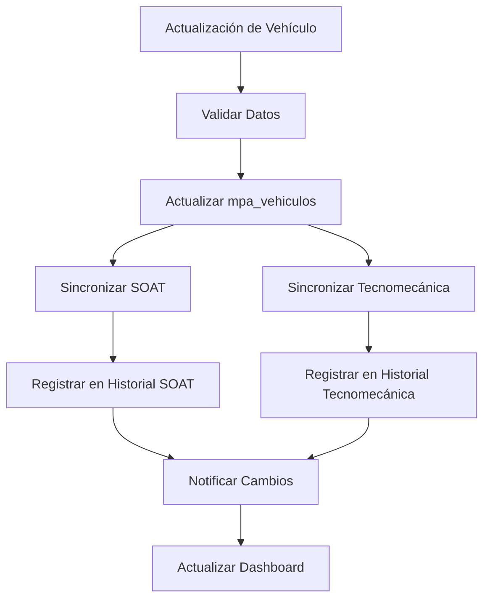

# Documento de Requerimientos del Producto - Mejoras Módulo MPA

## 1. Resumen del Proyecto

Este proyecto implementa mejoras críticas en el módulo MPA (Mantenimiento Parque Automotor) para automatizar la sincronización de datos entre vehículos, SOAT, Tecnomecánica y Licencias de Conducir, además de implementar un sistema completo de historial para el seguimiento de cambios y vencimientos.

**Objetivos principales:**
- Automatizar la sincronización cuando se actualice información de vehículos
- Garantizar integridad de datos con validaciones de unicidad
- Implementar trazabilidad completa mediante sistema de historial

## 2. Funcionalidades Principales

### 2.1 Roles de Usuario
| Rol | Método de Registro | Permisos Principales |
|-----|-------------------|---------------------|
| Administrativo | Asignación directa | Acceso completo a todas las funciones del módulo MPA |
| SSTT | Asignación por rol | Consulta y gestión de vencimientos, historial de cambios |
| Técnicos | Asignación por rol | Consulta de información asignada, actualización de datos básicos |

### 2.2 Módulos de Funcionalidad

Nuestro sistema de mejoras MPA consta de las siguientes páginas principales:

1. **Gestión de Vehículos**: sincronización automática, validaciones de integridad, historial de cambios
2. **Gestión de SOAT**: control de unicidad, sincronización con vehículos, historial completo
3. **Gestión de Tecnomecánica**: control de unicidad, sincronización con vehículos, historial completo
4. **Gestión de Licencias**: historial de renovaciones, seguimiento de vencimientos
5. **Dashboard de Historial**: visualización consolidada de todos los cambios históricos
6. **Reportes de Sincronización**: monitoreo de procesos automáticos y validaciones

### 2.3 Detalles de Páginas

| Página | Módulo | Descripción de Funcionalidad |
|--------|--------|------------------------------|
| Gestión de Vehículos | Sincronización Automática | Actualizar automáticamente SOAT y Tecnomecánica cuando cambie el técnico asignado. Validar integridad de datos antes de confirmar cambios. |
| Gestión de Vehículos | Control de Unicidad | Validar que solo exista un SOAT activo y una Tecnomecánica activa por vehículo. Mover registros anteriores al historial automáticamente. |
| Gestión de SOAT | Historial de Cambios | Registrar todos los cambios en tabla mpa_soat_historial con timestamp, usuario y motivo del cambio. Mostrar línea de tiempo de modificaciones. |
| Gestión de Tecnomecánica | Historial de Cambios | Registrar todos los cambios en tabla mpa_tecnico_mecanica_historial con timestamp, usuario y motivo del cambio. Mostrar línea de tiempo de modificaciones. |
| Gestión de Licencias | Historial de Renovaciones | Registrar renovaciones y cambios en tabla mpa_licencia_conducir_historial. Seguimiento de tipos de licencia y vencimientos. |
| Dashboard de Historial | Visualización Consolidada | Mostrar timeline unificado de todos los cambios en vehículos, SOAT, Tecnomecánica y Licencias. Filtros por fecha, técnico y tipo de cambio. |
| Reportes de Sincronización | Monitoreo de Procesos | Mostrar logs de sincronizaciones automáticas, errores detectados y validaciones fallidas. Alertas de inconsistencias de datos. |

## 3. Flujos Principales del Proceso

### Flujo de Sincronización Automática
Cuando un administrador actualiza la información de un vehículo (especialmente el técnico asignado):
1. El sistema valida los datos de entrada
2. Actualiza la información del vehículo en mpa_vehiculos
3. Automáticamente sincroniza el técnico_asignado en mpa_soat y mpa_tecnico_mecanica para la misma placa
4. Registra todos los cambios en las tablas de historial correspondientes
5. Envía notificaciones de cambios a los técnicos afectados

### Flujo de Control de Unicidad
Cuando se crea un nuevo SOAT o Tecnomecánica:
1. El sistema verifica si ya existe un registro activo para el mismo vehículo
2. Si existe, mueve el registro anterior al historial marcándolo como "Reemplazado"
3. Crea el nuevo registro como "Activo"
4. Actualiza las referencias en el vehículo si es necesario

### Flujo de Historial
Para cualquier cambio en SOAT, Tecnomecánica o Licencias:
1. Antes de actualizar, copia el registro actual al historial
2. Registra el usuario, fecha/hora y motivo del cambio
3. Ejecuta la actualización en la tabla principal
4. Actualiza el dashboard de historial en tiempo real

## 4. Diseño de Interfaz de Usuario

### 4.1 Estilo de Diseño
- **Colores primarios**: Azul corporativo (#007bff), Verde éxito (#28a745), Rojo alerta (#dc3545)
- **Colores secundarios**: Gris claro (#f8f9fa), Amarillo advertencia (#ffc107)
- **Estilo de botones**: Redondeados con sombra sutil, efectos hover suaves
- **Tipografía**: Roboto 14px para texto general, 16px para títulos de sección
- **Layout**: Diseño de tarjetas con espaciado consistente, navegación lateral fija
- **Iconos**: Font Awesome para consistencia, iconos específicos para historial (📋), sincronización (🔄), alertas (⚠️)

### 4.2 Resumen de Diseño de Páginas

| Página | Módulo | Elementos de UI |
|--------|--------|-----------------|
| Gestión de Vehículos | Panel de Sincronización | Indicador visual de estado de sincronización, botón "Sincronizar Ahora", alertas de inconsistencias en tiempo real |
| Gestión de SOAT | Control de Unicidad | Badge de "Activo/Inactivo", modal de confirmación para reemplazos, timeline de historial con iconos de estado |
| Gestión de Tecnomecánica | Control de Unicidad | Badge de "Activo/Inactivo", modal de confirmación para reemplazos, timeline de historial con iconos de estado |
| Dashboard de Historial | Visualización Timeline | Línea de tiempo interactiva, filtros desplegables, tarjetas de cambios con código de colores por tipo |
| Reportes de Sincronización | Monitoreo | Gráficos de barras para estadísticas, tabla de logs con paginación, indicadores de salud del sistema |

### 4.3 Responsividad
El sistema está optimizado para escritorio con adaptación a tablets. Las tablas de historial incluyen scroll horizontal en dispositivos móviles y los filtros se colapsan en menús desplegables para pantallas pequeñas.