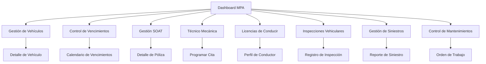

# Módulo de Parque Automotor (MPA) - Documento de Requerimientos

## 1. Product Overview

El Módulo de Parque Automotor (MPA) es un sistema integral de gestión vehicular diseñado para administrar de manera eficiente todos los aspectos relacionados con la flota de vehículos de la organización. Este módulo permite el control completo del inventario vehicular, documentación, mantenimientos, inspecciones y siniestros, garantizando el cumplimiento normativo y la operatividad óptima de la flota.

El sistema está dirigido a administradores de flota, personal de logística y supervisores operativos que requieren un control detallado y en tiempo real del estado de los vehículos, sus documentos y historial de mantenimiento.

## 2. Core Features

### 2.1 User Roles

| Role | Registration Method | Core Permissions |
|------|---------------------|------------------|
| Administrador MPA | Asignación por administrador del sistema | Acceso completo a todas las funcionalidades del módulo |
| Supervisor de Flota | Asignación por administrador MPA | Gestión de vehículos, mantenimientos e inspecciones |
| Operador Vehicular | Asignación por supervisor | Consulta de información y registro de novedades básicas |

### 2.2 Feature Module

Nuestro módulo MPA consta de las siguientes páginas principales:

1. **Dashboard Principal**: panel de control con estadísticas generales, alertas de vencimientos y accesos rápidos a los módulos principales.
2. **Gestión de Vehículos**: inventario completo de la flota con información detallada de cada vehículo.
3. **Control de Vencimientos**: monitoreo centralizado de todas las fechas de vencimiento de documentos vehiculares.
4. **Gestión SOAT**: administración de seguros obligatorios de accidentes de tránsito.
5. **Técnico Mecánica**: control de revisiones técnico mecánicas y certificaciones.
6. **Licencias de Conducir**: gestión de licencias de conductores asignados a la flota.
7. **Inspecciones Vehiculares**: registro y seguimiento de inspecciones preventivas y correctivas.
8. **Gestión de Siniestros**: administración de accidentes, incidentes y reclamaciones.
9. **Control de Mantenimientos**: programación y seguimiento de mantenimientos preventivos y correctivos.

### 2.3 Page Details

| Page Name | Module Name | Feature description |
|-----------|-------------|---------------------|
| Dashboard Principal | Panel de Control | Mostrar estadísticas generales de la flota, alertas de vencimientos próximos, indicadores de estado vehicular y accesos rápidos a módulos principales |
| Dashboard Principal | Alertas y Notificaciones | Generar alertas automáticas por vencimientos próximos, mantenimientos pendientes y documentos por renovar |
| Gestión de Vehículos | Inventario Vehicular | Registrar, editar y consultar información completa de vehículos (placa, marca, modelo, año, tipo, estado, conductor asignado) |
| Gestión de Vehículos | Asignación de Conductores | Asignar y gestionar conductores responsables de cada vehículo con historial de asignaciones |
| Control de Vencimientos | Monitor de Fechas | Visualizar calendario de vencimientos de todos los documentos vehiculares con filtros por tipo y urgencia |
| Control de Vencimientos | Gestión de Renovaciones | Programar y hacer seguimiento a procesos de renovación de documentos |
| Gestión SOAT | Registro de Pólizas | Crear, editar y consultar pólizas SOAT con fechas de vigencia, aseguradoras y montos |
| Gestión SOAT | Control de Pagos | Gestionar pagos de primas y renovaciones con historial financiero |
| Técnico Mecánica | Programación de Citas | Agendar citas para revisiones técnico mecánicas con centros autorizados |
| Técnico Mecánica | Registro de Resultados | Documentar resultados de revisiones con certificados y observaciones |
| Licencias de Conducir | Base de Conductores | Mantener registro completo de conductores con información personal y profesional |
| Licencias de Conducir | Control de Vigencias | Monitorear fechas de vencimiento de licencias y restricciones |
| Inspecciones Vehiculares | Programación de Inspecciones | Crear cronogramas de inspecciones preventivas y programar inspecciones correctivas |
| Inspecciones Vehiculares | Registro de Hallazgos | Documentar resultados de inspecciones con fotografías, observaciones y acciones correctivas |
| Gestión de Siniestros | Registro de Incidentes | Crear reportes detallados de accidentes con información de involucrados, daños y circunstancias |
| Gestión de Siniestros | Seguimiento de Reclamaciones | Gestionar procesos de reclamación con aseguradoras y terceros |
| Control de Mantenimientos | Programación Preventiva | Crear y gestionar cronogramas de mantenimiento preventivo basados en kilometraje y tiempo |
| Control de Mantenimientos | Registro de Servicios | Documentar servicios realizados con costos, repuestos utilizados y próximas fechas de servicio |

## 3. Core Process

### Flujo Principal del Administrador MPA:
1. Acceso al dashboard principal para visualizar estado general de la flota
2. Revisión de alertas y vencimientos próximos
3. Gestión de vehículos: registro de nuevos vehículos o actualización de información existente
4. Programación de mantenimientos preventivos y seguimiento de correctivos
5. Control de documentación vehicular y renovaciones
6. Supervisión de inspecciones y seguimiento de hallazgos
7. Gestión de siniestros y procesos de reclamación

### Flujo del Supervisor de Flota:
1. Consulta de estado de vehículos asignados a su área
2. Programación de inspecciones y mantenimientos
3. Registro de novedades y hallazgos en inspecciones
4. Seguimiento de conductores y licencias
5. Reporte de incidentes y siniestros

### Flujo del Operador Vehicular:
1. Consulta de información de vehículos asignados
2. Registro de novedades operativas básicas
3. Consulta de cronogramas de mantenimiento
4. Reporte de incidentes menores

## 4. User Interface Design

### 4.1 Design Style

- **Colores primarios**: Azul corporativo (#007bff) para elementos principales, verde (#28a745) para estados positivos
- **Colores secundarios**: Naranja (#fd7e14) para alertas, rojo (#dc3545) para urgencias y errores
- **Estilo de botones**: Botones redondeados con efectos hover y sombras sutiles
- **Tipografía**: Fuente principal Roboto o sistema, tamaños de 14px para texto normal, 16px para títulos de sección
- **Layout**: Diseño basado en cards con navegación superior fija, sidebar colapsible para filtros
- **Iconografía**: Font Awesome 6 con iconos específicos para cada módulo (🚗 vehículos, 📅 vencimientos, 🛡️ SOAT, etc.)

### 4.2 Page Design Overview

| Page Name | Module Name | UI Elements |
|-----------|-------------|-------------|
| Dashboard Principal | Panel de Control | Cards estadísticas con iconos grandes, gráficos de barras para indicadores, tabla de alertas con códigos de color por urgencia |
| Dashboard Principal | Navegación Rápida | Grid de 8 botones principales con iconos distintivos, colores temáticos y contadores de elementos pendientes |
| Gestión de Vehículos | Lista de Vehículos | Tabla responsive con filtros avanzados, badges de estado, botones de acción por fila y paginación |
| Gestión de Vehículos | Formulario de Vehículo | Formulario en modal o página completa con campos organizados en pestañas, validación en tiempo real |
| Control de Vencimientos | Calendario | Vista de calendario mensual con eventos coloreados por tipo de vencimiento, panel lateral con lista detallada |
| Gestión SOAT | Lista de Pólizas | Cards de pólizas con información resumida, indicadores de estado de vigencia y botones de renovación |
| Inspecciones Vehiculares | Formulario de Inspección | Checklist interactivo con opciones de fotografía, campos de observaciones y firma digital |
| Gestión de Siniestros | Reporte de Siniestro | Formulario paso a paso con mapas de ubicación, carga de documentos y timeline de seguimiento |

### 4.3 Responsiveness

El módulo está diseñado con enfoque mobile-first, adaptándose completamente a dispositivos móviles y tablets. Las tablas se convierten en cards apilables en pantallas pequeñas, los formularios se optimizan para entrada táctil y la navegación se adapta a menús colapsibles. Se incluye soporte para gestos táctiles en calendarios y galerías de imágenes.