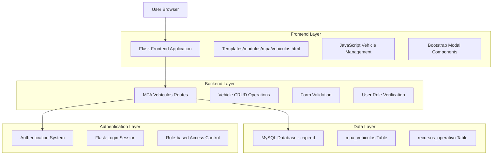
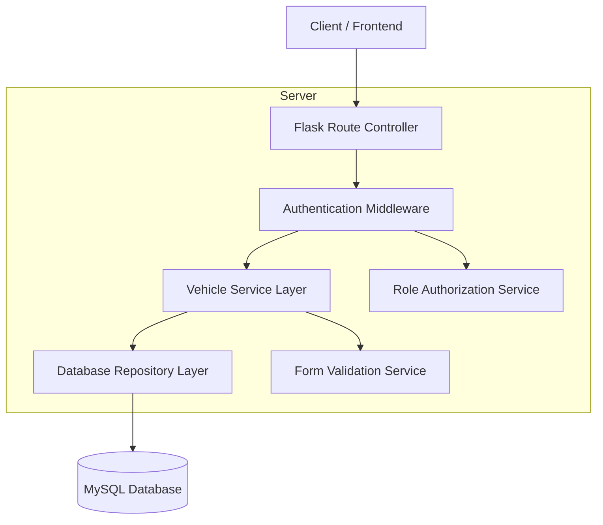
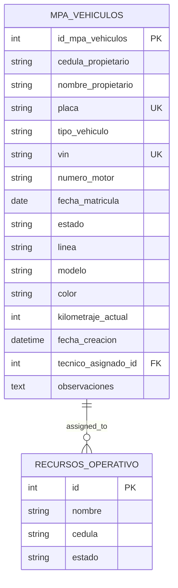

# Documento de Arquitectura Técnica - Módulo MPA Vehículos

## 1. Architecture design



## 2. Technology Description

- Frontend: Flask Templates + Bootstrap 4 + jQuery + Font Awesome
- Backend: Flask + MySQL + Flask-Login
- Database: MySQL (capired database)
- Authentication: Flask-Login with role-based access control

## 3. Route definitions

| Route | Purpose |
|-------|---------|
| /mpa/vehiculos | Main vehicles list page with table and action buttons |
| /api/mpa/vehiculos | GET: Retrieve vehicles list, POST: Create new vehicle |
| /api/mpa/vehiculos/<id> | GET: Get vehicle details, PUT: Update vehicle, DELETE: Remove vehicle |
| /api/mpa/vehiculos/tecnicos | GET: Retrieve available technicians from recursos_operativo |

## 4. API definitions

### 4.1 Core API

**Vehicle Management APIs**

```
GET /api/mpa/vehiculos
```

Request: None (authenticated user required)

Response:
| Param Name | Param Type | Description |
|------------|------------|-------------|
| vehicles | array | List of vehicle objects with placa and tecnico_asignado |
| status | boolean | Success status of the request |

Example Response:
```json
{
  "status": true,
  "vehicles": [
    {
      "id_mpa_vehiculos": 1,
      "placa": "ABC123",
      "tecnico_asignado": "Juan Pérez",
      "estado": "Activo"
    }
  ]
}
```

```
POST /api/mpa/vehiculos
```

Request:
| Param Name | Param Type | isRequired | Description |
|------------|------------|------------|-------------|
| cedula_propietario | string | true | Owner's identification number |
| nombre_propietario | string | true | Owner's full name |
| placa | string | true | Vehicle license plate |
| tipo_vehiculo | string | true | Vehicle type (Moto/Camioneta/Camión) |
| vin | string | true | Vehicle identification number |
| numero_motor | string | true | Engine number |
| fecha_matricula | date | true | Registration date |
| estado | string | true | Vehicle status (Activo/Inactivo) |
| linea | string | false | Vehicle line/brand |
| modelo | string | false | Vehicle model |
| color | string | false | Vehicle color |
| kilometraje_actual | integer | false | Current mileage |
| tecnico_asignado_id | integer | true | Assigned technician ID |
| observaciones | text | false | Additional observations |

Response:
| Param Name | Param Type | Description |
|------------|------------|-------------|
| status | boolean | Success status |
| message | string | Success or error message |
| vehicle_id | integer | ID of created vehicle |

```
GET /api/mpa/vehiculos/tecnicos
```

Request: None

Response:
| Param Name | Param Type | Description |
|------------|------------|-------------|
| tecnicos | array | List of available technicians from recursos_operativo |
| status | boolean | Success status |

Example Response:
```json
{
  "status": true,
  "tecnicos": [
    {
      "id": 1,
      "nombre": "Juan Pérez",
      "cedula": "12345678"
    }
  ]
}
```

## 5. Server architecture diagram



## 6. Data model

### 6.1 Data model definition



### 6.2 Data Definition Language

**MPA Vehículos Table Structure**

```sql
-- Verificar estructura de tabla existente
DESCRIBE capired.mpa_vehiculos;

-- Índices recomendados para optimización
CREATE INDEX idx_mpa_vehiculos_placa ON capired.mpa_vehiculos(placa);
CREATE INDEX idx_mpa_vehiculos_tecnico ON capired.mpa_vehiculos(tecnico_asignado_id);
CREATE INDEX idx_mpa_vehiculos_estado ON capired.mpa_vehiculos(estado);
CREATE INDEX idx_mpa_vehiculos_tipo ON capired.mpa_vehiculos(tipo_vehiculo);

-- Consulta para obtener vehículos con técnico asignado
SELECT 
    v.id_mpa_vehiculos,
    v.placa,
    v.estado,
    r.nombre as tecnico_asignado
FROM capired.mpa_vehiculos v
LEFT JOIN capired.recursos_operativo r ON v.tecnico_asignado_id = r.id
WHERE v.estado = 'Activo'
ORDER BY v.fecha_creacion DESC;

-- Consulta para técnicos disponibles
SELECT 
    id,
    nombre,
    cedula
FROM capired.recursos_operativo 
WHERE estado = 'Activo'
ORDER BY nombre ASC;
```

**Validaciones de Datos**

```sql
-- Validación de placa única
ALTER TABLE capired.mpa_vehiculos 
ADD CONSTRAINT uk_mpa_vehiculos_placa UNIQUE (placa);

-- Validación de VIN único
ALTER TABLE capired.mpa_vehiculos 
ADD CONSTRAINT uk_mpa_vehiculos_vin UNIQUE (vin);

-- Validación de tipo de vehículo
ALTER TABLE capired.mpa_vehiculos 
ADD CONSTRAINT chk_tipo_vehiculo 
CHECK (tipo_vehiculo IN ('Moto', 'Camioneta', 'Camión'));

-- Validación de estado
ALTER TABLE capired.mpa_vehiculos 
ADD CONSTRAINT chk_estado_vehiculo 
CHECK (estado IN ('Activo', 'Inactivo'));
```