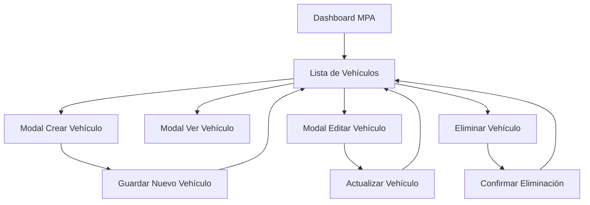

# Documento de Requerimientos del Producto - Módulo MPA Vehículos

## 1. Product Overview

Sistema de gestión integral del inventario de vehículos de la flota empresarial, permitiendo el registro, seguimiento y administración completa de todos los vehículos asignados a técnicos operativos.

- **Propósito principal**: Centralizar la información vehicular para optimizar la asignación de recursos y el control de la flota empresarial.
- **Usuarios objetivo**: Personal administrativo con rol MPA y administrativo que requieren gestionar el inventario vehicular.
- **Valor del producto**: Mejora la eficiencia operativa mediante el control detallado de vehículos y su asignación a técnicos.

## 2. Core Features

### 2.1 User Roles

| Role | Registration Method | Core Permissions |
|------|---------------------|------------------|
| Usuario MPA | Asignación administrativa | Puede gestionar vehículos, crear, editar, ver y eliminar registros |
| Usuario Administrativo | Asignación del sistema | Acceso completo a todas las funciones del módulo de vehículos |

### 2.2 Feature Module

Nuestro módulo de vehículos MPA consiste en las siguientes páginas principales:

1. **Lista de Vehículos**: tabla de vehículos registrados, botones de acción, filtros básicos.
2. **Modal de Creación**: formulario completo de registro, validaciones, selección de técnico asignado.
3. **Modal de Edición**: modificación de datos existentes, mantenimiento del historial.
4. **Modal de Visualización**: vista detallada de información vehicular, datos no editables.

### 2.3 Page Details

| Page Name | Module Name | Feature description |
|-----------|-------------|---------------------|
| Lista de Vehículos | Tabla Principal | Mostrar placa y técnico asignado en formato tabla. Incluir botones Ver, Actualizar, Eliminar por fila. Botón "Crear Vehículo" para abrir modal |
| Lista de Vehículos | Sistema de Filtros | Filtrar por placa, técnico asignado, estado del vehículo |
| Modal de Creación | Formulario de Registro | Campos: cédula propietario, nombre propietario, placa, tipo vehículo (dropdown: Moto/Camioneta/Camión), VIN, número motor, fecha matrícula, estado (Activo/Inactivo), línea, modelo, color, kilometraje actual, técnico asignado (desde recursos_operativo), observaciones |
| Modal de Creación | Validaciones | Validar formato de placa, unicidad de VIN, campos obligatorios, formato de cédula |
| Modal de Edición | Modificación de Datos | Permitir editar todos los campos excepto ID y fecha de creación. Mantener historial de cambios |
| Modal de Visualización | Vista Detallada | Mostrar todos los campos en formato de solo lectura con diseño organizado |

## 3. Core Process

**Flujo Principal del Usuario MPA:**

1. El usuario accede al dashboard MPA y selecciona "Ver Vehículos"
2. Se muestra la lista de vehículos con placa y técnico asignado
3. Para crear un nuevo vehículo: clic en "Crear Vehículo" → completar formulario modal → guardar
4. Para ver detalles: clic en "Ver" → modal de visualización con información completa
5. Para editar: clic en "Actualizar" → modal de edición → modificar campos → guardar cambios
6. Para eliminar: clic en "Eliminar" → confirmación → eliminación del registro

## 4. User Interface Design

### 4.1 Design Style

- **Colores primarios**: Azul corporativo (#007bff), blanco (#ffffff)
- **Colores secundarios**: Gris claro (#f8f9fa), verde éxito (#28a745), rojo alerta (#dc3545)
- **Estilo de botones**: Redondeados con sombra sutil, efectos hover
- **Fuente**: Sistema por defecto, tamaños 14px para texto, 16px para títulos
- **Layout**: Diseño de tarjetas para modales, tabla responsiva para listados
- **Iconos**: Font Awesome para acciones (ojo para ver, lápiz para editar, papelera para eliminar)

### 4.2 Page Design Overview

| Page Name | Module Name | UI Elements |
|-----------|-------------|-------------|
| Lista de Vehículos | Tabla Principal | Tabla Bootstrap responsiva, encabezados fijos, filas alternadas en gris claro. Botones de acción en colores: azul (ver), amarillo (editar), rojo (eliminar) |
| Lista de Vehículos | Botón Crear | Botón primario azul, posicionado arriba-derecha, icono de plus, texto "Crear Vehículo" |
| Modal de Creación | Formulario | Modal Bootstrap grande, campos organizados en 2 columnas, labels en negrita, inputs con bordes redondeados, dropdowns estilizados |
| Modal de Creación | Validaciones | Mensajes de error en rojo debajo de cada campo, bordes rojos en campos inválidos, tooltip de ayuda |
| Modal de Edición | Formulario Editable | Misma estructura que creación, campos pre-poblados, indicador visual de campos modificados |
| Modal de Visualización | Vista de Solo Lectura | Campos deshabilitados con fondo gris claro, información organizada en secciones, botón "Cerrar" únicamente |

### 4.3 Responsiveness

El módulo es desktop-first con adaptación móvil completa. En dispositivos móviles, la tabla se convierte en tarjetas apiladas y los modales ocupan toda la pantalla. Se optimiza para interacción táctil con botones más grandes y espaciado aumentado.