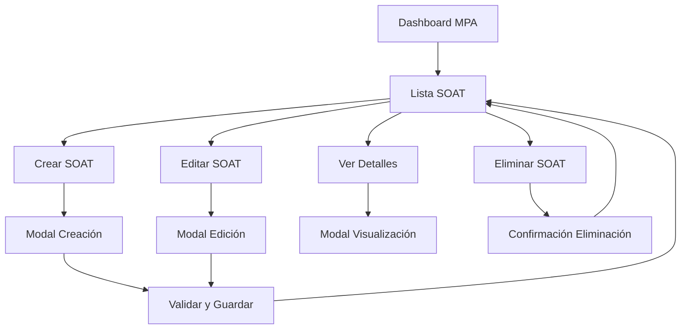

# Documento de Requerimientos del Producto (PRD) - Módulo SOAT MPA

## 1. Product Overview

El módulo de SOAT (Seguro Obligatorio de Accidentes de Tránsito) es una funcionalidad integral del sistema MPA que permite gestionar de manera eficiente los seguros obligatorios de la flota vehicular. Este módulo facilita el control de vigencias, renovaciones y seguimiento de pólizas SOAT para garantizar el cumplimiento legal y operativo de todos los vehículos.

El sistema está dirigido a administradores y personal del área MPA que requieren mantener un control riguroso sobre las fechas de vencimiento de los seguros, evitando multas y garantizando la operatividad continua de la flota.

## 2. Core Features

### 2.1 User Roles

| Role | Registration Method | Core Permissions |
|------|---------------------|------------------|
| Administrativo | Acceso directo del sistema | Acceso completo: crear, editar, eliminar y visualizar registros SOAT |
| MPA | Acceso directo del sistema | Acceso completo: crear, editar, eliminar y visualizar registros SOAT |

### 2.2 Feature Module

Nuestro módulo de SOAT consiste en las siguientes páginas principales:

1. **Página de Lista SOAT**: tabla de visualización, filtros de búsqueda, indicadores de vencimiento, botón de creación.
2. **Modal de Creación SOAT**: formulario de registro, validaciones, selección de vehículo, asignación automática de técnico.
3. **Modal de Edición SOAT**: formulario de actualización, validaciones, historial de cambios.
4. **Modal de Visualización**: detalles completos del SOAT, información del vehículo, datos del técnico.

### 2.3 Page Details

| Page Name | Module Name | Feature description |
|-----------|-------------|---------------------|
| Lista SOAT | Tabla Principal | Mostrar placa, fecha inicio, fecha vencimiento, días por vencer con códigos de color (verde >30 días, amarillo 15-30 días, rojo <15 días), acciones de editar/eliminar |
| Lista SOAT | Filtros y Búsqueda | Filtrar por placa, estado de vigencia, rango de fechas, técnico asignado |
| Lista SOAT | Botón Crear SOAT | Abrir modal de creación con formulario completo |
| Modal Creación | Formulario SOAT | Campos: placa (dropdown), fecha inicio, fecha vencimiento, número póliza, aseguradora, valor prima, técnico auto-asignado |
| Modal Creación | Validaciones | Validar fechas lógicas, número de póliza único, campos obligatorios, formato de datos |
| Modal Edición | Formulario Actualización | Editar todos los campos excepto placa, mantener historial de cambios |
| Modal Visualización | Detalles Completos | Mostrar información completa del SOAT, datos del vehículo, información del técnico |
| Todas las páginas | Alertas y Notificaciones | Mostrar mensajes de éxito, error, confirmaciones de eliminación |

## 3. Core Process

**Flujo Principal del Usuario:**

1. **Acceso al Módulo**: El usuario accede desde el dashboard MPA haciendo clic en "Ver SOAT"
2. **Visualización de Lista**: Se muestra la tabla con todos los registros SOAT, incluyendo indicadores visuales de vencimiento
3. **Creación de SOAT**: 
   - Clic en "Crear SOAT"
   - Selección de vehículo desde dropdown
   - Auto-completado del técnico asignado
   - Ingreso de datos del seguro
   - Validación y guardado
4. **Gestión de Registros**:
   - Edición de registros existentes
   - Visualización de detalles completos
   - Eliminación con confirmación
5. **Monitoreo de Vencimientos**: Identificación visual de seguros próximos a vencer

## 4. User Interface Design

### 4.1 Design Style

- **Colores Primarios**: Verde (#28a745) para elementos principales, azul (#007bff) para acciones secundarias
- **Colores de Estado**: Verde (vigente >30 días), amarillo/naranja (15-30 días), rojo (<15 días o vencido)
- **Estilo de Botones**: Botones redondeados con gradientes, iconos Font Awesome
- **Tipografía**: Bootstrap default fonts, tamaños 14px para texto normal, 16px para títulos
- **Layout**: Diseño basado en cards de Bootstrap, navegación superior consistente
- **Iconos**: Font Awesome - fas fa-shield-alt para SOAT, fas fa-calendar para fechas, fas fa-car para vehículos

### 4.2 Page Design Overview

| Page Name | Module Name | UI Elements |
|-----------|-------------|-------------|
| Lista SOAT | Header Card | Gradiente verde (#28a745 a #1e7e34), título con icono fas fa-shield-alt, descripción informativa |
| Lista SOAT | Tabla Principal | Bootstrap table-striped, columnas: Placa, Fecha Inicio, Fecha Vencimiento, Días por Vencer, Acciones |
| Lista SOAT | Indicadores Vencimiento | Badges con colores: success (>30), warning (15-30), danger (<15), secondary (vencido) |
| Lista SOAT | Botones Acción | Botón verde "Crear SOAT" con icono fas fa-plus, botones editar (azul) y eliminar (rojo) |
| Modal Creación | Formulario | Bootstrap modal, campos con validación, dropdown de vehículos con búsqueda, campos de fecha con datepicker |
| Modal Edición | Formulario Actualización | Misma estructura que creación, campos pre-poblados, validaciones en tiempo real |
| Modal Visualización | Detalles | Layout en dos columnas, información del vehículo y del SOAT, badges para estado |

### 4.3 Responsiveness

El módulo está diseñado con enfoque mobile-first utilizando Bootstrap 5, con adaptación completa para dispositivos móviles y tablets. Las tablas incluyen scroll horizontal en pantallas pequeñas y los modales se ajustan automáticamente al tamaño de pantalla. Se optimiza la interacción táctil para dispositivos móviles.