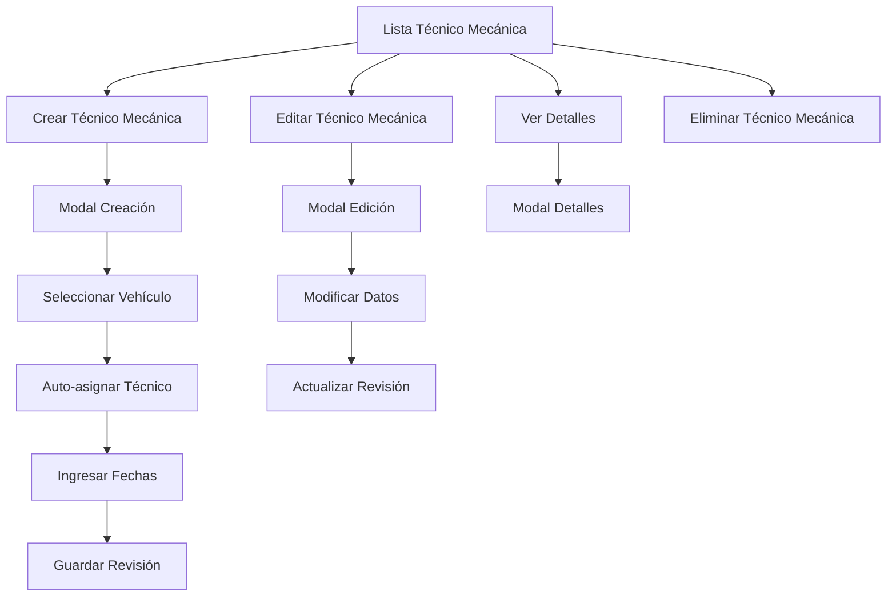

# Documento de Requerimientos del Producto - Módulo Técnico Mecánica MPA

## 1. Product Overview

Sistema de gestión de revisiones técnico mecánicas vehiculares para el módulo MPA, permitiendo el control y seguimiento de las inspecciones técnicas obligatorias de los vehículos de la flota.

- El módulo permite gestionar las fechas de vencimiento de las revisiones técnico mecánicas, calcular días restantes y mantener un control automatizado del estado de cada vehículo.
- Dirigido a técnicos y supervisores del área MPA que requieren monitorear el cumplimiento de las revisiones técnicas vehiculares obligatorias.

## 2. Core Features

### 2.1 User Roles

| Role | Registration Method | Core Permissions |
|------|---------------------|------------------|
| Técnico MPA | Acceso mediante credenciales del sistema | Puede visualizar, crear y editar revisiones técnico mecánicas |
| Supervisor MPA | Acceso mediante credenciales del sistema | Acceso completo: crear, editar, eliminar y generar reportes |

### 2.2 Feature Module

Nuestro módulo de Técnico Mecánica consiste en las siguientes páginas principales:

1. **Lista de Técnico Mecánica**: tabla principal con información de revisiones, filtros y acciones.
2. **Modal de Creación**: formulario para registrar nueva revisión técnico mecánica.
3. **Modal de Edición**: formulario para modificar revisión existente.
4. **Modal de Detalles**: vista completa de información de la revisión.

### 2.3 Page Details

| Page Name | Module Name | Feature description |
|-----------|-------------|---------------------|
| Lista de Técnico Mecánica | Tabla Principal | Mostrar placa, fecha inicial, fecha vencimiento, días restantes, estado, técnico asignado y acciones (ver, editar, eliminar) |
| Lista de Técnico Mecánica | Botón Crear | Abrir modal de creación de nueva revisión técnico mecánica |
| Lista de Técnico Mecánica | Filtros y Búsqueda | Filtrar por placa, estado, técnico o rango de fechas |
| Modal de Creación | Formulario de Registro | Campos: placa (dropdown), fechas inicio/vencimiento, auto-asignación de técnico y tipo de vehículo |
| Modal de Edición | Formulario de Modificación | Editar fechas, observaciones y datos modificables de la revisión |
| Modal de Detalles | Vista Completa | Mostrar toda la información de la revisión incluyendo datos del vehículo y técnico |
| Lista de Técnico Mecánica | Cálculo Automático | Calcular días restantes y determinar estado (Vigente, Próximo a vencer, Vencido) |
| Lista de Técnico Mecánica | Validaciones | Validar fechas, coherencia de datos y campos obligatorios |

## 3. Core Process

**Flujo Principal del Usuario:**

1. El usuario accede al módulo de Técnico Mecánica desde el menú MPA
2. Visualiza la tabla con todas las revisiones técnico mecánicas registradas
3. Puede filtrar o buscar revisiones específicas
4. Para crear nueva revisión: hace clic en "Crear Técnico Mecánica", selecciona vehículo (auto-completa técnico y tipo), ingresa fechas y guarda
5. Para editar: hace clic en el botón editar, modifica campos permitidos y guarda cambios
6. Para ver detalles: hace clic en el botón ver para consultar información completa
7. Para eliminar: confirma eliminación de revisión seleccionada

**Flujo de Auto-asignación:**

1. Usuario selecciona placa de vehículo en el dropdown
2. Sistema automáticamente asigna el técnico responsable del vehículo
3. Sistema obtiene y muestra el tipo de vehículo correspondiente
4. Usuario completa fechas y observaciones adicionales

## 4. User Interface Design

### 4.1 Design Style

- **Colores primarios**: Azul corporativo (#007bff), verde para estados vigentes (#28a745)
- **Colores secundarios**: Amarillo para alertas (#ffc107), rojo para vencidos (#dc3545)
- **Estilo de botones**: Redondeados con iconos, consistentes con el sistema MPA
- **Fuente**: Sistema por defecto, tamaños 14px para contenido, 16px para títulos
- **Layout**: Diseño de tarjetas para modales, tabla responsiva para listados
- **Iconos**: Font Awesome para acciones (ojo, lápiz, papelera, engranaje)

### 4.2 Page Design Overview

| Page Name | Module Name | UI Elements |
|-----------|-------------|-------------|
| Lista de Técnico Mecánica | Tabla Principal | Tabla responsiva con colores de estado, badges para días restantes, botones de acción agrupados |
| Lista de Técnico Mecánica | Header | Título del módulo, botón "Crear Técnico Mecánica" destacado en azul, filtros en línea |
| Modal de Creación | Formulario | Layout de 2 columnas, campos con validación visual, dropdown con búsqueda para placas |
| Modal de Edición | Formulario | Misma estructura que creación, campos pre-poblados, indicadores de campos auto-calculados |
| Modal de Detalles | Vista Información | Layout de tarjetas organizadas, información de solo lectura con formato claro |
| Lista de Técnico Mecánica | Estados Visuales | Filas con colores de fondo según estado, badges con días restantes, iconos de estado |

### 4.3 Responsiveness

El módulo está diseñado mobile-first con adaptación completa para escritorio. Las tablas se convierten en tarjetas apilables en dispositivos móviles, los modales se ajustan al ancho de pantalla y se optimiza la interacción táctil para botones y formularios.