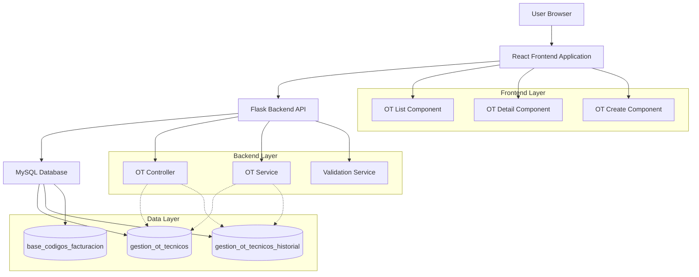
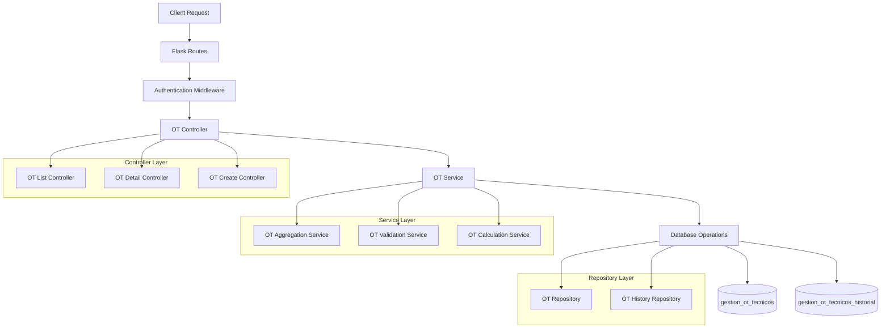
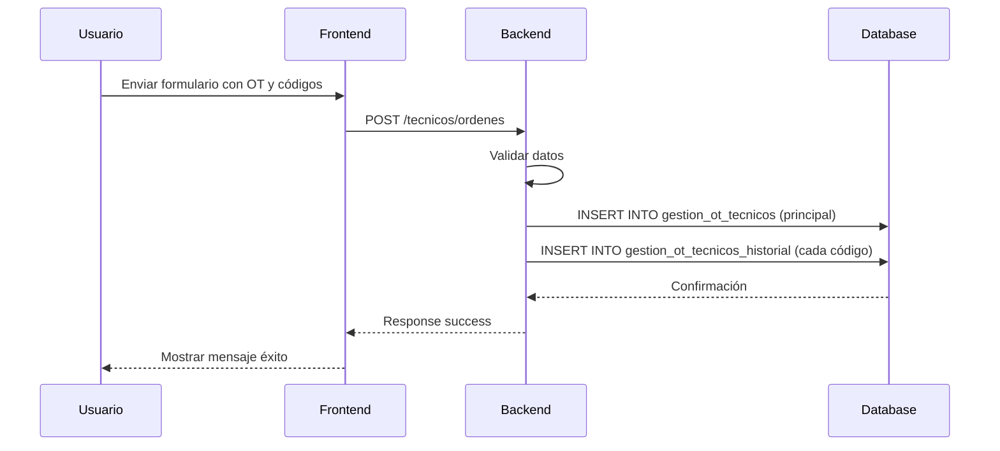
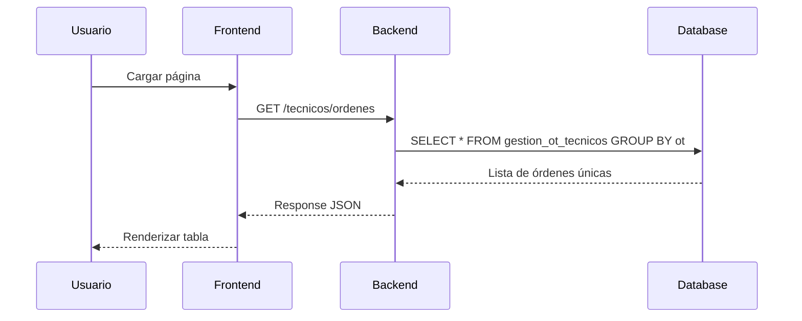
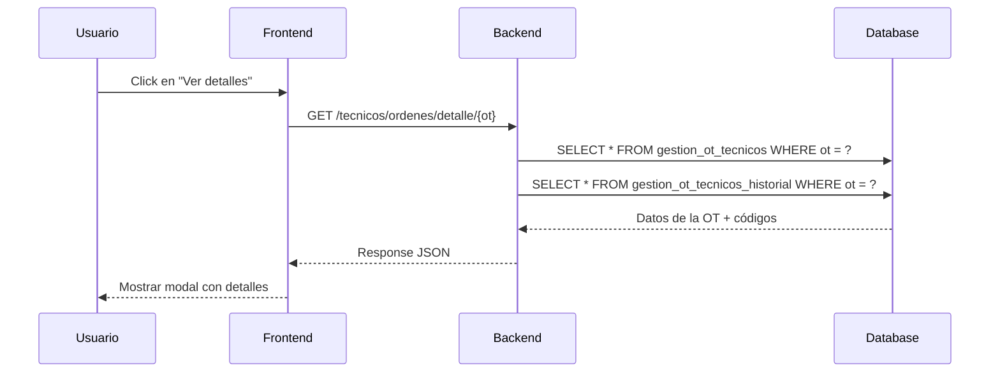

## 1. Architecture design



## 2. Technology Description

- **Frontend**: HTML + JavaScript + Bootstrap
- **Backend**: Flask (Python) + MySQL
- **Database**: MySQL 8.0+
- **Authentication**: Flask-Login session-based

## 3. Route definitions

| Route | Purpose |
|-------|---------|
| `/tecnicos/ordenes_trabajo` | Vista principal de órdenes de trabajo |
| `/tecnicos/ordenes` | API para listar órdenes (GET) |
| `/tecnicos/ordenes/detalle/<ot>` | API para obtener detalles de una OT |
| `/tecnicos/ordenes` | API para crear nueva orden (POST) |
| `/tecnicos/tecnologias` | API para obtener tecnologías |
| `/tecnicos/categorias/<tecnologia>` | API para obtener categorías |
| `/tecnicos/codigos/<tecnologia>/<categoria>` | API para obtener códigos disponibles |

## 4. API definitions

### 4.1 Core API

#### GET /tecnicos/ordenes
**Purpose**: Listar órdenes de trabajo agrupadas por OT

**Response:**
```json
{
  "success": true,
  "ordenes": [
    {
      "ot": "1234567",
      "cuenta": "87654321",
      "servicio": "7654321",
      "tecnologia": "GPON",
      "categoria": "INSTALACION",
      "tecnico_id": "T001",
      "tecnico_nombre": "Juan Pérez",
      "total_valor": 150000,
      "cantidad_codigos": 3,
      "estado": "activa",
      "fecha_creacion": "2024-01-15 10:30:00"
    }
  ]
}
```

#### GET /tecnicos/ordenes/detalle/<ot>
**Purpose**: Obtener detalles de todos los códigos de una OT

**Response:**
```json
{
  "success": true,
  "orden": {
    "ot": "1234567",
    "cuenta": "87654321",
    "servicio": "7654321",
    "tecnologia": "GPON",
    "categoria": "INSTALACION",
    "tecnico_id": "T001",
    "tecnico_nombre": "Juan Pérez",
    "total_valor": 150000,
    "estado": "activa",
    "fecha_creacion": "2024-01-15 10:30:00",
    "codigos": [
      {
        "id": 1,
        "codigo": "COD001",
        "nombre": "Instalación básica",
        "descripcion": "Instalación de equipo y configuración básica GPON",
        "cantidad": 2,
        "valor_unitario": 50000,
        "valor_total": 100000,
        "fecha_creacion": "2024-01-15 10:30:00"
      },
      {
        "id": 2,
        "codigo": "COD002",
        "nombre": "Configuración avanzada",
        "descripcion": "Configuración avanzada del servicio",
        "cantidad": 1,
        "valor_unitario": 50000,
        "valor_total": 50000,
        "fecha_creacion": "2024-01-15 10:30:01"
      }
    ]
  }
}
```

#### POST /tecnicos/ordenes
**Purpose**: Crear nueva orden de trabajo (guarda en ambas tablas)

**Request:**
```json
{
  "ot": "1234567",
  "cuenta": "87654321",
  "servicio": "7654321",
  "tecnico_id": "T001",
  "tecnologia": "GPON",
  "categoria": "INSTALACION",
  "codigos": [
    {
      "codigo": "COD001",
      "nombre": "Instalación básica",
      "descripcion": "Instalación de equipo y configuración básica GPON",
      "cantidad": 2,
      "valor_unitario": 50000,
      "valor_total": 100000
    }
  ]
}
```

**Response:**
```json
{
  "success": true,
  "message": "Orden creada exitosamente",
  "orden_id": "1234567"
}
```

## 5. Server architecture diagram



## 6. Data model

### 6.1 Database Schema

```mermaid
erDiagram
    gestion_ot_tecnicos ||--o{ gestion_ot_tecnicos_historial : has_history
    gestion_ot_tecnicos }o--|| recurso_operativo : assigned_to
    gestion_ot_tecnicos_historial }o--|| gestion_ot_tecnicos : belongs_to
    
    gestion_ot_tecnicos {
        int id PK
        string ot UK
        string cuenta
        string servicio
        string tecnico_id FK
        string tecnico_nombre
        decimal total_valor
        datetime fecha_creacion
        datetime fecha_actualizacion
        string tecnologia
        string categoria
    }
    
    gestion_ot_tecnicos_historial {
        int id PK
        int ot_id FK
        string ot UK
        string codigo
        string nombre
        string descripcion
        int cantidad
        decimal valor_unitario
        decimal valor_total
        datetime fecha_creacion
        INDEX idx_ot (ot)
        INDEX idx_ot_id (ot_id)
    }
    
    recurso_operativo {
        int id PK
        string id_codigo_consumidor
        string nombre
        string carpeta
        string rol
        string estado
    }
```

### 6.2 Data Definition Language

#### Tabla gestion_ot_tecnicos (principal - una fila por OT)
```sql
CREATE TABLE gestion_ot_tecnicos (
    id INT PRIMARY KEY AUTO_INCREMENT,
    ot VARCHAR(7) NOT NULL UNIQUE,
    cuenta VARCHAR(8) NOT NULL,
    servicio VARCHAR(7) NOT NULL,
    tecnico_id VARCHAR(50) NOT NULL,
    tecnico_nombre VARCHAR(100) NOT NULL,
    total_valor DECIMAL(10,2) DEFAULT 0,
    fecha_creacion TIMESTAMP DEFAULT CURRENT_TIMESTAMP,
    fecha_actualizacion TIMESTAMP DEFAULT CURRENT_TIMESTAMP ON UPDATE CURRENT_TIMESTAMP,
    tecnologia VARCHAR(50) NOT NULL,
    categoria VARCHAR(50) NOT NULL,
    INDEX idx_ot (ot),
    INDEX idx_tecnico_id (tecnico_id),
    INDEX idx_fecha_creacion (fecha_creacion)
);
```

#### Tabla gestion_ot_tecnicos_historial (detalles - múltiples filas por OT)
```sql
CREATE TABLE gestion_ot_tecnicos_historial (
    id INT PRIMARY KEY AUTO_INCREMENT,
    ot_id INT NOT NULL,
    ot VARCHAR(7) NOT NULL,
    codigo VARCHAR(20) NOT NULL,
    nombre VARCHAR(45) NOT NULL,
    descripcion VARCHAR(255),
    cantidad INT NOT NULL DEFAULT 1,
    valor_unitario DECIMAL(10,2) NOT NULL,
    valor_total DECIMAL(10,2) NOT NULL,
    fecha_creacion TIMESTAMP DEFAULT CURRENT_TIMESTAMP,
    FOREIGN KEY (ot_id) REFERENCES gestion_ot_tecnicos(id) ON DELETE CASCADE,
    INDEX idx_ot (ot),
    INDEX idx_ot_id (ot_id),
    INDEX idx_fecha_creacion (fecha_creacion)
);
```

## 7. Implementation Flow

### 7.1 Crear Nueva Orden (POST)



### 7.2 Listar Órdenes (GET)



### 7.3 Ver Detalles (GET)



## 8. Key Implementation Details

### 8.1 Backend Changes
- **Nuevo servicio**: OT Aggregation Service para agrupar por OT
- **Nuevo endpoint**: `/tecnicos/ordenes/detalle/{ot}` para detalles
- **Modificación**: POST ahora guarda en ambas tablas
- **Validación**: Verificar unicidad de OT antes de insertar

### 8.2 Frontend Changes
- **Tabla principal**: Agrupación por OT única
- **Nuevo modal**: Modal de detalles con tabla de códigos
- **JavaScript**: Nuevas funciones para cargar detalles
- **UI/UX**: Botón "Ver detalles" en cada fila

### 8.3 Database Changes
- **Relación**: gestion_ot_tecnicos → gestion_ot_tecnicos_historial (1:N)
- **Índices**: Optimización para búsquedas por OT
- **Integridad**: Foreign key con ON DELETE CASCADE
- **Truncamiento**: Campos limitados para evitar errores de longitud