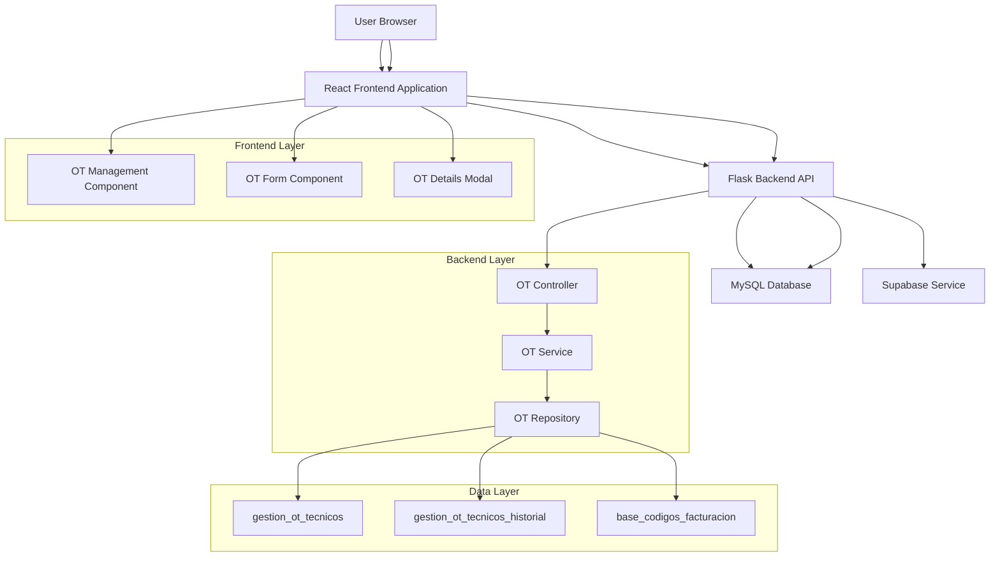
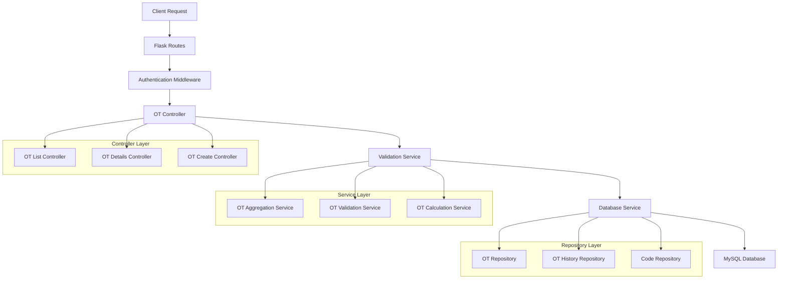

## 1. Architecture design



## 2. Technology Description

- **Frontend**: HTML5 + Bootstrap 5 + JavaScript ES6
- **Backend**: Flask 2.0 + Python 3.9
- **Database**: MySQL 8.0
- **ORM**: mysql-connector-python
- **Template Engine**: Jinja2
- **CSS Framework**: Bootstrap 5.3
- **JavaScript**: Vanilla JS + jQuery 3.6

## 3. Route definitions

| Route | Purpose |
|-------|---------|
| `/tecnicos/ordenes_trabajo` | Página principal de gestión de OTs |
| `/api/tecnicos/ordenes` | GET: Listar OTs únicas, POST: Crear nueva OT |
| `/api/tecnicos/ordenes/<ot>` | GET: Obtener detalles de OT específica |
| `/api/tecnicos/tecnologias` | GET: Listar tecnologías disponibles |
| `/api/tecnicos/categorias/<tecnologia>` | GET: Categorías por tecnología |
| `/api/tecnicos/codigos/<tecnologia>/<categoria>` | GET: Códigos filtrados |

## 4. API definitions

### 4.1 Core API Endpoints

#### GET /api/tecnicos/ordenes
**Purpose**: Obtener lista de OTs únicas (agrupadas por OT)

**Response:**
```json
[
  {
    "ot": "1234567",
    "cuenta": "87654321",
    "servicio": "7654321",
    "tecnico_id": "T001",
    "tecnico_nombre": "Juan Pérez",
    "tecnologia": "GPON",
    "categoria": "INSTALACION",
    "total_valor": 150000,
    "estado": "activa",
    "fecha_creacion": "2024-01-15T10:30:00Z"
  }
]
```

#### GET /api/tecnicos/ordenes/{ot}
**Purpose**: Obtener detalles completos de una OT específica

**Response:**
```json
{
  "ot": "1234567",
  "cuenta": "87654321",
  "servicio": "7654321",
  "tecnico_id": "T001",
  "tecnico_nombre": "Juan Pérez",
  "tecnologia": "GPON",
  "categoria": "INSTALACION",
  "total_valor": 150000,
  "estado": "activa",
  "fecha_creacion": "2024-01-15T10:30:00Z",
  "codigos": [
    {
      "id": 1,
      "codigo": "COD001",
      "nombre": "Instalación básica",
      "descripcion": "Instalación de equipo y configuración básica GPON",
      "cantidad": 2,
      "valor_unitario": 50000,
      "valor_total": 100000
    },
    {
      "id": 2,
      "codigo": "COD002",
      "nombre": "Configuración avanzada",
      "descripcion": "Configuración avanzada de servicios",
      "cantidad": 1,
      "valor_unitario": 50000,
      "valor_total": 50000
    }
  ]
}
```

#### POST /api/tecnicos/ordenes
**Purpose**: Crear nueva orden de trabajo

**Request:**
```json
{
  "ot": "1234567",
  "cuenta": "87654321",
  "servicio": "7654321",
  "tecnico_id": "T001",
  "tecnologia": "GPON",
  "categoria": "INSTALACION",
  "codigos": [
    {
      "codigo": "COD001",
      "nombre": "Instalación básica",
      "descripcion": "Instalación de equipo y configuración básica GPON",
      "cantidad": 2,
      "valor_unitario": 50000,
      "valor_total": 100000
    }
  ]
}
```

**Response:**
```json
{
  "success": true,
  "message": "Orden creada exitosamente",
  "orden_id": "1234567"
}
```

## 5. Server architecture diagram



## 6. Data model

### 6.1 Database Schema

```mermaid
erDiagram
    gestion_ot_tecnicos ||--o{ gestion_ot_tecnicos_historial : has_history
    gestion_ot_tecnicos }o--|| base_codigos_facturacion : contains_codes
    gestion_ot_tecnicos }o--|| recurso_operativo : assigned_to
    
    gestion_ot_tecnicos {
        int id PK
        string ot UK
        string cuenta
        string servicio
        string tecnico_id FK
        string tecnico_nombre
        string carpeta
        decimal total_valor
        datetime fecha_creacion
        datetime fecha_actualizacion
        string estado
        string tecnologia
        string categoria
    }
    
    gestion_ot_tecnicos_historial {
        int id PK
        string ot FK
        string codigo
        string nombre
        string descripcion
        int cantidad
        decimal valor_unitario
        decimal valor_total
        datetime fecha_registro
        string accion
        INDEX idx_ot (ot)
    }
    
    base_codigos_facturacion {
        int id PK
        string tecnologia
        string categoria
        string codigo
        string nombre
        string descripcion
        decimal valor
    }
    
    recurso_operativo {
        int id PK
        string id_codigo_consumidor
        string nombre
        string carpeta
        string rol
        string estado
    }
```

### 6.2 Data Definition Language

#### Tabla gestion_ot_tecnicos (principal)
```sql
CREATE TABLE gestion_ot_tecnicos (
    id INT PRIMARY KEY AUTO_INCREMENT,
    ot VARCHAR(7) NOT NULL UNIQUE,
    cuenta VARCHAR(8) NOT NULL,
    servicio VARCHAR(7) NOT NULL,
    tecnico_id VARCHAR(50) NOT NULL,
    tecnico_nombre VARCHAR(100) NOT NULL,
    carpeta VARCHAR(50) NOT NULL,
    total_valor DECIMAL(10,2) DEFAULT 0,
    fecha_creacion TIMESTAMP DEFAULT CURRENT_TIMESTAMP,
    fecha_actualizacion TIMESTAMP DEFAULT CURRENT_TIMESTAMP ON UPDATE CURRENT_TIMESTAMP,
    estado ENUM('activa', 'completada', 'cancelada') DEFAULT 'activa',
    tecnologia VARCHAR(50) NOT NULL,
    categoria VARCHAR(50) NOT NULL,
    INDEX idx_ot (ot),
    INDEX idx_tecnico_id (tecnico_id),
    INDEX idx_fecha_creacion (fecha_creacion)
);
```

#### Tabla gestion_ot_tecnicos_historial (detalles)
```sql
CREATE TABLE gestion_ot_tecnicos_historial (
    id INT PRIMARY KEY AUTO_INCREMENT,
    ot VARCHAR(7) NOT NULL,
    codigo VARCHAR(20) NOT NULL,
    nombre VARCHAR(45) NOT NULL,
    descripcion VARCHAR(255),
    cantidad INT NOT NULL DEFAULT 1,
    valor_unitario DECIMAL(10,2) NOT NULL,
    valor_total DECIMAL(10,2) NOT NULL,
    fecha_registro TIMESTAMP DEFAULT CURRENT_TIMESTAMP,
    accion ENUM('creacion', 'modificacion', 'eliminacion') DEFAULT 'creacion',
    INDEX idx_ot (ot),
    INDEX idx_codigo (codigo),
    INDEX idx_fecha_registro (fecha_registro)
);
```

## 7. Key Implementation Changes

### 7.1 Backend Changes
- **Nuevo endpoint**: GET `/api/tecnicos/ordenes/{ot}` para detalles
- **Modificación**: GET `/api/tecnicos/ordenes` ahora agrupa por OT única
- **Modificación**: POST `/api/tecnicos/ordenes` crea múltiples registros en historial
- **Nuevo servicio**: OT Aggregation Service para agrupar resultados

### 7.2 Frontend Changes
- **Tabla principal**: Agrupación por OT única con totales acumulados
- **Nuevo modal**: Modal de detalles con tabla de códigos
- **JavaScript**: Nuevas funciones para cargar y mostrar detalles
- **UI/UX**: Botón "Ver Detalles" en cada fila de OT

### 7.3 Database Changes
- **Índices**: Nuevos índices en `ot` para mejorar performance
- **Relación**: Cambio de FK `ot_id` a `ot` VARCHAR para simplificar
- **Truncamiento**: Campos `nombre` limitado a 45 caracteres