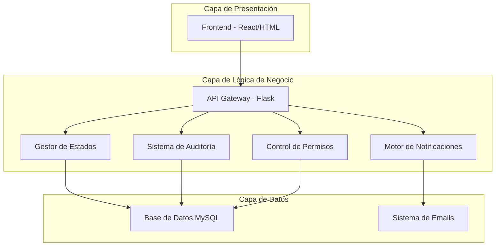
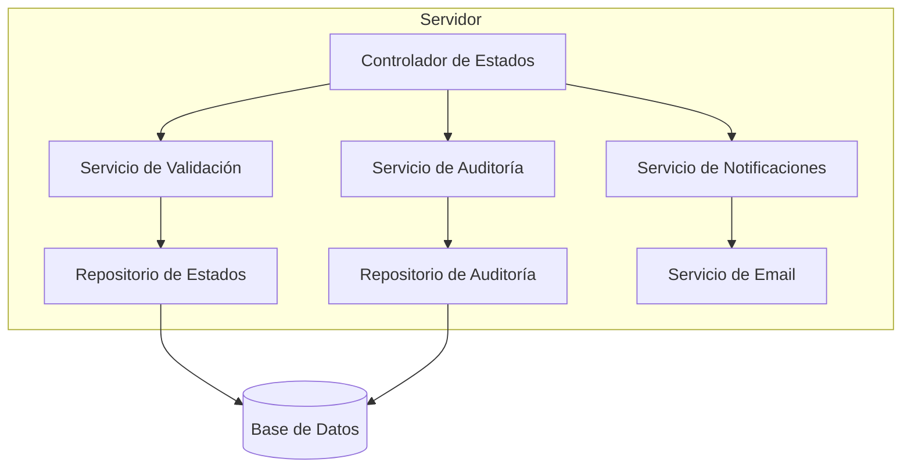
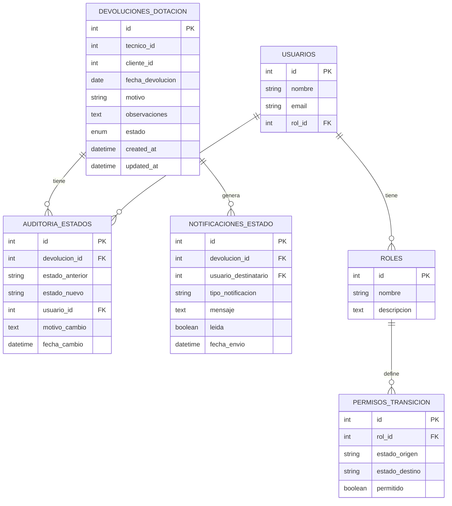

# Arquitectura Técnica - Sistema de Gestión de Estados para Devoluciones

## 1. Diseño de Arquitectura



## 2. Descripción de Tecnologías

- Frontend: HTML5 + JavaScript ES6 + Bootstrap 5 + FontAwesome
- Backend: Flask 2.3 + Python 3.9
- Base de Datos: MySQL 8.0
- Notificaciones: SMTP integrado

## 3. Definición de Rutas

| Ruta | Propósito |
|------|----------|
| /api/devoluciones/{id}/estado | Actualizar estado de devolución específica |
| /api/devoluciones/{id}/transiciones | Obtener transiciones válidas para una devolución |
| /api/devoluciones/{id}/historial | Consultar historial de cambios de estado |
| /api/estados/validar-transicion | Validar si una transición es permitida |
| /api/notificaciones/configurar | Configurar reglas de notificación |
| /api/permisos/roles | Gestionar permisos por rol |

## 4. Definiciones de API

### 4.1 APIs Principales

**Actualizar Estado de Devolución**
```
PUT /api/devoluciones/{id}/estado
```

Request:
| Parámetro | Tipo | Requerido | Descripción |
|-----------|------|-----------|-------------|
| nuevo_estado | string | true | Estado destino (PROCESANDO, COMPLETADA, CANCELADA) |
| motivo | string | true | Razón del cambio de estado |
| usuario_id | integer | true | ID del usuario que realiza el cambio |

Response:
| Parámetro | Tipo | Descripción |
|-----------|------|-------------|
| success | boolean | Indica si la operación fue exitosa |
| mensaje | string | Mensaje descriptivo del resultado |
| estado_anterior | string | Estado previo de la devolución |
| estado_nuevo | string | Nuevo estado de la devolución |

Ejemplo Request:
```json
{
  "nuevo_estado": "PROCESANDO",
  "motivo": "Elementos verificados y documentación completa",
  "usuario_id": 123
}
```

Ejemplo Response:
```json
{
  "success": true,
  "mensaje": "Estado actualizado exitosamente",
  "estado_anterior": "REGISTRADA",
  "estado_nuevo": "PROCESANDO"
}
```

**Obtener Transiciones Válidas**
```
GET /api/devoluciones/{id}/transiciones
```

Response:
| Parámetro | Tipo | Descripción |
|-----------|------|-------------|
| estado_actual | string | Estado actual de la devolución |
| transiciones_validas | array | Lista de estados a los que se puede transicionar |
| permisos_usuario | object | Permisos del usuario actual para cada transición |

**Consultar Historial de Estados**
```
GET /api/devoluciones/{id}/historial
```

Response:
| Parámetro | Tipo | Descripción |
|-----------|------|-------------|
| historial | array | Lista cronológica de cambios de estado |
| total_cambios | integer | Número total de cambios registrados |

## 5. Arquitectura del Servidor



## 6. Modelo de Datos

### 6.1 Definición del Modelo de Datos



### 6.2 Definición de Lenguaje de Datos (DDL)

**Tabla de Auditoría de Estados**
```sql
CREATE TABLE auditoria_estados (
    id INT AUTO_INCREMENT PRIMARY KEY,
    devolucion_id INT NOT NULL,
    estado_anterior ENUM('REGISTRADA', 'PROCESANDO', 'COMPLETADA', 'CANCELADA') NOT NULL,
    estado_nuevo ENUM('REGISTRADA', 'PROCESANDO', 'COMPLETADA', 'CANCELADA') NOT NULL,
    usuario_id INT NOT NULL,
    motivo_cambio TEXT NOT NULL,
    fecha_cambio DATETIME DEFAULT CURRENT_TIMESTAMP,
    FOREIGN KEY (devolucion_id) REFERENCES devoluciones_dotacion(id) ON DELETE CASCADE,
    FOREIGN KEY (usuario_id) REFERENCES usuarios(id),
    INDEX idx_devolucion_fecha (devolucion_id, fecha_cambio DESC),
    INDEX idx_usuario_fecha (usuario_id, fecha_cambio DESC)
) ENGINE=InnoDB DEFAULT CHARSET=utf8mb4 COLLATE=utf8mb4_unicode_ci;

-- Índices para optimización
CREATE INDEX idx_auditoria_devolucion_id ON auditoria_estados(devolucion_id);
CREATE INDEX idx_auditoria_fecha_cambio ON auditoria_estados(fecha_cambio DESC);
```

**Tabla de Notificaciones de Estado**
```sql
CREATE TABLE notificaciones_estado (
    id INT AUTO_INCREMENT PRIMARY KEY,
    devolucion_id INT NOT NULL,
    usuario_destinatario INT NOT NULL,
    tipo_notificacion ENUM('CAMBIO_ESTADO', 'APROBACION_REQUERIDA', 'PROCESO_COMPLETADO') NOT NULL,
    mensaje TEXT NOT NULL,
    leida BOOLEAN DEFAULT FALSE,
    fecha_envio DATETIME DEFAULT CURRENT_TIMESTAMP,
    FOREIGN KEY (devolucion_id) REFERENCES devoluciones_dotacion(id) ON DELETE CASCADE,
    FOREIGN KEY (usuario_destinatario) REFERENCES usuarios(id),
    INDEX idx_usuario_leida (usuario_destinatario, leida),
    INDEX idx_fecha_envio (fecha_envio DESC)
) ENGINE=InnoDB DEFAULT CHARSET=utf8mb4 COLLATE=utf8mb4_unicode_ci;
```

**Tabla de Permisos de Transición**
```sql
CREATE TABLE permisos_transicion (
    id INT AUTO_INCREMENT PRIMARY KEY,
    rol_id INT NOT NULL,
    estado_origen ENUM('REGISTRADA', 'PROCESANDO', 'COMPLETADA', 'CANCELADA') NOT NULL,
    estado_destino ENUM('REGISTRADA', 'PROCESANDO', 'COMPLETADA', 'CANCELADA') NOT NULL,
    permitido BOOLEAN DEFAULT TRUE,
    created_at DATETIME DEFAULT CURRENT_TIMESTAMP,
    FOREIGN KEY (rol_id) REFERENCES roles(id),
    UNIQUE KEY unique_transicion (rol_id, estado_origen, estado_destino),
    INDEX idx_rol_origen (rol_id, estado_origen)
) ENGINE=InnoDB DEFAULT CHARSET=utf8mb4 COLLATE=utf8mb4_unicode_ci;

-- Datos iniciales de permisos
INSERT INTO permisos_transicion (rol_id, estado_origen, estado_destino, permitido) VALUES
-- Técnico Logística (rol_id = 3)
(3, 'REGISTRADA', 'PROCESANDO', TRUE),
(3, 'REGISTRADA', 'CANCELADA', TRUE),
-- Supervisor Logística (rol_id = 4)
(4, 'PROCESANDO', 'COMPLETADA', TRUE),
(4, 'PROCESANDO', 'CANCELADA', TRUE),
(4, 'REGISTRADA', 'PROCESANDO', TRUE),
(4, 'REGISTRADA', 'CANCELADA', TRUE),
-- Administrador Logística (rol_id = 5) - todos los permisos
(5, 'REGISTRADA', 'PROCESANDO', TRUE),
(5, 'REGISTRADA', 'COMPLETADA', TRUE),
(5, 'REGISTRADA', 'CANCELADA', TRUE),
(5, 'PROCESANDO', 'COMPLETADA', TRUE),
(5, 'PROCESANDO', 'CANCELADA', TRUE),
(5, 'PROCESANDO', 'REGISTRADA', TRUE);
```

**Actualización de tabla principal**
```sql
-- Agregar campos de auditoría a la tabla principal
ALTER TABLE devoluciones_dotacion 
ADD COLUMN updated_by INT NULL,
ADD COLUMN version INT DEFAULT 1,
ADD FOREIGN KEY (updated_by) REFERENCES usuarios(id);

-- Trigger para actualizar version en cada cambio
DELIMITER //
CREATE TRIGGER tr_devoluciones_version_update
    BEFORE UPDATE ON devoluciones_dotacion
    FOR EACH ROW
BEGIN
    SET NEW.version = OLD.version + 1;
    SET NEW.updated_at = CURRENT_TIMESTAMP;
END//
DELIMITER ;
```

### 7.2 Sistema de Notificaciones

**Función: Enviar Notificación de Cambio de Estado**
```python
def enviar_notificacion_cambio_estado(devolucion_id, estado_anterior, estado_nuevo, cursor):
    """
    Envía notificaciones automáticas cuando cambia el estado
    """
    # Obtener usuarios a notificar según el tipo de cambio
    usuarios_notificar = obtener_usuarios_notificacion(estado_nuevo, cursor)
    
    for usuario in usuarios_notificar:
        mensaje = generar_mensaje_notificacion(devolucion_id, estado_anterior, estado_nuevo)
        
        # Insertar notificación en base de datos
        cursor.execute(
            """
            INSERT INTO notificaciones_estado 
            (devolucion_id, usuario_destinatario, tipo_notificacion, mensaje)
            VALUES (%s, %s, %s, %s)
            """,
            (devolucion_id, usuario['id'], 'CAMBIO_ESTADO', mensaje)
        )
        
        # Enviar email (opcional)
        enviar_email_notificacion(usuario['email'], mensaje)

def obtener_usuarios_notificacion(estado_nuevo, cursor):
    """
    Determina qué usuarios deben ser notificados según el nuevo estado
    """
    if estado_nuevo == 'PROCESANDO':
        # Notificar a supervisores de logística
        cursor.execute(
            "SELECT id, email FROM usuarios WHERE rol_id IN (4, 5)"
        )
    elif estado_nuevo == 'COMPLETADA':
        # Notificar a técnicos y administradores
        cursor.execute(
            "SELECT id, email FROM usuarios WHERE rol_id IN (3, 5)"
        )
    else:
        # Notificar a administradores
        cursor.execute(
            "SELECT id, email FROM usuarios WHERE rol_id = 5"
        )
    
    return cursor.fetchall()
```

## 8. Flujo de Implementación

### 8.1 Fases de Desarrollo

1. **Fase 1: Base de Datos**
   - Crear tablas de auditoría y permisos
   - Configurar triggers y índices
   - Insertar datos iniciales de permisos

2. **Fase 2: Backend Core**
   - Implementar funciones de validación
   - Desarrollar APIs de actualización de estado
   - Crear sistema de auditoría

3. **Fase 3: Sistema de Notificaciones**
   - Configurar envío de emails
   - Implementar notificaciones en tiempo real
   - Crear panel de notificaciones

4. **Fase 4: Frontend**
   - Actualizar interfaz para mostrar estados
   - Agregar botones de transición
   - Implementar historial visual

5. **Fase 5: Pruebas y Optimización**
   - Pruebas unitarias de validaciones
   - Pruebas de integración de APIs
   - Optimización de rendimiento

### 8.2 Consideraciones de Seguridad

- Validación de permisos en cada transición
- Auditoría completa de todos los cambios
- Encriptación de datos sensibles
- Rate limiting en APIs críticas
- Validación de entrada en todos los endpoints