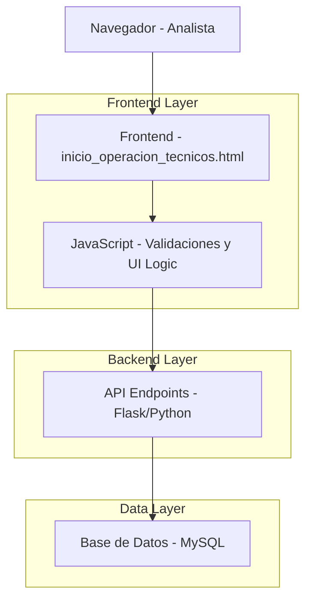

# Arquitectura Técnica - Actualización Tabla de Asistencia

## 1. Arquitectura del Sistema



## 2. Tecnologías Utilizadas

- **Frontend:** HTML5 + Bootstrap 5 + JavaScript ES6 + jQuery
- **Backend:** Flask (Python) + MySQL Connector
- **Base de Datos:** MySQL 8.0
- **Servidor:** Flask Development Server

## 3. Estructura de Archivos Modificados

### 3.1 Frontend
```
templates/
├── inicio_operacion_tecnicos.html (MODIFICAR)
└── modulos/administrativo/
    └── asistencia.html (REFERENCIA)
```

### 3.2 Backend
```
main.py (MODIFICAR)
├── Endpoint: /api/analistas/tecnicos-asignados
├── Endpoint: /api/asistencia/actualizar (NUEVO)
└── Database connection functions
```

### 3.3 Base de Datos
```sql
-- Tabla: asistencia (MODIFICAR)
ALTER TABLE asistencia 
ADD COLUMN hora_inicio TIME NULL,
ADD COLUMN estado ENUM('CUMPLE', 'NO CUMPLE', 'NOVEDAD', 'NO APLICA') NULL,
ADD COLUMN novedad TEXT NULL;
```

## 4. API Endpoints

### 4.1 Endpoint Existente (Modificar)

**GET** `/api/analistas/tecnicos-asignados`

**Respuesta Actualizada:**
```json
{
  "success": true,
  "tecnicos": [
    {
      "id_codigo_consumidor": 123,
      "nombre": "JUAN PEREZ",
      "recurso_operativo_cedula": "12345678",
      "carpeta": "INSTALACION",
      "super": "SUPERVISOR_1",
      "asistencia_hoy": {
        "presupuesto_diario": 150000,
        "presupuesto_eventos": 5,
        "hora_inicio": "08:00:00",
        "estado": "CUMPLE",
        "novedad": null
      }
    }
  ],
  "total_tecnicos": 10,
  "analista": "ANALISTA_NOMBRE"
}
```

### 4.2 Nuevo Endpoint

**POST** `/api/asistencia/actualizar`

**Request Body:**
```json
{
  "fecha": "2024-01-15",
  "actualizaciones": [
    {
      "id_codigo_consumidor": 123,
      "hora_inicio": "08:30:00",
      "estado": "NOVEDAD",
      "novedad": "Técnico reporta problema con herramientas"
    }
  ]
}
```

**Response:**
```json
{
  "success": true,
  "message": "Asistencia actualizada correctamente",
  "registros_actualizados": 1
}
```

## 5. Esquema de Base de Datos

### 5.1 Tabla Asistencia (Actualizada)

```sql
CREATE TABLE IF NOT EXISTS asistencia (
    id_asistencia INT AUTO_INCREMENT PRIMARY KEY,
    id_codigo_consumidor INT NOT NULL,
    fecha_asistencia DATETIME NOT NULL,
    carpeta_dia VARCHAR(100),
    super VARCHAR(100),
    presupuesto_diario DECIMAL(10,2),
    presupuesto_eventos INT,
    -- NUEVAS COLUMNAS
    hora_inicio TIME NULL COMMENT 'Hora de inicio de operación',
    estado ENUM('CUMPLE', 'NO CUMPLE', 'NOVEDAD', 'NO APLICA') NULL COMMENT 'Estado de cumplimiento',
    novedad TEXT NULL COMMENT 'Descripción de novedad cuando aplica',
    -- CAMPOS EXISTENTES
    created_at TIMESTAMP DEFAULT CURRENT_TIMESTAMP,
    updated_at TIMESTAMP DEFAULT CURRENT_TIMESTAMP ON UPDATE CURRENT_TIMESTAMP,
    FOREIGN KEY (id_codigo_consumidor) REFERENCES recurso_operativo(id_codigo_consumidor)
);

-- Índices para optimización
CREATE INDEX idx_asistencia_fecha_estado ON asistencia(fecha_asistencia, estado);
CREATE INDEX idx_asistencia_hora_inicio ON asistencia(hora_inicio);
```

## 6. Componentes Frontend

### 6.1 Estructura HTML Actualizada

```html
<!-- Tabla de técnicos con nuevas columnas -->
<table class="table table-hover">
    <thead>
        <tr>
            <th>Cédula</th>
            <th>Técnico</th>
            <th>Carpeta</th>
            <th>Supervisor</th>
            <th>Hora Inicio</th>      <!-- NUEVA -->
            <th>Estado</th>           <!-- NUEVA -->
            <th>Novedad</th>          <!-- NUEVA -->
            <th>Presupuesto Diario</th>
        </tr>
    </thead>
    <tbody id="tabla-tecnicos">
        <!-- Contenido dinámico -->
    </tbody>
</table>
```

### 6.2 Controles de Formulario

```html
<!-- Campo Hora Inicio -->
<input type="time" 
       class="form-control form-control-sm" 
       id="hora_inicio_${tecnico.id}" 
       value="${tecnico.hora_inicio || ''}"
       onchange="actualizarAsistencia(${tecnico.id}, 'hora_inicio', this.value)">

<!-- Campo Estado -->
<select class="form-control form-control-sm" 
        id="estado_${tecnico.id}" 
        onchange="manejarCambioEstado(${tecnico.id}, this.value)">
    <option value="">Seleccionar...</option>
    <option value="CUMPLE">CUMPLE</option>
    <option value="NO CUMPLE">NO CUMPLE</option>
    <option value="NOVEDAD">NOVEDAD</option>
    <option value="NO APLICA">NO APLICA</option>
</select>

<!-- Campo Novedad -->
<textarea class="form-control form-control-sm" 
          id="novedad_${tecnico.id}" 
          placeholder="Describa la novedad..."
          disabled
          onchange="actualizarAsistencia(${tecnico.id}, 'novedad', this.value)">
</textarea>
```

## 7. Lógica JavaScript

### 7.1 Funciones Principales

```javascript
// Manejar cambio de estado y habilitar/deshabilitar novedad
function manejarCambioEstado(tecnicoId, estado) {
    const novedadField = document.getElementById(`novedad_${tecnicoId}`);
    
    if (estado === 'NOVEDAD' || estado === 'NO APLICA') {
        novedadField.disabled = false;
        novedadField.required = true;
        novedadField.classList.add('campo-requerido');
    } else {
        novedadField.disabled = true;
        novedadField.required = false;
        novedadField.value = '';
        novedadField.classList.remove('campo-requerido');
    }
    
    // Actualizar en base de datos
    actualizarAsistencia(tecnicoId, 'estado', estado);
}

// Actualizar datos de asistencia
async function actualizarAsistencia(tecnicoId, campo, valor) {
    try {
        const response = await fetch('/api/asistencia/actualizar', {
            method: 'POST',
            headers: {
                'Content-Type': 'application/json',
            },
            body: JSON.stringify({
                fecha: document.getElementById('filtro-fecha').value,
                actualizaciones: [{
                    id_codigo_consumidor: tecnicoId,
                    [campo]: valor
                }]
            })
        });
        
        const result = await response.json();
        
        if (!result.success) {
            mostrarError(result.error || 'Error al actualizar');
            // Revertir cambio en UI
            revertirCambio(tecnicoId, campo);
        }
    } catch (error) {
        console.error('Error:', error);
        mostrarError('Error de conexión');
        revertirCambio(tecnicoId, campo);
    }
}

// Validar formulario antes de envío
function validarFormulario() {
    const errores = [];
    
    // Validar campos de novedad requeridos
    document.querySelectorAll('.campo-requerido').forEach(campo => {
        if (!campo.value.trim()) {
            errores.push(`Novedad es requerida para el técnico ${campo.dataset.tecnico}`);
        }
    });
    
    // Validar formato de hora
    document.querySelectorAll('input[type="time"]').forEach(campo => {
        if (campo.value && !validarFormatoHora(campo.value)) {
            errores.push(`Formato de hora inválido: ${campo.value}`);
        }
    });
    
    return errores;
}
```

## 8. Implementación Backend

### 8.1 Endpoint de Actualización

```python
@app.route('/api/asistencia/actualizar', methods=['POST'])
@login_required()
def actualizar_asistencia():
    try:
        data = request.get_json()
        fecha = data.get('fecha')
        actualizaciones = data.get('actualizaciones', [])
        
        if not fecha or not actualizaciones:
            return jsonify({'success': False, 'error': 'Datos incompletos'}), 400
        
        connection = get_db_connection()
        cursor = connection.cursor()
        
        registros_actualizados = 0
        
        for actualizacion in actualizaciones:
            id_codigo = actualizacion.get('id_codigo_consumidor')
            
            # Construir query dinámicamente según campos presentes
            campos_actualizar = []
            valores = []
            
            if 'hora_inicio' in actualizacion:
                campos_actualizar.append('hora_inicio = %s')
                valores.append(actualizacion['hora_inicio'])
            
            if 'estado' in actualizacion:
                # Validar estado
                estados_validos = ['CUMPLE', 'NO CUMPLE', 'NOVEDAD', 'NO APLICA']
                if actualizacion['estado'] not in estados_validos:
                    return jsonify({'success': False, 'error': f'Estado inválido: {actualizacion["estado"]}'}), 400
                
                campos_actualizar.append('estado = %s')
                valores.append(actualizacion['estado'])
            
            if 'novedad' in actualizacion:
                campos_actualizar.append('novedad = %s')
                valores.append(actualizacion['novedad'])
            
            if campos_actualizar:
                # Agregar timestamp de actualización
                campos_actualizar.append('updated_at = NOW()')
                valores.extend([id_codigo, fecha])
                
                query = f"""
                    UPDATE asistencia 
                    SET {', '.join(campos_actualizar)}
                    WHERE id_codigo_consumidor = %s AND DATE(fecha_asistencia) = %s
                """
                
                cursor.execute(query, valores)
                registros_actualizados += cursor.rowcount
        
        connection.commit()
        
        return jsonify({
            'success': True,
            'message': 'Asistencia actualizada correctamente',
            'registros_actualizados': registros_actualizados
        })
        
    except Exception as e:
        return jsonify({'success': False, 'error': str(e)}), 500
    finally:
        if cursor:
            cursor.close()
        if connection:
            connection.close()
```

## 9. Consideraciones de Rendimiento

### 9.1 Optimizaciones de Base de Datos
- Índices en campos frecuentemente consultados
- Queries optimizadas para evitar N+1 problems
- Uso de transacciones para actualizaciones múltiples

### 9.2 Optimizaciones Frontend
- Debounce en eventos de cambio para evitar múltiples requests
- Validación client-side antes de envío al servidor
- Carga lazy de datos no críticos

## 10. Seguridad

### 10.1 Validaciones
- Sanitización de inputs en backend
- Validación de permisos de usuario
- Prevención de inyección SQL con prepared statements

### 10.2 Auditoría
- Log de cambios en tabla de asistencia
- Timestamp de última modificación
- Registro de usuario que realizó cambios

## 11. Testing

### 11.1 Casos de Prueba
- Validación de campos requeridos
- Comportamiento condicional del campo novedad
- Actualización correcta en base de datos
- Manejo de errores de conexión
- Validación de permisos de usuario

### 11.2 Datos de Prueba
```sql
-- Insertar datos de prueba
INSERT INTO asistencia (id_codigo_consumidor, fecha_asistencia, hora_inicio, estado, novedad)
VALUES 
(123, '2024-01-15 08:00:00', '08:30:00', 'CUMPLE', NULL),
(124, '2024-01-15 08:00:00', '09:00:00', 'NOVEDAD', 'Técnico reporta problema con herramientas'),
(125, '2024-01-15 08:00:00', NULL, 'NO APLICA', 'Técnico en capacitación');
```