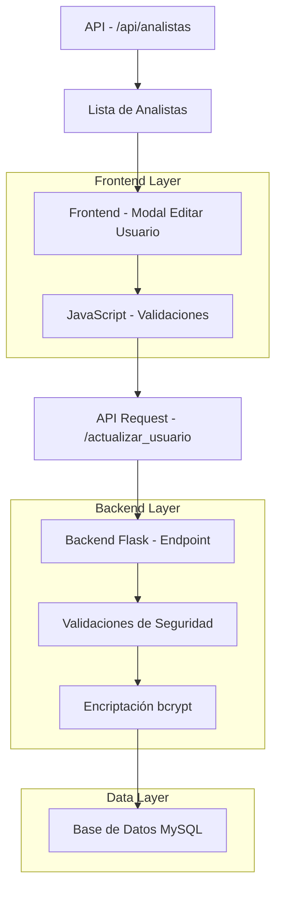
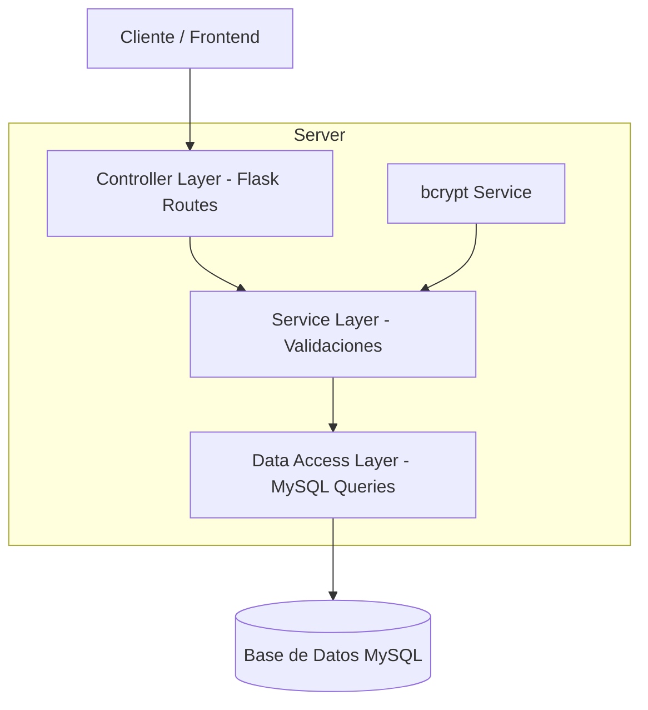
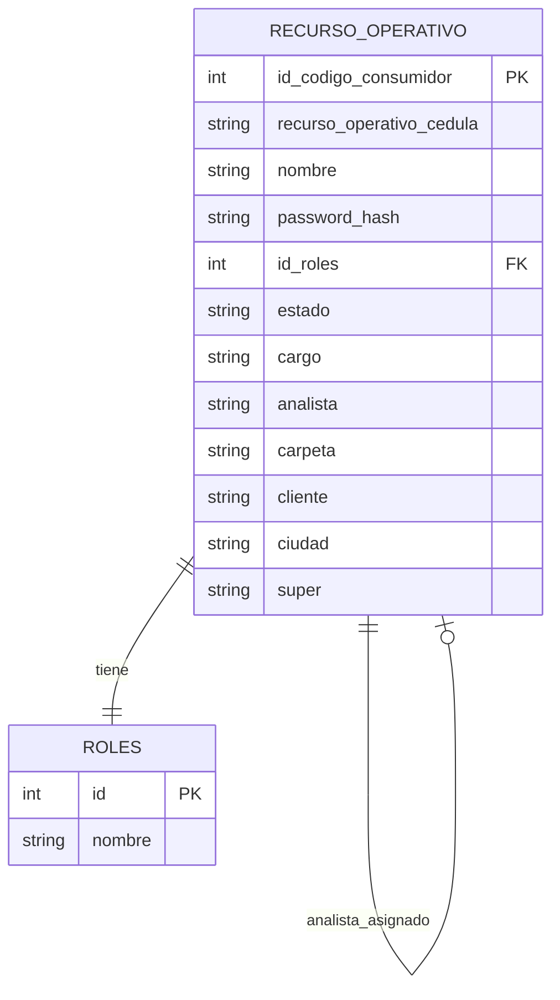

# Arquitectura Técnica - Mejoras Formulario Editar Usuario

## 1. Arquitectura del Sistema



## 2. Stack Tecnológico

- **Frontend:** HTML5 + Bootstrap 5 + JavaScript vanilla
- **Backend:** Flask (Python) + MySQL
- **Seguridad:** bcrypt para encriptación de contraseñas
- **Base de Datos:** MySQL (tabla recurso_operativo existente)

## 3. Definición de Rutas

| Ruta | Propósito |
|------|-----------|
| `/actualizar_usuario` (POST) | Actualizar datos de usuario incluyendo contraseña y analista |
| `/api/analistas` (GET) | Obtener lista de usuarios con cargo "ANALISTA" activos |

## 4. Definiciones de API

### 4.1 Endpoint Principal

**Actualización de Usuario**
```
POST /actualizar_usuario
```

Request:
| Parámetro | Tipo | Requerido | Descripción |
|-----------|------|-----------|-------------|
| id_codigo_consumidor | string | true | ID único del usuario |
| recurso_operativo_cedula | string | true | Cédula del usuario |
| nombre | string | true | Nombre completo |
| id_roles | string | true | ID del rol asignado |
| estado | string | true | Estado del usuario (Activo/Inactivo) |
| cargo | string | false | Cargo del usuario |
| password | string | false | Nueva contraseña (opcional) |
| analista | string | false | ID del analista asignado |
| carpeta | string | false | Carpeta asignada |
| cliente | string | false | Cliente asignado |
| ciudad | string | false | Ciudad |
| super | string | false | Supervisor |

Response:
| Parámetro | Tipo | Descripción |
|-----------|------|-------------|
| success | boolean | Estado de la operación |
| message | string | Mensaje descriptivo del resultado |

Ejemplo Response:
```json
{
  "success": true,
  "message": "Usuario actualizado exitosamente"
}
```

### 4.2 Endpoint de Analistas

**Obtener Lista de Analistas**
```
GET /api/analistas
```

Response:
| Parámetro | Tipo | Descripción |
|-----------|------|-------------|
| success | boolean | Estado de la operación |
| analistas | array | Lista de analistas disponibles |

Ejemplo Response:
```json
{
  "success": true,
  "analistas": [
    {
      "id_codigo_consumidor": "123",
      "nombre": "MARIA ELENA REYES CEDEÑO",
      "recurso_operativo_cedula": "80833959"
    }
  ]
}
```

## 5. Arquitectura del Servidor



## 6. Modelo de Datos

### 6.1 Diagrama de Entidades



### 6.2 Definición de Datos (DDL)

**Modificaciones a la tabla existente:**
```sql
-- Verificar que la columna analista existe
ALTER TABLE recurso_operativo 
ADD COLUMN IF NOT EXISTS analista VARCHAR(255) DEFAULT NULL;

-- Verificar que la columna password_hash existe para contraseñas
ALTER TABLE recurso_operativo 
ADD COLUMN IF NOT EXISTS password_hash VARCHAR(255) DEFAULT NULL;

-- Índice para mejorar consultas de analistas
CREATE INDEX IF NOT EXISTS idx_recurso_operativo_cargo ON recurso_operativo(cargo);
CREATE INDEX IF NOT EXISTS idx_recurso_operativo_estado ON recurso_operativo(estado);

-- Consulta para obtener analistas activos
SELECT id_codigo_consumidor, nombre, recurso_operativo_cedula 
FROM recurso_operativo 
WHERE cargo = 'ANALISTA' AND estado = 'Activo' 
ORDER BY nombre;
```

**Datos de ejemplo:**
```sql
-- Ejemplo de actualización de usuario con nueva contraseña y analista
UPDATE recurso_operativo 
SET 
    nombre = 'VICTOR ALFONSO NARANJO SIERRA',
    password_hash = '$2b$12$ejemplo_hash_encriptado',
    analista = '123',
    cargo = 'DESARROLLADOR'
WHERE id_codigo_consumidor = '456';
```