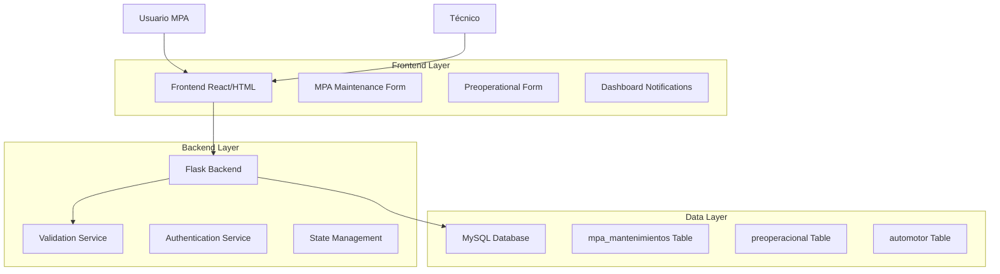
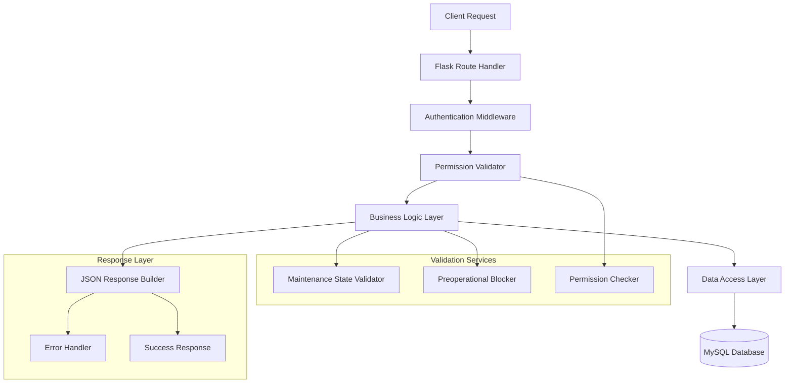
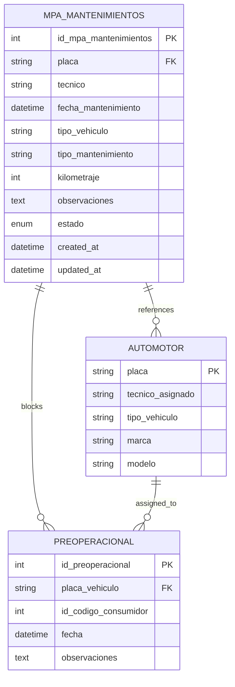

# Arquitectura Técnica - Control de Mantenimientos y Preoperacional

## 1. Architecture design



## 2. Technology Description

- Frontend: HTML5 + Bootstrap 5 + JavaScript ES6 + jQuery
- Backend: Flask + Python 3.8+
- Database: MySQL 8.0
- Authentication: Flask-Login + Session Management
- File Upload: Flask file handling + local storage

## 3. Route definitions

| Route | Purpose |
|-------|---------|
| /mpa/mantenimientos | Página principal de gestión de mantenimientos MPA |
| /api/mpa/mantenimientos | API REST para CRUD de mantenimientos |
| /api/mpa/mantenimientos/<id> | API para actualizar estado específico |
| /api/tecnicos/validar-mantenimientos/<placa> | API de validación de mantenimientos pendientes |
| /preoperacional_operativo | Formulario preoperacional con validación |
| /tecnicos/dashboard | Dashboard con notificaciones de estado |

## 4. API definitions

### 4.1 Core API

**Actualización de estado de mantenimiento**
```
PUT /api/mpa/mantenimientos/<id>
```

Request:
| Param Name | Param Type | isRequired | Description |
|------------|------------|------------|-------------|
| estado | string | true | Estado: 'abierto' o 'finalizado' |
| observaciones_cierre | string | false | Observaciones al finalizar |

Response:
| Param Name | Param Type | Description |
|------------|------------|-------------|
| success | boolean | Estado de la operación |
| message | string | Mensaje descriptivo |
| data | object | Datos del mantenimiento actualizado |

Example Request:
```json
{
  "estado": "finalizado",
  "observaciones_cierre": "Mantenimiento completado exitosamente"
}
```

Example Response:
```json
{
  "success": true,
  "message": "Estado actualizado correctamente",
  "data": {
    "id": 123,
    "placa": "ABC123",
    "estado": "finalizado",
    "fecha_actualizacion": "2024-01-15T10:30:00"
  }
}
```

**Validación de mantenimientos pendientes**
```
GET /api/tecnicos/validar-mantenimientos/<placa>
```

Response:
| Param Name | Param Type | Description |
|------------|------------|-------------|
| tiene_pendientes | boolean | Si hay mantenimientos abiertos |
| mantenimientos_abiertos | array | Lista de mantenimientos pendientes |
| puede_preoperacional | boolean | Si puede realizar preoperacional |
| mensaje_bloqueo | string | Mensaje para mostrar al técnico |

Example Response:
```json
{
  "tiene_pendientes": true,
  "mantenimientos_abiertos": [
    {
      "id": 123,
      "fecha_mantenimiento": "2024-01-10",
      "tipo_mantenimiento": "Cambio de aceite",
      "observaciones": "Mantenimiento preventivo programado"
    }
  ],
  "puede_preoperacional": false,
  "mensaje_bloqueo": "No puedes realizar el preoperacional. Hay 1 mantenimiento pendiente de finalizar."
}
```

**Crear mantenimiento con estado**
```
POST /api/mpa/mantenimientos
```

Request:
| Param Name | Param Type | isRequired | Description |
|------------|------------|------------|-------------|
| placa | string | true | Placa del vehículo |
| tipo_mantenimiento | string | true | Tipo de mantenimiento |
| kilometraje | integer | true | Kilometraje actual |
| observaciones | string | true | Observaciones del mantenimiento |
| estado | string | false | Estado inicial (default: 'abierto') |

## 5. Server architecture diagram



## 6. Data model

### 6.1 Data model definition



### 6.2 Data Definition Language

**Modificación tabla mpa_mantenimientos**
```sql
-- Agregar campo estado
ALTER TABLE mpa_mantenimientos 
ADD COLUMN estado ENUM('abierto', 'finalizado') DEFAULT 'abierto' NOT NULL AFTER observaciones;

-- Agregar campos de auditoría
ALTER TABLE mpa_mantenimientos 
ADD COLUMN fecha_actualizacion TIMESTAMP DEFAULT CURRENT_TIMESTAMP ON UPDATE CURRENT_TIMESTAMP,
ADD COLUMN usuario_actualizacion VARCHAR(100),
ADD COLUMN observaciones_cierre TEXT;

-- Crear índices para optimizar consultas
CREATE INDEX idx_mpa_mantenimientos_estado ON mpa_mantenimientos(estado);
CREATE INDEX idx_mpa_mantenimientos_placa_estado ON mpa_mantenimientos(placa, estado);
CREATE INDEX idx_mpa_mantenimientos_fecha ON mpa_mantenimientos(fecha_mantenimiento DESC);

-- Actualizar registros existentes
UPDATE mpa_mantenimientos 
SET estado = 'finalizado' 
WHERE fecha_mantenimiento < DATE_SUB(NOW(), INTERVAL 30 DAY);
```

**Tabla de logs de cambios de estado**
```sql
-- Crear tabla de auditoría
CREATE TABLE mpa_mantenimientos_log (
    id_log INT AUTO_INCREMENT PRIMARY KEY,
    id_mantenimiento INT NOT NULL,
    estado_anterior ENUM('abierto', 'finalizado'),
    estado_nuevo ENUM('abierto', 'finalizado') NOT NULL,
    usuario VARCHAR(100) NOT NULL,
    fecha_cambio TIMESTAMP DEFAULT CURRENT_TIMESTAMP,
    observaciones TEXT,
    FOREIGN KEY (id_mantenimiento) REFERENCES mpa_mantenimientos(id_mpa_mantenimientos)
);

-- Índices para la tabla de logs
CREATE INDEX idx_mantenimientos_log_fecha ON mpa_mantenimientos_log(fecha_cambio DESC);
CREATE INDEX idx_mantenimientos_log_mantenimiento ON mpa_mantenimientos_log(id_mantenimiento);
```

**Datos iniciales y configuración**
```sql
-- Configurar estados por defecto para registros existentes
UPDATE mpa_mantenimientos 
SET estado = CASE 
    WHEN fecha_mantenimiento >= DATE_SUB(NOW(), INTERVAL 7 DAY) THEN 'abierto'
    ELSE 'finalizado'
END
WHERE estado IS NULL;

-- Insertar datos de prueba
INSERT INTO mpa_mantenimientos (
    placa, tecnico, fecha_mantenimiento, tipo_vehiculo, 
    tipo_mantenimiento, kilometraje, observaciones, estado
) VALUES 
('ABC123', 'Juan Pérez', NOW(), 'Moto', 'Cambio de aceite', 15000, 'Mantenimiento preventivo', 'abierto'),
('XYZ789', 'María García', DATE_SUB(NOW(), INTERVAL 2 DAY), 'Moto', 'Revisión frenos', 12000, 'Revisión programada', 'finalizado');
```

## 7. Implementation Details

### 7.1 Backend Implementation

**Flask Route Handler:**
```python
@app.route('/api/mpa/mantenimientos/<int:id>', methods=['PUT'])
@login_required
def actualizar_mantenimiento(id):
    if not current_user.has_role('administrativo'):
        return jsonify({'success': False, 'message': 'Sin permisos'}), 403
    
    data = request.get_json()
    nuevo_estado = data.get('estado')
    
    # Validar estado
    if nuevo_estado not in ['abierto', 'finalizado']:
        return jsonify({'success': False, 'message': 'Estado inválido'}), 400
    
    # Actualizar en base de datos
    cursor = mysql.connection.cursor()
    cursor.execute("""
        UPDATE mpa_mantenimientos 
        SET estado = %s, fecha_actualizacion = NOW(), usuario_actualizacion = %s
        WHERE id_mpa_mantenimientos = %s
    """, (nuevo_estado, current_user.username, id))
    
    mysql.connection.commit()
    return jsonify({'success': True, 'message': 'Estado actualizado'})
```

**Validation Service:**
```python
@app.route('/api/tecnicos/validar-mantenimientos/<placa>')
@login_required
def validar_mantenimientos_pendientes(placa):
    cursor = mysql.connection.cursor()
    cursor.execute("""
        SELECT COUNT(*) as pendientes,
               GROUP_CONCAT(tipo_mantenimiento) as tipos
        FROM mpa_mantenimientos 
        WHERE placa = %s AND estado = 'abierto'
    """, (placa,))
    
    result = cursor.fetchone()
    tiene_pendientes = result['pendientes'] > 0
    
    return jsonify({
        'tiene_pendientes': tiene_pendientes,
        'puede_preoperacional': not tiene_pendientes,
        'mensaje_bloqueo': f"Hay {result['pendientes']} mantenimiento(s) pendiente(s)" if tiene_pendientes else None
    })
```

### 7.2 Frontend Implementation

**JavaScript Validation:**
```javascript
// Validar antes de mostrar formulario preoperacional
async function validarAccesoPreoperacional() {
    const placa = document.getElementById('placa_vehiculo').value;
    
    try {
        const response = await fetch(`/api/tecnicos/validar-mantenimientos/${placa}`);
        const data = await response.json();
        
        if (data.tiene_pendientes) {
            mostrarMensajeBloqueo(data.mensaje_bloqueo);
            return false;
        }
        
        return true;
    } catch (error) {
        console.error('Error validando mantenimientos:', error);
        return false;
    }
}

// Mostrar mensaje de bloqueo
function mostrarMensajeBloqueo(mensaje) {
    const alertHtml = `
        <div class="alert alert-danger" role="alert">
            <i class="fas fa-lock me-2"></i>
            <strong>Acceso Bloqueado:</strong> ${mensaje}
            <br><small>Contacta al personal MPA para finalizar los mantenimientos pendientes.</small>
        </div>
    `;
    document.getElementById('preoperacional-form').innerHTML = alertHtml;
}
```