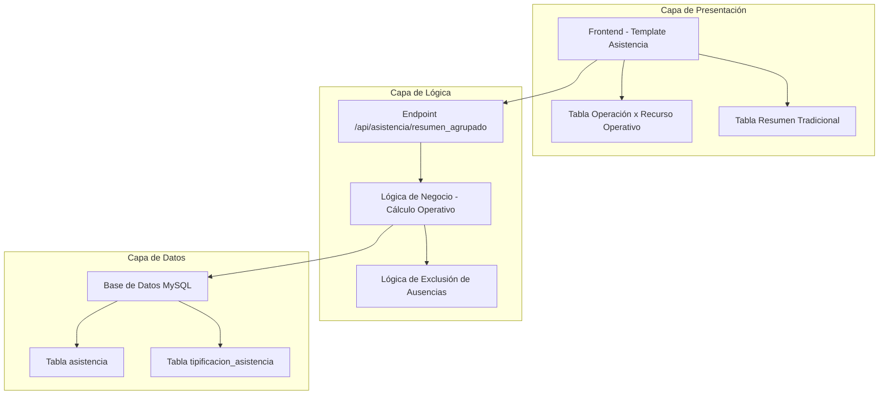
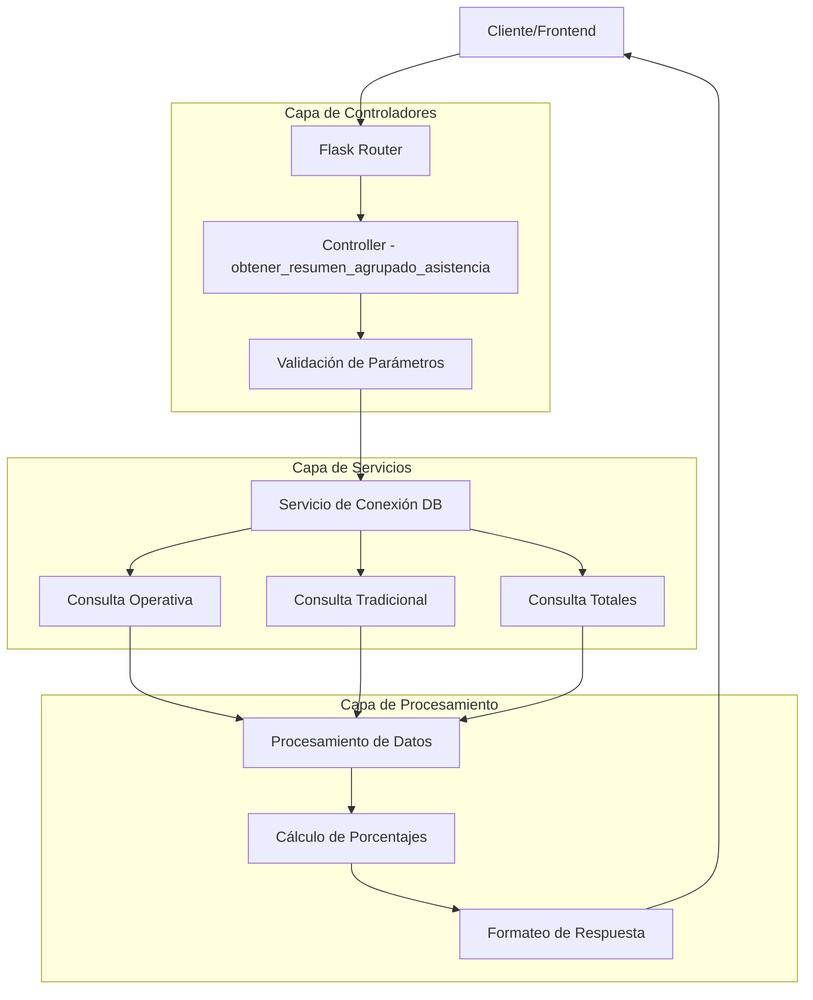
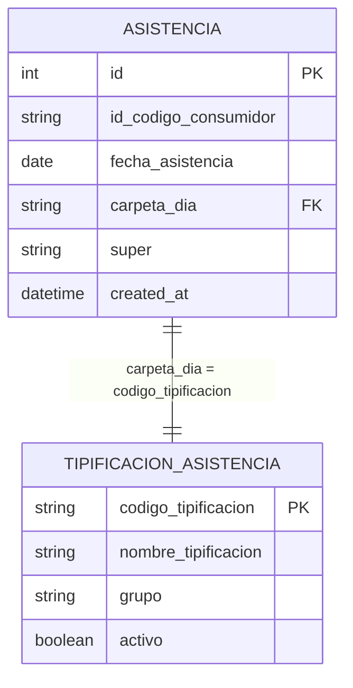

# Arquitectura Técnica - Operación x Recurso Operativo

## 1. Arquitectura de Solución



## 2. Tecnologías Utilizadas

- **Frontend**: HTML5 + Bootstrap 5 + JavaScript ES6
- **Backend**: Python Flask + MySQL
- **Base de Datos**: MySQL 8.0
- **Autenticación**: Flask-Login

## 3. Definición de Rutas

| Ruta | Propósito | Método |
|------|-----------|--------|
| `/administrativo/asistencia` | Página principal del módulo de asistencia | GET |
| `/api/asistencia/resumen_agrupado` | API para obtener datos de ambas tablas (modificado) | GET |
| `/api/supervisores` | API para obtener lista de supervisores | GET |

## 4. Definiciones de API

### 4.1 API Principal Modificada

**Endpoint**: `/api/asistencia/resumen_agrupado`

**Parámetros de Entrada**:
| Parámetro | Tipo | Requerido | Descripción |
|-----------|------|-----------|-------------|
| fecha_inicio | string | No | Fecha inicio (YYYY-MM-DD) |
| fecha_fin | string | No | Fecha fin (YYYY-MM-DD) |
| supervisor | string | No | Filtro por supervisor |

**Respuesta Exitosa**:
```json
{
    "success": true,
    "data": {
        "operacion_recurso_operativo": [
            {
                "grupo": "string",
                "carpeta": "string", 
                "total_tecnicos": "number",
                "porcentaje": "number"
            }
        ],
        "detallado": [
            {
                "grupo": "string",
                "carpeta": "string",
                "total_tecnicos": "number", 
                "porcentaje": "number"
            }
        ],
        "resumen_grupos": [
            {
                "grupo": "string",
                "total_tecnicos": "number",
                "porcentaje": "number"
            }
        ],
        "totales": {
            "total_general": "number",
            "total_operativo": "number", 
            "total_ausencias": "number"
        },
        "fecha_inicio": "string",
        "fecha_fin": "string",
        "supervisor_filtro": "string|null"
    }
}
```

**Respuesta de Error**:
```json
{
    "success": false,
    "message": "string"
}
```

## 5. Arquitectura de Servidor



## 6. Modelo de Datos

### 6.1 Diagrama de Entidades



### 6.2 Consultas SQL Principales

#### Consulta Operativa (Excluye Ausencias)
```sql
-- Datos para tabla "OPERACIÓN X RECURSO OPERATIVO"
SELECT 
    t.grupo,
    t.nombre_tipificacion as carpeta,
    COUNT(DISTINCT a.id_codigo_consumidor) as total_tecnicos
FROM asistencia a
INNER JOIN tipificacion_asistencia t ON a.carpeta_dia = t.codigo_tipificacion
WHERE DATE(a.fecha_asistencia) BETWEEN %s AND %s
    AND t.grupo IS NOT NULL 
    AND t.grupo != ''
    AND t.grupo NOT IN ('AUSENCIA INJUSTIFICADA', 'AUSENCIA JUSTIFICADA')
    AND (%s IS NULL OR a.super = %s)
GROUP BY t.grupo, t.nombre_tipificacion
ORDER BY t.grupo, t.nombre_tipificacion;
```

#### Consulta Total Operativo
```sql
-- Total de técnicos operativos (base para porcentajes)
SELECT COUNT(DISTINCT a.id_codigo_consumidor) as total_operativo
FROM asistencia a
INNER JOIN tipificacion_asistencia t ON a.carpeta_dia = t.codigo_tipificacion
WHERE DATE(a.fecha_asistencia) BETWEEN %s AND %s
    AND t.grupo IS NOT NULL 
    AND t.grupo != ''
    AND t.grupo NOT IN ('AUSENCIA INJUSTIFICADA', 'AUSENCIA JUSTIFICADA')
    AND (%s IS NULL OR a.super = %s);
```

#### Consulta Tradicional (Incluye Todo)
```sql
-- Datos para tabla tradicional (mantiene funcionalidad existente)
SELECT 
    t.grupo,
    t.nombre_tipificacion as carpeta,
    COUNT(DISTINCT a.id_codigo_consumidor) as total_tecnicos
FROM asistencia a
INNER JOIN tipificacion_asistencia t ON a.carpeta_dia = t.codigo_tipificacion
WHERE DATE(a.fecha_asistencia) BETWEEN %s AND %s
    AND t.grupo IS NOT NULL 
    AND t.grupo != ''
    AND t.grupo IN ('ARREGLOS', 'AUSENCIA INJUSTIFICADA', 'AUSENCIA JUSTIFICADA', 'INSTALACIONES', 'POSTVENTA')
    AND (%s IS NULL OR a.super = %s)
GROUP BY t.grupo, t.nombre_tipificacion
ORDER BY t.grupo, t.nombre_tipificacion;
```

### 6.3 Índices Requeridos

```sql
-- Índices para optimización de consultas
CREATE INDEX idx_asistencia_fecha_asistencia ON asistencia(fecha_asistencia);
CREATE INDEX idx_asistencia_carpeta_dia ON asistencia(carpeta_dia);
CREATE INDEX idx_asistencia_super ON asistencia(super);
CREATE INDEX idx_asistencia_fecha_carpeta ON asistencia(fecha_asistencia, carpeta_dia);
CREATE INDEX idx_tipificacion_codigo ON tipificacion_asistencia(codigo_tipificacion);
CREATE INDEX idx_tipificacion_grupo ON tipificacion_asistencia(grupo);
```

## 7. Lógica de Procesamiento

### 7.1 Algoritmo de Cálculo de Porcentajes

```python
def calcular_porcentajes_operativos(resultados_operativos, total_operativo):
    """
    Calcula porcentajes basados en total operativo (sin ausencias)
    """
    for resultado in resultados_operativos:
        total_tecnicos = resultado['total_tecnicos']
        porcentaje = round((total_tecnicos * 100) / total_operativo, 2) if total_operativo > 0 else 0
        resultado['porcentaje'] = porcentaje
    
    return resultados_operativos

def calcular_porcentajes_tradicionales(resultados_tradicionales, total_general):
    """
    Calcula porcentajes basados en total general (incluye ausencias)
    """
    for resultado in resultados_tradicionales:
        total_tecnicos = resultado['total_tecnicos']
        porcentaje = round((total_tecnicos * 100) / total_general, 2) if total_general > 0 else 0
        resultado['porcentaje'] = porcentaje
    
    return resultados_tradicionales
```

### 7.2 Validaciones de Entrada

```python
def validar_parametros_fecha(fecha_inicio, fecha_fin):
    """
    Valida parámetros de fecha de entrada
    """
    validaciones = {
        'fecha_formato': True,
        'rango_valido': True,
        'no_futuras': True,
        'rango_maximo': True
    }
    
    try:
        fecha_inicio_obj = datetime.strptime(fecha_inicio, '%Y-%m-%d').date()
        fecha_fin_obj = datetime.strptime(fecha_fin, '%Y-%m-%d').date()
        fecha_actual = get_bogota_datetime().date()
        
        # Validar rango
        if fecha_inicio_obj > fecha_fin_obj:
            validaciones['rango_valido'] = False
            
        # Validar fechas futuras
        if fecha_inicio_obj > fecha_actual or fecha_fin_obj > fecha_actual:
            validaciones['no_futuras'] = False
            
        # Validar rango máximo (1 año)
        diferencia_dias = (fecha_fin_obj - fecha_inicio_obj).days
        if diferencia_dias > 365:
            validaciones['rango_maximo'] = False
            
    except ValueError:
        validaciones['fecha_formato'] = False
    
    return validaciones
```

## 8. Estructura Frontend

### 8.1 Componentes JavaScript

```javascript
// Función principal para cargar ambas tablas
async function cargarResumenAgrupado() {
    const supervisor = document.getElementById('supervisorResumen').value;
    const fechaInicio = document.getElementById('fechaInicioResumen').value;
    const fechaFin = document.getElementById('fechaFinResumen').value;
    
    try {
        mostrarCargando();
        
        const response = await fetch(`/api/asistencia/resumen_agrupado?${new URLSearchParams({
            supervisor: supervisor || '',
            fecha_inicio: fechaInicio,
            fecha_fin: fechaFin
        })}`);
        
        const data = await response.json();
        
        if (data.success) {
            renderizarTablaOperativa(data.data.operacion_recurso_operativo, data.data.totales);
            renderizarTablaTradicional(data.data.detallado, data.data.totales);
            actualizarIndicadores(data.data.totales);
        } else {
            mostrarError(data.message);
        }
    } catch (error) {
        mostrarError('Error al cargar los datos: ' + error.message);
    } finally {
        ocultarCargando();
    }
}

// Renderizar tabla operativa (nueva)
function renderizarTablaOperativa(datos, totales) {
    const tbody = document.getElementById('cuerpoTablaOperativa');
    tbody.innerHTML = '';
    
    datos.forEach(item => {
        const row = `
            <tr>
                <td><span class="badge bg-primary">${item.grupo}</span></td>
                <td>${item.carpeta}</td>
                <td class="text-center">
                    <span class="badge bg-success">${item.total_tecnicos}</span>
                </td>
                <td class="text-center">
                    <span class="badge bg-info">${item.porcentaje}%</span>
                </td>
            </tr>
        `;
        tbody.innerHTML += row;
    });
    
    // Actualizar total operativo
    document.getElementById('totalOperativo').textContent = totales.total_operativo;
}
```

### 8.2 Estructura HTML

```html
<!-- Nueva tabla: OPERACIÓN X RECURSO OPERATIVO -->
<div class="card mb-4">
    <div class="card-header bg-success text-white">
        <h5 class="mb-0">
            <i class="fas fa-cogs me-2"></i>OPERACIÓN X RECURSO OPERATIVO
        </h5>
        <small>Distribución operativa (excluye ausencias)</small>
    </div>
    <div class="card-body">
        <div class="table-responsive">
            <table class="table table-striped table-hover">
                <thead class="table-dark">
                    <tr>
                        <th>GRUPO</th>
                        <th>CARPETA</th>
                        <th class="text-center">TÉCNICOS</th>
                        <th class="text-center">PORCENTAJE</th>
                    </tr>
                </thead>
                <tbody id="cuerpoTablaOperativa">
                    <!-- Datos dinámicos -->
                </tbody>
                <tfoot class="table-success">
                    <tr>
                        <th colspan="2">TOTAL OPERATIVO</th>
                        <th class="text-center" id="totalOperativo">0</th>
                        <th class="text-center">100%</th>
                    </tr>
                </tfoot>
            </table>
        </div>
    </div>
</div>

<!-- Indicadores de totales -->
<div class="row mb-3">
    <div class="col-md-4">
        <div class="card bg-success text-white">
            <div class="card-body text-center">
                <h4 id="indicadorOperativo">0</h4>
                <small>Técnicos Operativos</small>
            </div>
        </div>
    </div>
    <div class="col-md-4">
        <div class="card bg-primary text-white">
            <div class="card-body text-center">
                <h4 id="indicadorGeneral">0</h4>
                <small>Total General</small>
            </div>
        </div>
    </div>
    <div class="col-md-4">
        <div class="card bg-warning text-dark">
            <div class="card-body text-center">
                <h4 id="indicadorAusencias">0</h4>
                <small>Ausencias</small>
            </div>
        </div>
    </div>
</div>
```

## 9. Consideraciones de Performance

### 9.1 Optimizaciones de Base de Datos
- **Índices compuestos**: Para consultas con múltiples filtros
- **DISTINCT optimizado**: Para evitar conteos duplicados
- **Límite de rango**: Máximo 1 año para evitar consultas pesadas

### 9.2 Optimizaciones Frontend
- **Carga asíncrona**: Ambas tablas se cargan en paralelo
- **Debounce en filtros**: Evita consultas excesivas
- **Cache de supervisores**: Lista se carga una sola vez

### 9.3 Manejo de Errores
- **Validación de entrada**: Antes de enviar al servidor
- **Timeouts**: Para consultas que tarden mucho
- **Mensajes informativos**: Para guiar al usuario

## 10. Seguridad

### 10.1 Autenticación
- **Login requerido**: Decorador `@login_required` en endpoints
- **Validación de sesión**: Verificación automática de Flask-Login

### 10.2 Validación de Datos
- **Sanitización de parámetros**: Prevención de inyección SQL
- **Validación de rangos**: Límites en fechas y parámetros
- **Escape de caracteres**: En consultas dinámicas

### 10.3 Control de Acceso
- **Filtro por supervisor**: Los usuarios solo ven sus datos autorizados
- **Validación de permisos**: Según rol del usuario logueado