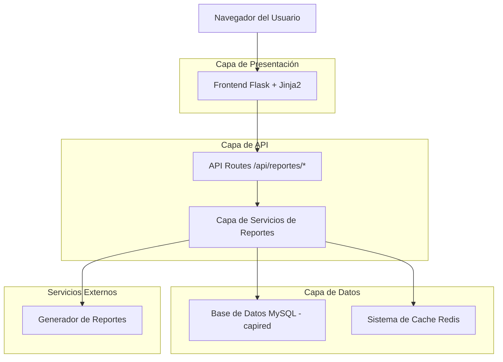
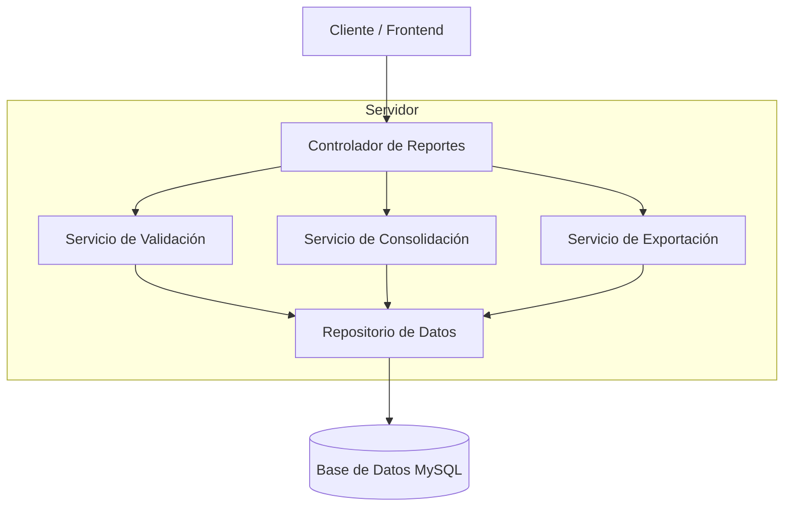
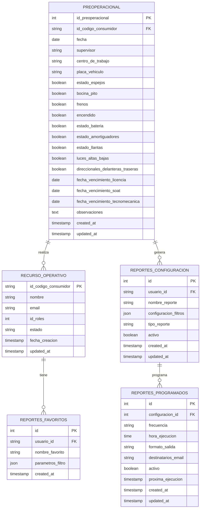

# Documento de Arquitectura Técnica - Optimización del Módulo de Reportes

## 1. Diseño de Arquitectura



## 2. Descripción de Tecnologías

* **Frontend**: Flask + Jinja2 + Bootstrap 5 + Chart.js + jQuery

* **Backend**: Flask + PyMySQL + Redis

* **Base de Datos**: MySQL 8.0 (capired)

* **Cache**: Redis para optimización de consultas

* **Exportación**: ReportLab (PDF) + openpyxl (Excel)

## 3. Definiciones de Rutas

| Ruta                          | Propósito                                                        |
| ----------------------------- | ---------------------------------------------------------------- |
| /admin/reportes               | Dashboard principal de reportes con filtros y métricas generales |
| /admin/reportes/detallado     | Página de reportes detallados con drill-down por categorías      |
| /admin/reportes/configuracion | Configuración de filtros, alertas y preferencias de usuario      |
| /admin/reportes/analisis      | Centro de análisis con consolidación de datos y tendencias       |
| /admin/reportes/exportar      | Interfaz para exportación y programación de reportes             |

## 4. Definiciones de API

### 4.1 APIs Principales

**Obtener datos de filtros mejorados**

```
GET /api/reportes/filtros/avanzados
```

Request:

| Parámetro | Tipo    | Requerido | Descripción                                              |
| --------- | ------- | --------- | -------------------------------------------------------- |
| categoria | string  | false     | Categoría de filtro (supervisor, centro\_trabajo, fecha) |
| validar   | boolean | false     | Validar consistencia con base de datos                   |

Response:

| Parámetro        | Tipo   | Descripción                                 |
| ---------------- | ------ | ------------------------------------------- |
| supervisores     | array  | Lista validada de supervisores únicos       |
| centros\_trabajo | array  | Lista validada de centros de trabajo        |
| rangos\_fecha    | object | Rango mínimo y máximo de fechas disponibles |
| carpetas         | array  | Estructura de carpetas para organización    |

Ejemplo:

```json
{
  "supervisores": ["Juan Pérez", "María García"],
  "centros_trabajo": ["Centro Norte", "Centro Sur"],
  "rangos_fecha": {
    "min": "2024-01-01",
    "max": "2024-12-31"
  },
  "carpetas": [
    {
      "nombre": "Reportes Operativos",
      "subcarpetas": ["Preoperacionales", "Vencimientos"]
    }
  ]
}
```

**Generar reporte consolidado**

```
POST /api/reportes/generar/consolidado
```

Request:

| Parámetro       | Tipo    | Requerido | Descripción                                              |
| --------------- | ------- | --------- | -------------------------------------------------------- |
| tipo\_reporte   | string  | true      | Tipo de reporte (preoperacional, vencimientos, usuarios) |
| filtros         | object  | true      | Objeto con filtros aplicados                             |
| consolidar      | boolean | false     | Aplicar consolidación de datos similares                 |
| formato\_salida | string  | false     | Formato de exportación (json, pdf, excel)                |

Response:

| Parámetro           | Tipo   | Descripción                          |
| ------------------- | ------ | ------------------------------------ |
| datos\_consolidados | object | Datos procesados y consolidados      |
| metricas\_resumen   | object | Métricas calculadas del reporte      |
| url\_descarga       | string | URL para descargar reporte exportado |

**Validar consistencia de datos**

```
GET /api/reportes/validar/consistencia
```

Request:

| Parámetro | Tipo   | Requerido | Descripción                                          |
| --------- | ------ | --------- | ---------------------------------------------------- |
| tabla     | string | true      | Tabla a validar (preoperacional, recurso\_operativo) |
| campo     | string | false     | Campo específico a validar                           |

Response:

| Parámetro               | Tipo    | Descripción                         |
| ----------------------- | ------- | ----------------------------------- |
| es\_consistente         | boolean | Estado de consistencia general      |
| errores\_encontrados    | array   | Lista de inconsistencias detectadas |
| sugerencias\_correccion | array   | Sugerencias para corregir errores   |

## 5. Arquitectura del Servidor



## 6. Modelo de Datos

### 6.1 Definición del Modelo de Datos



### 6.2 Lenguaje de Definición de Datos

**Tabla de Configuración de Reportes (reportes\_configuracion)**

```sql
-- Crear tabla para configuraciones de reportes
CREATE TABLE reportes_configuracion (
    id INT AUTO_INCREMENT PRIMARY KEY,
    usuario_id VARCHAR(50) NOT NULL,
    nombre_reporte VARCHAR(255) NOT NULL,
    configuracion_filtros JSON,
    tipo_reporte ENUM('preoperacional', 'vencimientos', 'usuarios', 'consolidado') NOT NULL,
    activo BOOLEAN DEFAULT TRUE,
    created_at TIMESTAMP DEFAULT CURRENT_TIMESTAMP,
    updated_at TIMESTAMP DEFAULT CURRENT_TIMESTAMP ON UPDATE CURRENT_TIMESTAMP,
    FOREIGN KEY (usuario_id) REFERENCES recurso_operativo(id_codigo_consumidor)
);

-- Crear índices
CREATE INDEX idx_reportes_config_usuario ON reportes_configuracion(usuario_id);
CREATE INDEX idx_reportes_config_tipo ON reportes_configuracion(tipo_reporte);
CREATE INDEX idx_reportes_config_activo ON reportes_configuracion(activo);
```

**Tabla de Reportes Favoritos (reportes\_favoritos)**

```sql
-- Crear tabla para reportes favoritos
CREATE TABLE reportes_favoritos (
    id INT AUTO_INCREMENT PRIMARY KEY,
    usuario_id VARCHAR(50) NOT NULL,
    nombre_favorito VARCHAR(255) NOT NULL,
    parametros_filtro JSON,
    created_at TIMESTAMP DEFAULT CURRENT_TIMESTAMP,
    FOREIGN KEY (usuario_id) REFERENCES recurso_operativo(id_codigo_consumidor)
);

-- Crear índices
CREATE INDEX idx_reportes_favoritos_usuario ON reportes_favoritos(usuario_id);
CREATE INDEX idx_reportes_favoritos_created ON reportes_favoritos(created_at DESC);
```

**Tabla de Reportes Programados (reportes\_programados)**

```sql
-- Crear tabla para reportes programados
CREATE TABLE reportes_programados (
    id INT AUTO_INCREMENT PRIMARY KEY,
    configuracion_id INT NOT NULL,
    frecuencia ENUM('diario', 'semanal', 'mensual', 'trimestral') NOT NULL,
    hora_ejecucion TIME NOT NULL,
    formato_salida ENUM('pdf', 'excel', 'csv') DEFAULT 'pdf',
    destinatarios_email TEXT,
    activo BOOLEAN DEFAULT TRUE,
    proxima_ejecucion TIMESTAMP,
    created_at TIMESTAMP DEFAULT CURRENT_TIMESTAMP,
    updated_at TIMESTAMP DEFAULT CURRENT_TIMESTAMP ON UPDATE CURRENT_TIMESTAMP,
    FOREIGN KEY (configuracion_id) REFERENCES reportes_configuracion(id)
);

-- Crear índices
CREATE INDEX idx_reportes_programados_config ON reportes_programados(configuracion_id);
CREATE INDEX idx_reportes_programados_proxima ON reportes_programados(proxima_ejecucion);
CREATE INDEX idx_reportes_programados_activo ON reportes_programados(activo);
```

**Optimización de tabla preoperacional existente**

```sql
-- Agregar índices para mejorar rendimiento de reportes
CREATE INDEX idx_preoperacional_fecha_supervisor ON preoperacional(fecha, supervisor);
CREATE INDEX idx_preoperacional_centro_trabajo ON preoperacional(centro_de_trabajo);
CREATE INDEX idx_preoperacional_vencimientos ON preoperacional(fecha_vencimiento_licencia, fecha_vencimiento_soat, fecha_vencimiento_tecnomecanica);
CREATE INDEX idx_preoperacional_estado_vehiculo ON preoperacional(estado_espejos, bocina_pito, frenos, encendido, estado_bateria);

-- Datos iniciales para configuraciones de ejemplo
INSERT INTO reportes_configuracion (usuario_id, nombre_reporte, configuracion_filtros, tipo_reporte) VALUES
('admin', 'Reporte Mensual Preoperacionales', '{"periodo": "mensual", "incluir_graficos": true}', 'preoperacional'),
('admin', 'Alertas de Vencimientos', '{"dias_anticipacion": 30, "tipos": ["licencia", "soat", "tecnomecanica"]}', 'vencimientos'),
('admin', 'Estadísticas de Usuarios', '{"incluir_actividad": true, "agrupar_por_rol": true}', 'usuarios');
```

