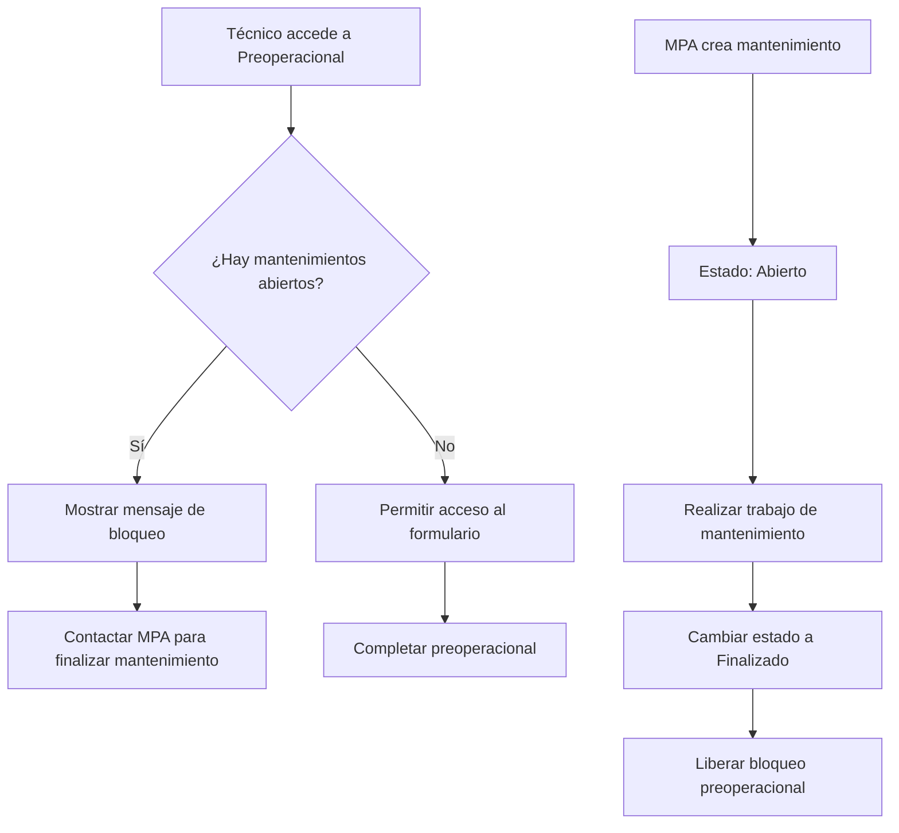

# Control de Estados de Mantenimiento y Validación Preoperacional

## 1. Product Overview

Sistema de control de calidad que implementa validación de mantenimientos pendientes antes de permitir el registro de preoperacionales. El sistema bloquea automáticamente el formulario preoperacional si el vehículo asignado al técnico tiene mantenimientos abiertos sin finalizar, garantizando que todos los mantenimientos estén completados antes de la operación.

- **Problema a resolver**: Evitar que técnicos realicen preoperacionales con vehículos que tienen mantenimientos pendientes
- **Usuarios**: Personal MPA (administrativo) y técnicos operativos
- **Valor del producto**: Mejora la seguridad operacional y el control de calidad de la flota vehicular

## 2. Core Features

### 2.1 User Roles

| Role | Registration Method | Core Permissions |
|------|---------------------|------------------|
| Personal MPA | Acceso administrativo existente | Gestionar estados de mantenimiento, crear/finalizar mantenimientos |
| Técnico Operativo | Acceso técnico existente | Visualizar bloqueos, consultar estado de mantenimientos |

### 2.2 Feature Module

Nuestros requerimientos consisten en las siguientes páginas principales:

1. **Módulo MPA Mantenimientos**: gestión de estados, registro con estado inicial, finalización de mantenimientos
2. **Módulo Preoperacional**: validación automática, bloqueo condicional, mensajes informativos
3. **Dashboard Técnico**: visualización de estado, notificaciones de bloqueo

### 2.3 Page Details

| Page Name | Module Name | Feature description |
|-----------|-------------|---------------------|
| MPA Mantenimientos | Formulario de Registro | Agregar campo "Estado" con opciones "Abierto/Finalizado", establecer "Abierto" por defecto |
| MPA Mantenimientos | Gestión de Estados | Permitir cambio de estado de "Abierto" a "Finalizado", validar permisos de modificación |
| MPA Mantenimientos | Lista de Mantenimientos | Mostrar estado actual, filtrar por estado, indicadores visuales de estado |
| Preoperacional Técnico | Validación de Acceso | Verificar mantenimientos abiertos antes de mostrar formulario, bloquear acceso si hay pendientes |
| Preoperacional Técnico | Mensaje de Bloqueo | Mostrar información detallada del mantenimiento pendiente, opciones de contacto con MPA |
| Dashboard Técnico | Notificaciones | Mostrar alertas de mantenimientos pendientes, estado actual del vehículo asignado |

## 3. Core Process

### Flujo Principal - Personal MPA:
1. Accede al módulo de mantenimientos MPA
2. Crea nuevo mantenimiento (estado automático: "Abierto")
3. Registra detalles del mantenimiento realizado
4. Cambia estado a "Finalizado" cuando el trabajo esté completo
5. El sistema libera automáticamente el bloqueo del preoperacional

### Flujo Principal - Técnico Operativo:
1. Intenta acceder al formulario preoperacional
2. El sistema valida automáticamente mantenimientos pendientes
3. Si hay mantenimientos abiertos: muestra mensaje de bloqueo
4. Si no hay pendientes: permite acceso normal al formulario
5. Completa preoperacional normalmente



## 4. User Interface Design

### 4.1 Design Style

- **Colores primarios**: Verde (#28a745) para estados finalizados, Naranja (#ffc107) para estados abiertos, Rojo (#dc3545) para bloqueos
- **Estilo de botones**: Redondeados con iconos FontAwesome
- **Fuente**: Sistema actual (Bootstrap), tamaños 14px-16px para contenido
- **Layout**: Cards con bordes suaves, alertas Bootstrap para notificaciones
- **Iconos**: FontAwesome - fas fa-tools (mantenimientos), fas fa-lock (bloqueos), fas fa-check-circle (completado)

### 4.2 Page Design Overview

| Page Name | Module Name | UI Elements |
|-----------|-------------|-------------|
| MPA Mantenimientos | Campo Estado | Select dropdown con opciones "Abierto" (naranja) y "Finalizado" (verde), badge de estado visual |
| MPA Mantenimientos | Lista Estados | Columna de estado con badges coloridos, filtros por estado, iconos de estado |
| Preoperacional | Mensaje Bloqueo | Alert rojo con icono de candado, detalles del mantenimiento pendiente, botón de contacto MPA |
| Dashboard Técnico | Notificación Estado | Card informativa con estado del vehículo, alertas de mantenimientos pendientes |

### 4.3 Responsiveness

Diseño mobile-first con adaptación completa para tablets y desktop. Optimización táctil para uso en campo por técnicos.

## 5. Technical Architecture

### 5.1 Database Schema Changes

**Tabla: mpa_mantenimientos**
```sql
-- Agregar campo estado
ALTER TABLE mpa_mantenimientos 
ADD COLUMN estado ENUM('abierto', 'finalizado') DEFAULT 'abierto' NOT NULL;

-- Índice para consultas rápidas
CREATE INDEX idx_mpa_mantenimientos_estado ON mpa_mantenimientos(estado);
CREATE INDEX idx_mpa_mantenimientos_placa_estado ON mpa_mantenimientos(placa, estado);
```

### 5.2 API Endpoints

**Actualizar mantenimiento existente:**
```
PUT /api/mpa/mantenimientos/<id>
```

Request:
| Param Name | Param Type | isRequired | Description |
|------------|------------|------------|-------------|
| estado | string | true | Estado del mantenimiento: 'abierto' o 'finalizado' |

**Validar mantenimientos pendientes:**
```
GET /api/tecnicos/validar-mantenimientos/<placa>
```

Response:
| Param Name | Param Type | Description |
|------------|------------|-------------|
| tiene_pendientes | boolean | Si hay mantenimientos abiertos |
| mantenimientos | array | Lista de mantenimientos abiertos |
| puede_preoperacional | boolean | Si puede realizar preoperacional |

### 5.3 Frontend Implementation

**Modificaciones en MPA Maintenance Form:**
- Agregar campo select para estado
- Implementar validación de cambios de estado
- Actualizar tabla para mostrar estados con badges

**Modificaciones en Preoperacional:**
- Agregar validación antes de mostrar formulario
- Implementar mensaje de bloqueo informativo
- Integrar con API de validación de mantenimientos

### 5.4 Backend Logic

**Validación de Preoperacional:**
```python
def validar_mantenimientos_pendientes(placa):
    """Valida si hay mantenimientos abiertos para una placa"""
    query = """
    SELECT COUNT(*) as pendientes 
    FROM mpa_mantenimientos 
    WHERE placa = %s AND estado = 'abierto'
    """
    # Retorna True si hay pendientes, False si puede continuar
```

**Actualización de Estado:**
```python
def actualizar_estado_mantenimiento(id_mantenimiento, nuevo_estado):
    """Actualiza el estado de un mantenimiento"""
    # Validar permisos MPA
    # Actualizar estado en base de datos
    # Registrar log de cambio
```

## 6. Implementation Phases

### Fase 1: Módulo MPA (Prioritario)
- ✅ Agregar campo estado a base de datos
- ✅ Modificar formulario de registro
- ✅ Implementar gestión de estados
- ✅ Actualizar visualización de lista

### Fase 2: Validación Preoperacional
- ✅ Crear API de validación
- ✅ Implementar lógica de bloqueo
- ✅ Diseñar mensaje informativo
- ✅ Integrar con formulario existente

### Fase 3: Mejoras UX
- ✅ Notificaciones en dashboard técnico
- ✅ Filtros avanzados en MPA
- ✅ Reportes de mantenimientos pendientes

## 7. Security Considerations

- **Permisos**: Solo personal MPA puede cambiar estados de mantenimiento
- **Validación**: Doble validación en frontend y backend
- **Logs**: Registro de todos los cambios de estado
- **Integridad**: Validación de datos antes de bloquear preoperacionales

## 8. Testing Strategy

- **Unit Tests**: Validación de lógica de estados
- **Integration Tests**: Flujo completo MPA → Preoperacional
- **User Acceptance**: Pruebas con personal MPA y técnicos
- **Performance**: Validación de consultas de estado optimizadas