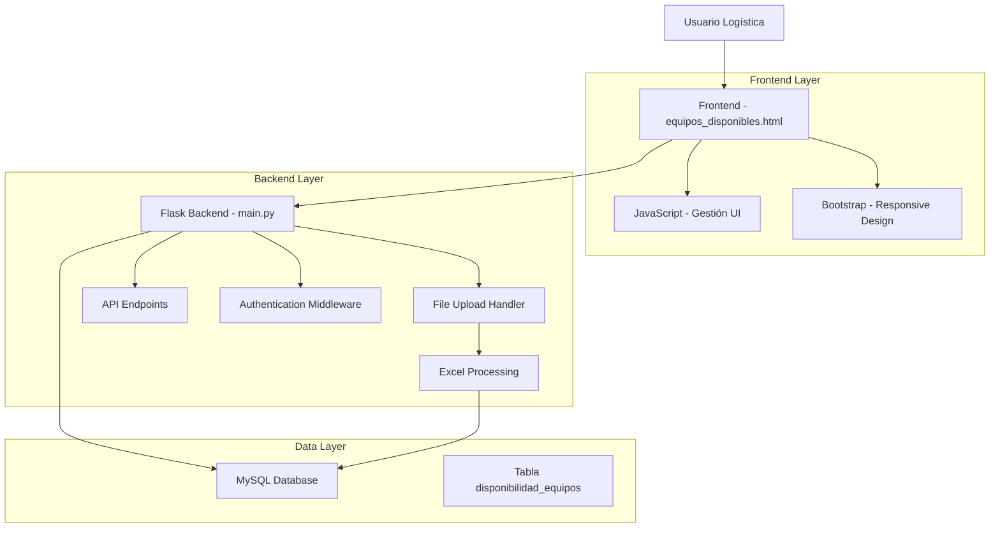
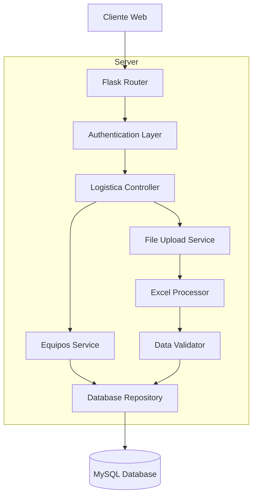
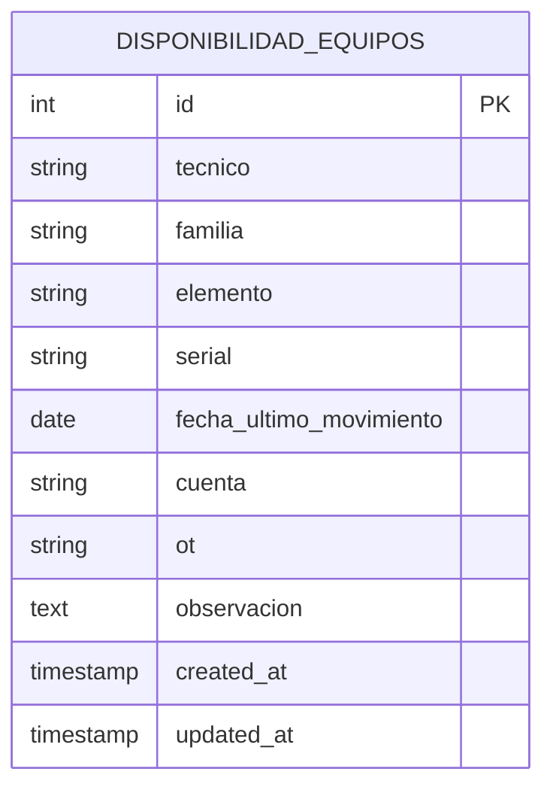

# Arquitectura Técnica - Submódulo Equipos Disponibles Logística

## 1. Architecture design



## 2. Technology Description

- Frontend: HTML5 + Bootstrap 5 + JavaScript ES6 + FontAwesome
- Backend: Flask + Python 3.x + pandas (para procesamiento Excel)
- Database: MySQL (tabla existente disponibilidad_equipos)
- File Processing: openpyxl/pandas para lectura de archivos Excel

## 3. Route definitions

| Route | Purpose |
|-------|---------|
| /logistica/equipos_disponibles | Página principal del submódulo de equipos disponibles para logística |
| /api/logistica/equipos_disponibles | API GET para obtener todos los equipos sin filtros |
| /api/logistica/equipos_disponibles/truncate | API POST para limpiar tabla completa (TRUNCATE) |
| /api/logistica/equipos_disponibles/upload | API POST para procesar archivo Excel y cargar datos |
| /api/logistica/equipos_disponibles/template | API GET para descargar plantilla Excel de ejemplo |

## 4. API definitions

### 4.1 Core API

**Obtener todos los equipos**
```
GET /api/logistica/equipos_disponibles
```

Response:
| Param Name | Param Type | Description |
|------------|------------|-------------|
| success | boolean | Estado de la operación |
| equipos | array | Lista completa de equipos |
| total | integer | Cantidad total de registros |

Example Response:
```json
{
  "success": true,
  "equipos": [
    {
      "id": 1,
      "tecnico": "Juan Pérez",
      "familia": "Herramientas",
      "elemento": "Taladro",
      "serial": "TD001",
      "fecha_ultimo_movimiento": "2024-01-15",
      "cuenta": "12345",
      "ot": "OT-001",
      "observacion": "En buen estado"
    }
  ],
  "total": 150
}
```

**Limpiar tabla completa**
```
POST /api/logistica/equipos_disponibles/truncate
```

Request:
| Param Name | Param Type | isRequired | Description |
|------------|------------|------------|-------------|
| confirm | boolean | true | Confirmación de acción destructiva |

Response:
| Param Name | Param Type | Description |
|------------|------------|-------------|
| success | boolean | Estado de la operación |
| message | string | Mensaje de confirmación |
| records_deleted | integer | Cantidad de registros eliminados |

**Cargar datos desde Excel**
```
POST /api/logistica/equipos_disponibles/upload
```

Request (multipart/form-data):
| Param Name | Param Type | isRequired | Description |
|------------|------------|------------|-------------|
| file | file | true | Archivo Excel con datos de equipos |
| replace_all | boolean | false | Si reemplazar todos los datos existentes |

Response:
| Param Name | Param Type | Description |
|------------|------------|-------------|
| success | boolean | Estado de la operación |
| message | string | Mensaje de resultado |
| records_processed | integer | Cantidad de registros procesados |
| errors | array | Lista de errores encontrados |

## 5. Server architecture diagram



## 6. Data model

### 6.1 Data model definition



### 6.2 Data Definition Language

**Tabla disponibilidad_equipos (existente)**
```sql
-- La tabla ya existe, pero se documenta su estructura
CREATE TABLE disponibilidad_equipos (
    id INT AUTO_INCREMENT PRIMARY KEY,
    tecnico VARCHAR(255),
    familia VARCHAR(255),
    elemento VARCHAR(255),
    serial VARCHAR(255) UNIQUE,
    fecha_ultimo_movimiento DATE,
    cuenta VARCHAR(100),
    ot VARCHAR(100),
    observacion TEXT,
    created_at TIMESTAMP DEFAULT CURRENT_TIMESTAMP,
    updated_at TIMESTAMP DEFAULT CURRENT_TIMESTAMP ON UPDATE CURRENT_TIMESTAMP
);

-- Índices para optimizar consultas
CREATE INDEX idx_disponibilidad_tecnico ON disponibilidad_equipos(tecnico);
CREATE INDEX idx_disponibilidad_familia ON disponibilidad_equipos(familia);
CREATE INDEX idx_disponibilidad_elemento ON disponibilidad_equipos(elemento);
CREATE INDEX idx_disponibilidad_serial ON disponibilidad_equipos(serial);
CREATE INDEX idx_disponibilidad_fecha ON disponibilidad_equipos(fecha_ultimo_movimiento);

-- Estructura esperada del archivo Excel
-- Columnas requeridas: tecnico, familia, elemento, serial, fecha_ultimo_movimiento
-- Columnas opcionales: cuenta, ot, observacion
```

**Endpoints Flask requeridos en main.py:**
```python
@app.route('/logistica/equipos_disponibles')
@login_required
def logistica_equipos_disponibles():
    # Verificar rol de logística
    return render_template('modulos/logistica/equipos_disponibles.html')

@app.route('/api/logistica/equipos_disponibles', methods=['GET'])
@login_required
def api_logistica_equipos_disponibles():
    # Retornar todos los equipos sin filtros
    pass

@app.route('/api/logistica/equipos_disponibles/truncate', methods=['POST'])
@login_required
def api_logistica_truncate_equipos():
    # TRUNCATE TABLE disponibilidad_equipos
    pass

@app.route('/api/logistica/equipos_disponibles/upload', methods=['POST'])
@login_required
def api_logistica_upload_equipos():
    # Procesar archivo Excel y cargar datos
    pass
```