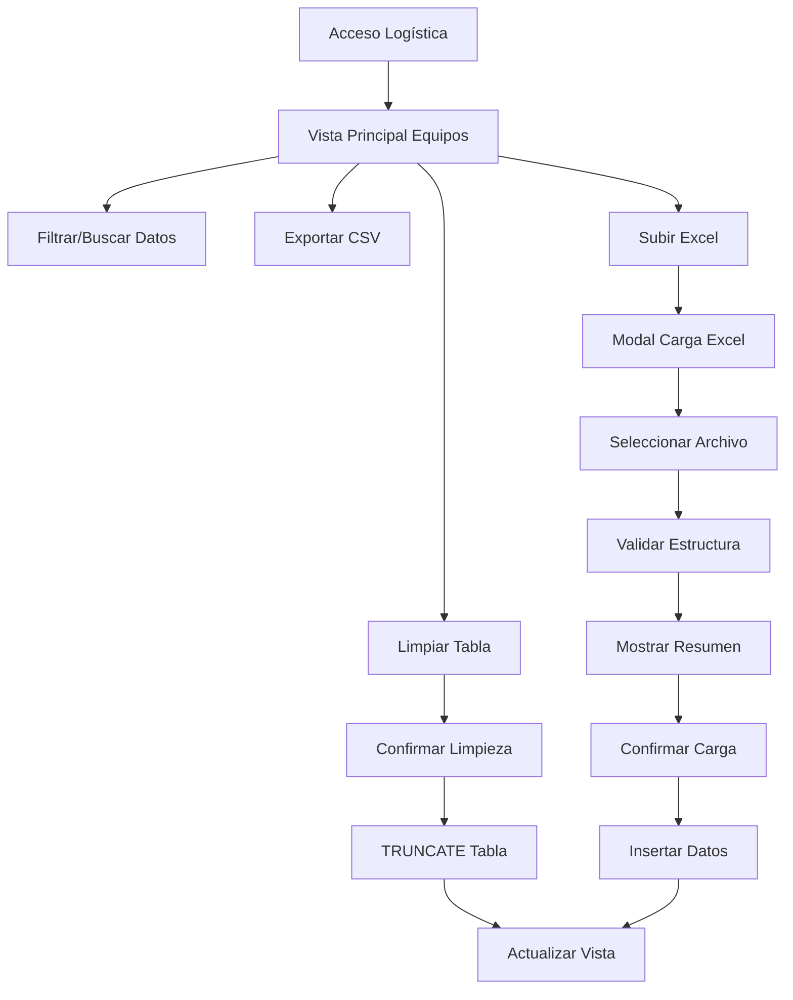

# Submódulo Equipos Disponibles - Logística

## 1. Product Overview

Submódulo de gestión de equipos disponibles diseñado específicamente para el área de Logística, que permite visualizar, administrar y actualizar masivamente la información de todos los equipos en la tabla `disponibilidad_equipos`.

- A diferencia del módulo de Operativo (que filtra por supervisor), este módulo permite a Logística ver TODOS los datos para validar que las demás áreas estén completando correctamente la información.
- Incluye funcionalidades administrativas como limpieza masiva de datos y carga de información actualizada mediante archivos Excel.

## 2. Core Features

### 2.1 User Roles

| Role | Registration Method | Core Permissions |
|------|---------------------|------------------|
| Usuario Logística | Acceso mediante credenciales existentes del sistema | Puede ver todos los equipos, limpiar tabla completa, subir archivos Excel, exportar datos |

### 2.2 Feature Module

Nuestro submódulo de Equipos Disponibles para Logística consiste en las siguientes funcionalidades principales:

1. **Vista Principal**: Tabla completa de equipos, filtros de búsqueda, controles de ordenamiento, exportación CSV.
2. **Gestión de Datos**: Botón para limpiar tabla completa, botón para subir Excel con datos nuevos.
3. **Modal de Carga Excel**: Interfaz para subir archivo, instrucciones de formato, validación de datos.

### 2.3 Page Details

| Page Name | Module Name | Feature description |
|-----------|-------------|---------------------|
| Vista Principal | Tabla de Equipos | Mostrar todos los registros de disponibilidad_equipos sin filtros por supervisor. Incluir columnas: Técnico, Familia, Elemento, Serial, Fecha Último Movimiento, Días, Cuenta, OT, Observación |
| Vista Principal | Filtros y Búsqueda | Implementar filtros por técnico, familia, elemento y búsqueda por serial/elemento. Mantener funcionalidad de ordenamiento por columnas |
| Vista Principal | Controles Administrativos | Botón "Limpiar Tabla" para ejecutar TRUNCATE en disponibilidad_equipos. Botón "Subir Excel" para cargar datos masivos |
| Vista Principal | Exportación | Botón para exportar datos filtrados/ordenados a formato CSV |
| Modal Carga Excel | Interfaz de Subida | Selector de archivo Excel, botón de carga, barra de progreso, mensajes de estado |
| Modal Carga Excel | Instrucciones | Mostrar formato requerido de plantilla Excel con columnas esperadas y ejemplos de datos |
| Modal Carga Excel | Validación | Validar estructura del archivo, mostrar errores de formato, confirmar cantidad de registros a procesar |

## 3. Core Process

**Flujo Principal de Logística:**
1. Usuario accede al submódulo desde el menú de Logística
2. Sistema carga y muestra TODOS los equipos de la tabla disponibilidad_equipos
3. Usuario puede filtrar, buscar y ordenar datos para análisis
4. Usuario puede exportar datos actuales a CSV

**Flujo de Limpieza de Datos:**
1. Usuario hace clic en "Limpiar Tabla"
2. Sistema muestra confirmación de acción destructiva
3. Usuario confirma y sistema ejecuta TRUNCATE en disponibilidad_equipos
4. Sistema muestra mensaje de confirmación

**Flujo de Carga de Excel:**
1. Usuario hace clic en "Subir Excel"
2. Sistema abre modal con instrucciones de formato
3. Usuario selecciona archivo Excel
4. Sistema valida estructura y contenido
5. Sistema muestra resumen de datos a procesar
6. Usuario confirma y sistema inserta datos en disponibilidad_equipos
7. Sistema actualiza vista principal con nuevos datos

## 4. User Interface Design

### 4.1 Design Style

- **Colores primarios**: Azul (#007bff) para header, Verde (#28a745) para exportar, Rojo (#dc3545) para limpiar tabla
- **Colores secundarios**: Gris claro (#f8f9fa) para fondos, Amarillo (#ffc107) para advertencias
- **Estilo de botones**: Botones redondeados con iconos FontAwesome, tamaño pequeño (btn-sm)
- **Fuentes**: Sistema por defecto, tamaño 0.9rem para tabla, 0.875rem para controles
- **Layout**: Diseño de tarjeta (card) con header azul, layout responsivo con Bootstrap
- **Iconos**: FontAwesome para herramientas (fa-tools), exportar (fa-file-export), limpiar (fa-trash), subir (fa-upload)

### 4.2 Page Design Overview

| Page Name | Module Name | UI Elements |
|-----------|-------------|-------------|
| Vista Principal | Header | Card header azul con título "Equipos Disponibles - Logística" e icono de herramientas |
| Vista Principal | Alert Info | Mensaje informativo indicando que se muestran todos los equipos para validación |
| Vista Principal | Controles Filtros | Row con 4 columnas: input búsqueda, select técnico, select familia, select elemento |
| Vista Principal | Controles Acción | Botones: Exportar CSV (verde), Limpiar Tabla (rojo), Subir Excel (azul) |
| Vista Principal | Tabla Equipos | Tabla striped hover con headers ordenables, datos en tiempo real, badges para días |
| Modal Carga Excel | Header Modal | Título "Cargar Datos desde Excel" con botón cerrar |
| Modal Carga Excel | Body | Instrucciones de formato, selector archivo, área de arrastrar y soltar |
| Modal Carga Excel | Footer | Botones Cancelar (secundario) y Procesar (primario) |

### 4.3 Responsiveness

- **Desktop-first**: Diseño optimizado para pantallas grandes con tabla completa visible
- **Mobile-adaptive**: Tabla responsive con scroll horizontal en dispositivos móviles
- **Touch-friendly**: Botones y controles optimizados para interacción táctil
- **Breakpoints**: Utiliza sistema de grid Bootstrap para adaptación automática