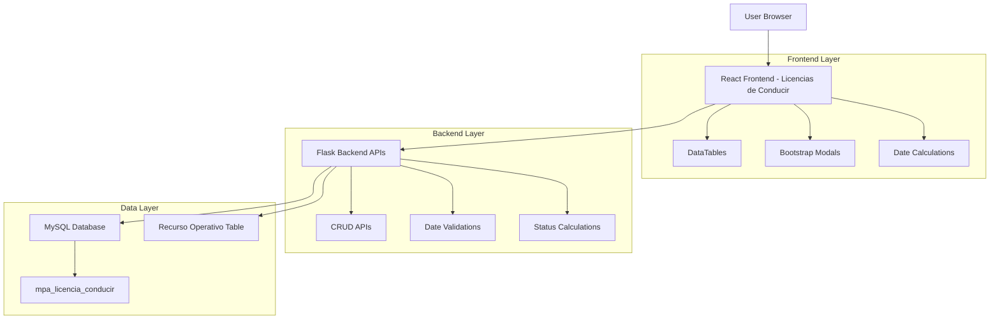
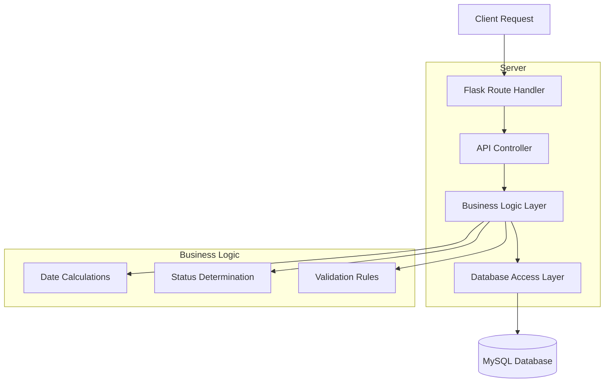
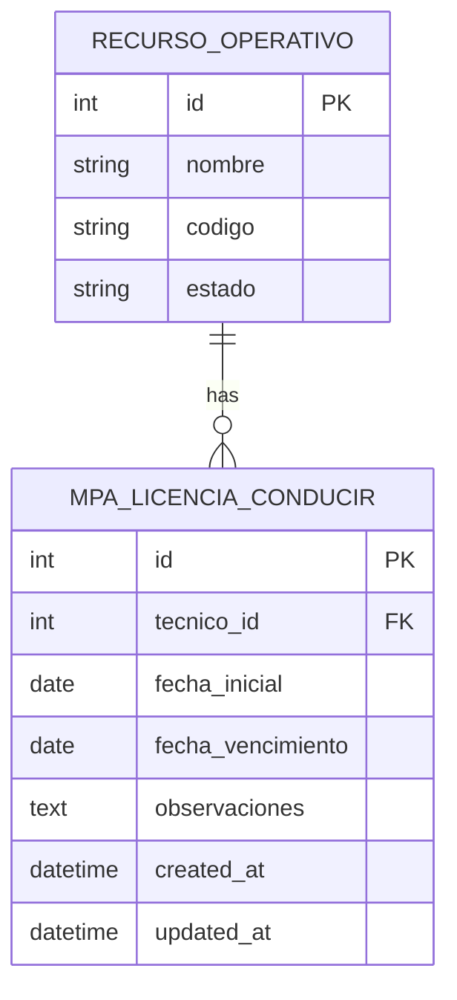

# Documento de Arquitectura Técnica - Módulo Licencias de Conducir

## 1. Architecture design



## 2. Technology Description
- Frontend: HTML5 + Bootstrap 5 + jQuery + DataTables + Font Awesome
- Backend: Flask + MySQL
- Database: MySQL (tabla mpa_licencia_conducir + recurso_operativo)

## 3. Route definitions
| Route | Purpose |
|-------|---------|
| /mpa/licencias-conducir | Página principal de gestión de licencias de conducir |

## 4. API definitions

### 4.1 Core API

**Listar todas las licencias de conducir**
```
GET /api/mpa/licencias_conducir
```

Response:
| Param Name | Param Type | Description |
|------------|------------|-------------|
| id | integer | ID único de la licencia |
| tecnico_id | integer | ID del técnico (referencia a recurso_operativo) |
| tecnico_nombre | string | Nombre completo del técnico |
| fecha_inicial | date | Fecha de inicio de vigencia |
| fecha_vencimiento | date | Fecha de vencimiento |
| dias_restantes | integer | Días restantes hasta vencimiento |
| estado | string | Estado calculado (Vigente, Próximo a vencer, Vencido) |
| observaciones | string | Observaciones adicionales |

**Obtener licencia específica**
```
GET /api/mpa/licencias_conducir/<id>
```

**Crear nueva licencia**
```
POST /api/mpa/licencias_conducir
```

Request:
| Param Name | Param Type | isRequired | Description |
|------------|------------|------------|-------------|
| tecnico_id | integer | true | ID del técnico seleccionado |
| fecha_inicial | date | true | Fecha de inicio (YYYY-MM-DD) |
| fecha_vencimiento | date | true | Fecha de vencimiento (YYYY-MM-DD) |
| observaciones | string | false | Observaciones adicionales |

**Actualizar licencia**
```
PUT /api/mpa/licencias_conducir/<id>
```

Request:
| Param Name | Param Type | isRequired | Description |
|------------|------------|------------|-------------|
| fecha_inicial | date | true | Nueva fecha de inicio |
| fecha_vencimiento | date | true | Nueva fecha de vencimiento |
| observaciones | string | false | Observaciones actualizadas |

**Eliminar licencia**
```
DELETE /api/mpa/licencias_conducir/<id>
```

**Obtener lista de técnicos**
```
GET /api/mpa/tecnicos_operativos
```

Response:
| Param Name | Param Type | Description |
|------------|------------|-------------|
| id | integer | ID del técnico |
| nombre | string | Nombre completo del técnico |
| codigo | string | Código del técnico |

## 5. Server architecture diagram



## 6. Data model

### 6.1 Data model definition



### 6.2 Data Definition Language

**Tabla de Licencias de Conducir (mpa_licencia_conducir)**
```sql
-- Crear tabla
CREATE TABLE mpa_licencia_conducir (
    id INT AUTO_INCREMENT PRIMARY KEY,
    tecnico_id INT NOT NULL,
    fecha_inicial DATE NOT NULL,
    fecha_vencimiento DATE NOT NULL,
    observaciones TEXT,
    created_at TIMESTAMP DEFAULT CURRENT_TIMESTAMP,
    updated_at TIMESTAMP DEFAULT CURRENT_TIMESTAMP ON UPDATE CURRENT_TIMESTAMP,
    INDEX idx_tecnico_id (tecnico_id),
    INDEX idx_fecha_vencimiento (fecha_vencimiento),
    INDEX idx_created_at (created_at DESC)
);

-- Datos iniciales de ejemplo
INSERT INTO mpa_licencia_conducir (tecnico_id, fecha_inicial, fecha_vencimiento, observaciones) VALUES
(11, '2024-01-15', '2026-01-15', 'Licencia renovada - Categoría B1'),
(25, '2023-06-10', '2025-06-10', 'Licencia vigente - Categoría C1'),
(33, '2024-03-20', '2026-03-20', 'Nueva licencia - Categoría B1');
```

**Consultas principales**
```sql
-- Obtener todas las licencias con información del técnico
SELECT 
    lc.id,
    lc.tecnico_id,
    ro.nombre as tecnico_nombre,
    lc.fecha_inicial,
    lc.fecha_vencimiento,
    DATEDIFF(lc.fecha_vencimiento, CURDATE()) as dias_restantes,
    CASE 
        WHEN DATEDIFF(lc.fecha_vencimiento, CURDATE()) > 30 THEN 'Vigente'
        WHEN DATEDIFF(lc.fecha_vencimiento, CURDATE()) BETWEEN 1 AND 30 THEN 'Próximo a vencer'
        ELSE 'Vencido'
    END as estado,
    lc.observaciones,
    lc.created_at,
    lc.updated_at
FROM mpa_licencia_conducir lc
LEFT JOIN recurso_operativo ro ON lc.tecnico_id = ro.id
ORDER BY lc.fecha_vencimiento ASC;

-- Obtener técnicos disponibles
SELECT 
    id,
    nombre,
    codigo
FROM recurso_operativo 
WHERE estado = 'ACTIVO'
ORDER BY nombre ASC;
```