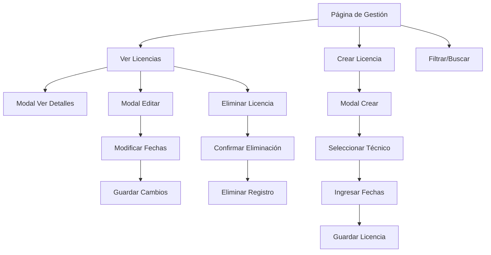

# Documento de Requerimientos del Producto - Módulo Licencias de Conducir

## 1. Product Overview
Sistema de gestión integral de licencias de conducir para técnicos operativos, permitiendo el control de vigencia, renovaciones y seguimiento automatizado de vencimientos.
- Facilita el control y seguimiento de las licencias de conducir de los técnicos operativos, asegurando el cumplimiento de requisitos legales y operativos.
- Dirigido a supervisores y administradores del área MPA que necesitan gestionar y monitorear el estado de las licencias de conducir del personal técnico.

## 2. Core Features

### 2.1 User Roles
| Role | Registration Method | Core Permissions |
|------|---------------------|------------------|
| Supervisor MPA | Acceso con credenciales existentes | Puede crear, editar, ver y eliminar licencias de conducir |
| Administrador | Acceso con credenciales existentes | Acceso completo a todas las funcionalidades del módulo |

### 2.2 Feature Module
Nuestro módulo de licencias de conducir consta de las siguientes páginas principales:
1. **Página de Gestión**: tabla de licencias, filtros de búsqueda, botón de crear nueva licencia.
2. **Modal de Creación**: formulario para registrar nueva licencia con selección de técnico y fechas.
3. **Modal de Edición**: formulario para modificar datos de licencias existentes.
4. **Modal de Visualización**: vista detallada de información de licencia en modo solo lectura.

### 2.3 Page Details
| Page Name | Module Name | Feature description |
|-----------|-------------|---------------------|
| Página de Gestión | Tabla de Licencias | Mostrar todas las licencias con técnico, fecha inicial, fecha vencimiento, días restantes, estado y acciones |
| Página de Gestión | Filtros y Búsqueda | Filtrar por técnico, estado, rango de fechas y búsqueda por texto |
| Página de Gestión | Botón Crear Licencia | Abrir modal de creación para registrar nueva licencia de conducir |
| Modal de Creación | Formulario de Registro | Seleccionar técnico (dropdown desde recurso_operativo), ingresar fecha inicial y fecha vencimiento |
| Modal de Creación | Validaciones | Validar fechas lógicas, técnico seleccionado y campos requeridos |
| Modal de Edición | Formulario de Modificación | Editar fecha inicial, fecha vencimiento y observaciones de licencia existente |
| Modal de Edición | Técnico Asignado | Mostrar técnico asignado (solo lectura, no editable) |
| Modal de Visualización | Vista Detallada | Mostrar toda la información de la licencia en modo solo lectura |
| Todas las páginas | Cálculo Automático | Calcular días restantes y estado automático (Vigente, Próximo a vencer, Vencido) |
| Todas las páginas | Gestión de Estados | Actualizar automáticamente estados basado en fechas de vencimiento |

## 3. Core Process

**Flujo Principal del Usuario:**
1. El usuario accede a la página de gestión de licencias de conducir
2. Visualiza la tabla con todas las licencias registradas y sus estados
3. Puede filtrar y buscar licencias específicas
4. Para crear una nueva licencia: hace clic en "Crear Licencia" → selecciona técnico → ingresa fechas → guarda
5. Para editar: hace clic en "Editar" → modifica fechas → guarda cambios
6. Para ver detalles: hace clic en "Ver" → visualiza información completa
7. Para eliminar: hace clic en "Eliminar" → confirma acción → elimina registro

**Flujo de Cálculos Automáticos:**
1. El sistema calcula automáticamente los días restantes hasta el vencimiento
2. Actualiza el estado basado en los días restantes:
   - Vigente: más de 30 días
   - Próximo a vencer: entre 1 y 30 días
   - Vencido: 0 o menos días
3. Los cálculos se actualizan en tiempo real al cargar la página

## 4. User Interface Design

### 4.1 Design Style
- **Colores primarios:** Azul corporativo (#007bff) para botones principales, verde (#28a745) para estados vigentes
- **Colores secundarios:** Amarillo (#ffc107) para próximo a vencer, rojo (#dc3545) para vencido
- **Estilo de botones:** Botones redondeados con efectos hover, iconos Font Awesome
- **Fuente:** Sistema de fuentes Bootstrap (Segoe UI, Arial, sans-serif), tamaños 14px para texto normal, 16px para títulos
- **Estilo de layout:** Diseño basado en cards con navegación superior, tabla responsiva con DataTables
- **Iconos:** Font Awesome para acciones (eye, edit, trash, plus, calendar)

### 4.2 Page Design Overview
| Page Name | Module Name | UI Elements |
|-----------|-------------|-------------|
| Página de Gestión | Header | Título "Licencias de Conducir", breadcrumb navigation, botón "Crear Licencia" (azul, icono plus) |
| Página de Gestión | Tabla Principal | DataTable responsiva con columnas: Técnico, Fecha Inicial, Fecha Vencimiento, Días Restantes, Estado (badges coloridos), Acciones (botones icon) |
| Página de Gestión | Filtros | Dropdown de técnicos, selector de estado, date pickers para rango de fechas, campo de búsqueda |
| Modal de Creación | Formulario | Dropdown de técnicos (searchable), date pickers para fechas, textarea para observaciones, botones Cancelar/Guardar |
| Modal de Edición | Formulario | Técnico (readonly), date pickers editables, textarea para observaciones, botones Cancelar/Guardar |
| Modal de Visualización | Vista Detallada | Cards informativos con datos de la licencia, badges de estado, botón Cerrar |
| Estados | Badges | Vigente (verde), Próximo a vencer (amarillo), Vencido (rojo) con iconos correspondientes |

### 4.3 Responsiveness
El módulo está diseñado mobile-first con adaptación completa para dispositivos móviles. La tabla se convierte en cards apiladas en pantallas pequeñas, los modales se ajustan al ancho de pantalla, y se optimiza la interacción táctil para botones y formularios. Breakpoints: móvil (<768px), tablet (768px-1024px), desktop (>1024px).