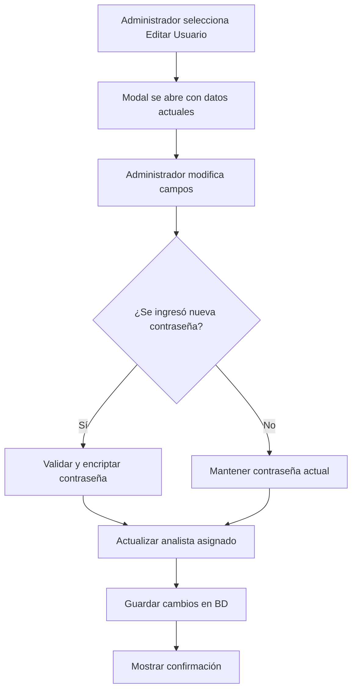

# Mejoras al Formulario "Editar Usuario" - Documento de Requerimientos

## 1. Resumen del Proyecto

Este proyecto busca mejorar el formulario de "Editar Usuario" del sistema administrativo agregando funcionalidades críticas para la gestión de contraseñas y asignación de analistas a técnicos. Las mejoras permitirán una administración más completa y segura de los usuarios del sistema.

## 2. Funcionalidades Principales

### 2.1 Roles de Usuario
No se requieren nuevos roles para esta funcionalidad. Se utilizarán los roles existentes:

| Rol | Permisos | Descripción |
|-----|----------|-------------|
| Administrativo | Editar usuarios, actualizar contraseñas, asignar analistas | Acceso completo al formulario de edición |
| Analista | Solo visualización | No puede editar usuarios |

### 2.2 Módulos de Funcionalidad

Las mejoras al formulario de edición de usuarios incluyen:

1. **Formulario de Edición de Usuario**: Campos existentes + nuevos campos de contraseña y analista
2. **Gestión de Contraseñas**: Actualización segura de contraseñas con encriptación
3. **Asignación de Analistas**: Dropdown dinámico para asignar analistas a técnicos

### 2.3 Detalles de Funcionalidades

| Módulo | Funcionalidad | Descripción |
|--------|---------------|-------------|
| Formulario Edición | Campo Contraseña | Campo opcional para actualizar contraseña. Si se deja vacío, mantiene la actual. Incluye validación de seguridad |
| Formulario Edición | Campo Analista | Dropdown que muestra usuarios con cargo "ANALISTA" activos. Actualiza columna `analista` en tabla `recurso_operativo` |
| Backend API | Endpoint Actualización | Modificar `/actualizar_usuario` para manejar encriptación de contraseñas y actualización de analista |
| Validaciones | Seguridad | Validar que solo usuarios administrativos puedan actualizar contraseñas y asignar analistas |
| Base de Datos | Consulta Analistas | Endpoint para obtener lista de usuarios con cargo "ANALISTA" y estado "Activo" |

## 3. Flujo de Procesos

### Flujo Principal - Edición de Usuario

1. **Administrador** accede al módulo de gestión de usuarios
2. Selecciona "Editar" en un usuario específico
3. Se abre el modal con los datos actuales del usuario
4. **Campos nuevos disponibles:**
   - Campo "Contraseña" (opcional)
   - Campo "Analista" (dropdown con analistas activos)
5. Administrador modifica los campos necesarios
6. Al guardar, el sistema:
   - Valida los datos ingresados
   - Encripta la nueva contraseña (si se proporcionó)
   - Actualiza la asignación de analista
   - Guarda los cambios en la base de datos
7. Muestra confirmación de actualización exitosa

## 4. Diseño de Interfaz

### 4.1 Estilo de Diseño
- **Colores primarios:** Azul (#007bff) para botones principales, amarillo (#ffc107) para modal de edición
- **Estilo de botones:** Redondeados con iconos FontAwesome
- **Fuente:** Sistema por defecto de Bootstrap
- **Layout:** Modal responsivo con formulario de dos columnas
- **Iconos:** FontAwesome para consistencia visual

### 4.2 Elementos de Interfaz

| Elemento | Estilo | Descripción |
|----------|--------|-------------|
| Campo Contraseña | Input type="password" con placeholder | Campo opcional con texto de ayuda explicativo |
| Campo Analista | Select dropdown con búsqueda | Lista dinámica de analistas activos |
| Botón Guardar | btn-primary con icono save | Botón principal para confirmar cambios |
| Texto de Ayuda | text-muted pequeño | Explicación sobre campos opcionales |
| Validaciones | border-danger + texto rojo | Indicadores visuales de errores |

### 4.3 Responsividad
- **Desktop-first:** Optimizado para pantallas de escritorio
- **Adaptativo:** Modal se ajusta a pantallas móviles
- **Touch-friendly:** Elementos táctiles apropiados para tablets