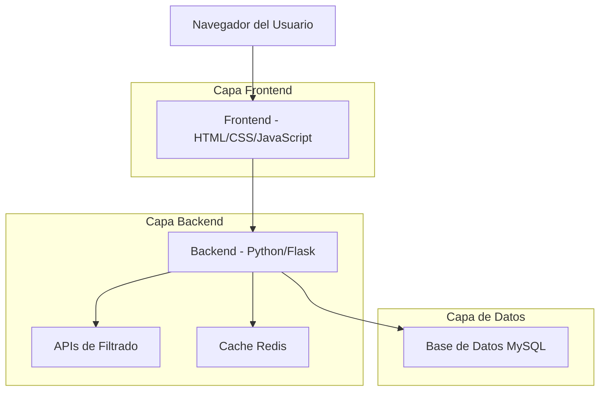
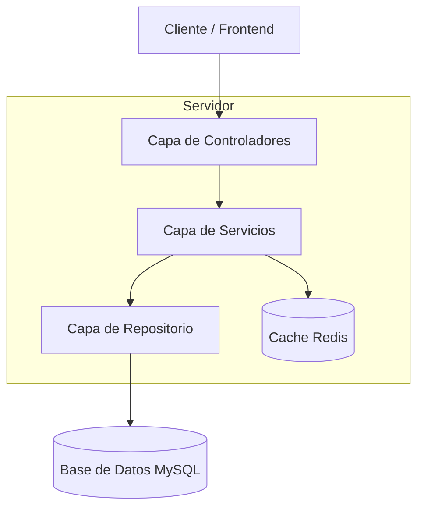
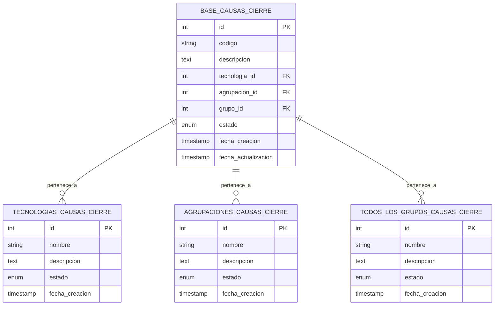

# Módulo Analistas - Documento de Arquitectura Técnica

## 1. Diseño de Arquitectura



## 2. Descripción de Tecnologías

- **Frontend**: HTML5 + CSS3 + JavaScript ES6 + Bootstrap 5
- **Backend**: Python 3.8+ + Flask 2.0
- **Base de Datos**: MySQL 8.0
- **Cache**: Redis 6.0 (opcional para optimización)
- **Servidor Web**: Nginx + Gunicorn

## 3. Definiciones de Rutas

| Ruta | Propósito |
|------|----------|
| /analistas | Dashboard principal del módulo analistas |
| /analistas/buscador | Interfaz de búsqueda y filtrado de causas de cierre |
| /analistas/configuracion | Panel de administración de filtros y configuraciones |
| /analistas/api/buscar | Endpoint AJAX para búsquedas en tiempo real |
| /analistas/api/filtros | Endpoint para obtener datos de filtros dinámicos |

## 4. Definiciones de API

### 4.1 APIs Principales

#### Búsqueda de Causas de Cierre
```
POST /analistas/api/buscar
```

**Request:**
| Nombre del Parámetro | Tipo de Parámetro | Es Requerido | Descripción |
|---------------------|-------------------|--------------|-------------|
| texto_busqueda | string | false | Texto libre para búsqueda en descripción y código |
| tecnologia_id | integer | false | ID de la tecnología seleccionada |
| agrupacion_id | integer | false | ID de la agrupación seleccionada |
| grupo_id | integer | false | ID del grupo seleccionado |
| pagina | integer | false | Número de página para paginación (default: 1) |
| limite | integer | false | Cantidad de resultados por página (default: 20) |

**Response:**
| Nombre del Parámetro | Tipo de Parámetro | Descripción |
|---------------------|-------------------|-------------|
| resultados | array | Lista de causas de cierre encontradas |
| total | integer | Total de resultados encontrados |
| pagina_actual | integer | Página actual |
| total_paginas | integer | Total de páginas disponibles |

**Ejemplo Request:**
```json
{
  "texto_busqueda": "falla técnica",
  "tecnologia_id": 1,
  "agrupacion_id": null,
  "grupo_id": 3,
  "pagina": 1,
  "limite": 20
}
```

**Ejemplo Response:**
```json
{
  "resultados": [
    {
      "id": 1,
      "codigo": "VTP",
      "descripcion": "Visita Técnica Pymes",
      "tecnologia": "PRIMERAS CLIENTE",
      "agrupacion": "CSR",
      "grupo": "OTROS TRABAJOS"
    }
  ],
  "total": 178,
  "pagina_actual": 1,
  "total_paginas": 9
}
```

#### Obtener Filtros Dinámicos
```
GET /analistas/api/filtros
```

**Response:**
| Nombre del Parámetro | Tipo de Parámetro | Descripción |
|---------------------|-------------------|-------------|
| tecnologias | array | Lista de tecnologías disponibles |
| agrupaciones | array | Lista de agrupaciones disponibles |
| grupos | array | Lista de grupos disponibles |

**Ejemplo Response:**
```json
{
  "tecnologias": [
    {"id": 1, "nombre": "Todas las tecnologías"},
    {"id": 2, "nombre": "PRIMERAS CLIENTE"}
  ],
  "agrupaciones": [
    {"id": 1, "nombre": "Todas las agrupaciones"},
    {"id": 2, "nombre": "CSR"}
  ],
  "grupos": [
    {"id": 1, "nombre": "Todos los grupos"},
    {"id": 2, "nombre": "OTROS TRABAJOS"}
  ]
}
```

## 5. Arquitectura del Servidor



### 5.1 Componentes del Servidor

- **Controladores**: Manejan las peticiones HTTP y respuestas
- **Servicios**: Lógica de negocio para búsqueda y filtrado
- **Repositorio**: Acceso a datos y consultas SQL optimizadas
- **Cache**: Almacenamiento temporal de filtros y resultados frecuentes

## 6. Modelo de Datos

### 6.1 Definición del Modelo de Datos



### 6.2 Lenguaje de Definición de Datos (DDL)

#### Tabla Principal: base_causas_cierre
```sql
-- Crear tabla principal
CREATE TABLE base_causas_cierre (
    id INT AUTO_INCREMENT PRIMARY KEY,
    codigo VARCHAR(50) UNIQUE NOT NULL,
    descripcion TEXT NOT NULL,
    tecnologia_id INT,
    agrupacion_id INT,
    grupo_id INT,
    estado ENUM('activo', 'inactivo') DEFAULT 'activo',
    fecha_creacion TIMESTAMP DEFAULT CURRENT_TIMESTAMP,
    fecha_actualizacion TIMESTAMP DEFAULT CURRENT_TIMESTAMP ON UPDATE CURRENT_TIMESTAMP,
    
    INDEX idx_codigo (codigo),
    INDEX idx_tecnologia (tecnologia_id),
    INDEX idx_agrupacion (agrupacion_id),
    INDEX idx_grupo (grupo_id),
    INDEX idx_estado (estado),
    FULLTEXT INDEX idx_busqueda (codigo, descripcion)
);

-- Crear tabla de tecnologías
CREATE TABLE tecnologias_causas_cierre (
    id INT AUTO_INCREMENT PRIMARY KEY,
    nombre VARCHAR(100) NOT NULL,
    descripcion TEXT,
    estado ENUM('activo', 'inactivo') DEFAULT 'activo',
    fecha_creacion TIMESTAMP DEFAULT CURRENT_TIMESTAMP,
    
    INDEX idx_nombre (nombre),
    INDEX idx_estado (estado)
);

-- Crear tabla de agrupaciones
CREATE TABLE agrupaciones_causas_cierre (
    id INT AUTO_INCREMENT PRIMARY KEY,
    nombre VARCHAR(100) NOT NULL,
    descripcion TEXT,
    estado ENUM('activo', 'inactivo') DEFAULT 'activo',
    fecha_creacion TIMESTAMP DEFAULT CURRENT_TIMESTAMP,
    
    INDEX idx_nombre (nombre),
    INDEX idx_estado (estado)
);

-- Crear tabla de grupos
CREATE TABLE todos_los_grupos_causas_cierre (
    id INT AUTO_INCREMENT PRIMARY KEY,
    nombre VARCHAR(100) NOT NULL,
    descripcion TEXT,
    estado ENUM('activo', 'inactivo') DEFAULT 'activo',
    fecha_creacion TIMESTAMP DEFAULT CURRENT_TIMESTAMP,
    
    INDEX idx_nombre (nombre),
    INDEX idx_estado (estado)
);

-- Datos iniciales de ejemplo
INSERT INTO tecnologias_causas_cierre (nombre, descripcion) VALUES
('PRIMERAS CLIENTE', 'Tecnología para primeras instalaciones de cliente'),
('OTROS TRABAJOS', 'Otras tecnologías de trabajo'),
('MANTENIMIENTO', 'Tecnologías de mantenimiento');

INSERT INTO agrupaciones_causas_cierre (nombre, descripcion) VALUES
('CSR', 'Customer Service Representative'),
('TECNICO', 'Agrupación técnica'),
('ADMINISTRATIVO', 'Agrupación administrativa');

INSERT INTO todos_los_grupos_causas_cierre (nombre, descripcion) VALUES
('OTROS TRABAJOS', 'Grupo de otros trabajos'),
('INSTALACIONES', 'Grupo de instalaciones'),
('REPARACIONES', 'Grupo de reparaciones');

-- Datos de ejemplo para la tabla principal
INSERT INTO base_causas_cierre (codigo, descripcion, tecnologia_id, agrupacion_id, grupo_id) VALUES
('VTP', 'VISITA TECNICA PYMES', 1, 1, 1),
('VTC', 'VISITA TECNICA BIDI', 1, 1, 1),
('VER', 'VERIFICACIONES BIDI', 2, 2, 2),
('INS', 'INSTALACION NUEVA', 1, 2, 2),
('REP', 'REPARACION TECNICA', 2, 2, 3);
```

## 7. Especificaciones de Implementación

### 7.1 Estructura de Archivos
```
/templates/modulos/analistas/
├── analistas.html          # Dashboard principal
├── buscador.html          # Interfaz de búsqueda
├── configuracion.html     # Panel de configuración
└── components/
    ├── search_form.html   # Formulario de búsqueda
    ├── filter_dropdown.html # Componente de filtro
    └── result_card.html   # Tarjeta de resultado

/static/js/analistas/
├── main.js               # Funcionalidad principal
├── search.js            # Lógica de búsqueda
└── filters.js           # Manejo de filtros

/static/css/analistas/
└── styles.css           # Estilos específicos del módulo
```

### 7.2 Consideraciones de Performance

- **Índices de Base de Datos**: Índices optimizados para búsqueda de texto y filtros
- **Cache Redis**: Cache de resultados frecuentes y filtros
- **Paginación**: Limitación de resultados por página (20 por defecto)
- **Búsqueda Asíncrona**: Implementación con AJAX para mejor UX
- **Debouncing**: Retraso en búsqueda en tiempo real para reducir consultas

### 7.3 Seguridad

- **Validación de Entrada**: Sanitización de parámetros de búsqueda
- **SQL Injection Prevention**: Uso de consultas preparadas
- **Rate Limiting**: Limitación de consultas por usuario
- **Autenticación**: Verificación de permisos de usuario para acceso al módulo