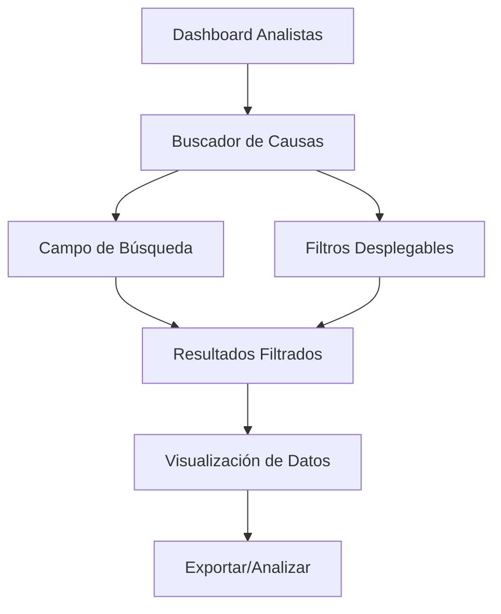

# Módulo Analistas - Documento de Requisitos del Producto

## 1. Descripción General del Producto

El módulo "Analistas" es un sistema de búsqueda y análisis de causas de cierre que permite a los usuarios filtrar y visualizar información de manera eficiente. El módulo proporciona herramientas de búsqueda avanzada con múltiples filtros para analizar datos de causas de cierre de manera organizada y responsive.

## 2. Características Principales

### 2.1 Roles de Usuario
| Rol | Método de Registro | Permisos Principales |
|-----|-------------------|---------------------|
| Analista | Asignación por administrador | Puede buscar, filtrar y visualizar datos de causas de cierre |
| Administrador | Acceso completo del sistema | Gestión completa del módulo y configuración de filtros |

### 2.2 Módulos de Funcionalidad

Nuestro módulo de analistas consta de las siguientes páginas principales:
1. **Dashboard de Analistas**: panel principal con acceso a herramientas de búsqueda y estadísticas generales.
2. **Buscador de Causas de Cierre**: interfaz principal de búsqueda con filtros avanzados y visualización de resultados.
3. **Configuración de Filtros**: página para gestionar y configurar los filtros disponibles.

### 2.3 Detalles de Páginas

| Nombre de Página | Nombre del Módulo | Descripción de Funcionalidad |
|------------------|-------------------|------------------------------|
| Dashboard de Analistas | Panel Principal | Mostrar estadísticas generales, acceso rápido al buscador, resumen de datos recientes |
| Buscador de Causas | Motor de Búsqueda | Campo de texto para búsqueda libre, tres filtros desplegables (tecnologías, agrupaciones, grupos), tabla de resultados responsive |
| Configuración | Gestión de Filtros | Administrar opciones de filtros, configurar categorías, gestionar datos maestros |

## 3. Proceso Principal

### Flujo de Usuario Analista
1. El usuario accede al dashboard del módulo analistas
2. Hace clic en el botón "Buscador de Causas de Cierre"
3. Ingresa términos de búsqueda en el campo de texto
4. Selecciona filtros específicos en los desplegables
5. Visualiza los resultados filtrados en formato de tarjetas responsive
6. Puede exportar o analizar los datos mostrados



## 4. Diseño de Interfaz de Usuario

### 4.1 Estilo de Diseño
- **Colores primarios**: Gradiente azul-púrpura (#667eea a #764ba2)
- **Colores secundarios**: Gris claro (#f8f9fa), blanco (#ffffff)
- **Estilo de botones**: Redondeados con gradiente y efectos hover
- **Tipografía**: Sans-serif, tamaños 14px-18px para contenido, 24px-32px para títulos
- **Layout**: Diseño de tarjetas con bordes redondeados, espaciado consistente
- **Iconos**: Font Awesome para consistencia visual

### 4.2 Descripción General del Diseño de Páginas

| Nombre de Página | Nombre del Módulo | Elementos de UI |
|------------------|-------------------|----------------|
| Dashboard Analistas | Panel Principal | Header con título y navegación, tarjetas de estadísticas, botón prominente "Acceder al Buscador" |
| Buscador de Causas | Interfaz de Búsqueda | Campo de búsqueda centrado, tres filtros desplegables en fila, área de resultados con tarjetas responsive, paginación |
| Configuración | Panel de Administración | Formularios para gestión de filtros, tablas de configuración, botones de acción |

### 4.3 Responsividad

El módulo está diseñado con enfoque mobile-first:
- **Desktop (>992px)**: Layout de 3 columnas para filtros, tabla completa de resultados
- **Tablet (768px-992px)**: Layout de 2 columnas, filtros apilados
- **Mobile (<768px)**: Layout de 1 columna, filtros colapsables, tarjetas de resultados optimizadas para touch

## 5. Especificaciones Técnicas

### 5.1 Estructura de Base de Datos

#### Tabla Principal: base_causas_cierre
- `id` (INT, PRIMARY KEY, AUTO_INCREMENT)
- `codigo` (VARCHAR(50), UNIQUE)
- `descripcion` (TEXT)
- `tecnologia_id` (INT, FOREIGN KEY)
- `agrupacion_id` (INT, FOREIGN KEY)
- `grupo_id` (INT, FOREIGN KEY)
- `estado` (ENUM: 'activo', 'inactivo')
- `fecha_creacion` (TIMESTAMP)
- `fecha_actualizacion` (TIMESTAMP)

#### Tablas de Filtros

**tecnologias_causas_cierre**
- `id` (INT, PRIMARY KEY)
- `nombre` (VARCHAR(100))
- `descripcion` (TEXT)
- `estado` (ENUM: 'activo', 'inactivo')

**agrupaciones_causas_cierre**
- `id` (INT, PRIMARY KEY)
- `nombre` (VARCHAR(100))
- `descripcion` (TEXT)
- `estado` (ENUM: 'activo', 'inactivo')

**todos_los_grupos_causas_cierre**
- `id` (INT, PRIMARY KEY)
- `nombre` (VARCHAR(100))
- `descripcion` (TEXT)
- `estado` (ENUM: 'activo', 'inactivo')

### 5.2 Endpoints de API

#### Búsqueda y Filtrado
```
GET /api/analistas/causas-cierre
POST /api/analistas/buscar
```

#### Gestión de Filtros
```
GET /api/analistas/tecnologias
GET /api/analistas/agrupaciones
GET /api/analistas/grupos
```

### 5.3 Componentes Frontend

- **SearchComponent**: Campo de búsqueda con autocompletado
- **FilterDropdown**: Componente reutilizable para filtros desplegables
- **ResultsGrid**: Grid responsive para mostrar resultados
- **ResultCard**: Tarjeta individual para cada resultado
- **PaginationComponent**: Navegación entre páginas de resultados

## 6. Criterios de Aceptación

1. ✅ Campo de búsqueda funcional que filtre en tiempo real
2. ✅ Tres filtros desplegables operativos con datos dinámicos
3. ✅ Diseño responsive que funcione en móviles, tablets y desktop
4. ✅ Visualización clara de resultados en formato de tarjetas
5. ✅ Botón de acceso prominente desde el dashboard
6. ✅ Mantenimiento de relaciones de datos originales
7. ✅ Tiempo de respuesta menor a 2 segundos para búsquedas
8. ✅ Compatibilidad con navegadores modernos (Chrome, Firefox, Safari, Edge)