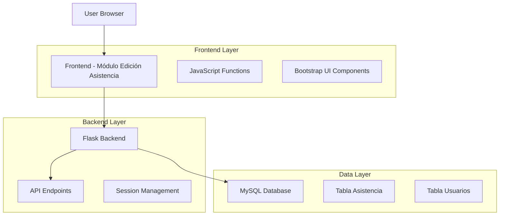
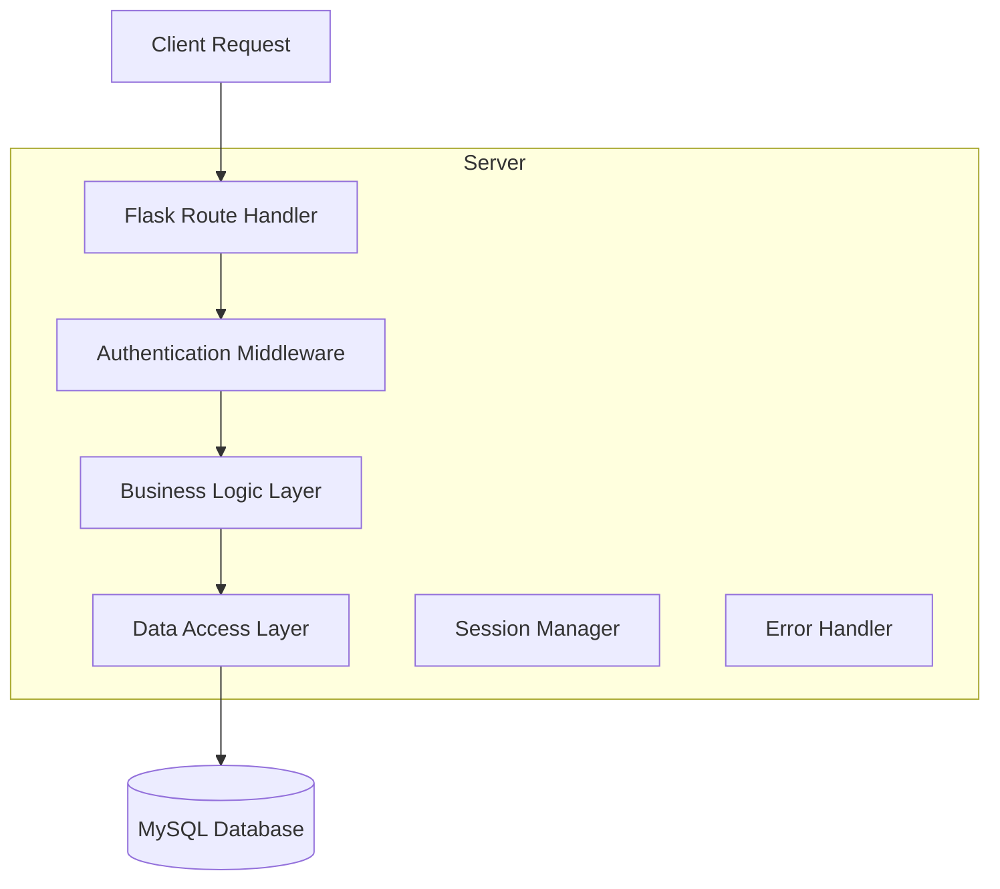
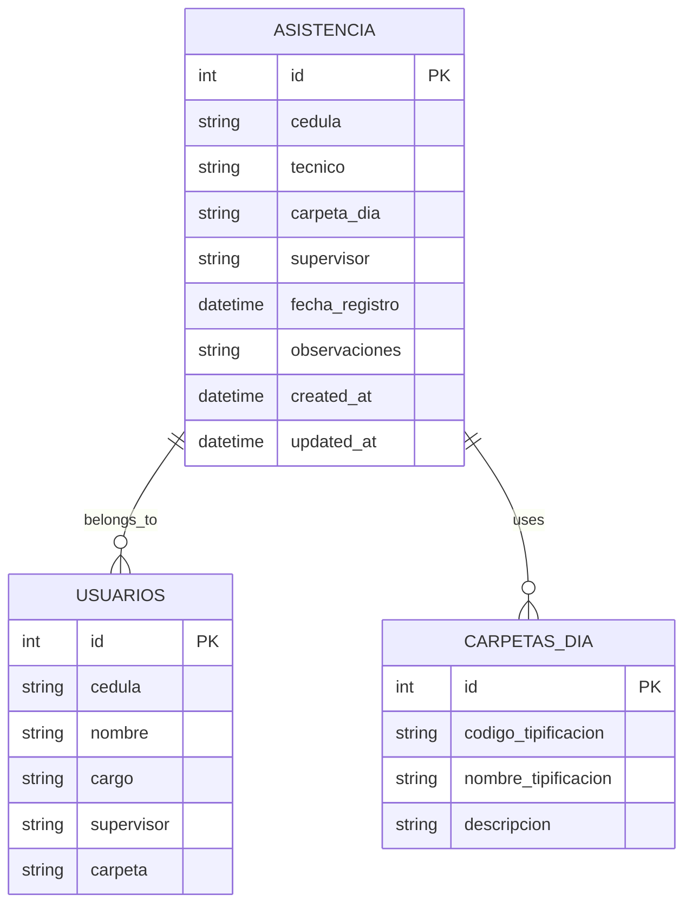

## 1.Architecture design



## 2.Technology Description

* Frontend: HTML5 + Bootstrap 5 + JavaScript ES6 + jQuery

* Backend: Flask (Python) + MySQL

* Autenticación: Flask-Session

## 3.Route definitions

| Route                      | Purpose                                                  |
| -------------------------- | -------------------------------------------------------- |
| /administrativo/asistencia | Página principal del módulo de edición de asistencia     |
| /api/asistencia/consultar  | Consultar registros de asistencia por supervisor y fecha |
| /api/asistencia/actualizar | Actualizar registros de asistencia existentes            |
| /api/asistencia/eliminar   | Eliminar registros de asistencia específicos             |
| /api/supervisores          | Obtener lista de supervisores disponibles                |

## 4.API definitions

### 4.1 Core API

Consultar asistencias por supervisor y fecha

```
GET /api/asistencia/consultar
```

Request:

| Param Name | Param Type | isRequired | Description                 |
| ---------- | ---------- | ---------- | --------------------------- |
| supervisor | string     | true       | Nombre del supervisor       |
| fecha      | string     | true       | Fecha en formato YYYY-MM-DD |

Response:

| Param Name  | Param Type | Description                      |
| ----------- | ---------- | -------------------------------- |
| success     | boolean    | Estado de la operación           |
| asistencias | array      | Lista de registros de asistencia |
| message     | string     | Mensaje de respuesta             |

Example

```json
{
  "success": true,
  "asistencias": [
    {
      "id": 1,
      "cedula": "12345678",
      "tecnico": "Juan Pérez",
      "carpeta_dia": "FTTH_001",
      "supervisor": "Carlos López",
      "fecha_registro": "2024-01-15 08:30:00"
    }
  ],
  "message": "Registros encontrados"
}
```

Actualizar registro de asistencia

```
PUT /api/asistencia/actualizar
```

Request:

| Param Name    | Param Type | isRequired | Description                  |
| ------------- | ---------- | ---------- | ---------------------------- |
| id            | integer    | true       | ID del registro a actualizar |
| carpeta\_dia  | string     | false      | Nueva carpeta día            |
| supervisor    | string     | false      | Nuevo supervisor             |
| observaciones | string     | false      | Observaciones adicionales    |

Response:

| Param Name | Param Type | Description             |
| ---------- | ---------- | ----------------------- |
| success    | boolean    | Estado de la operación  |
| message    | string     | Mensaje de confirmación |

Eliminar registro de asistencia

```
DELETE /api/asistencia/eliminar
```

Request:

| Param Name | Param Type | isRequired | Description                |
| ---------- | ---------- | ---------- | -------------------------- |
| id         | integer    | true       | ID del registro a eliminar |

Response:

| Param Name | Param Type | Description             |
| ---------- | ---------- | ----------------------- |
| success    | boolean    | Estado de la operación  |
| message    | string     | Mensaje de confirmación |

## 5.Server architecture diagram



## 6.Data model

### 6.1 Data model definition



### 6.2 Data Definition Language

Tabla de Asistencia (asistencia)

```sql
-- Verificar si la tabla existe
SELECT COUNT(*) FROM information_schema.tables 
WHERE table_schema = DATABASE() AND table_name = 'asistencia';

-- Agregar campos para edición si no existen
ALTER TABLE asistencia 
ADD COLUMN IF NOT EXISTS observaciones TEXT,
ADD COLUMN IF NOT EXISTS updated_at TIMESTAMP DEFAULT CURRENT_TIMESTAMP ON UPDATE CURRENT_TIMESTAMP;

-- Crear índices para optimizar consultas
CREATE INDEX IF NOT EXISTS idx_asistencia_supervisor_fecha 
ON asistencia(super, DATE(fecha_registro_bogota));

CREATE INDEX IF NOT EXISTS idx_asistencia_cedula 
ON asistencia(cedula);

CREATE INDEX IF NOT EXISTS idx_asistencia_fecha 
ON asistencia(DATE(fecha_registro_bogota));
```

Permisos y configuración

```sql
-- Asegurar permisos para operaciones CRUD
GRANT SELECT, INSERT, UPDATE, DELETE ON asistencia TO 'app_user'@'localhost';
GRANT SELECT ON usuarios TO 'app_user'@'localhost';
GRANT SELECT ON carpetas_dia TO 'app_user'@'localhost';
```

