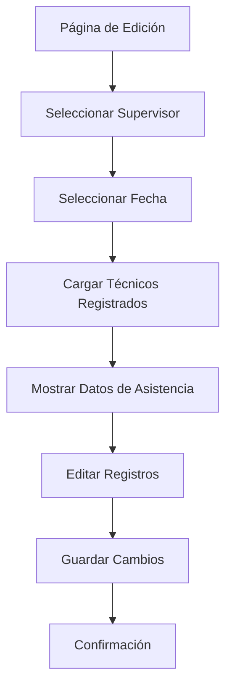

## 1. Product Overview
Módulo de edición de asistencia que permite a los supervisores modificar y gestionar los registros de asistencia de técnicos para fechas específicas.
- Soluciona la necesidad de corregir errores en registros de asistencia ya guardados y permite ajustes posteriores en la gestión de personal técnico.
- Dirigido a supervisores y administradores que necesitan flexibilidad para modificar datos de asistencia según cambios operativos.

## 2. Core Features

### 2.1 User Roles
| Role | Registration Method | Core Permissions |
|------|---------------------|------------------|
| Supervisor | Acceso con credenciales existentes | Puede editar asistencias de sus técnicos asignados |
| Administrador | Acceso con credenciales existentes | Puede editar asistencias de todos los supervisores y técnicos |

### 2.2 Feature Module
Nuestro módulo de edición de asistencia consta de las siguientes páginas principales:
1. **Página de Edición de Asistencia**: selector de supervisor, selector de fecha, tabla de técnicos registrados, formularios de edición.

### 2.3 Page Details
| Page Name | Module Name | Feature description |
|-----------|-------------|---------------------|
| Página de Edición de Asistencia | Selector de Supervisor | Dropdown que permite seleccionar un supervisor específico para filtrar técnicos |
| Página de Edición de Asistencia | Selector de Fecha | Campo de fecha que permite elegir el día específico para consultar registros |
| Página de Edición de Asistencia | Tabla de Técnicos Registrados | Muestra lista de técnicos que registraron asistencia en la fecha seleccionada |
| Página de Edición de Asistencia | Visualización de Carpeta Día | Muestra la carpeta de asistencia correspondiente a cada técnico en la fecha |
| Página de Edición de Asistencia | Formularios de Edición | Permite modificar carpeta día, supervisor asignado y otros datos de asistencia |
| Página de Edición de Asistencia | Botones de Acción | Guardar cambios, cancelar edición, eliminar registro |

## 3. Core Process
**Flujo Principal de Edición:**
1. El usuario selecciona un supervisor del dropdown
2. Elige una fecha específica usando el selector de fecha
3. El sistema carga y muestra los técnicos que registraron asistencia ese día
4. Se visualizan las carpetas día asignadas a cada técnico
5. El usuario puede editar los campos modificables (carpeta día, supervisor, etc.)
6. Confirma los cambios y el sistema actualiza los registros

## 4. User Interface Design
### 4.1 Design Style
- Colores primarios: Azul (#007bff) y verde (#28a745) para acciones principales
- Colores secundarios: Gris (#6c757d) para elementos neutros
- Botones con estilo Bootstrap redondeado y efectos hover
- Fuente: Sistema por defecto (Arial, sans-serif) con tamaños 14px para texto normal, 16px para títulos
- Layout basado en cards de Bootstrap con navegación superior
- Iconos Font Awesome para acciones (editar, guardar, cancelar)

### 4.2 Page Design Overview
| Page Name | Module Name | UI Elements |
|-----------|-------------|-------------|
| Página de Edición de Asistencia | Selector de Supervisor | Dropdown estilo Bootstrap con búsqueda, color azul primario |
| Página de Edición de Asistencia | Selector de Fecha | Input tipo date con calendario desplegable, bordes redondeados |
| Página de Edición de Asistencia | Tabla de Técnicos | Tabla responsive con filas alternadas, headers con fondo gris claro |
| Página de Edición de Asistencia | Formularios de Edición | Inputs inline editables con validación visual, bordes azules al focus |
| Página de Edición de Asistencia | Botones de Acción | Botones Bootstrap: verde para guardar, gris para cancelar, rojo para eliminar |

### 4.3 Responsiveness
Diseño desktop-first con adaptación móvil. La tabla se convierte en cards apiladas en pantallas menores a 768px. Optimizado para interacción táctil con botones de tamaño mínimo 44px.