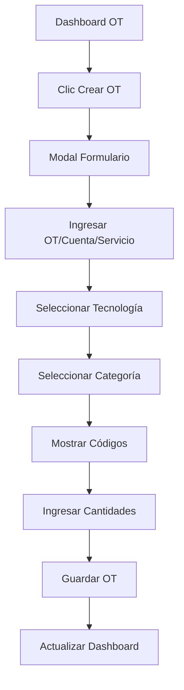

## 1. Product Overview
Sistema de gestión de órdenes de trabajo para técnicos que permite crear, visualizar y administrar OT de manera eficiente. Los técnicos pueden registrar nuevas órdenes con códigos de facturación, cantidades y validaciones específicas.

## 2. Core Features

### 2.1 User Roles
| Role | Registration Method | Core Permissions |
|------|---------------------|------------------|
| Técnico | Sistema asignado por administrador | Crear OT, ver sus propias OT, gestionar cantidades |
| Administrador | Sistema asignado | Ver todas las OT, gestionar permisos, reportes |

### 2.2 Feature Module
El módulo de órdenes de trabajo consta de las siguientes páginas principales:

1. **Dashboard de órdenes**: tabla de órdenes existentes, filtros, botón de creación.
2. **Formulario de creación**: modal con formulario paso a paso para nueva OT.
3. **Detalle de orden**: vista completa de una OT específica.

### 2.3 Page Details
| Page Name | Module Name | Feature description |
|-----------|-------------|---------------------|
| Dashboard OT | Tabla de órdenes | Mostrar lista de órdenes con OT, cuenta, servicio, código, nombre, valor total y botones de acciones |
| Dashboard OT | Filtros y búsqueda | Permitir filtrar por fecha, estado, tecnología, categoría |
| Dashboard OT | Paginación | Navegación entre páginas de resultados |
| Dashboard OT | Botón crear OT | Abrir modal de creación de nueva orden |
| Modal crear OT | Formulario principal | Campos: OT (7 dígitos), cuenta (8 dígitos), servicio (7 dígitos) |
| Modal crear OT | Filtros en cascada | Tecnología → Categoría → Códigos disponibles |
| Modal crear OT | Tabla de códigos | Mostrar códigos filtrados con columna cantidad editable |
| Modal crear OT | Validaciones | Validar longitud numérica exacta de campos |
| Modal crear OT | Guardar OT | Procesar formulario y guardar en base de datos |

## 3. Core Process

### Flujo de creación de OT:
1. Técnico accede al dashboard de órdenes
2. Clic en "Crear nueva OT"
3. Ingresa OT (7 dígitos), cuenta (8 dígitos), servicio (7 dígitos)
4. Selecciona tecnología (lista desplegable)
5. Selecciona categoría (filtrada por tecnología)
6. Sistema muestra códigos disponibles
7. Técnico ingresa cantidades por código
8. Guarda la orden completa

## 4. User Interface Design

### 4.1 Design Style
- **Colores primarios**: Azul profesional (#2563eb) para encabezados y botones principales
- **Colores secundarios**: Gris claro (#f8fafc) para fondos y bordes
- **Botones**: Estilo redondeado con sombra sutil
- **Fuentes**: Inter para títulos, Roboto para contenido
- **Layout**: Card-based con sombras y bordes redondeados
- **Iconos**: Heroicons para consistencia

### 4.2 Page Design Overview
| Page Name | Module Name | UI Elements |
|-----------|-------------|-------------|
| Dashboard OT | Tabla principal | Tabla responsive con filas alternadas, bordes suaves, hover effects |
| Dashboard OT | Botones acción | Iconos de vista (ojo), colores consistentes |
| Dashboard OT | Filtros | Dropdowns modernos con búsqueda integrada |
| Modal crear OT | Formulario | Inputs con validación visual, labels claros |
| Modal crear OT | Tabla códigos | Tabla compacta con inputs numéricos para cantidades |
| Modal crear OT | Botones acción | Botón primario para guardar, secundario para cancelar |

### 4.3 Responsiveness
- Diseño mobile-first con breakpoints en 640px, 768px, 1024px
- Tabla horizontal scroll en móviles
- Modal adaptativo con altura máxima y scroll interno
- Touch-friendly con áreas de clic ampliadas