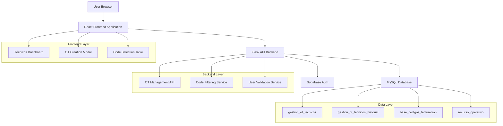
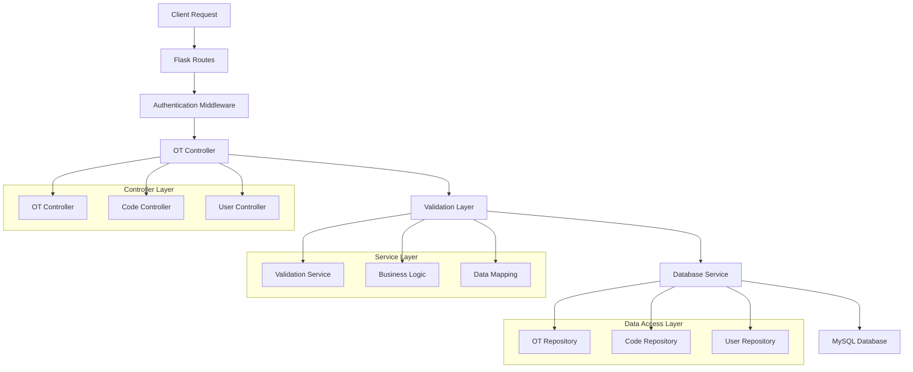
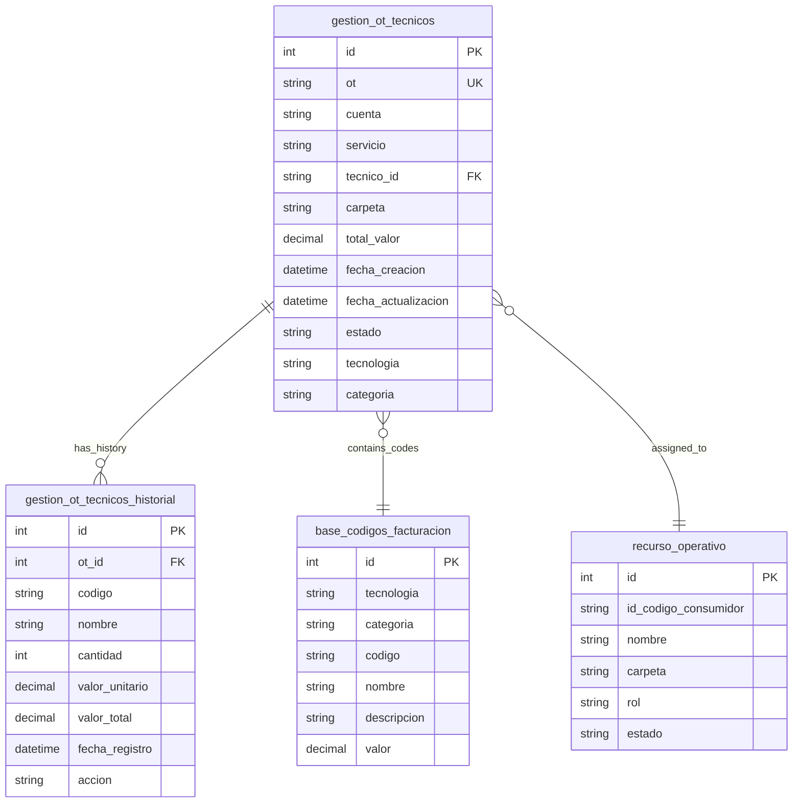

## 1. Architecture design



## 2. Technology Description

- **Frontend**: HTML5 + CSS3 + JavaScript ES6 + Bootstrap 5
- **Backend**: Flask 2.3 + Python 3.9
- **Database**: MySQL 8.0
- **Authentication**: Flask-Login + Session Management
- **Initialization Tool**: Flask development server

## 3. Route definitions

| Route | Purpose |
|-------|---------|
| /tecnicos/ordenes-trabajo | Dashboard principal de órdenes de trabajo |
| /api/tecnicos/ordenes | CRUD API para órdenes de trabajo |
| /api/tecnicos/ordenes/<id> | Detalle de orden específica |
| /api/tecnicos/tecnologias | Obtener lista de tecnologías |
| /api/tecnicos/categorias/<tecnologia> | Obtener categorías por tecnología |
| /api/tecnicos/codigos/<tecnologia>/<categoria> | Obtener códigos filtrados |
| /api/tecnicos/user-info | Obtener info del técnico logueado |

## 4. API definitions

### 4.1 Core API Endpoints

#### GET /api/tecnicos/ordenes
**Purpose**: Obtener lista de órdenes del técnico

**Request Parameters**:
| Param Name | Param Type | isRequired | Description |
|------------|------------|------------|-------------|
| page | integer | false | Número de página (default: 1) |
| limit | integer | false | Items por página (default: 20) |
| search | string | false | Búsqueda por OT o cuenta |
| tecnologia | string | false | Filtrar por tecnología |
| categoria | string | false | Filtrar por categoría |

**Response**:
```json
{
  "ordenes": [
    {
      "id": 1,
      "ot": "1234567",
      "cuenta": "12345678",
      "servicio": "1234567",
      "tecnico_id": "TEC001",
      "carpeta": "CARP123",
      "total_valor": 150000,
      "fecha_creacion": "2024-01-15T10:30:00",
      "estado": "activa"
    }
  ],
  "total": 50,
  "page": 1,
  "pages": 3
}
```

#### POST /api/tecnicos/ordenes
**Purpose**: Crear nueva orden de trabajo

**Request Body**:
```json
{
  "ot": "1234567",
  "cuenta": "12345678", 
  "servicio": "1234567",
  "codigos": [
    {
      "codigo": "COD001",
      "nombre": "Instalación básica",
      "cantidad": 2,
      "valor": 50000
    }
  ]
}
```

**Response**:
```json
{
  "success": true,
  "message": "Orden creada exitosamente",
  "orden_id": 123
}
```

#### GET /api/tecnicos/tecnologias
**Purpose**: Obtener tecnologías disponibles

**Response**:
```json
[
  "GPON", "HFC", "FTTH", "ADSL", "WIRELESS"
]
```

#### GET /api/tecnicos/categorias/<tecnologia>
**Purpose**: Obtener categorías por tecnología

**Response**:
```json
[
  "INSTALACION", "REPARACION", "MANTENIMIENTO", "RETIRO"
]
```

#### GET /api/tecnicos/codigos/<tecnologia>/<categoria>
**Purpose**: Obtener códigos filtrados

**Response**:
```json
[
  {
    "codigo": "COD001",
    "nombre": "Instalación básica GPON",
    "descripcion": "Instalación de equipo y configuración básica",
    "valor": 50000
  }
]
```

## 5. Server architecture diagram



## 6. Data model

### 6.1 Database Schema



### 6.2 Data Definition Language

#### Tabla gestion_ot_tecnicos
```sql
CREATE TABLE gestion_ot_tecnicos (
    id INT PRIMARY KEY AUTO_INCREMENT,
    ot VARCHAR(7) NOT NULL UNIQUE,
    cuenta VARCHAR(8) NOT NULL,
    servicio VARCHAR(7) NOT NULL,
    tecnico_id VARCHAR(50) NOT NULL,
    carpeta VARCHAR(50) NOT NULL,
    total_valor DECIMAL(10,2) DEFAULT 0,
    fecha_creacion TIMESTAMP DEFAULT CURRENT_TIMESTAMP,
    fecha_actualizacion TIMESTAMP DEFAULT CURRENT_TIMESTAMP ON UPDATE CURRENT_TIMESTAMP,
    estado ENUM('activa', 'completada', 'cancelada') DEFAULT 'activa',
    tecnologia VARCHAR(50) NOT NULL,
    categoria VARCHAR(50) NOT NULL,
    INDEX idx_tecnico_id (tecnico_id),
    INDEX idx_ot (ot),
    INDEX idx_fecha_creacion (fecha_creacion)
);
```

#### Tabla gestion_ot_tecnicos_historial
```sql
CREATE TABLE gestion_ot_tecnicos_historial (
    id INT PRIMARY KEY AUTO_INCREMENT,
    ot_id INT NOT NULL,
    codigo VARCHAR(20) NOT NULL,
    nombre VARCHAR(255) NOT NULL,
    cantidad INT NOT NULL DEFAULT 1,
    valor_unitario DECIMAL(10,2) NOT NULL,
    valor_total DECIMAL(10,2) NOT NULL,
    fecha_registro TIMESTAMP DEFAULT CURRENT_TIMESTAMP,
    accion ENUM('creacion', 'modificacion', 'eliminacion') DEFAULT 'creacion',
    FOREIGN KEY (ot_id) REFERENCES gestion_ot_tecnicos(id) ON DELETE CASCADE,
    INDEX idx_ot_id (ot_id),
    INDEX idx_codigo (codigo)
);
```

## 7. Validation Rules

### Campos numéricos
- **OT**: Exactamente 7 dígitos numéricos
- **Cuenta**: Exactamente 8 dígitos numéricos  
- **Servicio**: Exactamente 7 dígitos numéricos
- **Cantidad**: Entero positivo mayor a 0

### Filtros en cascada
1. Tecnología seleccionada → Categorías disponibles
2. Categoría seleccionada → Códigos disponibles
3. Cada código tiene cantidad editable

### Cálculos
- Valor total por código: cantidad × valor_unitario
- Valor total OT: suma de todos los valores totales de códigos