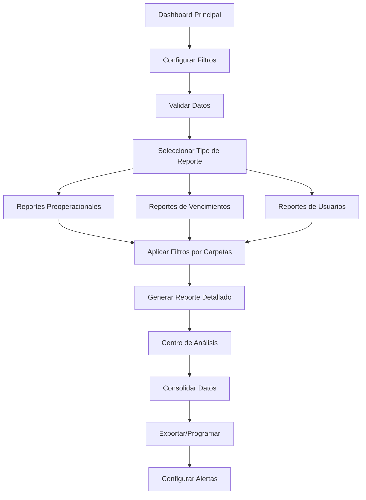

# Documento de Requerimientos del Producto - Optimización del Módulo de Reportes

## 1. Resumen del Producto

Optimización integral del módulo de reportes del sistema Synapsis para mejorar la generación de informes detallados, consolidación de datos, funcionalidad de filtros, consistencia de datos y experiencia de usuario. El sistema actual maneja datos preoperacionales de vehículos, usuarios y vencimientos de documentos, requiriendo mejoras en precisión, organización y navegabilidad.

El objetivo es transformar el módulo de reportes en una herramienta robusta que permita a los administradores tomar decisiones informadas basadas en datos precisos y bien organizados, mejorando la eficiencia operativa del sistema de gestión vehicular.

## 2. Funcionalidades Principales

### 2.1 Roles de Usuario

| Rol | Método de Registro | Permisos Principales |
|-----|-------------------|---------------------|
| Administrador | Acceso directo al sistema | Acceso completo a todos los reportes, filtros avanzados, exportación de datos |
| Supervisor | Asignación por administrador | Visualización de reportes de su área, filtros limitados a su centro de trabajo |

### 2.2 Módulos de Funcionalidad

Nuestro sistema de reportes optimizado consistirá en las siguientes páginas principales:

1. **Dashboard Principal de Reportes**: panel de control centralizado, filtros globales, resumen ejecutivo de métricas clave
2. **Reportes Detallados**: informes granulares por categoría, exportación en múltiples formatos, análisis comparativo
3. **Gestión de Filtros**: configuración avanzada de filtros, filtros por carpetas/categorías, validación de consistencia de datos
4. **Centro de Análisis**: consolidación de resultados similares, tendencias y patrones, alertas automáticas
5. **Configuración de Reportes**: personalización de vistas, programación de reportes automáticos, gestión de permisos

### 2.3 Detalles de Páginas

| Página | Módulo | Descripción de Funcionalidad |
|--------|--------|------------------------------|
| Dashboard Principal | Panel de Control | Mostrar métricas clave en tiempo real, filtros globales por fecha/supervisor/centro de trabajo, navegación intuitiva a reportes específicos |
| Dashboard Principal | Resumen Ejecutivo | Consolidar estadísticas generales, mostrar alertas de vencimientos próximos, indicadores de rendimiento por área |
| Reportes Detallados | Reportes Preoperacionales | Generar informes detallados de inspecciones vehiculares, análisis de cumplimiento por supervisor, estado de vehículos con drill-down |
| Reportes Detallados | Reportes de Vencimientos | Listar documentos próximos a vencer, agrupar por tipo de documento, alertas automáticas por email |
| Reportes Detallados | Reportes de Usuarios | Estadísticas de actividad por usuario, registros mensuales, análisis de roles y permisos |
| Gestión de Filtros | Filtros Avanzados | Implementar filtros por carpetas/categorías, validación de datos contra base de datos, filtros combinados y guardados |
| Gestión de Filtros | Validación de Datos | Verificar consistencia de supervisores, centros de trabajo y fechas, sincronización automática con base de datos |
| Centro de Análisis | Consolidación de Datos | Unificar resultados similares, eliminar duplicados, crear vistas consolidadas por período |
| Centro de Análisis | Análisis de Tendencias | Mostrar patrones temporales, comparativas período a período, predicciones basadas en datos históricos |
| Configuración | Personalización | Permitir configuración de vistas por usuario, guardar filtros favoritos, configurar alertas personalizadas |
| Configuración | Exportación | Exportar reportes en PDF/Excel/CSV, programar envíos automáticos, configurar formatos de salida |

## 3. Proceso Principal

**Flujo del Administrador:**
1. Acceder al dashboard principal de reportes
2. Configurar filtros globales (fecha, supervisor, centro de trabajo)
3. Validar consistencia de datos automáticamente
4. Seleccionar tipo de reporte específico
5. Aplicar filtros adicionales por carpetas/categorías
6. Generar reporte detallado con datos consolidados
7. Exportar o programar envío automático
8. Configurar alertas para futuros reportes

**Flujo del Supervisor:**
1. Acceder a reportes limitados a su área
2. Aplicar filtros disponibles para su centro de trabajo
3. Visualizar reportes de su equipo
4. Exportar datos en formatos básicos

## 4. Diseño de Interfaz de Usuario

### 4.1 Estilo de Diseño

- **Colores Primarios**: #2dce89 (verde éxito), #fb6340 (naranja advertencia), #f5365c (rojo crítico)
- **Colores Secundarios**: #11cdef (azul información), #8965e0 (púrpura)
- **Estilo de Botones**: Redondeados con sombras sutiles, efectos hover suaves
- **Tipografía**: Roboto 14px para texto general, 16px para títulos de sección, 24px para títulos principales
- **Estilo de Layout**: Diseño basado en tarjetas con navegación superior fija, sidebar colapsible para filtros
- **Iconos**: Font Awesome 5.x con estilo sólido, colores que coincidan con la paleta principal

### 4.2 Resumen de Diseño de Páginas

| Página | Módulo | Elementos de UI |
|--------|--------|----------------|
| Dashboard Principal | Panel de Control | Layout de 4 columnas con tarjetas de métricas, colores de estado (verde/amarillo/rojo), gráficos Chart.js responsivos |
| Dashboard Principal | Filtros Globales | Barra superior fija con selectores desplegables, botones de acción primarios azules, validación en tiempo real |
| Reportes Detallados | Tablas de Datos | Tablas responsivas con paginación, ordenamiento por columnas, filtros inline, botones de exportación |
| Reportes Detallados | Gráficos | Charts.js con paleta de colores consistente, tooltips informativos, leyendas posicionadas abajo |
| Gestión de Filtros | Sidebar de Filtros | Panel lateral colapsible, acordeones para categorías, checkboxes y selectores múltiples |
| Centro de Análisis | Vistas Consolidadas | Layout de mosaico con tarjetas de análisis, indicadores de tendencia con flechas, alertas destacadas |

### 4.3 Responsividad

El sistema será diseñado con enfoque desktop-first pero completamente adaptativo para tablets y móviles. Se implementará optimización táctil para dispositivos móviles con botones de tamaño adecuado (mínimo 44px) y navegación por gestos. Los gráficos se adaptarán automáticamente al tamaño de pantalla manteniendo la legibilidad.