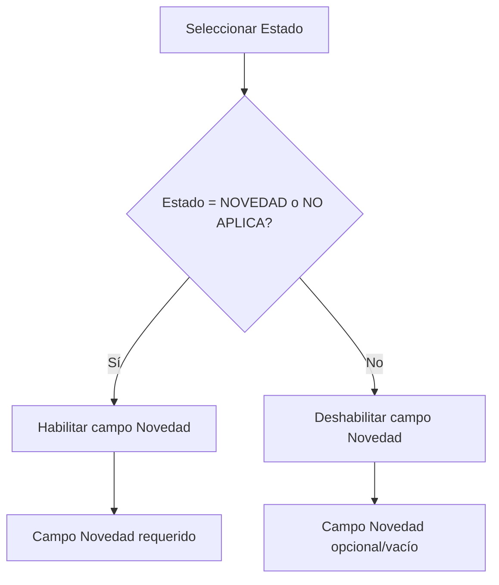

# Requerimientos - Actualización Tabla de Asistencia

## 1. Resumen del Proyecto

Actualización de la tabla de asistencia en la página de inicio de operación de técnicos para incluir nuevos campos que permitan un mejor control y seguimiento del estado operacional de cada técnico durante el inicio de jornada.

**Objetivo:** Mejorar el control operacional agregando campos para hora de inicio, estado de cumplimiento y registro de novedades en la tabla de asistencia.

**Página afectada:** `/analistas/inicio-operacion-tecnicos` (template: `inicio_operacion_tecnicos.html`)

## 2. Funcionalidades Principales

### 2.1 Nuevas Columnas en Base de Datos

Se requiere agregar 3 nuevas columnas a la tabla `asistencia`:

| Campo | Tipo | Descripción | Restricciones |
|-------|------|-------------|---------------|
| `hora_inicio` | TIME | Hora de inicio de operación del técnico | Formato HH:MM:SS, opcional |
| `estado` | ENUM | Estado de cumplimiento del técnico | Valores: 'CUMPLE', 'NO CUMPLE', 'NOVEDAD', 'NO APLICA' |
| `novedad` | TEXT | Descripción detallada de la novedad | Solo requerido cuando estado = 'NOVEDAD' o 'NO APLICA' |

### 2.2 Funcionalidades de Interfaz

#### 2.2.1 Campo Hora de Inicio
- **Tipo:** Input time picker
- **Comportamiento:** Permite seleccionar hora y minutos
- **Validación:** Formato HH:MM
- **Valor por defecto:** Hora actual del sistema

#### 2.2.2 Campo Estado
- **Tipo:** Dropdown/Select
- **Opciones disponibles:**
  - CUMPLE
  - NO CUMPLE  
  - NOVEDAD
  - NO APLICA
- **Comportamiento:** Al seleccionar "NOVEDAD" o "NO APLICA", se habilita automáticamente el campo "novedad"

#### 2.2.3 Campo Novedad
- **Tipo:** Textarea
- **Comportamiento:** 
  - Se habilita solo cuando estado = "NOVEDAD" o "NO APLICA"
  - Se deshabilita y limpia cuando estado = "CUMPLE" o "NO CUMPLE"
- **Validación:** Requerido cuando está habilitado
- **Placeholder:** "Describa la novedad o situación especial..."

## 3. Flujo de Operación

### 3.1 Flujo Principal
1. El analista accede a la página de inicio de operación
2. Visualiza la tabla de técnicos asignados con las nuevas columnas
3. Para cada técnico puede:
   - Registrar hora de inicio de operación
   - Seleccionar estado de cumplimiento
   - Si aplica, registrar novedad detallada
4. Guarda los cambios en la base de datos

### 3.2 Flujo Condicional - Campo Novedad


## 4. Especificaciones Técnicas

### 4.1 Modificaciones de Base de Datos

```sql
-- Agregar nuevas columnas a la tabla asistencia
ALTER TABLE asistencia 
ADD COLUMN hora_inicio TIME NULL COMMENT 'Hora de inicio de operación',
ADD COLUMN estado ENUM('CUMPLE', 'NO CUMPLE', 'NOVEDAD', 'NO APLICA') NULL COMMENT 'Estado de cumplimiento',
ADD COLUMN novedad TEXT NULL COMMENT 'Descripción de novedad cuando aplica';
```

### 4.2 Modificaciones de Frontend

#### 4.2.1 Estructura HTML Actualizada
- Agregar 3 nuevas columnas a la tabla existente
- Implementar controles de formulario para cada campo
- Agregar validaciones JavaScript

#### 4.2.2 JavaScript Requerido
- Función para habilitar/deshabilitar campo novedad
- Validación de campos requeridos
- Actualización de datos vía AJAX
- Manejo de eventos onChange para el dropdown de estado

### 4.3 Modificaciones de Backend

#### 4.3.1 Endpoints a Actualizar
- **GET** `/api/analistas/tecnicos-asignados`: Incluir nuevos campos en respuesta
- **POST** `/api/asistencia/actualizar`: Manejar nuevos campos en actualización

#### 4.3.2 Validaciones de Servidor
- Validar formato de hora_inicio
- Validar valores permitidos para estado
- Validar que novedad sea requerida cuando estado = 'NOVEDAD' o 'NO APLICA'

## 5. Diseño de Interfaz

### 5.1 Layout de Tabla Actualizada

| Cédula | Técnico | Carpeta | Supervisor | Hora Inicio | Estado | Novedad | Presupuesto |
|--------|---------|---------|------------|-------------|--------|---------|-------------|
| Input readonly | Input readonly | Input readonly | Input readonly | **Time picker** | **Dropdown** | **Textarea** | Input readonly |

### 5.2 Estilos y Comportamiento
- **Hora Inicio:** Input time con icono de reloj
- **Estado:** Dropdown con colores según estado:
  - CUMPLE: Verde
  - NO CUMPLE: Rojo  
  - NOVEDAD: Amarillo
  - NO APLICA: Gris
- **Novedad:** Textarea que se expande/contrae según estado

## 6. Validaciones y Reglas de Negocio

### 6.1 Validaciones de Frontend
- Hora inicio debe ser formato válido HH:MM
- Estado debe ser uno de los valores permitidos
- Novedad es requerida cuando estado = 'NOVEDAD' o 'NO APLICA'
- Novedad debe tener mínimo 10 caracteres cuando es requerida

### 6.2 Validaciones de Backend
- Verificar integridad de datos antes de guardar
- Validar que el técnico existe y está asignado al analista
- Registrar timestamp de última modificación

## 7. Casos de Uso

### 7.1 Caso de Uso Principal
**Actor:** Analista
**Objetivo:** Registrar información de inicio de operación para técnicos

**Flujo:**
1. Analista accede a página de inicio de operación
2. Visualiza lista de técnicos asignados
3. Para cada técnico registra:
   - Hora de inicio (opcional)
   - Estado de cumplimiento (requerido)
   - Novedad si aplica (condicional)
4. Guarda cambios
5. Sistema confirma actualización exitosa

### 7.2 Caso de Uso - Registro de Novedad
**Precondición:** Estado seleccionado = 'NOVEDAD' o 'NO APLICA'

**Flujo:**
1. Analista selecciona estado 'NOVEDAD' o 'NO APLICA'
2. Sistema habilita automáticamente campo novedad
3. Analista ingresa descripción detallada
4. Sistema valida que novedad no esté vacía
5. Guarda información completa

## 8. Criterios de Aceptación

### 8.1 Funcionalidad
- ✅ Las 3 nuevas columnas se muestran en la tabla
- ✅ Campo hora_inicio permite selección de hora
- ✅ Dropdown estado muestra las 4 opciones correctas
- ✅ Campo novedad se habilita/deshabilita según estado
- ✅ Datos se guardan correctamente en base de datos

### 8.2 Usabilidad
- ✅ Interfaz es intuitiva y fácil de usar
- ✅ Validaciones muestran mensajes claros
- ✅ Campos se comportan según especificaciones
- ✅ Responsive design mantiene funcionalidad

### 8.3 Rendimiento
- ✅ Carga de página no se ve afectada significativamente
- ✅ Actualización de datos es rápida (< 2 segundos)
- ✅ No hay conflictos con funcionalidad existente

## 9. Consideraciones de Implementación

### 9.1 Compatibilidad
- Mantener compatibilidad con funcionalidad existente
- No afectar otros módulos del sistema
- Preservar datos históricos de asistencia

### 9.2 Seguridad
- Validar permisos de usuario antes de permitir modificaciones
- Sanitizar inputs para prevenir inyección SQL/XSS
- Registrar auditoría de cambios

### 9.3 Mantenibilidad
- Código limpio y bien documentado
- Separación clara entre lógica de presentación y negocio
- Facilitar futuras extensiones de funcionalidad