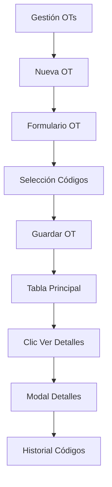

## 1. Product Overview

Rediseño del módulo de órdenes de trabajo para mejorar la visualización y gestión de OTs. El sistema pasará de mostrar múltiples filas por OT a mostrar una única fila por OT en la tabla principal, con detalles desplegables para ver todos los códigos asociados.

- Problema a resolver: Visualización confusa con múltiples filas duplicadas por OT
- Usuarios: Técnicos y personal administrativo que gestionan órdenes de trabajo
- Solución: Estructura más clara con OT única y detalles expandibles

## 2. Core Features

### 2.1 User Roles

| Role | Registration Method | Core Permissions |
|------|---------------------|------------------|
| Técnico | Sistema interno | Crear, ver y editar órdenes de trabajo asignadas |
| Administrativo | Sistema interno | Ver todas las OTs, generar reportes |
| Supervisor | Sistema interno | Aprobar, rechazar y auditar órdenes de trabajo |

### 2.2 Feature Module

Nuestro sistema de órdenes de trabajo consiste en las siguientes páginas principales:

1. **Gestión de OTs**: Tabla principal con OT únicas, botón de ver detalles, filtros por tecnología y categoría
2. **Nueva OT**: Formulario para crear nueva orden con códigos de trabajo
3. **Detalles de OT**: Modal expandible mostrando todos los códigos asociados a una OT
4. **Historial OT**: Registro individual de cada código guardado con ID único

### 2.3 Page Details

| Page Name | Module Name | Feature description |
|-----------|-------------|---------------------|
| Gestión de OTs | Tabla principal | Mostrar una única fila por OT agrupando por número de OT, mostrar total acumulado de valores |
| Gestión de OTs | Botón Ver Detalles | Expandir fila o abrir modal para mostrar todos los códigos asociados a la OT seleccionada |
| Gestión de OTs | Filtros superiores | Filtrar por tecnología (GPON, HFC, FTTH) y categoría (INSTALACION, REPARACION) |
| Nueva OT | Formulario principal | Ingresar OT, cuenta, servicio, técnico, tecnología y categoría |
| Nueva OT | Selección de códigos | Buscar y agregar múltiples códigos de trabajo con cantidades |
| Nueva OT | Cálculo total | Mostrar sumatoria automática del valor total de todos los códigos seleccionados |
| Detalles OT | Modal/Expandible | Listar todos los códigos con nombre, cantidad, valor unitario y total por línea |
| Historial OT | Registro individual | Guardar cada código en fila separada con ID autoincremental único |

## 3. Core Process

### Flujo de Creación de OT
1. Usuario accede a "Nueva OT"
2. Completa datos principales (OT, cuenta, servicio, técnico)
3. Selecciona tecnología y categoría
4. Sistema carga códigos disponibles
5. Usuario selecciona códigos y define cantidades
6. Sistema calcula total automáticamente
7. Usuario guarda OT
8. Sistema crea: 1 registro en tabla principal + N registros en historial (uno por código)

### Flujo de Visualización
1. Usuario accede a "Gestión de OTs"
2. Ve tabla con OT únicas y totales acumulados
3. Puede filtrar por tecnología/categoría
4. Clic en "Ver Detalles" expande la fila o abre modal
5. Sistema carga y muestra todos los códigos de esa OT
6. Usuario puede ver cantidades y valores individuales

## 4. User Interface Design

### 4.1 Design Style
- **Colores primarios**: Azul corporativo (#0066CC) para headers y botones principales
- **Colores secundarios**: Gris claro (#F5F5F5) para fondos de tablas
- **Botones**: Estilo redondeado con hover effects
- **Fuentes**: Sans-serif (Arial/Helvetica) para mejor legibilidad
- **Tamaños**: 14px para texto normal, 16px para headers
- **Layout**: Card-based con sombras sutiles
- **Íconos**: Font Awesome para consistencia

### 4.2 Page Design Overview

| Page Name | Module Name | UI Elements |
|-----------|-------------|-------------|
| Gestión OTs | Tabla principal | Filas expandibles, botón azul "Ver Detalles", badges para estado, totales en negrita |
| Gestión OTs | Filtros | Dropdowns estilo Bootstrap, botones primarios para aplicar filtros |
| Nueva OT | Formulario | Inputs con bordes redondeados, labels en negrita, validación en tiempo real |
| Nueva OT | Tabla códigos | Striped rows, botón verde "Agregar", input numérico para cantidad |
| Detalles OT | Modal | Header azul, tabla compacta, botón de cierre en esquina superior derecha |

### 4.3 Responsiveness
- **Desktop-first**: Optimizado para pantallas de 1200px+
- **Mobile-adaptive**: Tablas horizontales scrollables en móviles
- **Touch-friendly**: Botones mínimo 44px para interacción táctil