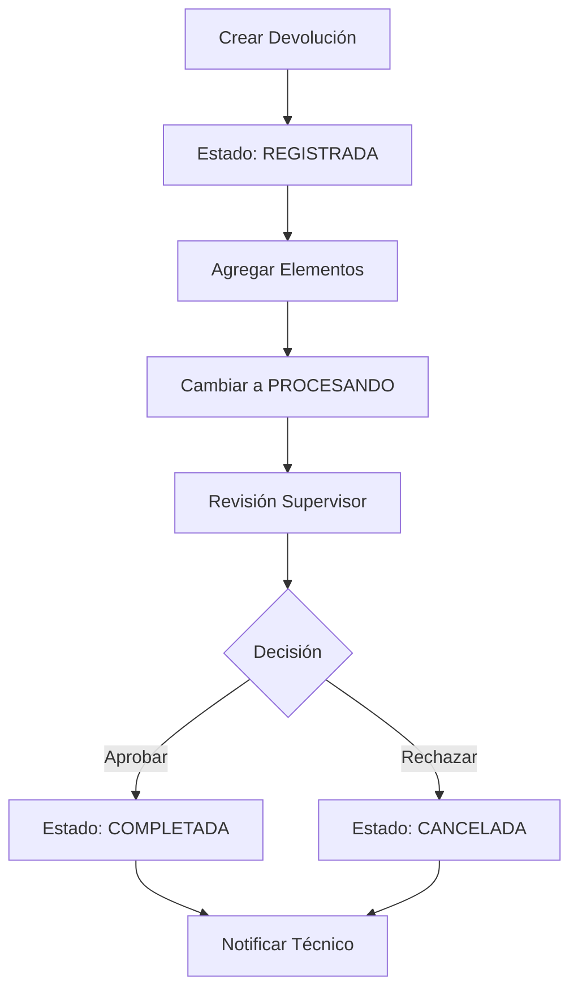

# Sistema de Gestión de Estados para Devoluciones de Dotación

## 1. Resumen del Producto

Sistema avanzado de gestión de estados para el módulo de devoluciones de dotación que permite controlar el ciclo de vida completo de las devoluciones desde su registro hasta su finalización, con validaciones robustas, auditoría completa y notificaciones automáticas.

El sistema resuelve la limitación actual donde solo se puede asignar el estado inicial, implementando transiciones controladas, permisos basados en roles y trazabilidad completa de cambios.

## 2. Funcionalidades Principales

### 2.1 Roles de Usuario

| Rol | Método de Registro | Permisos Principales |
|-----|-------------------|---------------------|
| Técnico Logística | Asignación por administrador | Puede crear devoluciones, cambiar estado REGISTRADA → PROCESANDO |
| Supervisor Logística | Asignación por administrador | Puede aprobar/rechazar devoluciones, cambiar PROCESANDO → COMPLETADA/CANCELADA |
| Administrador Logística | Asignación por administrador | Control total sobre estados, puede realizar cualquier transición |

### 2.2 Módulos del Sistema

Nuestro sistema de gestión de estados consta de los siguientes módulos principales:

1. **Gestor de Transiciones**: Control de cambios de estado con validaciones
2. **Sistema de Auditoría**: Registro completo de cambios y trazabilidad
3. **Motor de Notificaciones**: Alertas automáticas por cambios de estado
4. **Control de Permisos**: Validación de roles para transiciones
5. **API de Estados**: Endpoints para gestión programática

### 2.3 Detalles de Funcionalidades

| Módulo | Funcionalidad | Descripción |
|--------|---------------|-------------|
| Gestor de Transiciones | Validar Transición | Verifica que el cambio de estado sea válido según reglas de negocio |
| Gestor de Transiciones | Actualizar Estado | Ejecuta el cambio de estado con validaciones previas |
| Sistema de Auditoría | Registrar Cambio | Almacena historial completo de cambios con usuario, fecha y motivo |
| Sistema de Auditoría | Consultar Historial | Permite ver el historial completo de cambios de una devolución |
| Motor de Notificaciones | Enviar Alerta | Notifica automáticamente a usuarios relevantes sobre cambios |
| Motor de Notificaciones | Configurar Reglas | Define qué usuarios reciben notificaciones por cada tipo de cambio |
| Control de Permisos | Validar Rol | Verifica que el usuario tenga permisos para realizar la transición |
| Control de Permisos | Gestionar Permisos | Administra qué roles pueden realizar cada tipo de transición |
| API de Estados | Actualizar Estado | Endpoint REST para cambiar estado de devolución |
| API de Estados | Consultar Estados | Endpoint para obtener estados disponibles y transiciones válidas |

## 3. Flujo Principal del Sistema

### Flujo de Gestión de Estados

**Flujo del Técnico de Logística:**
1. Crea devolución con estado REGISTRADA
2. Agrega elementos devueltos
3. Cambia estado a PROCESANDO cuando esté completa
4. Recibe notificación de aprobación/rechazo

**Flujo del Supervisor de Logística:**
1. Recibe notificación de devolución en PROCESANDO
2. Revisa elementos y documentación
3. Aprueba (COMPLETADA) o rechaza (CANCELADA)
4. Sistema notifica al técnico del resultado

## 4. Diseño de Interfaz de Usuario

### 4.1 Estilo de Diseño

- **Colores Primarios**: 
  - Azul (#007bff) para estados activos
  - Verde (#28a745) para estados completados
  - Naranja (#fd7e14) para estados en proceso
  - Rojo (#dc3545) para estados cancelados
- **Estilo de Botones**: Redondeados con iconos FontAwesome
- **Fuentes**: Sistema por defecto, tamaños 14px-16px para contenido
- **Layout**: Diseño de tarjetas con navegación superior
- **Iconos**: FontAwesome para estados y acciones

### 4.2 Componentes de Interfaz

| Página | Módulo | Elementos de UI |
|--------|--------|----------------|
| Gestión de Estados | Panel de Control | Botones de transición con colores específicos por estado, modal de confirmación con campo de motivo |
| Gestión de Estados | Historial de Cambios | Tabla cronológica con usuario, fecha, estado anterior/nuevo, motivo del cambio |
| Configuración | Permisos de Rol | Matriz de permisos con checkboxes, formulario de asignación de roles |
| Notificaciones | Centro de Alertas | Lista de notificaciones con filtros por tipo, botones de marcar como leído |
| API Dashboard | Monitor de Estados | Gráficos de distribución de estados, métricas de tiempo promedio por estado |

### 4.3 Responsividad

Diseño mobile-first con adaptación completa para tablets y escritorio, optimizado para uso táctil en dispositivos móviles.
