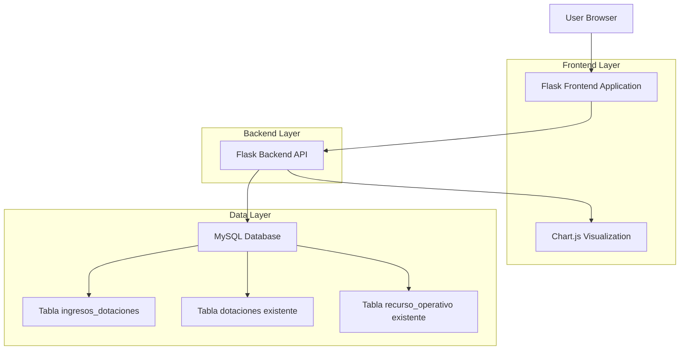
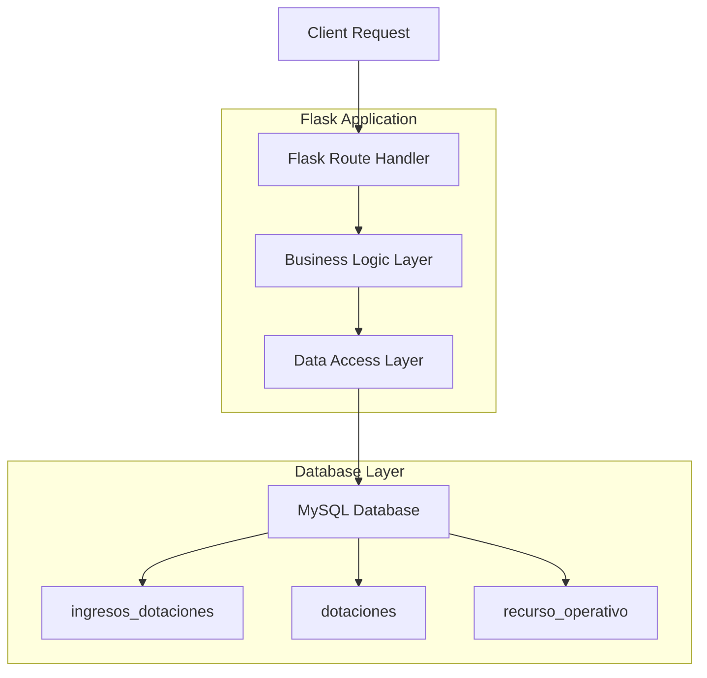
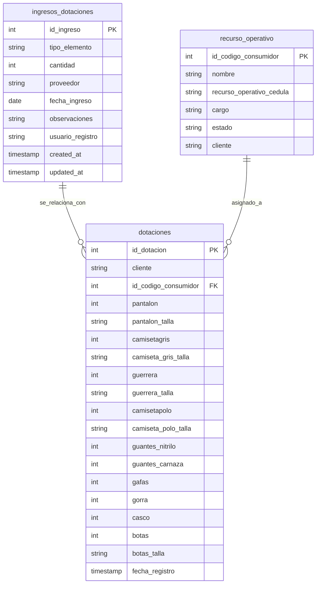

# Arquitectura Técnica - Sistema de Gestión de Ingresos de Dotaciones

## 1. Architecture design



## 2. Technology Description

- Frontend: Flask Templates + Bootstrap 5.3.3 + Chart.js + jQuery 3.7.1
- Backend: Flask + Python 3.x + MySQL Connector
- Database: MySQL 8.0 (existente)
- Visualización: Chart.js para gráficos de stock
- Estilos: Bootstrap 5 + Font Awesome 6

## 3. Route definitions

| Route | Purpose |
|-------|----------|
| /logistica/dotaciones | Página principal del módulo (existente) con modal de ingresos |
| /api/ingresos-dotaciones | API para gestionar ingresos de dotaciones |
| /api/stock-dotaciones | API para obtener datos de stock para gráficos |
| /api/reportes-inventario | API para generar reportes de inventario |
| /api/export-inventario | API para exportar datos en Excel/PDF |

## 4. API definitions

### 4.1 Core API

**Gestión de ingresos de dotaciones**
```
POST /api/ingresos-dotaciones
```

Request:
| Param Name | Param Type | isRequired | Description |
|------------|------------|------------|-------------|
| tipo_elemento | string | true | Tipo de dotación (pantalon, camisetagris, etc.) |
| cantidad | integer | true | Cantidad ingresada |
| proveedor | string | false | Nombre del proveedor |
| fecha_ingreso | date | true | Fecha de ingreso |
| observaciones | string | false | Observaciones adicionales |
| usuario_registro | string | true | Usuario que registra el ingreso |

Response:
| Param Name | Param Type | Description |
|------------|------------|-------------|
| success | boolean | Estado de la operación |
| message | string | Mensaje de respuesta |
| id_ingreso | integer | ID del ingreso creado |

Example:
```json
{
  "tipo_elemento": "pantalon",
  "cantidad": 50,
  "proveedor": "Proveedor ABC",
  "fecha_ingreso": "2024-01-15",
  "observaciones": "Talla M y L",
  "usuario_registro": "admin_logistica"
}
```

**Obtener datos de stock**
```
GET /api/stock-dotaciones
```

Request:
| Param Name | Param Type | isRequired | Description |
|------------|------------|------------|-------------|
| tipo_elemento | string | false | Filtrar por tipo específico |
| fecha_desde | date | false | Fecha inicio para filtro |
| fecha_hasta | date | false | Fecha fin para filtro |

Response:
| Param Name | Param Type | Description |
|------------|------------|-------------|
| success | boolean | Estado de la operación |
| stock_data | array | Datos de stock por elemento |

Example Response:
```json
{
  "success": true,
  "stock_data": [
    {
      "tipo_elemento": "pantalon",
      "cantidad_ingresada": 150,
      "cantidad_entregada": 120,
      "saldo_disponible": 30
    }
  ]
}
```

**Generar reportes**
```
GET /api/reportes-inventario
```

Request:
| Param Name | Param Type | isRequired | Description |
|------------|------------|------------|-------------|
| formato | string | true | Formato del reporte (json, excel, pdf) |
| fecha_desde | date | false | Fecha inicio |
| fecha_hasta | date | false | Fecha fin |
| tipo_elemento | string | false | Filtrar por tipo |

Response:
| Param Name | Param Type | Description |
|------------|------------|-------------|
| success | boolean | Estado de la operación |
| data | array/file | Datos del reporte o archivo |

## 5. Server architecture diagram



## 6. Data model

### 6.1 Data model definition



### 6.2 Data Definition Language

**Tabla ingresos_dotaciones**
```sql
-- Crear tabla para registrar ingresos de dotaciones
CREATE TABLE ingresos_dotaciones (
    id_ingreso INT AUTO_INCREMENT PRIMARY KEY,
    tipo_elemento VARCHAR(50) NOT NULL COMMENT 'Tipo de dotación (pantalon, camisetagris, etc.)',
    cantidad INT NOT NULL COMMENT 'Cantidad ingresada',
    proveedor VARCHAR(100) COMMENT 'Nombre del proveedor',
    fecha_ingreso DATE NOT NULL COMMENT 'Fecha de ingreso a bodega',
    observaciones TEXT COMMENT 'Observaciones adicionales',
    usuario_registro VARCHAR(50) NOT NULL COMMENT 'Usuario que registra el ingreso',
    created_at TIMESTAMP DEFAULT CURRENT_TIMESTAMP,
    updated_at TIMESTAMP DEFAULT CURRENT_TIMESTAMP ON UPDATE CURRENT_TIMESTAMP,
    INDEX idx_tipo_elemento (tipo_elemento),
    INDEX idx_fecha_ingreso (fecha_ingreso),
    INDEX idx_usuario_registro (usuario_registro)
) ENGINE=InnoDB DEFAULT CHARSET=utf8mb4 COLLATE=utf8mb4_unicode_ci;

-- Crear vista para cálculos de stock
CREATE VIEW vista_stock_dotaciones AS
SELECT 
    'pantalon' as tipo_elemento,
    COALESCE(SUM(i.cantidad), 0) as cantidad_ingresada,
    COALESCE(SUM(d.pantalon), 0) as cantidad_entregada,
    COALESCE(SUM(i.cantidad), 0) - COALESCE(SUM(d.pantalon), 0) as saldo_disponible
FROM ingresos_dotaciones i
LEFT JOIN dotaciones d ON i.tipo_elemento = 'pantalon'
WHERE i.tipo_elemento = 'pantalon'
UNION ALL
SELECT 
    'camisetagris' as tipo_elemento,
    COALESCE(SUM(i.cantidad), 0) as cantidad_ingresada,
    COALESCE(SUM(d.camisetagris), 0) as cantidad_entregada,
    COALESCE(SUM(i.cantidad), 0) - COALESCE(SUM(d.camisetagris), 0) as saldo_disponible
FROM ingresos_dotaciones i
LEFT JOIN dotaciones d ON i.tipo_elemento = 'camisetagris'
WHERE i.tipo_elemento = 'camisetagris'
UNION ALL
SELECT 
    'guerrera' as tipo_elemento,
    COALESCE(SUM(i.cantidad), 0) as cantidad_ingresada,
    COALESCE(SUM(d.guerrera), 0) as cantidad_entregada,
    COALESCE(SUM(i.cantidad), 0) - COALESCE(SUM(d.guerrera), 0) as saldo_disponible
FROM ingresos_dotaciones i
LEFT JOIN dotaciones d ON i.tipo_elemento = 'guerrera'
WHERE i.tipo_elemento = 'guerrera'
UNION ALL
SELECT 
    'camisetapolo' as tipo_elemento,
    COALESCE(SUM(i.cantidad), 0) as cantidad_ingresada,
    COALESCE(SUM(d.camisetapolo), 0) as cantidad_entregada,
    COALESCE(SUM(i.cantidad), 0) - COALESCE(SUM(d.camisetapolo), 0) as saldo_disponible
FROM ingresos_dotaciones i
LEFT JOIN dotaciones d ON i.tipo_elemento = 'camisetapolo'
WHERE i.tipo_elemento = 'camisetapolo'
UNION ALL
SELECT 
    'guantes_nitrilo' as tipo_elemento,
    COALESCE(SUM(i.cantidad), 0) as cantidad_ingresada,
    COALESCE(SUM(d.guantes_nitrilo), 0) as cantidad_entregada,
    COALESCE(SUM(i.cantidad), 0) - COALESCE(SUM(d.guantes_nitrilo), 0) as saldo_disponible
FROM ingresos_dotaciones i
LEFT JOIN dotaciones d ON i.tipo_elemento = 'guantes_nitrilo'
WHERE i.tipo_elemento = 'guantes_nitrilo'
UNION ALL
SELECT 
    'guantes_carnaza' as tipo_elemento,
    COALESCE(SUM(i.cantidad), 0) as cantidad_ingresada,
    COALESCE(SUM(d.guantes_carnaza), 0) as cantidad_entregada,
    COALESCE(SUM(i.cantidad), 0) - COALESCE(SUM(d.guantes_carnaza), 0) as saldo_disponible
FROM ingresos_dotaciones i
LEFT JOIN dotaciones d ON i.tipo_elemento = 'guantes_carnaza'
WHERE i.tipo_elemento = 'guantes_carnaza'
UNION ALL
SELECT 
    'gafas' as tipo_elemento,
    COALESCE(SUM(i.cantidad), 0) as cantidad_ingresada,
    COALESCE(SUM(d.gafas), 0) as cantidad_entregada,
    COALESCE(SUM(i.cantidad), 0) - COALESCE(SUM(d.gafas), 0) as saldo_disponible
FROM ingresos_dotaciones i
LEFT JOIN dotaciones d ON i.tipo_elemento = 'gafas'
WHERE i.tipo_elemento = 'gafas'
UNION ALL
SELECT 
    'gorra' as tipo_elemento,
    COALESCE(SUM(i.cantidad), 0) as cantidad_ingresada,
    COALESCE(SUM(d.gorra), 0) as cantidad_entregada,
    COALESCE(SUM(i.cantidad), 0) - COALESCE(SUM(d.gorra), 0) as saldo_disponible
FROM ingresos_dotaciones i
LEFT JOIN dotaciones d ON i.tipo_elemento = 'gorra'
WHERE i.tipo_elemento = 'gorra'
UNION ALL
SELECT 
    'casco' as tipo_elemento,
    COALESCE(SUM(i.cantidad), 0) as cantidad_ingresada,
    COALESCE(SUM(d.casco), 0) as cantidad_entregada,
    COALESCE(SUM(i.cantidad), 0) - COALESCE(SUM(d.casco), 0) as saldo_disponible
FROM ingresos_dotaciones i
LEFT JOIN dotaciones d ON i.tipo_elemento = 'casco'
WHERE i.tipo_elemento = 'casco'
UNION ALL
SELECT 
    'botas' as tipo_elemento,
    COALESCE(SUM(i.cantidad), 0) as cantidad_ingresada,
    COALESCE(SUM(d.botas), 0) as cantidad_entregada,
    COALESCE(SUM(i.cantidad), 0) - COALESCE(SUM(d.botas), 0) as saldo_disponible
FROM ingresos_dotaciones i
LEFT JOIN dotaciones d ON i.tipo_elemento = 'botas'
WHERE i.tipo_elemento = 'botas';

-- Datos iniciales de ejemplo
INSERT INTO ingresos_dotaciones (tipo_elemento, cantidad, proveedor, fecha_ingreso, observaciones, usuario_registro) VALUES
('pantalon', 100, 'Proveedor Textil ABC', '2024-01-15', 'Tallas M, L, XL', 'admin_logistica'),
('camisetagris', 150, 'Confecciones DEF', '2024-01-15', 'Tallas S, M, L', 'admin_logistica'),
('guerrera', 80, 'Uniformes GHI', '2024-01-16', 'Material resistente', 'admin_logistica'),
('guantes_nitrilo', 200, 'Seguridad Industrial JKL', '2024-01-16', 'Talla única', 'admin_logistica'),
('botas', 60, 'Calzado de Seguridad MNO', '2024-01-17', 'Tallas 38-44', 'admin_logistica');
```