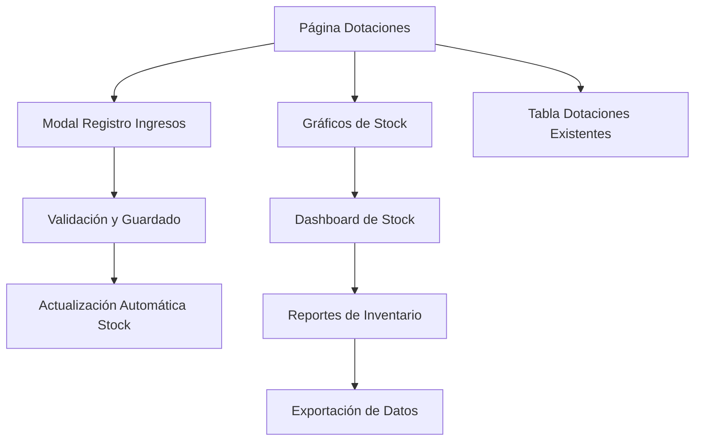

# Sistema de Gestión de Ingresos de Dotaciones

## 1. Product Overview

Sistema integral para registrar y gestionar el ingreso de elementos de dotación a la bodega, con visualización de stock en tiempo real y control de inventarios.

El sistema permite registrar ingresos de dotaciones, visualizar gráficos de stock (cantidad ingresada, entregada y saldo disponible) y mantener trazabilidad completa de los elementos de dotación asignados a técnicos.

Objetivo: Optimizar el control de inventarios de dotaciones y mejorar la gestión logística mediante un sistema integrado de seguimiento de stock.

## 2. Core Features

### 2.1 User Roles

| Role | Registration Method | Core Permissions |
|------|---------------------|------------------|
| Usuario Logística | Acceso con credenciales existentes | Registrar ingresos, consultar stock, generar reportes |
| Administrador | Acceso administrativo | Todas las funciones + configuración del sistema |

### 2.2 Feature Module

Nuestro sistema de gestión de ingresos de dotaciones consta de las siguientes páginas principales:

1. **Página de Dotaciones**: modal de registro de ingresos, tabla de dotaciones existentes, gráficos de stock.
2. **Dashboard de Stock**: visualización gráfica de inventarios, indicadores de stock crítico.
3. **Reportes de Inventario**: exportación de datos, historial de movimientos.

### 2.3 Page Details

| Page Name | Module Name | Feature description |
|-----------|-------------|---------------------|
| Página de Dotaciones | Modal de Registro de Ingresos | Abrir modal para registrar nuevos ingresos de dotaciones. Seleccionar tipo de elemento, cantidad, proveedor, fecha de ingreso. Validar datos y guardar en base de datos. |
| Página de Dotaciones | Tabla de Dotaciones Existentes | Mostrar lista de dotaciones actuales con filtros por técnico y cliente. Integrar con tabla recurso_operativo para obtener datos de técnicos. |
| Página de Dotaciones | Gráfico de Stock por Elemento | Visualizar gráfico de barras/líneas mostrando cantidad ingresada, cantidad entregada y saldo disponible por cada tipo de dotación. Actualización en tiempo real. |
| Dashboard de Stock | Indicadores de Stock | Mostrar métricas clave: total ingresado, total entregado, stock disponible, elementos críticos (stock bajo). |
| Dashboard de Stock | Gráfico de Tendencias | Visualizar tendencias de ingresos y entregas por período de tiempo. Filtros por fechas y tipos de elementos. |
| Reportes de Inventario | Exportación de Datos | Generar reportes en Excel/PDF con datos de inventario. Filtros por fechas, elementos y técnicos. |
| Reportes de Inventario | Historial de Movimientos | Mostrar historial completo de ingresos y entregas con detalles de fechas, cantidades y responsables. |

## 3. Core Process

**Flujo Principal de Usuario Logística:**
1. Usuario accede al módulo de dotaciones existente
2. Hace clic en botón "Registrar Ingreso" para abrir modal
3. Completa formulario con tipo de elemento, cantidad, proveedor y observaciones
4. Sistema valida datos y guarda en tabla ingresos_dotaciones
5. Actualiza automáticamente los gráficos de stock
6. Usuario puede consultar reportes y exportar datos

**Flujo de Consulta de Stock:**
1. Usuario visualiza gráficos de stock en tiempo real
2. Puede filtrar por tipo de elemento o período de tiempo
3. Accede a detalles específicos haciendo clic en elementos del gráfico
4. Exporta reportes según necesidades

## 4. User Interface Design

### 4.1 Design Style

- **Colores primarios**: Azul corporativo (#007bff), Verde éxito (#28a745)
- **Colores secundarios**: Gris claro (#f8f9fa), Blanco (#ffffff)
- **Estilo de botones**: Redondeados con sombra sutil, estilo Bootstrap 5
- **Fuente**: Sistema de fuentes Bootstrap (Segoe UI, Arial, sans-serif)
- **Tamaños de fuente**: 14px base, 16px títulos, 12px texto secundario
- **Layout**: Diseño de tarjetas con navegación superior, sidebar colapsible
- **Iconos**: Font Awesome 6 para consistencia con el sistema existente

### 4.2 Page Design Overview

| Page Name | Module Name | UI Elements |
|-----------|-------------|-------------|
| Página de Dotaciones | Modal de Registro | Modal centrado 600px ancho, formulario con campos organizados en 2 columnas, botones azul primario para guardar, gris para cancelar |
| Página de Dotaciones | Gráficos de Stock | Tarjetas con gráficos Chart.js, colores diferenciados (azul ingresado, verde entregado, naranja disponible), tooltips informativos |
| Dashboard de Stock | Indicadores KPI | Tarjetas con números grandes, iconos representativos, colores de estado (verde/amarillo/rojo según stock) |
| Reportes de Inventario | Tabla de Datos | DataTables con paginación, filtros superiores, botones de exportación estilo Bootstrap |

### 4.3 Responsiveness

Diseño mobile-first con adaptación completa para dispositivos móviles y tablets. Gráficos responsivos que se ajustan al tamaño de pantalla. Modal de registro optimizado para touch en dispositivos móviles.