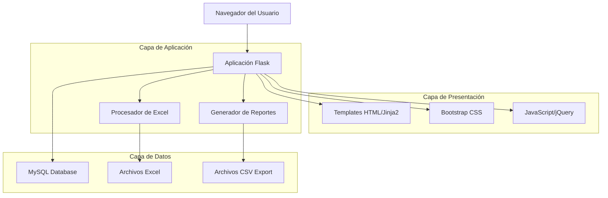
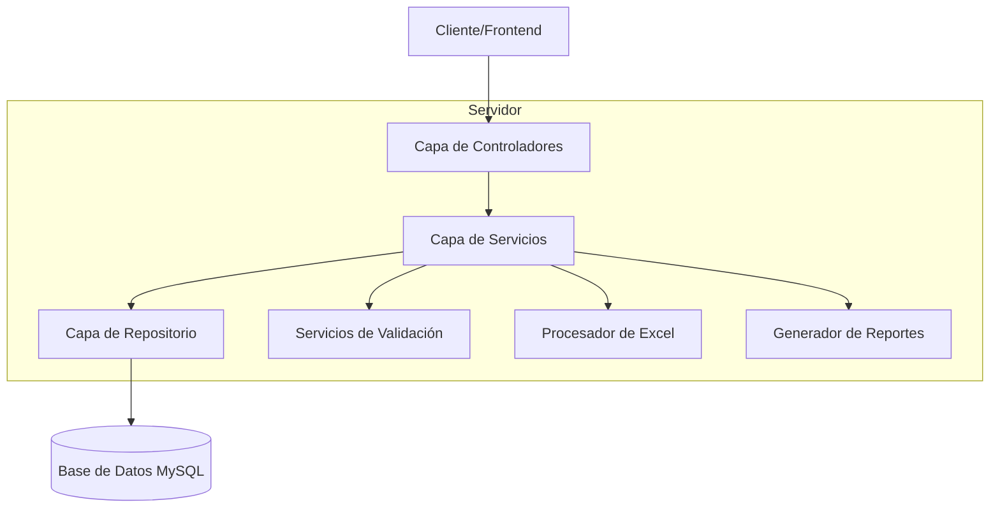
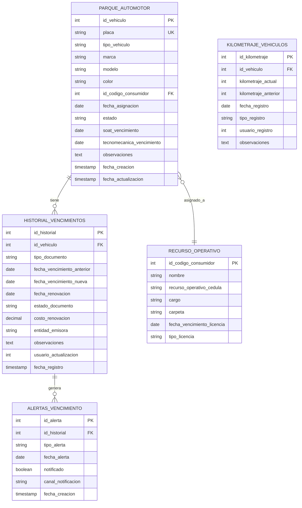

# Sistema de Gestión de Vehículos - Documento de Arquitectura Técnica

## 1. Diseño de Arquitectura



## 2. Descripción de Tecnologías

* **Backend**: Flask 2.3.2 + mysql-connector-python 8.1.0

* **Frontend**: HTML5 + Bootstrap 5 + jQuery + Font Awesome

* **Base de Datos**: MySQL 8.0

* **Procesamiento de Datos**: pandas + openpyxl para Excel

* **Autenticación**: Flask-Login + bcrypt

* **Reportes**: ReportLab para PDF + CSV nativo

## 3. Definiciones de Rutas

| Ruta                                  | Propósito                                                                       |
| ------------------------------------- | ------------------------------------------------------------------------------- |
| /logistica/automotor                  | Página principal de gestión de vehículos, muestra tabla con todos los vehículos |
| /logistica/registrar\_vehiculo        | Endpoint POST para crear nuevos vehículos                                       |
| /logistica/actualizar\_vehiculo/<id>  | Endpoint POST para actualizar vehículos existentes                              |
| /logistica/exportar\_automotor\_csv   | Exportación de datos del parque automotor en formato CSV                        |
| /logistica/importar\_vehiculos\_excel | Endpoint POST para importación masiva desde Excel                               |
| /api/vehiculos/vencimientos           | API REST para obtener alertas de vencimientos                                   |
| /api/vehiculos/historial/<id>         | API REST para obtener historial de un vehículo específico                       |

## 4. Definiciones de API

### 4.1 APIs Principales

**Registro de vehículos**

```
POST /logistica/registrar_vehiculo
```

Request:

| Parámetro                  | Tipo    | Requerido | Descripción                            |
| -------------------------- | ------- | --------- | -------------------------------------- |
| placa                      | string  | true      | Placa del vehículo (único)             |
| tipo\_vehiculo             | string  | true      | Tipo de vehículo (moto, carro, camión) |
| marca                      | string  | true      | Marca del vehículo                     |
| modelo                     | string  | true      | Año del modelo                         |
| color                      | string  | true      | Color del vehículo                     |
| id\_codigo\_consumidor     | integer | false     | ID del técnico asignado                |
| fecha\_asignacion          | date    | true      | Fecha de asignación                    |
| soat\_vencimiento          | date    | false     | Fecha de vencimiento del SOAT          |
| tecnomecanica\_vencimiento | date    | false     | Fecha de vencimiento de tecnomecánica  |
| observaciones              | text    | false     | Observaciones adicionales              |

Response:

| Parámetro | Tipo   | Descripción                            |
| --------- | ------ | -------------------------------------- |
| status    | string | Estado de la respuesta (success/error) |
| message   | string | Mensaje descriptivo del resultado      |

Ejemplo:

```json
{
  "placa": "ABC123",
  "tipo_vehiculo": "Motocicleta",
  "marca": "Honda",
  "modelo": "2023",
  "color": "Rojo",
  "fecha_asignacion": "2024-01-15"
}
```

**Actualización de vehículos**

```
POST /logistica/actualizar_vehiculo/<int:id_parque_automotor>
```

Request: (Mismos parámetros que registro + estado)

| Parámetro | Tipo   | Requerido | Descripción                                         |
| --------- | ------ | --------- | --------------------------------------------------- |
| estado    | string | false     | Estado del vehículo (Activo/Inactivo/Mantenimiento) |

**Importación masiva desde Excel**

```
POST /logistica/importar_vehiculos_excel
```

Request:

| Parámetro      | Tipo    | Requerido | Descripción                                 |
| -------------- | ------- | --------- | ------------------------------------------- |
| archivo\_excel | file    | true      | Archivo Excel con estructura predefinida    |
| sobrescribir   | boolean | false     | Indica si sobrescribir registros existentes |

Response:

| Parámetro  | Tipo    | Descripción                     |
| ---------- | ------- | ------------------------------- |
| status     | string  | Estado de la operación          |
| procesados | integer | Número de registros procesados  |
| errores    | array   | Lista de errores encontrados    |
| duplicados | integer | Número de duplicados detectados |

**API de vencimientos**

```
GET /api/vehiculos/vencimientos
```

Query Parameters:

| Parámetro       | Tipo    | Descripción                                           |
| --------------- | ------- | ----------------------------------------------------- |
| dias\_alerta    | integer | Días de anticipación para alertas (default: 30)       |
| tipo\_documento | string  | Filtrar por tipo (soat/tecnomecanica/licencia/poliza) |

Response:

```json
{
  "vencimientos_proximos": [
    {
      "id_vehiculo": 1,
      "placa": "ABC123",
      "tipo_documento": "soat",
      "fecha_vencimiento": "2024-02-15",
      "dias_restantes": 15,
      "criticidad": "media"
    }
  ],
  "total": 5
}
```

## 5. Arquitectura del Servidor



## 6. Modelo de Datos

### 6.1 Definición del Modelo de Datos



### 6.2 Lenguaje de Definición de Datos (DDL)

**Tabla principal de vehículos (existente - mejorada)**

```sql
-- Modificar tabla existente para agregar campos faltantes
ALTER TABLE parque_automotor 
ADD COLUMN IF NOT EXISTS fecha_actualizacion TIMESTAMP DEFAULT CURRENT_TIMESTAMP ON UPDATE CURRENT_TIMESTAMP,
ADD COLUMN IF NOT EXISTS kilometraje_actual INT DEFAULT 0,
ADD COLUMN IF NOT EXISTS proximo_mantenimiento_km INT,
ADD COLUMN IF NOT EXISTS fecha_ultimo_mantenimiento DATE;

-- Crear índices para optimización
CREATE INDEX idx_parque_automotor_placa ON parque_automotor(placa);
CREATE INDEX idx_parque_automotor_estado ON parque_automotor(estado);
CREATE INDEX idx_parque_automotor_soat_vencimiento ON parque_automotor(soat_vencimiento);
CREATE INDEX idx_parque_automotor_tecnomecanica_vencimiento ON parque_automotor(tecnomecanica_vencimiento);
CREATE INDEX idx_parque_automotor_asignacion ON parque_automotor(id_codigo_consumidor);
```

**Tabla de historial de vencimientos (nueva)**

```sql
-- Crear tabla para historial de vencimientos
CREATE TABLE historial_vencimientos (
    id_historial INT AUTO_INCREMENT PRIMARY KEY,
    id_vehiculo INT NOT NULL,
    tipo_documento ENUM('soat', 'tecnomecanica', 'licencia_conduccion', 'poliza_todo_riesgo', 'revision_preventiva') NOT NULL,
    fecha_vencimiento_anterior DATE,
    fecha_vencimiento_nueva DATE NOT NULL,
    fecha_renovacion DATE NOT NULL,
    estado_documento ENUM('vigente', 'vencido', 'en_tramite', 'renovado') DEFAULT 'vigente',
    costo_renovacion DECIMAL(10,2),
    entidad_emisora VARCHAR(100),
    numero_documento VARCHAR(50),
    observaciones TEXT,
    usuario_actualizacion INT,
    fecha_registro TIMESTAMP DEFAULT CURRENT_TIMESTAMP,
    FOREIGN KEY (id_vehiculo) REFERENCES parque_automotor(id_vehiculo) ON DELETE CASCADE,
    FOREIGN KEY (usuario_actualizacion) REFERENCES recurso_operativo(id_codigo_consumidor)
);

-- Crear índices para historial
CREATE INDEX idx_historial_vehiculo ON historial_vencimientos(id_vehiculo);
CREATE INDEX idx_historial_tipo_documento ON historial_vencimientos(tipo_documento);
CREATE INDEX idx_historial_fecha_vencimiento ON historial_vencimientos(fecha_vencimiento_nueva);
CREATE INDEX idx_historial_estado ON historial_vencimientos(estado_documento);
```

**Tabla de alertas de vencimiento (nueva)**

```sql
-- Crear tabla para alertas automáticas
CREATE TABLE alertas_vencimiento (
    id_alerta INT AUTO_INCREMENT PRIMARY KEY,
    id_historial INT NOT NULL,
    tipo_alerta ENUM('30_dias', '15_dias', '7_dias', '1_dia', 'vencido') NOT NULL,
    fecha_alerta DATE NOT NULL,
    notificado BOOLEAN DEFAULT FALSE,
    canal_notificacion ENUM('email', 'sistema', 'sms') DEFAULT 'sistema',
    fecha_notificacion TIMESTAMP NULL,
    fecha_creacion TIMESTAMP DEFAULT CURRENT_TIMESTAMP,
    FOREIGN KEY (id_historial) REFERENCES historial_vencimientos(id_historial) ON DELETE CASCADE
);

-- Crear índices para alertas
CREATE INDEX idx_alertas_fecha ON alertas_vencimiento(fecha_alerta);
CREATE INDEX idx_alertas_notificado ON alertas_vencimiento(notificado);
CREATE INDEX idx_alertas_tipo ON alertas_vencimiento(tipo_alerta);
```

**Tabla de control de kilometraje (nueva)**

```sql
-- Crear tabla para control de kilometraje
CREATE TABLE kilometraje_vehiculos (
    id_kilometraje INT AUTO_INCREMENT PRIMARY KEY,
    id_vehiculo INT NOT NULL,
    kilometraje_actual INT NOT NULL,
    kilometraje_anterior INT DEFAULT 0,
    diferencia_km INT GENERATED ALWAYS AS (kilometraje_actual - kilometraje_anterior) STORED,
    fecha_registro DATE NOT NULL,
    tipo_registro ENUM('manual', 'mantenimiento', 'inspeccion', 'asignacion') DEFAULT 'manual',
    usuario_registro INT,
    observaciones TEXT,
    fecha_creacion TIMESTAMP DEFAULT CURRENT_TIMESTAMP,
    FOREIGN KEY (id_vehiculo) REFERENCES parque_automotor(id_vehiculo) ON DELETE CASCADE,
    FOREIGN KEY (usuario_registro) REFERENCES recurso_operativo(id_codigo_consumidor)
);

-- Crear índices para kilometraje
CREATE INDEX idx_kilometraje_vehiculo ON kilometraje_vehiculos(id_vehiculo);
CREATE INDEX idx_kilometraje_fecha ON kilometraje_vehiculos(fecha_registro);
CREATE INDEX idx_kilometraje_tipo ON kilometraje_vehiculos(tipo_registro);
```

**Datos iniciales y triggers**

```sql
-- Trigger para actualizar fecha de modificación
DELIMITER //
CREATE TRIGGER tr_parque_automotor_update 
    BEFORE UPDATE ON parque_automotor
    FOR EACH ROW
BEGIN
    SET NEW.fecha_actualizacion = CURRENT_TIMESTAMP;
END//
DELIMITER ;

-- Trigger para crear alertas automáticas cuando se registra un vencimiento
DELIMITER //
CREATE TRIGGER tr_crear_alertas_vencimiento
    AFTER INSERT ON historial_vencimientos
    FOR EACH ROW
BEGIN
    -- Alerta 30 días antes
    INSERT INTO alertas_vencimiento (id_historial, tipo_alerta, fecha_alerta)
    VALUES (NEW.id_historial, '30_dias', DATE_SUB(NEW.fecha_vencimiento_nueva, INTERVAL 30 DAY));
    
    -- Alerta 15 días antes
    INSERT INTO alertas_vencimiento (id_historial, tipo_alerta, fecha_alerta)
    VALUES (NEW.id_historial, '15_dias', DATE_SUB(NEW.fecha_vencimiento_nueva, INTERVAL 15 DAY));
    
    -- Alerta 7 días antes
    INSERT INTO alertas_vencimiento (id_historial, tipo_alerta, fecha_alerta)
    VALUES (NEW.id_historial, '7_dias', DATE_SUB(NEW.fecha_vencimiento_nueva, INTERVAL 7 DAY));
    
    -- Alerta 1 día antes
    INSERT INTO alertas_vencimiento (id_historial, tipo_alerta, fecha_alerta)
    VALUES (NEW.id_historial, '1_dia', DATE_SUB(NEW.fecha_vencimiento_nueva, INTERVAL 1 DAY));
END//
DELIMITER ;

-- Procedimiento para migrar datos existentes al historial
DELIMITER //
CREATE PROCEDURE MigrarDatosExistentesHistorial()
BEGIN
    -- Migrar datos de SOAT existentes
    INSERT INTO historial_vencimientos (id_vehiculo, tipo_documento, fecha_vencimiento_nueva, fecha_renovacion, estado_documento)
    SELECT 
        id_vehiculo,
        'soat',
        soat_vencimiento,
        COALESCE(fecha_asignacion, fecha_creacion),
        CASE 
            WHEN soat_vencimiento < CURDATE() THEN 'vencido'
            WHEN soat_vencimiento <= DATE_ADD(CURDATE(), INTERVAL 30 DAY) THEN 'vigente'
            ELSE 'vigente'
        END
    FROM parque_automotor 
    WHERE soat_vencimiento IS NOT NULL;
    
    -- Migrar datos de tecnomecánica existentes
    INSERT INTO historial_vencimientos (id_vehiculo, tipo_documento, fecha_vencimiento_nueva, fecha_renovacion, estado_documento)
    SELECT 
        id_vehiculo,
        'tecnomecanica',
        tecnomecanica_vencimiento,
        
```

