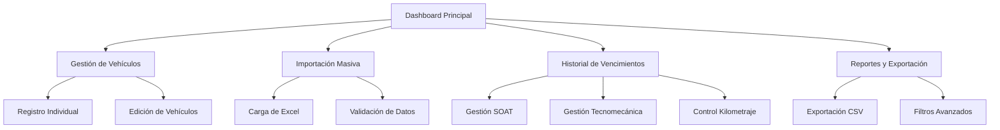

# Sistema de Gestión de Vehículos - Documento de Requisitos del Producto

## 1. Resumen del Producto

Sistema integral de gestión del parque automotor que permite administrar vehículos, controlar vencimientos de documentos y mantener un historial completo de actualizaciones. El sistema incluye funcionalidades de importación masiva desde Excel, gestión individual de registros y sincronización entre la interfaz web y la base de datos.

El producto resuelve la necesidad de centralizar la información vehicular, automatizar alertas de vencimientos y mantener trazabilidad completa de cambios para empresas con flotas de vehículos.

## 2. Funcionalidades Principales

### 2.1 Roles de Usuario

| Rol | Método de Registro | Permisos Principales |
|-----|-------------------|---------------------|
| Logística | Autenticación por base de datos | Acceso completo al módulo de vehículos, importación masiva, exportación de datos |
| Administrativo | Autenticación por base de datos | Acceso de solo lectura y reportes |
| Técnico | Autenticación por base de datos | Consulta de vehículos asignados |

### 2.2 Módulos de Funcionalidad

Nuestro sistema de gestión de vehículos consta de las siguientes páginas principales:

1. **Dashboard de Vehículos**: visualización general del parque automotor, alertas de vencimientos, estadísticas de estado.
2. **Gestión de Vehículos**: registro individual, edición, consulta detallada de vehículos.
3. **Importación Masiva**: carga de datos desde archivo Excel, validación y procesamiento.
4. **Historial de Vencimientos**: seguimiento de SOAT, tecnomecánica, licencias, pólizas y kilometraje.
5. **Reportes y Exportación**: generación de reportes en CSV, filtros avanzados.

### 2.3 Detalles de Páginas

| Página | Módulo | Descripción de Funcionalidad |
|--------|--------|------------------------------|
| Dashboard de Vehículos | Panel Principal | Mostrar resumen de vehículos activos, alertas de vencimientos próximos, gráficos de estado del parque automotor |
| Dashboard de Vehículos | Alertas de Vencimiento | Generar notificaciones automáticas para SOAT, tecnomecánica y otros documentos próximos a vencer |
| Gestión de Vehículos | Registro Individual | Crear nuevos registros de vehículos con validación de placa única, asignación de técnicos |
| Gestión de Vehículos | Edición de Vehículos | Actualizar información existente, cambiar asignaciones, modificar fechas de vencimiento |
| Gestión de Vehículos | Modal de Formulario | Interfaz unificada para registro y edición con validación en tiempo real |
| Importación Masiva | Carga de Excel | Procesar archivo BASE semaforo vehiculos.xlsx, validar estructura y datos |
| Importación Masiva | Validación de Datos | Verificar integridad de información, detectar duplicados, validar formatos de fecha |
| Importación Masiva | Procesamiento Batch | Insertar múltiples registros de forma eficiente con manejo de errores |
| Historial de Vencimientos | Gestión SOAT | Registrar fechas de vencimiento, renovaciones, alertas automáticas |
| Historial de Vencimientos | Gestión Tecnomecánica | Controlar revisiones técnico-mecánicas, fechas de vencimiento |
| Historial de Vencimientos | Gestión de Licencias | Seguimiento de licencias de conducción de técnicos asignados |
| Historial de Vencimientos | Gestión de Pólizas | Control de pólizas de todo riesgo, fechas de renovación |
| Historial de Vencimientos | Control de Kilometraje | Registro de odómetro, mantenimientos programados |
| Reportes y Exportación | Exportación CSV | Generar archivos CSV con información completa del parque automotor |
| Reportes y Exportación | Filtros Avanzados | Buscar por placa, técnico, estado, fechas de vencimiento |
| Reportes y Exportación | Reportes de Vencimientos | Generar reportes específicos de documentos próximos a vencer |

## 3. Proceso Principal

### Flujo de Usuario Logística
1. Acceder al dashboard para revisar alertas de vencimientos
2. Importar datos masivos desde Excel o registrar vehículos individualmente
3. Asignar vehículos a técnicos específicos
4. Actualizar fechas de vencimiento de documentos
5. Generar reportes y exportar información

### Flujo de Usuario Técnico
1. Consultar vehículos asignados
2. Reportar cambios de kilometraje
3. Notificar sobre mantenimientos requeridos

## 4. Diseño de Interfaz de Usuario

### 4.1 Estilo de Diseño

- **Colores Primarios**: Azul (#007bff) para acciones principales, Verde (#28a745) para estados activos
- **Colores Secundarios**: Amarillo (#ffc107) para alertas, Rojo (#dc3545) para vencimientos críticos
- **Estilo de Botones**: Redondeados con efectos hover, iconos Font Awesome
- **Tipografía**: Sans-serif, tamaños 14px para texto normal, 16px para títulos
- **Layout**: Diseño basado en tarjetas, navegación superior, sidebar colapsible
- **Iconos**: Font Awesome para consistencia visual, emojis para alertas de estado

### 4.2 Resumen de Diseño de Páginas

| Página | Módulo | Elementos de UI |
|--------|--------|----------------|
| Dashboard de Vehículos | Panel Principal | Tarjetas de resumen con contadores, gráficos de dona para distribución de estados, tabla responsiva con badges de estado |
| Dashboard de Vehículos | Alertas | Notificaciones tipo toast, badges de colores según criticidad (rojo: vencido, amarillo: próximo, verde: vigente) |
| Gestión de Vehículos | Tabla Principal | DataTable con paginación, filtros por columna, botones de acción (editar, eliminar) |
| Gestión de Vehículos | Modal de Formulario | Formulario de dos columnas, validación en tiempo real, selectores desplegables para técnicos |
| Importación Masiva | Zona de Carga | Drag & drop para archivos Excel, barra de progreso, vista previa de datos |
| Historial de Vencimientos | Timeline | Vista cronológica de eventos, indicadores visuales de estado, filtros por tipo de documento |
| Reportes | Controles de Filtro | Selectores de fecha, checkboxes para tipos de vehículo, botones de exportación |

### 4.3 Responsividad

El sistema está diseñado con enfoque mobile-first, adaptándose a dispositivos móviles y tablets. Incluye optimización táctil para formularios y navegación, con colapso automático de sidebar en pantallas pequeñas.