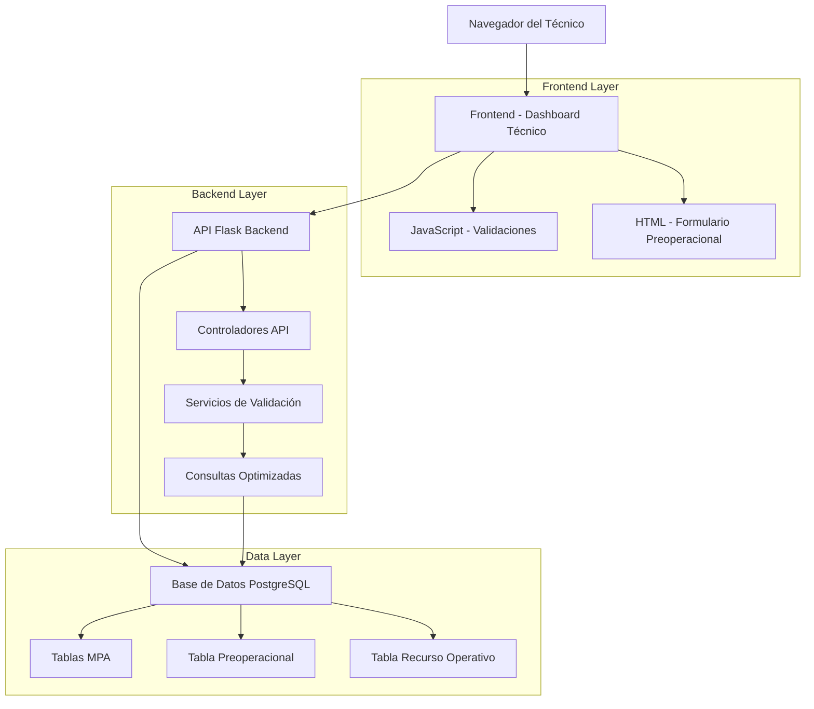
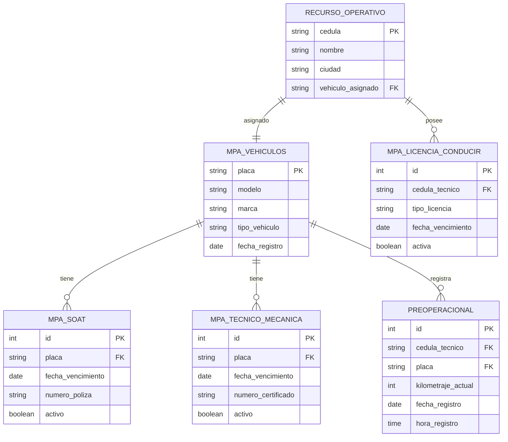

# Sistema de Registro Preoperacional Mejorado - Arquitectura Técnica

## 1. Arquitectura del Sistema



## 2. Descripción de Tecnologías

- **Frontend**: HTML5 + JavaScript ES6 + CSS3 (Bootstrap existente)
- **Backend**: Flask (Python) + SQLAlchemy ORM
- **Base de Datos**: PostgreSQL (existente)
- **Validaciones**: JavaScript (cliente) + Python (servidor)

## 3. Definición de Rutas

| Ruta | Propósito |
|------|-----------|
| `/modulos/tecnicos/dashboard` | Dashboard principal del técnico con formulario preoperacional mejorado |
| `/api/preoperacional/datos-vehiculo` | Endpoint para obtener datos completos del vehículo y licencia |
| `/api/preoperacional/ultimo-kilometraje/<placa>` | Endpoint para consultar último kilometraje registrado |
| `/api/preoperacional/validar-kilometraje` | Endpoint para validación de kilometraje en tiempo real |
| `/api/preoperacional/registrar` | Endpoint existente mejorado para el registro completo |

## 4. Definiciones de API

### 4.1 Obtener Datos del Vehículo

```
GET /api/preoperacional/datos-vehiculo
```

**Headers:**
| Header | Valor | Requerido |
|--------|-------|-----------|
| Authorization | Bearer token o session | Sí |

**Respuesta:**
| Campo | Tipo | Descripción |
|-------|------|-------------|
| ciudad | string | Ciudad del recurso operativo |
| placa | string | Placa del vehículo asignado |
| modelo | string | Modelo del vehículo |
| marca | string | Marca del vehículo |
| tipo_licencia | string | Tipo de licencia del técnico |
| fecha_venc_licencia | string (YYYY-MM-DD) | Fecha de vencimiento de licencia |
| fecha_venc_soat | string (YYYY-MM-DD) | Fecha de vencimiento SOAT |
| fecha_venc_tecnico_mecanica | string (YYYY-MM-DD) | Fecha de vencimiento técnico mecánica |
| ultimo_kilometraje | integer | Último kilometraje registrado |
| fecha_ultimo_kilometraje | string (YYYY-MM-DD) | Fecha del último registro |

**Ejemplo de Respuesta:**
```json
{
  "success": true,
  "data": {
    "ciudad": "Bogotá",
    "placa": "ABC123",
    "modelo": "Hilux",
    "marca": "Toyota",
    "tipo_licencia": "B1",
    "fecha_venc_licencia": "2025-06-15",
    "fecha_venc_soat": "2024-12-30",
    "fecha_venc_tecnico_mecanica": "2025-03-20",
    "ultimo_kilometraje": 45230,
    "fecha_ultimo_kilometraje": "2024-01-15"
  },
  "alertas": [
    {
      "tipo": "warning",
      "mensaje": "SOAT próximo a vencer en 25 días"
    }
  ]
}
```

### 4.2 Validar Kilometraje

```
POST /api/preoperacional/validar-kilometraje
```

**Request:**
| Campo | Tipo | Requerido | Descripción |
|-------|------|-----------|-------------|
| placa | string | Sí | Placa del vehículo |
| kilometraje_propuesto | integer | Sí | Kilometraje a validar |

**Respuesta:**
| Campo | Tipo | Descripción |
|-------|------|-------------|
| valido | boolean | Si el kilometraje es válido |
| ultimo_kilometraje | integer | Último kilometraje registrado |
| fecha_ultimo_registro | string | Fecha del último registro |
| mensaje | string | Mensaje descriptivo |

**Ejemplo de Request:**
```json
{
  "placa": "ABC123",
  "kilometraje_propuesto": 45250
}
```

**Ejemplo de Respuesta (Válido):**
```json
{
  "success": true,
  "valido": true,
  "ultimo_kilometraje": 45230,
  "fecha_ultimo_registro": "2024-01-15",
  "mensaje": "Kilometraje válido"
}
```

**Ejemplo de Respuesta (Inválido):**
```json
{
  "success": true,
  "valido": false,
  "ultimo_kilometraje": 45230,
  "fecha_ultimo_registro": "2024-01-15",
  "mensaje": "El kilometraje no puede ser menor al último registrado: 45230 km en fecha 15/01/2024"
}
```

### 4.3 Registro Preoperacional Mejorado

```
POST /api/preoperacional/registrar
```

**Request (Campos Adicionales):**
| Campo | Tipo | Requerido | Descripción |
|-------|------|-----------|-------------|
| kilometraje_actual | integer | Sí | Kilometraje validado |
| datos_vehiculo_verificados | boolean | Sí | Confirmación de datos correctos |

## 5. Arquitectura de Base de Datos

### 5.1 Modelo de Datos



### 5.2 Consultas SQL Optimizadas

**Obtener Datos Completos del Vehículo:**
```sql
-- Consulta principal para datos del vehículo y técnico
SELECT 
    ro.ciudad,
    mv.placa,
    mv.modelo,
    mv.marca,
    mlc.tipo_licencia,
    mlc.fecha_vencimiento as fecha_venc_licencia,
    ms.fecha_vencimiento as fecha_venc_soat,
    mtm.fecha_vencimiento as fecha_venc_tecnico_mecanica,
    COALESCE(ultimo_km.kilometraje_actual, 0) as ultimo_kilometraje,
    ultimo_km.fecha_registro as fecha_ultimo_kilometraje
FROM recurso_operativo ro
LEFT JOIN mpa_vehiculos mv ON ro.vehiculo_asignado = mv.placa
LEFT JOIN mpa_licencia_conducir mlc ON ro.cedula = mlc.cedula_tecnico 
    AND mlc.activa = true
LEFT JOIN mpa_soat ms ON mv.placa = ms.placa 
    AND ms.activo = true
LEFT JOIN mpa_tecnico_mecanica mtm ON mv.placa = mtm.placa 
    AND mtm.activo = true
LEFT JOIN (
    SELECT placa, kilometraje_actual, fecha_registro,
           ROW_NUMBER() OVER (PARTITION BY placa ORDER BY fecha_registro DESC, hora_registro DESC) as rn
    FROM preoperacional
) ultimo_km ON mv.placa = ultimo_km.placa AND ultimo_km.rn = 1
WHERE ro.cedula = %s;
```

**Validar Kilometraje:**
```sql
-- Obtener último kilometraje para validación
SELECT kilometraje_actual, fecha_registro
FROM preoperacional 
WHERE placa = %s 
ORDER BY fecha_registro DESC, hora_registro DESC 
LIMIT 1;
```

### 5.3 Índices Requeridos

```sql
-- Índices para optimización de consultas
CREATE INDEX IF NOT EXISTS idx_recurso_operativo_cedula ON recurso_operativo(cedula);
CREATE INDEX IF NOT EXISTS idx_mpa_vehiculos_placa ON mpa_vehiculos(placa);
CREATE INDEX IF NOT EXISTS idx_mpa_licencia_cedula_activa ON mpa_licencia_conducir(cedula_tecnico, activa);
CREATE INDEX IF NOT EXISTS idx_mpa_soat_placa_activo ON mpa_soat(placa, activo);
CREATE INDEX IF NOT EXISTS idx_mpa_tecnico_placa_activo ON mpa_tecnico_mecanica(placa, activo);
CREATE INDEX IF NOT EXISTS idx_preoperacional_placa_fecha ON preoperacional(placa, fecha_registro DESC, hora_registro DESC);
```

## 6. Arquitectura Frontend

### 6.1 Estructura de Archivos JavaScript

```
templates/modulos/tecnicos/
├── dashboard.html (modificado)
└── js/
    ├── preoperacional-mejorado.js (nuevo)
    ├── validaciones-kilometraje.js (nuevo)
    └── utils-vehiculo.js (nuevo)
```

### 6.2 Funciones JavaScript Principales

**preoperacional-mejorado.js:**
```javascript
// Función principal para cargar datos del vehículo
async function cargarDatosVehiculo() {
    try {
        const response = await fetch('/api/preoperacional/datos-vehiculo');
        const data = await response.json();
        
        if (data.success) {
            poblarFormulario(data.data);
            mostrarAlertas(data.alertas);
        }
    } catch (error) {
        console.error('Error cargando datos del vehículo:', error);
        mostrarError('Error al cargar datos del vehículo');
    }
}

// Poblar campos del formulario
function poblarFormulario(datos) {
    document.getElementById('ciudad').value = datos.ciudad || '';
    document.getElementById('placa').value = datos.placa || '';
    document.getElementById('modelo').value = datos.modelo || '';
    document.getElementById('marca').value = datos.marca || '';
    document.getElementById('tipo_licencia').value = datos.tipo_licencia || '';
    document.getElementById('fecha_venc_licencia').value = datos.fecha_venc_licencia || '';
    document.getElementById('fecha_venc_soat').value = datos.fecha_venc_soat || '';
    document.getElementById('fecha_venc_tecnico_mecanica').value = datos.fecha_venc_tecnico_mecanica || '';
    
    // Mostrar último kilometraje como referencia
    if (datos.ultimo_kilometraje > 0) {
        document.getElementById('ultimo_km_referencia').textContent = 
            `Último kilometraje: ${datos.ultimo_kilometraje} km (${formatearFecha(datos.fecha_ultimo_kilometraje)})`;
    }
    
    // Deshabilitar campos auto-completados
    deshabilitarCamposAutocompletados();
}
```

**validaciones-kilometraje.js:**
```javascript
// Validación en tiempo real del kilometraje
async function validarKilometraje() {
    const placa = document.getElementById('placa').value;
    const kilometraje = parseInt(document.getElementById('kilometraje_actual').value);
    
    if (!placa || !kilometraje) return;
    
    try {
        const response = await fetch('/api/preoperacional/validar-kilometraje', {
            method: 'POST',
            headers: {
                'Content-Type': 'application/json',
            },
            body: JSON.stringify({
                placa: placa,
                kilometraje_propuesto: kilometraje
            })
        });
        
        const data = await response.json();
        mostrarResultadoValidacion(data);
        
    } catch (error) {
        console.error('Error validando kilometraje:', error);
        mostrarError('Error al validar kilometraje');
    }
}

// Mostrar resultado de validación
function mostrarResultadoValidacion(data) {
    const campo = document.getElementById('kilometraje_actual');
    const mensaje = document.getElementById('mensaje_kilometraje');
    const botonEnviar = document.getElementById('btn_enviar_preoperacional');
    
    if (data.valido) {
        campo.classList.remove('is-invalid');
        campo.classList.add('is-valid');
        mensaje.textContent = 'Kilometraje válido ✓';
        mensaje.className = 'text-success';
        botonEnviar.disabled = false;
    } else {
        campo.classList.remove('is-valid');
        campo.classList.add('is-invalid');
        mensaje.textContent = data.mensaje;
        mensaje.className = 'text-danger';
        botonEnviar.disabled = true;
    }
}
```

## 7. Manejo de Errores y Excepciones

### 7.1 Errores del Backend

```python
# Manejo de errores en Flask
@app.errorhandler(404)
def not_found_error(error):
    return jsonify({
        'success': False,
        'error': 'Recurso no encontrado',
        'code': 404
    }), 404

@app.errorhandler(500)
def internal_error(error):
    return jsonify({
        'success': False,
        'error': 'Error interno del servidor',
        'code': 500
    }), 500

# Validaciones específicas
def validar_datos_vehiculo(cedula_tecnico):
    try:
        # Consulta de datos
        datos = obtener_datos_vehiculo(cedula_tecnico)
        
        if not datos:
            return {
                'success': False,
                'error': 'No se encontraron datos del vehículo para el técnico'
            }
            
        # Validar documentos vencidos
        alertas = validar_documentos_vencimiento(datos)
        
        return {
            'success': True,
            'data': datos,
            'alertas': alertas
        }
        
    except Exception as e:
        logger.error(f"Error obteniendo datos del vehículo: {str(e)}")
        return {
            'success': False,
            'error': 'Error al consultar datos del vehículo'
        }
```

### 7.2 Validaciones Frontend

```javascript
// Validaciones antes del envío
function validarFormularioCompleto() {
    const errores = [];
    
    // Validar campos obligatorios
    if (!document.getElementById('placa').value) {
        errores.push('Placa del vehículo es requerida');
    }
    
    if (!document.getElementById('kilometraje_actual').value) {
        errores.push('Kilometraje actual es requerido');
    }
    
    // Validar documentos vencidos
    if (documentosVencidos.length > 0) {
        errores.push('Hay documentos vencidos que impiden el registro');
    }
    
    if (errores.length > 0) {
        mostrarErrores(errores);
        return false;
    }
    
    return true;
}
```

## 8. Seguridad y Autenticación

### 8.1 Validación de Sesión

```python
# Decorador para validar sesión de técnico
def requiere_sesion_tecnico(f):
    @wraps(f)
    def decorated_function(*args, **kwargs):
        if 'user_cedula' not in session:
            return jsonify({
                'success': False,
                'error': 'Sesión no válida'
            }), 401
            
        if session.get('user_role') != 'tecnico':
            return jsonify({
                'success': False,
                'error': 'Acceso no autorizado'
            }), 403
            
        return f(*args, **kwargs)
    return decorated_function
```

### 8.2 Validación de Datos

```python
# Sanitización de inputs
def sanitizar_kilometraje(kilometraje_str):
    try:
        kilometraje = int(kilometraje_str)
        if kilometraje < 0 or kilometraje > 9999999:
            raise ValueError("Kilometraje fuera de rango válido")
        return kilometraje
    except (ValueError, TypeError):
        raise ValueError("Kilometraje debe ser un número entero válido")
```

## 9. Optimización y Rendimiento

### 9.1 Caché de Consultas

```python
# Cache para datos que no cambian frecuentemente
from functools import lru_cache

@lru_cache(maxsize=100)
def obtener_datos_vehiculo_cache(cedula_tecnico):
    return obtener_datos_vehiculo(cedula_tecnico)

# Invalidar cache cuando sea necesario
def invalidar_cache_vehiculo(cedula_tecnico):
    obtener_datos_vehiculo_cache.cache_clear()
```

### 9.2 Consultas Optimizadas

```python
# Usar una sola consulta con JOINs en lugar de múltiples consultas
def obtener_datos_completos_vehiculo(cedula_tecnico):
    query = """
    SELECT ro.ciudad, mv.placa, mv.modelo, mv.marca,
           mlc.tipo_licencia, mlc.fecha_vencimiento as fecha_venc_licencia,
           ms.fecha_vencimiento as fecha_venc_soat,
           mtm.fecha_vencimiento as fecha_venc_tecnico_mecanica,
           ultimo_km.kilometraje_actual, ultimo_km.fecha_registro
    FROM recurso_operativo ro
    LEFT JOIN mpa_vehiculos mv ON ro.vehiculo_asignado = mv.placa
    LEFT JOIN mpa_licencia_conducir mlc ON ro.cedula = mlc.cedula_tecnico AND mlc.activa = true
    LEFT JOIN mpa_soat ms ON mv.placa = ms.placa AND ms.activo = true
    LEFT JOIN mpa_tecnico_mecanica mtm ON mv.placa = mtm.placa AND mtm.activo = true
    LEFT JOIN (
        SELECT placa, kilometraje_actual, fecha_registro,
               ROW_NUMBER() OVER (PARTITION BY placa ORDER BY fecha_registro DESC, hora_registro DESC) as rn
        FROM preoperacional
    ) ultimo_km ON mv.placa = ultimo_km.placa AND ultimo_km.rn = 1
    WHERE ro.cedula = %s
    """
    
    return db.session.execute(text(query), [cedula_tecnico]).fetchone()
```

## 10. Plan de Despliegue

### 10.1 Migración de Base de Datos

```sql
-- Script de migración para nuevos índices
BEGIN;

-- Crear índices si no existen
CREATE INDEX CONCURRENTLY IF NOT EXISTS idx_preoperacional_placa_fecha 
ON preoperacional(placa, fecha_registro DESC, hora_registro DESC);

CREATE INDEX CONCURRENTLY IF NOT EXISTS idx_mpa_licencia_cedula_activa 
ON mpa_licencia_conducir(cedula_tecnico, activa);

CREATE INDEX CONCURRENTLY IF NOT EXISTS idx_mpa_soat_placa_activo 
ON mpa_soat(placa, activo);

CREATE INDEX CONCURRENTLY IF NOT EXISTS idx_mpa_tecnico_placa_activo 
ON mpa_tecnico_mecanica(placa, activo);

COMMIT;
```

### 10.2 Verificación Post-Despliegue

```python
# Script de verificación
def verificar_sistema_preoperacional():
    verificaciones = []
    
    # Verificar endpoints
    try:
        response = requests.get('/api/preoperacional/datos-vehiculo')
        verificaciones.append(('API datos-vehiculo', response.status_code == 200))
    except:
        verificaciones.append(('API datos-vehiculo', False))
    
    # Verificar índices de base de datos
    indices_requeridos = [
        'idx_preoperacional_placa_fecha',
        'idx_mpa_licencia_cedula_activa',
        'idx_mpa_soat_placa_activo',
        'idx_mpa_tecnico_placa_activo'
    ]
    
    for indice in indices_requeridos:
        existe = verificar_indice_existe(indice)
        verificaciones.append((f'Índice {indice}', existe))
    
    return verificaciones
```

Esta arquitectura técnica proporciona una base sólida para implementar el sistema de registro preoperacional mejorado, con énfasis en el rendimiento, la seguridad y la mantenibilidad del código.