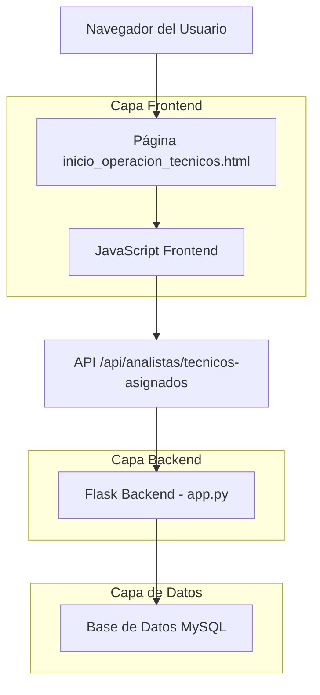
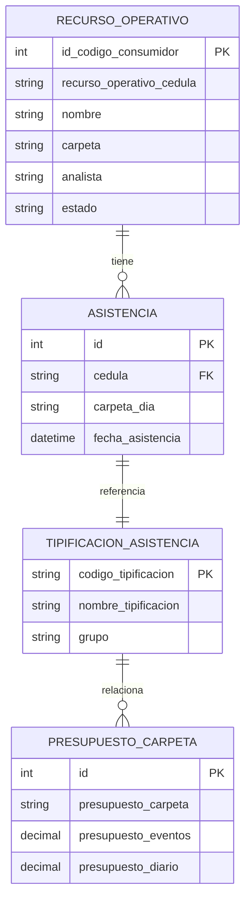

# Documento de Arquitectura Técnica - Tarjeta de Estadísticas de Técnicos Sin Presupuesto

## 1. Diseño de Arquitectura



## 2. Descripción de Tecnologías

- Frontend: HTML5 + CSS3 + JavaScript ES6 + Bootstrap 5 + Font Awesome
- Backend: Flask (Python) existente en app.py
- Base de Datos: MySQL (tablas existentes: recurso_operativo, asistencia, tipificacion_asistencia, presupuesto_carpeta)

## 3. Definiciones de Rutas

| Ruta | Propósito |
|------|-----------|
| /analistas/inicio-operacion-tecnicos | Página principal con tarjeta de estadísticas integrada |
| /api/analistas/tecnicos-asignados | API existente que proporciona datos de técnicos con información de asistencia |

## 4. Definiciones de API

### 4.1 API Principal

**Endpoint Existente (Sin Modificaciones)**
```
GET /api/analistas/tecnicos-asignados
```

Parámetros de Consulta:
| Nombre del Parámetro | Tipo de Parámetro | Es Requerido | Descripción |
|---------------------|-------------------|--------------|-------------|
| fecha | string (YYYY-MM-DD) | false | Fecha específica para filtrar datos de asistencia |

Respuesta:
| Nombre del Parámetro | Tipo de Parámetro | Descripción |
|---------------------|-------------------|-------------|
| success | boolean | Estado de la respuesta |
| analista | string | Nombre del analista actual |
| total_tecnicos | integer | Número total de técnicos asignados |
| tecnicos | array | Lista de técnicos con información de asistencia |

**Estructura de Datos de Técnico:**
```json
{
  "success": true,
  "analista": "Juan Pérez",
  "total_tecnicos": 15,
  "tecnicos": [
    {
      "cedula": "12345678",
      "tecnico": "Carlos Rodríguez",
      "carpeta": "FTTH_BOG_01",
      "supervisor": "María García",
      "asistencia_hoy": {
        "carpeta_dia": "AUS001",
        "tipificacion": "AUSENCIA INJUSTIFICADA",
        "presupuesto_eventos": null,
        "presupuesto_diario": null
      }
    }
  ]
}
```

### 4.2 Procesamiento Frontend

**Función de Análisis de Novedades:**
```javascript
function analizarNovedadesSinPresupuesto(tecnicos) {
    // Filtrar técnicos sin presupuesto
    const tecnicosSinPresupuesto = tecnicos.filter(t => 
        !t.asistencia_hoy.presupuesto_eventos || 
        t.asistencia_hoy.presupuesto_eventos === null || 
        t.asistencia_hoy.presupuesto_eventos === ''
    );
    
    // Agrupar por tipificación
    const agrupacionTipificaciones = {};
    tecnicosSinPresupuesto.forEach(tecnico => {
        const tipificacion = tecnico.asistencia_hoy.tipificacion || 'Sin tipificación';
        agrupacionTipificaciones[tipificacion] = (agrupacionTipificaciones[tipificacion] || 0) + 1;
    });
    
    return {
        total: tecnicosSinPresupuesto.length,
        tipificaciones: agrupacionTipificaciones
    };
}
```

## 5. Modelo de Datos

### 5.1 Definición del Modelo de Datos



### 5.2 Lenguaje de Definición de Datos

**Tablas Existentes (Sin Modificaciones Requeridas)**

Tabla recurso_operativo
```sql
-- Tabla existente - sin cambios necesarios
SELECT 
    id_codigo_consumidor,
    recurso_operativo_cedula as cedula,
    nombre as tecnico,
    carpeta,
    analista
FROM recurso_operativo 
WHERE analista = ? AND estado = 'Activo';
```

Tabla asistencia
```sql
-- Tabla existente - sin cambios necesarios
SELECT 
    a.carpeta_dia,
    a.fecha_asistencia,
    ta.nombre_tipificacion,
    pc.presupuesto_eventos
FROM asistencia a
LEFT JOIN tipificacion_asistencia ta ON a.carpeta_dia = ta.codigo_tipificacion
LEFT JOIN presupuesto_carpeta pc ON ta.nombre_tipificacion = pc.presupuesto_carpeta
WHERE a.cedula = ? AND DATE(a.fecha_asistencia) = CURDATE();
```

**Consulta de Análisis para Frontend:**
```sql
-- Consulta optimizada para obtener técnicos sin presupuesto
SELECT 
    ro.recurso_operativo_cedula as cedula,
    ro.nombre as tecnico,
    ta.nombre_tipificacion as tipificacion,
    pc.presupuesto_eventos
FROM recurso_operativo ro
LEFT JOIN asistencia a ON ro.recurso_operativo_cedula = a.cedula 
    AND DATE(a.fecha_asistencia) = CURDATE()
LEFT JOIN tipificacion_asistencia ta ON a.carpeta_dia = ta.codigo_tipificacion
LEFT JOIN presupuesto_carpeta pc ON ta.nombre_tipificacion = pc.presupuesto_carpeta
WHERE ro.analista = ? 
    AND ro.estado = 'Activo'
    AND (pc.presupuesto_eventos IS NULL OR pc.presupuesto_eventos = '');
```