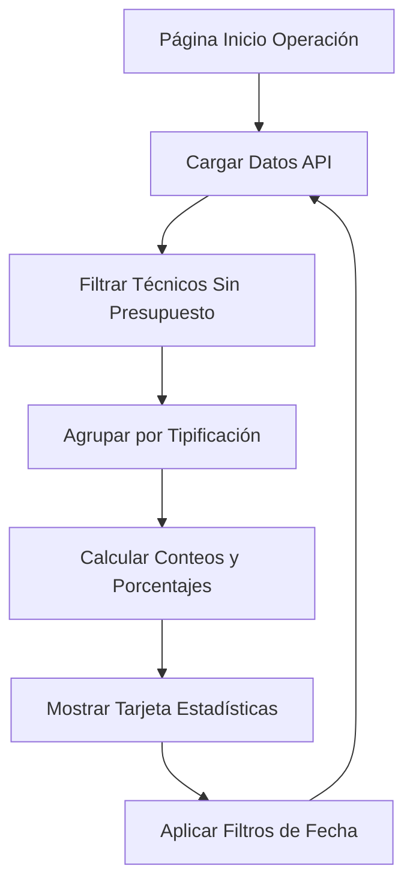

# Documento de Requisitos del Producto - Tarjeta de Estadísticas de Técnicos Sin Presupuesto

## 1. Descripción General del Producto

Sistema de visualización de estadísticas avanzadas para técnicos sin presupuesto asignado en la plataforma de gestión operativa. La funcionalidad se integra como una tarjeta adicional en la sección de estadísticas de la página "Inicio de Operación - Técnicos", proporcionando análisis detallado de las tipificaciones y novedades de técnicos que no tienen presupuesto de eventos asignado.

- **Propósito Principal**: Facilitar el análisis y seguimiento de técnicos sin presupuesto mediante visualización clara de sus tipificaciones y estados operativos.
- **Usuarios Objetivo**: Analistas operativos y supervisores que requieren monitoreo detallado del estado de técnicos sin asignación presupuestaria.
- **Valor del Producto**: Optimización de la gestión operativa mediante identificación rápida de patrones en ausencias y novedades de personal técnico.

## 2. Características Principales

### 2.1 Roles de Usuario
No se requieren roles adicionales. La funcionalidad utiliza el sistema de autenticación existente para analistas.

| Rol | Método de Acceso | Permisos Principales |
|-----|------------------|---------------------|
| Analista | Autenticación existente del sistema | Visualización de estadísticas de técnicos asignados a su supervisión |

### 2.2 Módulo de Funcionalidades

El sistema consiste en una única página mejorada con funcionalidad adicional:

1. **Página Inicio de Operación - Técnicos**: Sección de estadísticas existente con nueva tarjeta de novedades sin presupuesto, análisis de tipificaciones, resumen consolidado.

### 2.3 Detalles de Página

| Nombre de Página | Nombre del Módulo | Descripción de Funcionalidad |
|------------------|-------------------|------------------------------|
| Inicio de Operación - Técnicos | Tarjeta de Novedades Sin Presupuesto | Mostrar listado detallado de tipificaciones de técnicos sin presupuesto con conteos numéricos. Incluir resumen consolidado con total general y desglose porcentual por tipo de novedad. Aplicar filtros por fecha y actualización automática. |

## 3. Proceso Principal

**Flujo de Análisis de Novedades:**

1. El analista accede a la página "Inicio de Operación - Técnicos"
2. El sistema carga automáticamente los datos de técnicos asignados al analista
3. La nueva tarjeta analiza técnicos sin presupuesto (presupuesto_eventos = null/vacío)
4. Se agrupan y cuentan las tipificaciones de estos técnicos
5. Se muestra el listado detallado con conteos y porcentajes
6. El analista puede filtrar por fecha para análisis histórico
7. Los datos se actualizan automáticamente al cambiar filtros

## 4. Diseño de Interfaz de Usuario

### 4.1 Estilo de Diseño

- **Colores Primarios**: Gradiente azul-púrpura (#667eea a #764ba2) para consistencia con la interfaz existente
- **Colores Secundarios**: Verde (#28a745) para conteos positivos, naranja (#ffc107) para alertas, rojo (#dc3545) para críticos
- **Estilo de Botones**: Redondeados con efectos de hover y sombras sutiles
- **Tipografía**: Font-family del sistema, tamaños jerárquicos (h4 para título, h5 para subtítulos, texto normal para contenido)
- **Layout**: Diseño de tarjetas con sombras suaves (box-shadow: 0 4px 6px rgba(0,0,0,0.1))
- **Iconografía**: Font Awesome icons para consistencia visual

### 4.2 Descripción General de Páginas

| Nombre de Página | Nombre del Módulo | Elementos de UI |
|------------------|-------------------|-----------------|
| Inicio de Operación - Técnicos | Tarjeta de Novedades Sin Presupuesto | **Estilo**: Tarjeta blanca con bordes redondeados y sombra sutil. **Layout**: Encabezado con ícono y título, sección de resumen con métricas destacadas, lista de tipificaciones con badges de colores, gráfico de barras horizontal para porcentajes. **Colores**: Fondo blanco, texto principal #333, badges con colores semánticos, barras de progreso con gradiente azul. **Fuentes**: Títulos en negrita 1.1rem, métricas destacadas 1.5rem, texto normal 0.9rem. **Animaciones**: Transiciones suaves en hover, carga progresiva de datos. |

### 4.3 Responsividad

La tarjeta está diseñada con enfoque desktop-first con adaptación móvil completa. Incluye optimización para interacción táctil en dispositivos móviles y tablets, con breakpoints responsivos para diferentes tamaños de pantalla.