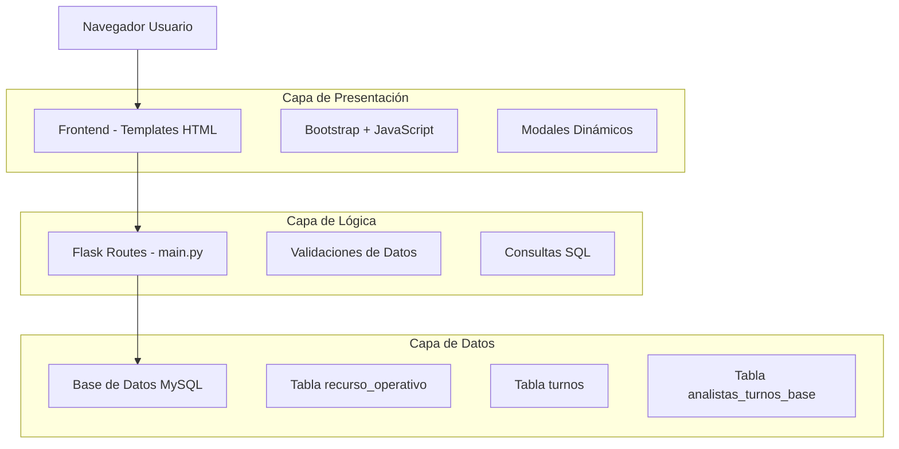
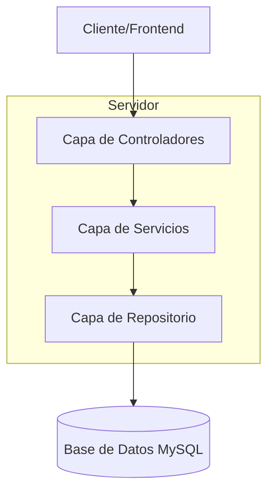
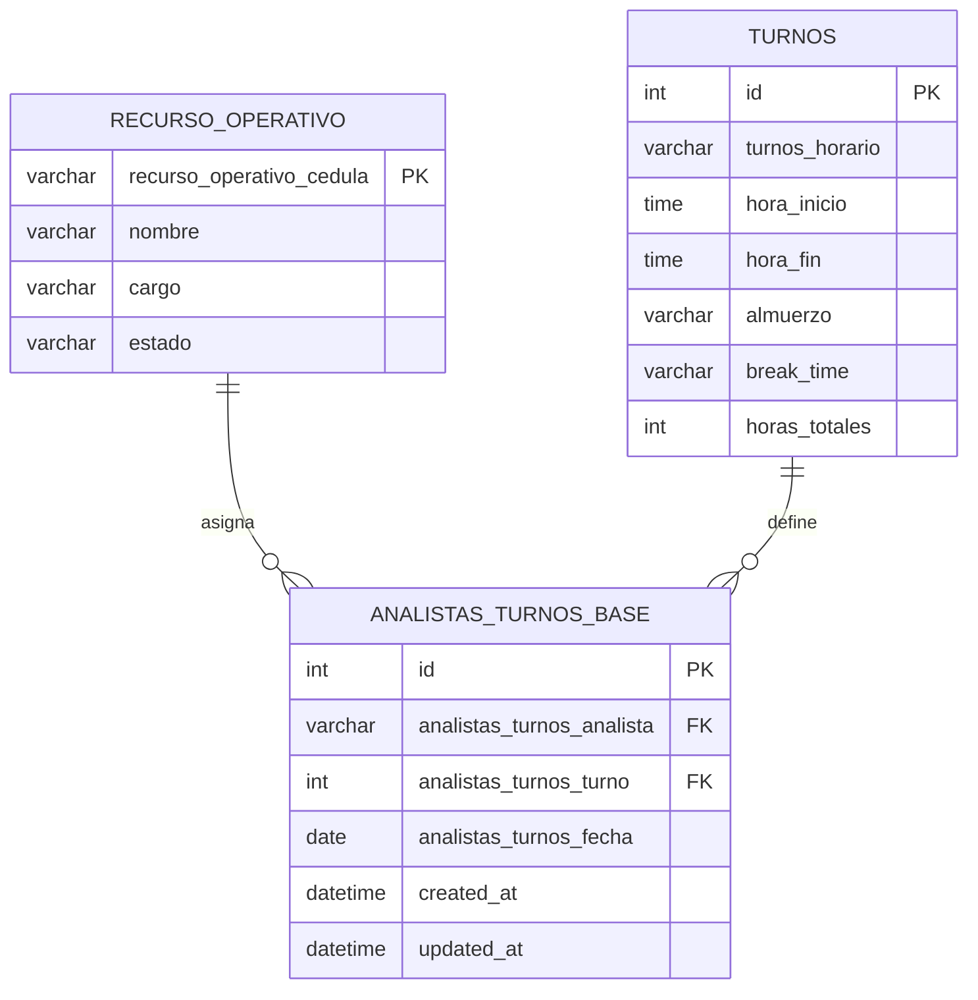

# Documento de Arquitectura Técnica - Submódulo Turnos Analistas

## 1. Diseño de Arquitectura



## 2. Descripción de Tecnologías
- Frontend: HTML5 + Bootstrap 5 + JavaScript ES6 + jQuery
- Backend: Flask (Python) integrado en main.py existente
- Base de Datos: MySQL (base de datos capired existente)

## 3. Definiciones de Rutas

| Ruta | Propósito |
|------|-----------|
| /lider/turnos-analistas | Página principal del submódulo con calendario de turnos |
| /api/analistas | Endpoint para obtener lista de analistas activas (cargo='ANALISTA') |
| /api/turnos | Endpoint para obtener lista de turnos disponibles |
| /api/turnos-semana | Endpoint para obtener turnos asignados de una semana específica |
| /api/asignar-turno | Endpoint POST para guardar nueva asignación de turno |
| /api/detalles-dia | Endpoint para obtener detalles completos de turnos de un día |

## 4. Definiciones de API

### 4.1 API Principal

**Obtener lista de analistas**
```
GET /api/analistas
```

Response:
| Nombre Parámetro | Tipo Parámetro | Descripción |
|------------------|----------------|-------------|
| success | boolean | Estado de la respuesta |
| data | array | Lista de analistas activas |
| analista.id | string | Cédula de la analista |
| analista.nombre | string | Nombre completo de la analista |

Ejemplo:
```json
{
  "success": true,
  "data": [
    {
      "id": "12345678",
      "nombre": "MARIA GONZALEZ"
    }
  ]
}
```

**Obtener turnos disponibles**
```
GET /api/turnos
```

Response:
| Nombre Parámetro | Tipo Parámetro | Descripción |
|------------------|----------------|-------------|
| success | boolean | Estado de la respuesta |
| data | array | Lista de turnos disponibles |
| turno.id | integer | ID del turno |
| turno.horario | string | Descripción del horario |
| turno.hora_inicio | string | Hora de inicio |
| turno.hora_fin | string | Hora de finalización |
| turno.almuerzo | string | Horario de almuerzo |
| turno.break | string | Horario de break |

**Asignar turno**
```
POST /api/asignar-turno
```

Request:
| Nombre Parámetro | Tipo Parámetro | Requerido | Descripción |
|------------------|----------------|-----------|-------------|
| analista | string | true | Cédula de la analista |
| turnos | array | true | Array de asignaciones por día |
| turnos[].fecha | string | true | Fecha en formato YYYY-MM-DD |
| turnos[].turno_id | integer | true | ID del turno asignado |

Response:
| Nombre Parámetro | Tipo Parámetro | Descripción |
|------------------|----------------|-------------|
| success | boolean | Estado de la operación |
| message | string | Mensaje de confirmación o error |

## 5. Diagrama de Arquitectura del Servidor



## 6. Modelo de Datos

### 6.1 Definición del Modelo de Datos



### 6.2 Lenguaje de Definición de Datos

**Tabla analistas_turnos_base (si no existe)**
```sql
-- Crear tabla para almacenar asignaciones de turnos
CREATE TABLE IF NOT EXISTS analistas_turnos_base (
    id INT AUTO_INCREMENT PRIMARY KEY,
    analistas_turnos_analista VARCHAR(20) NOT NULL,
    analistas_turnos_turno INT NOT NULL,
    analistas_turnos_fecha DATE NOT NULL,
    created_at TIMESTAMP DEFAULT CURRENT_TIMESTAMP,
    updated_at TIMESTAMP DEFAULT CURRENT_TIMESTAMP ON UPDATE CURRENT_TIMESTAMP,
    
    -- Índices para optimizar consultas
    INDEX idx_analista_fecha (analistas_turnos_analista, analistas_turnos_fecha),
    INDEX idx_fecha (analistas_turnos_fecha),
    
    -- Constraint para evitar duplicados
    UNIQUE KEY unique_analista_fecha (analistas_turnos_analista, analistas_turnos_fecha)
);

-- Verificar estructura de tabla turnos existente
DESCRIBE turnos;

-- Verificar analistas disponibles
SELECT recurso_operativo_cedula, nombre, cargo, estado 
FROM recurso_operativo 
WHERE cargo = 'ANALISTA' AND estado = 'Activo'
LIMIT 5;

-- Datos de ejemplo para turnos (si la tabla está vacía)
INSERT IGNORE INTO turnos (turnos_horario, hora_inicio, hora_fin, almuerzo, break_time, horas_totales) VALUES
('MAÑANA 6:00-14:00', '06:00:00', '14:00:00', '12:00-13:00', '09:00-09:15', 8),
('TARDE 14:00-22:00', '14:00:00', '22:00:00', '18:00-19:00', '17:00-17:15', 8),
('NOCHE 22:00-06:00', '22:00:00', '06:00:00', '02:00-03:00', '01:00-01:15', 8);
```