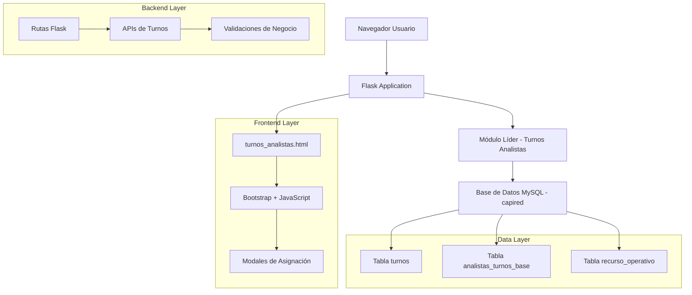
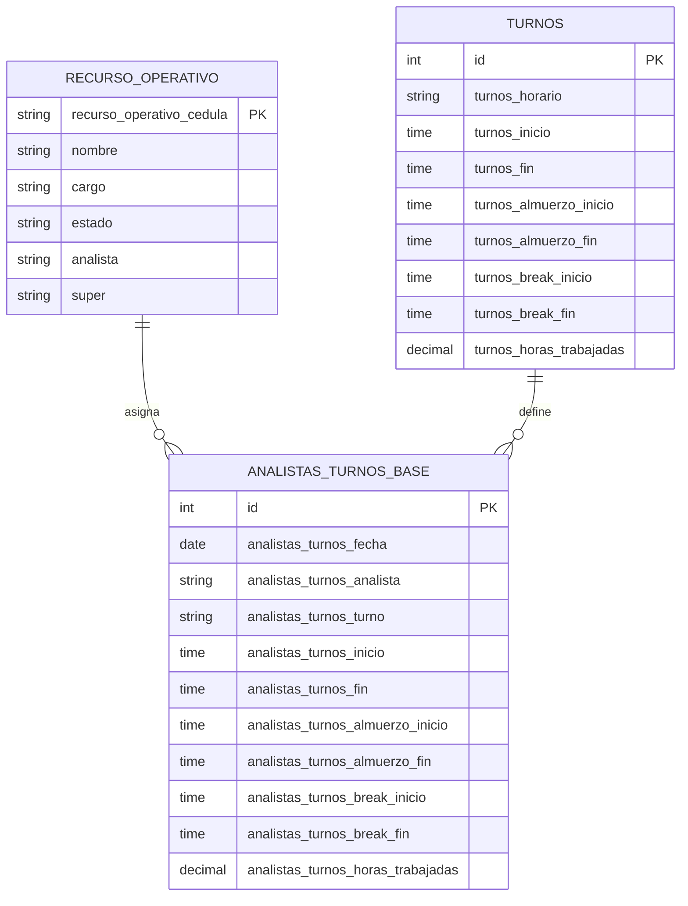

# Documento de Arquitectura Técnica - Submódulo Turnos Analistas

## 1. Arquitectura del Sistema



## 2. Descripción de Tecnologías

- **Frontend**: HTML5 + Bootstrap 5 + JavaScript ES6 + jQuery
- **Backend**: Flask (Python) + MySQL Connector
- **Base de Datos**: MySQL (base de datos existente 'capired')
- **Estilos**: Bootstrap CSS + Font Awesome Icons
- **Validaciones**: JavaScript frontend + Python backend

## 3. Definiciones de Rutas

| Ruta | Propósito |
|------|-----------|
| `/lider/turnos-analistas` | Página principal del submódulo con calendario semanal |
| `/api/analistas-activos` | API para obtener lista de analistas con cargo 'ANALISTA' |
| `/api/turnos-disponibles` | API para obtener turnos predefinidos de la tabla 'turnos' |
| `/api/asignar-turno` | API POST para guardar nueva asignación de turno |
| `/api/turnos-semana` | API para obtener asignaciones de una semana específica |
| `/api/detalles-dia` | API para obtener detalles completos de un día específico |
| `/api/eliminar-turno` | API DELETE para eliminar asignación de turno |

## 4. Definiciones de APIs

### 4.1 API de Analistas Activos

**Obtener lista de analistas disponibles**
```
GET /api/analistas-activos
```

Response:
| Parámetro | Tipo | Descripción |
|-----------|------|-------------|
| success | boolean | Estado de la respuesta |
| analistas | array | Lista de analistas activos |
| analistas[].nombre | string | Nombre completo del analista |
| analistas[].cargo | string | Cargo del analista |
| analistas[].estado | string | Estado activo/inactivo |

Ejemplo:
```json
{
  "success": true,
  "analistas": [
    {
      "nombre": "Juan Pérez García",
      "cargo": "ANALISTA",
      "estado": "Activo"
    },
    {
      "nombre": "María López Rodríguez",
      "cargo": "ANALISTA LOGISTICA",
      "estado": "Activo"
    }
  ]
}
```

### 4.2 API de Turnos Disponibles

**Obtener turnos predefinidos**
```
GET /api/turnos-disponibles
```

Response:
| Parámetro | Tipo | Descripción |
|-----------|------|-------------|
| success | boolean | Estado de la respuesta |
| turnos | array | Lista de turnos disponibles |
| turnos[].turnos_horario | string | Nombre del turno |
| turnos[].turnos_inicio | time | Hora de inicio |
| turnos[].turnos_fin | time | Hora de fin |
| turnos[].turnos_horas_trabajadas | decimal | Total de horas |

### 4.3 API de Asignación de Turno

**Crear nueva asignación de turno**
```
POST /api/asignar-turno
```

Request:
| Parámetro | Tipo | Requerido | Descripción |
|-----------|------|-----------|-------------|
| analista | string | true | Nombre del analista |
| fechas | array | true | Array de fechas a asignar |
| turno | string | true | Nombre del turno |
| inicio_personalizado | time | false | Hora inicio personalizada |
| fin_personalizado | time | false | Hora fin personalizada |

Ejemplo:
```json
{
  "analista": "Juan Pérez García",
  "fechas": ["2024-01-15", "2024-01-16", "2024-01-17"],
  "turno": "Diurno",
  "inicio_personalizado": null,
  "fin_personalizado": null
}
```

### 4.4 API de Turnos por Semana

**Obtener asignaciones de una semana**
```
GET /api/turnos-semana?fecha_inicio=2024-01-15
```

Response:
| Parámetro | Tipo | Descripción |
|-----------|------|-------------|
| success | boolean | Estado de la respuesta |
| asignaciones | array | Asignaciones de la semana |
| asignaciones[].fecha | date | Fecha de la asignación |
| asignaciones[].analista | string | Nombre del analista |
| asignaciones[].turno | string | Nombre del turno |
| asignaciones[].horarios | object | Detalles de horarios |

## 5. Modelo de Datos

### 5.1 Diagrama de Relaciones



### 5.2 Estructura de Tablas Existentes

**Tabla `turnos` (Turnos Predefinidos)**
```sql
-- Estructura existente verificada
CREATE TABLE turnos (
    id INT PRIMARY KEY AUTO_INCREMENT,
    turnos_horario VARCHAR(50) NOT NULL,
    turnos_inicio TIME NOT NULL,
    turnos_fin TIME NOT NULL,
    turnos_almuerzo_inicio TIME,
    turnos_almuerzo_fin TIME,
    turnos_break_inicio TIME,
    turnos_break_fin TIME,
    turnos_horas_trabajadas DECIMAL(4,2)
);

-- Datos existentes (5 turnos predefinidos)
-- Diurno: 06:00-14:00 (8 horas)
-- Vespertino: 14:00-22:00 (8 horas)  
-- Nocturno: 22:00-06:00 (8 horas)
-- Extendido: 06:00-18:00 (12 horas)
-- Dominical: 08:00-16:00 (8 horas)
```

**Tabla `analistas_turnos_base` (Asignaciones de Turnos)**
```sql
-- Estructura existente verificada
CREATE TABLE analistas_turnos_base (
    id INT PRIMARY KEY AUTO_INCREMENT,
    analistas_turnos_fecha DATE NOT NULL,
    analistas_turnos_analista VARCHAR(255) NOT NULL,
    analistas_turnos_turno VARCHAR(50) NOT NULL,
    analistas_turnos_inicio TIME,
    analistas_turnos_fin TIME,
    analistas_turnos_almuerzo_inicio TIME,
    analistas_turnos_almuerzo_fin TIME,
    analistas_turnos_break_inicio TIME,
    analistas_turnos_break_fin TIME,
    analistas_turnos_horas_trabajadas DECIMAL(4,2),
    
    INDEX idx_fecha (analistas_turnos_fecha),
    INDEX idx_analista (analistas_turnos_analista),
    INDEX idx_turno (analistas_turnos_turno)
);
```

**Tabla `recurso_operativo` (Información de Analistas)**
```sql
-- Estructura existente para filtrar analistas
SELECT nombre, cargo, estado 
FROM recurso_operativo 
WHERE cargo IN ('ANALISTA', 'ANALISTA LOGISTICA') 
AND estado = 'Activo';
```

### 5.3 Consultas SQL Principales

**Obtener Analistas Activos**
```sql
SELECT DISTINCT nombre, cargo, estado
FROM recurso_operativo 
WHERE cargo LIKE '%ANALISTA%' 
AND estado = 'Activo'
ORDER BY nombre;
```

**Obtener Turnos Disponibles**
```sql
SELECT turnos_horario, turnos_inicio, turnos_fin, 
       turnos_almuerzo_inicio, turnos_almuerzo_fin,
       turnos_break_inicio, turnos_break_fin,
       turnos_horas_trabajadas
FROM turnos 
ORDER BY turnos_inicio;
```

**Insertar Nueva Asignación**
```sql
INSERT INTO analistas_turnos_base (
    analistas_turnos_fecha,
    analistas_turnos_analista,
    analistas_turnos_turno,
    analistas_turnos_inicio,
    analistas_turnos_fin,
    analistas_turnos_almuerzo_inicio,
    analistas_turnos_almuerzo_fin,
    analistas_turnos_break_inicio,
    analistas_turnos_break_fin,
    analistas_turnos_horas_trabajadas
) VALUES (?, ?, ?, ?, ?, ?, ?, ?, ?, ?);
```

**Obtener Asignaciones por Semana**
```sql
SELECT atb.*, t.turnos_inicio, t.turnos_fin,
       t.turnos_almuerzo_inicio, t.turnos_almuerzo_fin,
       t.turnos_break_inicio, t.turnos_break_fin
FROM analistas_turnos_base atb
LEFT JOIN turnos t ON atb.analistas_turnos_turno = t.turnos_horario
WHERE analistas_turnos_fecha BETWEEN ? AND ?
ORDER BY analistas_turnos_fecha, analistas_turnos_analista;
```