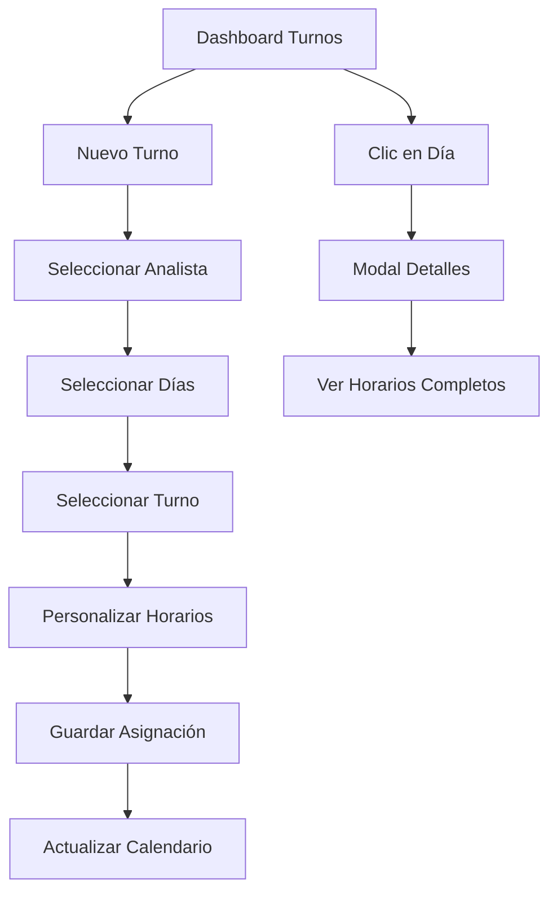

# Documento de Requerimientos del Producto (PRD) - Submódulo Turnos Analistas

## 1. Descripción General del Producto

El submódulo "Turnos Analistas" es una funcionalidad dentro del módulo "Líder" que permite a los líderes gestionar y asignar turnos semanales a los analistas del equipo. El sistema facilita la planificación de horarios, visualización de asignaciones y seguimiento de la distribución de turnos de manera eficiente y organizada.

## 2. Características Principales

### 2.1 Roles de Usuario

| Rol | Método de Acceso | Permisos Principales |
|-----|------------------|---------------------|
| Líder | Acceso directo desde módulo Líder | Puede asignar, modificar y visualizar todos los turnos de analistas |
| Administrador | Acceso completo al sistema | Puede realizar todas las funciones de líder más configuraciones avanzadas |

### 2.2 Módulos de Funcionalidad

El submódulo "Turnos Analistas" consta de las siguientes páginas principales:

1. **Dashboard Principal**: Vista calendario semanal con asignaciones actuales y botón "Nuevo Turno"
2. **Modal de Asignación**: Interfaz para seleccionar analista, días y turnos específicos
3. **Modal de Detalles**: Vista detallada de horarios, breaks y almuerzo por día
4. **Vista de Reportes**: Resumen de asignaciones y estadísticas de turnos

### 2.3 Detalles de Páginas

| Página | Módulo | Descripción de Funcionalidad |
|--------|--------|------------------------------|
| Dashboard Principal | Vista Calendario | Mostrar calendario semanal con código de colores por analista. Incluir botón "Nuevo Turno" y navegación entre semanas |
| Dashboard Principal | Lista de Analistas | Mostrar panel lateral con lista de analistas activos y sus colores asignados |
| Modal Asignación | Selector de Analista | Dropdown con analistas del cargo 'ANALISTA' y 'ANALISTA LOGISTICA' activos |
| Modal Asignación | Selector de Días | Checkboxes para días de la semana (Lunes a Domingo) con fechas correspondientes |
| Modal Asignación | Selector de Turnos | Dropdown con turnos predefinidos: Diurno, Vespertino, Nocturno, Extendido, Dominical |
| Modal Asignación | Horarios Personalizados | Campos opcionales para personalizar horarios de inicio, fin, almuerzo y breaks |
| Modal Detalles | Información del Día | Mostrar todos los analistas asignados para un día específico con horarios completos |
| Modal Detalles | Detalles de Turno | Mostrar horario de trabajo, almuerzo, breaks y total de horas trabajadas |

## 3. Flujo Principal de Procesos

### Flujo de Asignación de Turnos:
1. Líder accede al dashboard de "Turnos Analistas"
2. Hace clic en "Nuevo Turno" para abrir modal de asignación
3. Selecciona analista del dropdown (filtrado por cargo 'ANALISTA')
4. Selecciona días de la semana para asignar
5. Selecciona turno predefinido o personaliza horarios
6. Confirma asignación y datos se guardan en `analistas_turnos_base`
7. Vista calendario se actualiza con código de colores

### Flujo de Consulta de Detalles:
1. Líder hace clic en un día específico del calendario
2. Se abre modal con detalles del día seleccionado
3. Muestra lista de analistas asignados con horarios completos
4. Incluye información de breaks, almuerzo y horas totales

## 4. Diseño de Interfaz de Usuario

### 4.1 Estilo de Diseño

- **Colores Primarios**: Azul (#007bff) para elementos principales, amarillo (#ffc107) para header del módulo líder
- **Colores Secundarios**: Verde (#28a745) para confirmaciones, rojo (#dc3545) para alertas
- **Estilo de Botones**: Bootstrap con bordes redondeados y efectos hover
- **Tipografía**: Font-family del sistema Bootstrap, tamaños 14px-16px para contenido
- **Layout**: Grid responsivo de Bootstrap con cards y modales
- **Iconos**: Font Awesome para consistencia visual (fas fa-calendar-alt, fas fa-clock, fas fa-user)

### 4.2 Descripción de Páginas por Módulo

| Página | Módulo | Elementos UI |
|--------|--------|--------------|
| Dashboard Principal | Header | Título "Gestión de Turnos Analistas" con icono de calendario, navegación de semanas |
| Dashboard Principal | Calendario Semanal | Tabla 7x5 con días de semana, celdas con código de colores por analista |
| Dashboard Principal | Panel Lateral | Lista de analistas activos con indicadores de color y estado |
| Dashboard Principal | Botón Nuevo Turno | Botón principal azul con icono "+" y texto "Nuevo Turno" |
| Modal Asignación | Formulario | Campos organizados en secciones: Analista, Fechas, Turnos, Horarios |
| Modal Asignación | Controles | Dropdowns estilizados, checkboxes para días, campos de tiempo |
| Modal Detalles | Tabla de Horarios | Tabla responsive con información completa de turnos del día |
| Modal Detalles | Indicadores | Badges de colores para diferentes tipos de información |

### 4.3 Responsividad

- **Desktop-first**: Diseño optimizado para pantallas grandes (1200px+)
- **Tablet**: Adaptación para pantallas medianas (768px-1199px) con ajuste de grid
- **Mobile**: Vista simplificada para móviles (<768px) con navegación táctil optimizada
- **Interacción táctil**: Botones y elementos clickeables con tamaño mínimo de 44px