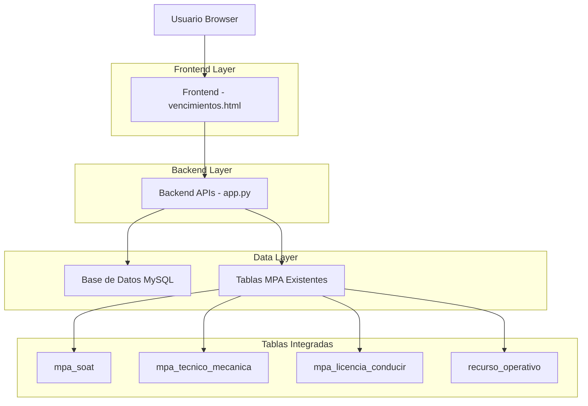
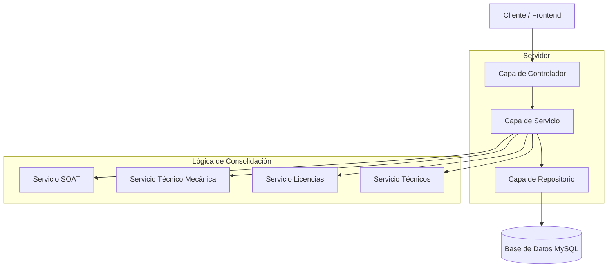
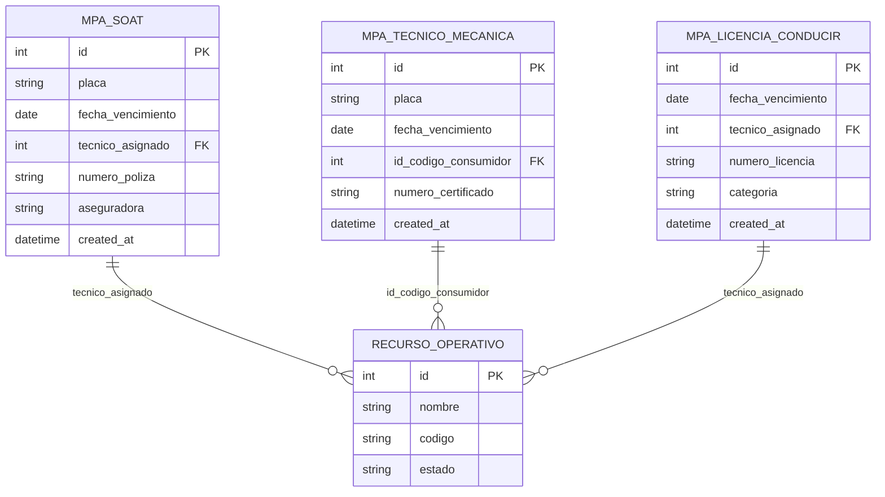

# Documento de Arquitectura Técnica - Módulo Vencimientos

## 1. Diseño de Arquitectura



## 2. Descripción de Tecnología

* Frontend: HTML5 + Bootstrap 5 + JavaScript ES6 + jQuery

* Backend: Flask (Python) integrado en app.py existente

* Base de Datos: MySQL (tablas MPA existentes)

* Integración: APIs RESTful para consolidación de datos

## 3. Definiciones de Rutas

| Ruta              | Propósito                                                |
| ----------------- | -------------------------------------------------------- |
| /mpa/vencimientos | Página principal del módulo de vencimientos consolidados |

## 4. Definiciones de API

### 4.1 API Principal

**Obtener vencimientos consolidados**

```
GET /api/mpa/vencimientos
```

Request:

| Nombre Parámetro | Tipo Parámetro | Es Requerido | Descripción                                                        |
| ---------------- | -------------- | ------------ | ------------------------------------------------------------------ |
| tipo\_documento  | string         | false        | Filtro por tipo: 'soat', 'tecnico\_mecanica', 'licencia\_conducir' |
| estado           | string         | false        | Filtro por estado: 'vigente', 'proximo\_vencer', 'vencido'         |
| tecnico\_id      | integer        | false        | Filtro por ID del técnico asignado                                 |

Response:

| Nombre Parámetro | Tipo Parámetro | Descripción                        |
| ---------------- | -------------- | ---------------------------------- |
| success          | boolean        | Estado de la respuesta             |
| data             | array          | Lista de vencimientos consolidados |
| total            | integer        | Total de registros                 |

Ejemplo Response:

```json
{
  "success": true,
  "data": [
    {
      "id": 1,
      "tipo_documento": "SOAT",
      "fecha_vencimiento": "2024-03-15",
      "estado": "proximo_vencer",
      "dias_restantes": 15,
      "placa": "ABC123",
      "tecnico_nombre": "Juan Pérez",
      "tecnico_id": 11,
      "detalles": {
        "numero_poliza": "12345",
        "aseguradora": "Seguros XYZ"
      }
    }
  ],
  "total": 25
}
```

**Obtener detalle específico de vencimiento**

```
GET /api/mpa/vencimiento-detalle
```

Request:

| Nombre Parámetro | Tipo Parámetro | Es Requerido | Descripción                                                          |
| ---------------- | -------------- | ------------ | -------------------------------------------------------------------- |
| tipo             | string         | true         | Tipo de documento: 'soat', 'tecnico\_mecanica', 'licencia\_conducir' |
| id               | integer        | true         | ID del registro específico                                           |

Response:

| Nombre Parámetro | Tipo Parámetro | Descripción                      |
| ---------------- | -------------- | -------------------------------- |
| success          | boolean        | Estado de la respuesta           |
| data             | object         | Detalles completos del documento |

## 5. Diagrama de Arquitectura del Servidor



## 6. Modelo de Datos

### 6.1 Definición del Modelo de Datos



### 6.2 Lenguaje de Definición de Datos

**Consulta SQL para vencimientos consolidados**

```sql
-- Vista consolidada de vencimientos
CREATE VIEW vista_vencimientos_consolidados AS
SELECT 
    'SOAT' as tipo_documento,
    s.id,
    s.placa,
    s.fecha_vencimiento,
    s.tecnico_asignado as tecnico_id,
    COALESCE(ro1.nombre, 'Sin asignar') as tecnico_nombre,
    CASE 
        WHEN s.fecha_vencimiento < CURDATE() THEN 'vencido'
        WHEN s.fecha_vencimiento <= DATE_ADD(CURDATE(), INTERVAL 30 DAY) THEN 'proximo_vencer'
        ELSE 'vigente'
    END as estado,
    DATEDIFF(s.fecha_vencimiento, CURDATE()) as dias_restantes,
    JSON_OBJECT(
        'numero_poliza', s.numero_poliza,
        'aseguradora', s.aseguradora,
        'fecha_inicio', s.fecha_inicio
    ) as detalles
FROM mpa_soat s
LEFT JOIN recurso_operativo ro1 ON s.tecnico_asignado = ro1.id

UNION ALL

SELECT 
    'TECNICO_MECANICA' as tipo_documento,
    tm.id,
    tm.placa,
    tm.fecha_vencimiento,
    tm.id_codigo_consumidor as tecnico_id,
    COALESCE(ro2.nombre, 'Sin asignar') as tecnico_nombre,
    CASE 
        WHEN tm.fecha_vencimiento < CURDATE() THEN 'vencido'
        WHEN tm.fecha_vencimiento <= DATE_ADD(CURDATE(), INTERVAL 30 DAY) THEN 'proximo_vencer'
        ELSE 'vigente'
    END as estado,
    DATEDIFF(tm.fecha_vencimiento, CURDATE()) as dias_restantes,
    JSON_OBJECT(
        'numero_certificado', tm.numero_certificado,
        'fecha_inicio', tm.fecha_inicio
    ) as detalles
FROM mpa_tecnico_mecanica tm
LEFT JOIN recurso_operativo ro2 ON tm.id_codigo_consumidor = ro2.id

UNION ALL

SELECT 
    'LICENCIA_CONDUCIR' as tipo_documento,
    lc.id,
    NULL as placa,
    lc.fecha_vencimiento,
    lc.tecnico_asignado as tecnico_id,
    COALESCE(ro3.nombre, 'Sin asignar') as tecnico_nombre,
    CASE 
        WHEN lc.fecha_vencimiento < CURDATE() THEN 'vencido'
        WHEN lc.fecha_vencimiento <= DATE_ADD(CURDATE(), INTERVAL 30 DAY) THEN 'proximo_vencer'
        ELSE 'vigente'
    END as estado,
    DATEDIFF(lc.fecha_vencimiento, CURDATE()) as dias_restantes,
    JSON_OBJECT(
        'numero_licencia', lc.numero_licencia,
        'categoria', lc.categoria,
        'fecha_inicio', lc.fecha_inicio
    ) as detalles
FROM mpa_licencia_conducir lc
LEFT JOIN recurso_operativo ro3 ON lc.tecnico_asignado = ro3.id

ORDER BY fecha_vencimiento ASC;

-- Índices para optimización
CREATE INDEX idx_mpa_soat_fecha_vencimiento ON mpa_soat(fecha_vencimiento);
CREATE INDEX idx_mpa_tecnico_mecanica_fecha_vencimiento ON mpa_tecnico_mecanica(fecha_vencimiento);
CREATE INDEX idx_mpa_licencia_conducir_fecha_vencimiento ON mpa_licencia_conducir(fecha_vencimiento);
```

