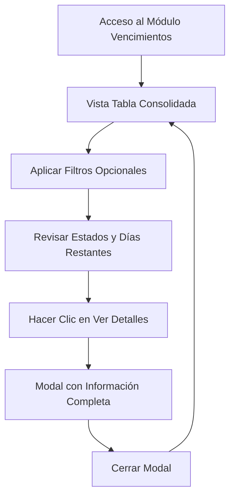

# Documento de Requerimientos del Producto (PRD) - Módulo Vencimientos

## 1. Descripción General del Producto
Sub-módulo de "Vencimientos" que consolida y presenta de manera unificada todos los vencimientos de documentos vehiculares (SOAT, Técnico Mecánica y Licencias de Conducir) en una sola vista centralizada.

- Proporciona una vista consolidada de todos los vencimientos críticos para facilitar el seguimiento y control de documentos vehiculares.
- Dirigido a supervisores y administradores del área MPA que necesitan monitorear el estado de vencimientos de manera eficiente.
- Mejora la gestión proactiva de renovaciones y reduce el riesgo de documentos vencidos.

## 2. Características Principales

### 2.1 Roles de Usuario
| Rol | Método de Registro | Permisos Principales |
|-----|-------------------|---------------------|
| Usuario MPA | Acceso mediante sistema existente | Puede visualizar todos los vencimientos y acceder a detalles |
| Supervisor MPA | Acceso mediante sistema existente | Acceso completo a vista consolidada y filtros avanzados |

### 2.2 Módulo de Características
Nuestros requerimientos del módulo de vencimientos consisten en las siguientes páginas principales:
1. **Página de Vencimientos**: tabla consolidada, filtros de búsqueda, indicadores visuales de estado.
2. **Modal de Vista Detallada**: información completa del documento seleccionado.

### 2.3 Detalles de Página
| Nombre de Página | Nombre del Módulo | Descripción de Características |
|------------------|-------------------|-------------------------------|
| Página de Vencimientos | Tabla Consolidada | Mostrar todos los vencimientos de SOAT, Técnico Mecánica y Licencias de Conducir con columnas: Tipo, Fecha Vencimiento, Estado, Días Restantes, Placa, Técnico, Acción Ver |
| Página de Vencimientos | Filtros de Búsqueda | Filtrar por tipo de documento (SOAT/Técnico Mecánica/Licencia), estado (Vigente/Próximo a vencer/Vencido), técnico asignado |
| Página de Vencimientos | Ordenamiento | Ordenar por fecha de vencimiento, días restantes, tipo de documento |
| Página de Vencimientos | Indicadores Visuales | Códigos de color por estado: Verde (Vigente), Amarillo (Próximo a vencer), Rojo (Vencido) |
| Modal Vista Detallada | Información Completa | Mostrar todos los detalles del documento seleccionado según su tipo (SOAT/Técnico Mecánica/Licencia) |
| Modal Vista Detallada | Navegación | Botón cerrar, información organizada por secciones |

## 3. Proceso Principal
Los usuarios acceden al módulo de vencimientos para obtener una vista consolidada de todos los documentos próximos a vencer o vencidos. Pueden filtrar por tipo de documento, estado o técnico asignado, y hacer clic en "Ver" para obtener detalles completos de cualquier registro.

**Flujo Principal del Usuario:**

## 4. Diseño de Interfaz de Usuario
### 4.1 Estilo de Diseño
- **Colores primarios y secundarios**: Azul corporativo (#007bff), Verde para vigente (#28a745), Amarillo para próximo a vencer (#ffc107), Rojo para vencido (#dc3545)
- **Estilo de botones**: Botones redondeados con iconos, estilo consistente con módulos MPA existentes
- **Fuente y tamaños preferidos**: Bootstrap default fonts, tamaños estándar para legibilidad
- **Estilo de diseño**: Diseño basado en tarjetas, navegación superior, layout responsivo
- **Sugerencias de emojis o iconos**: 📅 para fechas, ⚠️ para alertas, 👁️ para ver detalles, 🚗 para vehículos

### 4.2 Resumen de Diseño de Página
| Nombre de Página | Nombre del Módulo | Elementos de UI |
|------------------|-------------------|-----------------|
| Página de Vencimientos | Encabezado | Título "Control de Vencimientos", breadcrumb navigation, filtros en fila superior |
| Página de Vencimientos | Tabla Consolidada | Tabla responsive con columnas: Tipo, Fecha Vencimiento, Estado (con badges de color), Días Restantes, Placa, Técnico, Acción. Paginación inferior |
| Página de Vencimientos | Filtros | Dropdowns para Tipo de Documento, Estado, Técnico. Input de búsqueda por placa. Botón limpiar filtros |
| Modal Vista Detallada | Contenido | Header con título del tipo de documento, body con información organizada en secciones, footer con botón cerrar |

### 4.3 Responsividad
El módulo está diseñado mobile-first con adaptación completa para desktop. Incluye optimización táctil para dispositivos móviles, tabla responsive con scroll horizontal en pantallas pequeñas, y modales adaptables al tamaño de pantalla.